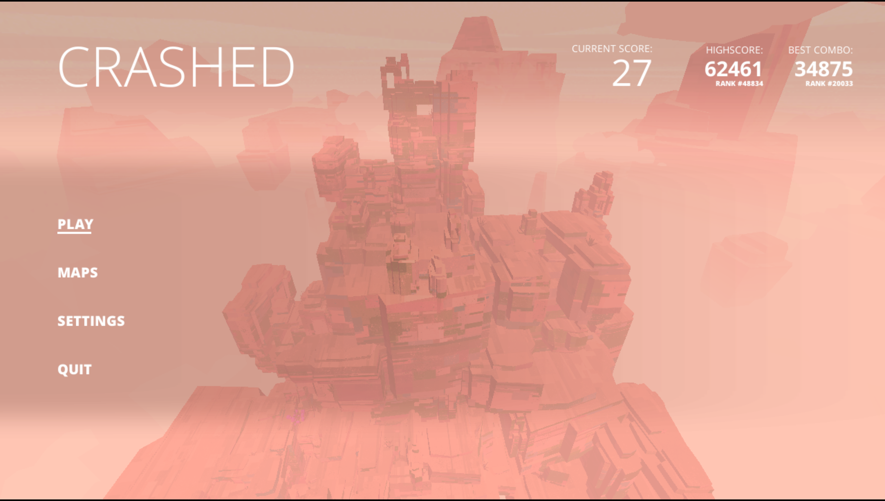
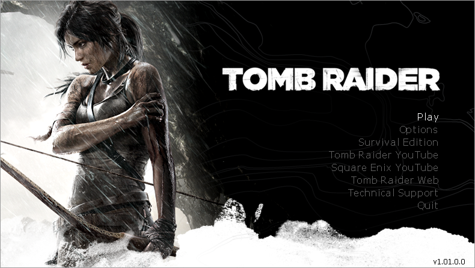
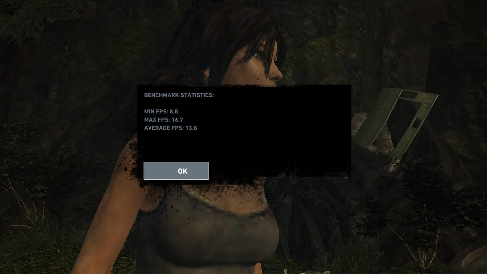
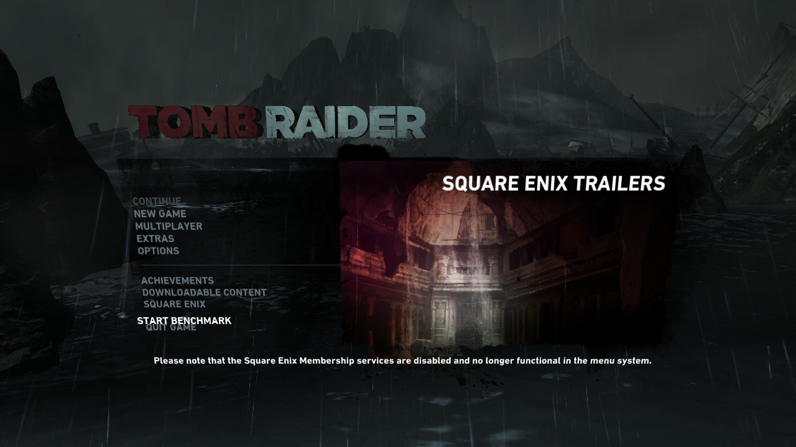
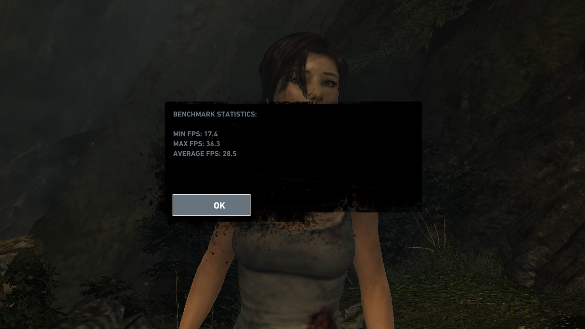
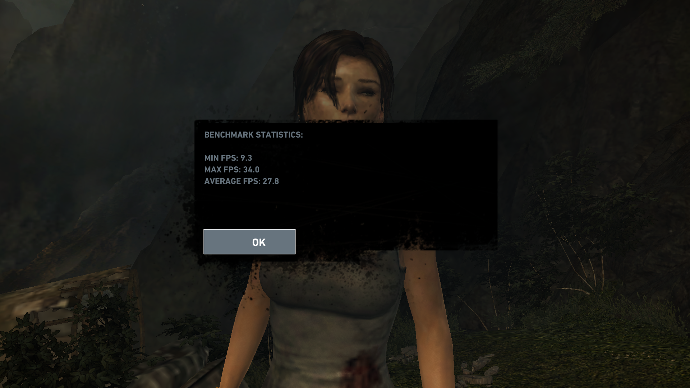
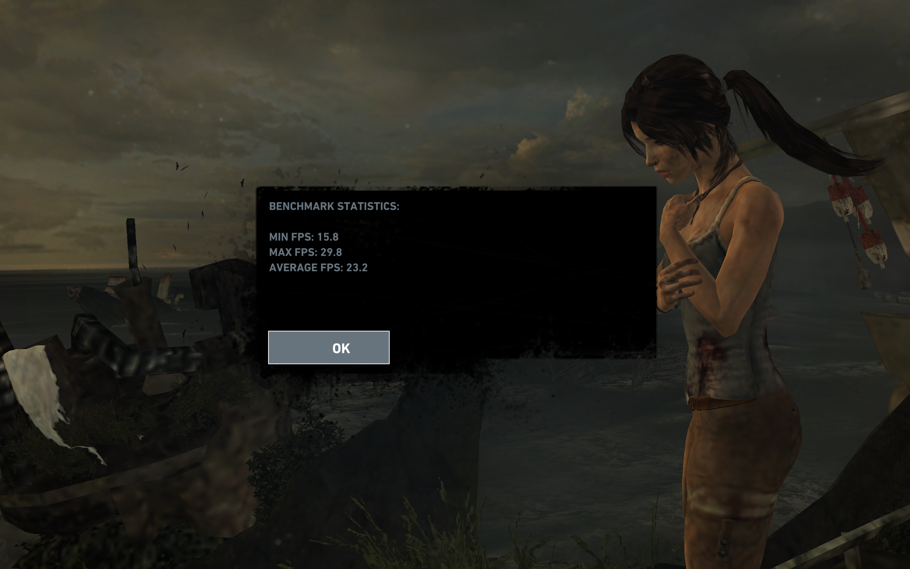
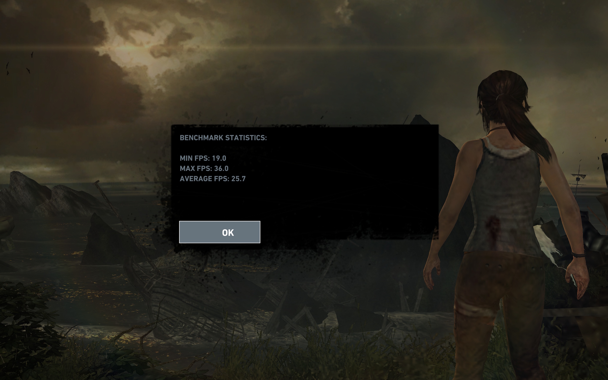

# Steam ARM64 on Termux/X11

Run Valve's conventional native ARM64 Linux Steam client on an **unrooted**
Samsung Galaxy Tab S8+ (SM-X808U) using Termux, Debian PRoot, Termux:X11/KDE,
Mesa Turnip, official Proton 11 ARM64, and its bundled FEX/DXVK stack.




## Current status

- Native ARM64 Steam launches, authenticates, renders its UI, and downloads
  games.
- Turnip provides Vulkan acceleration on the Snapdragon/Adreno GPU.
- Official Proton 11 ARM64 and Steam Linux Runtime 4 ARM64 are registered and
  launch through the correct ARM64 paths.
- Superflight runs fullscreen through FEX, Wine, DXVK, and Turnip with working
  PulseAudio output.
- An optional microSD library keeps Windows game depots external while Proton,
  runtimes, active downloads, and per-game compatdata remain on internal F2FS.
  Kingsway runs fullscreen with audio through this split route.
- GTA IV is installed on the microSD, completes Rockstar authentication and
  online presence, launches the real `GTAIV.exe`, passes the GTA IV/EFLC
  selector and main menu, completes the animated loading-art sequence, and
  starts the first mission, **The Cousins Bellic**, through official ARM
  Proton/FEX and Turnip. Saved authentication survived full X/KDE/Steam
  recovery and repeated launches without another 2FA prompt. Interactive
  control after the opening mission transition is not yet verified.
  The no-PRoot native Steam host now reaches the same authenticated Rockstar
  and game boundary. `~/start-gtaiv-native.sh` primes remembered-login Steam,
  forwards AppID 12210 with the previously proven `-dontStartService` route,
  keeps its foreground service alive for the game lifetime, and continuously
  enforces the measured CPU split. The first controlled native pass reached
  `Auth -> MainWindow`, `Went Online`, cloud sync, the private-view
  `GTAIV.exe`, and a visible `GTAIV` window with 64 game threads. Set
  `GTAIV_DIRECT_LAUNCH=0` only to reproduce the older experimental
  service-first batch.
- Tomb Raider (2013) is installed on the microSD as the Windows depot set and
  launches the real `TombRaider.exe` through Steam Linux Runtime 4 ARM64,
  official Proton 11 ARM64, FEX, DXVK, and Turnip. Its launcher and first-run
  renderer both work. Its first built-in 1280x720 Low benchmark completed at
  5.8 minimum, 18.0 maximum, and 13.6 average FPS. A follow-up used a real
  1280x720 Termux:X11 root, V-Sync off, one warm-up, and three clean passes.
  The clean mean was 8.0 minimum, 16.63 maximum, and 13.7 average FPS, so the
  lower X surface did not materially improve average throughput. A first
  live-tuned CPU pass then reached **23 minimum, 41 maximum, and 31 average
  FPS** with the game on CPUs 1-7, its continuously runnable
  `Raknet-RecvFrom` thread isolated to CPU 1, and Steam web helpers on CPU 0.
  Three tuned passes reported 23/41/31, 11/28/24, and 21/39.8/31.1 FPS. Their
  28.7 FPS mean average is 2.09x the clean baseline; their median average is
  31.0 FPS. Removing the floating Termux activity with the standalone
  Termux:X11 APK collapsed one full-screen Safe pass to 3/7/5.4 FPS. The
  official shared-UID Termux:X11 build instead kept the game and X server in
  `/top-app`; its first usable full-screen pass reached **17.4/36.3/28.5
  FPS**, or 5.28x the standalone pass's average. Raising both the X root and
  game from 1280x720 to 1920x1080 then produced **9.3/34.0/27.8 FPS**. That is
  2.25x the pixels for only a 2.5% average-FPS loss, although the minimum fell
  46.6%. Three panel-native Low passes at 2800x1752 then reported
  15.8/29.8/23.2, 4.7/27.9/21.7, and 13.6/28.7/21.7 FPS, producing a
  **11.37/28.8/22.2 FPS mean**. A quick user-read Normal-preset pass reached
  only 10/16/13.9 FPS. Two confirmed Samsung Game Booster Performance passes
  then averaged 13.85/29.0/20.0 FPS, 9.9% below the ordinary native-Low mean.
  A later SSH-spawned native-Low pass reported 7.2/13.8/10.3 FPS, but the
  complete X/Steam/Wine/game tree was in `/moderate` + `/background` and
  restricted to CPUs 0-3; that result is excluded as scheduler-failure
  evidence. The first foreground launch through the hardened launcher then
  held the complete workload in `/top-app`, verified the game/Wine CPUs 1-7,
  RakNet CPU 1, and nine Steam helpers on CPU 0 before exiting its guard, and
  produced a captured native-Low result of **19.0/36.0/25.7 FPS**. That is
  15.8% above the original three-run native-Low mean. The authenticated
  no-PRoot Steam client now launches this same Windows game successfully too:
  the real executable created a DX11 swapchain, entered panel-native
  fullscreen, initialized PulseAudio, and remained live through official
  Proton/FEX and Turnip. In the first diagnostic run, a warm native Steam
  request reached `TombRaider.exe` in about 39 seconds and its fullscreen
  swapchain in about 74 seconds. Vulkan loader tracing was enabled and the
  Runtime 4 cache had just been exercised, so this is launch-path evidence,
  not the final controlled latency or FPS result. The native-aware affinity
  guard subsequently converged the live 52-thread game to CPUs 1-7, isolated
  RakNet on CPU 1, and placed loader-wrapped Steam helpers on CPU 0.
  See the [benchmark report](docs/TOMB_RAIDER_BENCHMARK.md) and the ranked
  [optimization plan](docs/TOMB_RAIDER_OPTIMIZATION_PLAN.md).
- Burnout remains experimental; its detailed EA, FEX, and DXVK investigation is
  kept in [`docs/TECHNICAL_LOG.md`](docs/TECHNICAL_LOG.md), not duplicated here.
- The no-PRoot native host is now a separate project:
  [`termux-glibc-compat`](https://github.com/huntergdavis/termux-glibc-compat).
  Its persistent same-UID semaphore broker, complete public glibc boundary,
  timed waits, metadata/control operations, and process-exit `SEM_UNDO` are now
  implemented. A real patched glibc 2.44 `libc.so` linked and passed the public
  semaphore probe on the host. The native Bionic daemon then built on this Tab
  S8+ with Clang ThinLTO; all seven broker/client suites passed and an optimized
  20,000-operation pass measured 9,226 persistent `GETVAL` calls/second. The
  no-copy child-execution shim now covers every exec-family symbol imported by
  the ARM64 Steam bootstrap plus POSIX spawn, and the experimental launcher
  resolves Steam and CEF dependencies directly from staged glibc, official
  client, Turnip, and existing Debian library trees. The official glibc 2.44
  package built from the pinned Termux recipe now passes both the extracted
  SysV-semaphore control/wakeup test and upstream glibc 2.44 `test-sysvsem` on
  the tablet. Its exact SHA-256 is
  `52f5ce13b66fc3307f48285d32b72951472493e91b96fc3e08c0c42772d999f3`.
  The native Steam/CEF and generic game-boundary preflights pass against that
  content-addressed candidate. The real client now starts without PRoot,
  retains the existing authenticated account, renders CEF, discovers the
  split microSD library, and forwards AppID launches. Only the game boundary
  enters the existing PRoot/Pressure Vessel environment required by official
  Proton. A native-only preload shim maps
  exact `/tmp` paths into Termux's real temp directory, including pathname
  Unix sockets, so Steam's hard-coded Breakpad directory can be created
  without broad path rewriting. Its host and on-tablet regressions pass; the
  all-PRoot fallback and saved Steam/Rockstar login remain available and were
  not replaced or cleared.

### Current benchmark target: Tomb Raider (2013)

Tomb Raider replaces the earlier planned Sleeping Dogs control for the first
measurement. It avoids GTA IV's separate Rockstar launcher, has named graphics
quality profiles and an integrated benchmark, and has now crossed the real
Windows executable boundary on this exact Tab S8+. The first completed pass
used its Low profile at fullscreen 1280x720, with game/X11 affinity split across
CPUs 4-7/0-3.

That follow-up is now complete as a combined V-Sync-off/exact-X A/B pass. Its
three clean averages were 13.8, 13.5, and 13.8 FPS. Because both presentation
variables changed together, it does not isolate their individual effects, but
it rules out the earlier hypothesis that merely shrinking the 4.8186-times-
larger native X surface would multiply game throughput.

The first combined scheduling pass changed the game mask to CPUs 1-7, pinned
only the busy `Raknet-RecvFrom` thread to CPU 1, and moved Steam CEF helpers to
CPU 0. It produced 23/41/31 FPS while still using Proton's unmodified bundled
FEX profile. This raises average throughput by 126.3% over the 13.7 FPS clean
mean. Two repetitions reached 11/28/24 and 21/39.8/31.1 FPS, making the final
three-pass mean 18.3/36.3/28.7 FPS and median 21/39.8/31.0 FPS. The slower
middle pass also exposed an uncontrolled scheduling variable: the 63.5%-CPU
PRoot tracer and 31%-CPU wineserver were still free to contend with game work
on the fast cores. Because several scheduling changes were applied together,
the report does not assign the gain to one component.

The first `STEAM_ARM64_FEX_PROFILE=safe` series is complete under the same
scheduling state. Its clean passes reported 17.7/30.8/25.7,
19.2/31.1/25.8, and 19.2/31.1/25.8 FPS, producing a tightly grouped
18.7/31.0/25.77 FPS three-pass mean. All ran at the same 1.325/1.613 GHz CPU
policy ceilings as the bundled-FEX scheduling baseline. The Safe mean is
10.2% below the bundled-FEX scheduling mean of 28.7 FPS.

The first usable no-overlay pass is also complete. With the standalone
Termux:X11 APK, hiding Termux demoted the game to `/cpuset/moderate` and
`cpu:/background`, restricted it to CPUs 1-3, and produced only 3/7/5.4 FPS.
The upstream `sharedUid` APK gives Termux and Termux:X11 the same Android UID;
with Termux:X11 alone visible, the complete stack remained `/top-app` and the
same Safe-profile benchmark reported **17.4 minimum, 36.3 maximum, and 28.5
average FPS**. Average throughput increased 427.8% over the failed standalone
condition and was 10.6% above the floating-Termux Safe clean mean. This is one
pass, not yet a replacement mean, and one late `dxvk-cache` thread had widened
itself to CPUs 0-7 by the post-run audit.

The first resolution A/B retained that full-screen shared-UID condition and
all scheduling and graphics settings while changing the X root and game to
1920x1080. It reported **9.3 minimum, 34.0 maximum, and 27.8 average FPS**.
Compared with the 1280x720 pass, 2.25x as many pixels reduced average FPS by
only 2.5% and maximum by 6.3%, but minimum fell 46.6%. This is evidence that
steady-state average throughput is not primarily pixel-bound in this profile;
it is not proof until both resolutions have repeated runs.

The project now optimizes for the Tab S8+'s physical **2800x1752** panel
resolution. Three controlled native Low passes reported 15.8/29.8/23.2,
4.7/27.9/21.7, and 13.6/28.7/21.7 FPS. Their mean is **11.37 minimum, 28.8
maximum, and 22.2 average FPS**; the median is 13.6/28.7/21.7. Runs 2 and 3
repeated the same average while their minimums differed sharply, confirming
that minimum FPS is the noisy metric here. The 720p and 1080p results remain
diagnostic A/B points rather than the final optimization target.

A quick 2800x1752 Normal-preset pass, still without Game Booster, reported
10/16/13.9 FPS directly to the user. Its average is 37.4% below the native Low
mean and 35.9% below the immediately preceding Low Run 3. The attempted result
capture had already advanced to a loading screen, so it was deleted and is not
claimed as screenshot evidence.

After adding both shared-UID apps to Gaming Hub and explicitly selecting Game
Booster's Performance policy, two confirmed native-Low passes reported
13.7/29.0/20.2 and 14.0/29.0/19.8 FPS. Their mean is
**13.85/29.0/20.0 FPS**, 9.9% below the native-Low mean. Performance mode did
not improve this workload, so the next session returns to Standard and tests
60 Hz thermal control followed by the bundled and `fast` FEX profiles.

The measurement protocol is one warm-up and three recorded passes per profile.
Alongside the benchmark result, record peak memory, time to the main menu,
launch success rate, and any Android whole-UID eviction.

#### Launch timing protocol

Launch latency is measured separately from benchmark performance. Start the
host-side timer immediately before clicking Play:

```bash
~/steam-arm64/compat-bin/time-steam-game-launch.py \
  --appid 203160 \
  --process-name TombRaider.exe \
  --window-regex 'Tomb Raider'
```

The timer follows Steam's logs from their current end, then records the first
observed Pressure Vessel, Proton, Wine, wineserver, `TombRaider.exe`, and
matching visible-window stages in a JSON file under `~/steam-arm64/logs`. The
primary comparison is Steam's `Game process added` event to the first visible
game window. A result is complete only after the target process and matching
window remain continuously present for 30 seconds; the report retains the
first-window timestamp and records the stability interval separately. This
excludes cloud synchronization, interstitials, and user
response time from the PRoot-versus-native-glibc measurement. The timer exits
after the stability proof and before the benchmark starts, so its one-second
polling cannot affect FPS.

The first observational PRoot timing on 2026-08-16 began its Steam session at
09:45:08 PDT and emitted `Game process added` at 09:47:22. Kernel process
elapsed times place Pressure Vessel at approximately 09:47:34, Proton at
09:52:09, Wine at 09:52:11, wineserver at 09:52:12, and the real
`TombRaider.exe` at 09:53:00. A one-second external watcher first observed the
Tomb Raider window at 09:54:09.236. The comparable runtime-to-window result is
therefore approximately **6 minutes 47 seconds**; the full Steam-session total
was approximately **9 minutes 1 second**, including 2 minutes 14 seconds of
cloud, interstitial, and user-response delay. This is a single warm-Steam,
warm-compatibility-cache observation rather than a completed A/B series. The
[structured timing record](docs/launch-timings/tomb-raider-proot-20260816.json)
preserves the stage timestamps and their measurement precision for the future
native-glibc A/B.

The first logging-free native-Steam measurement is now complete. Its initial
cold Runtime 4 attempt exited before Proton after three seconds; the automatic
workflow remained healthy and the successful retry reached Proton in 10.2
seconds, `TombRaider.exe` in 27.8 seconds, and the visible 2800x1752 window in
**59.917 seconds** from the retry's Runtime launch. That comparable
runtime-to-window interval is 85.3% shorter, or 6.80x faster, than the 407.236
second PRoot observation. Counting from the first native Steam session through
the failed attempt and retry, the window took 158.917 seconds, still 70.6%
shorter than the 541.236-second PRoot session total. These remain one
observation per stack, not a latency distribution. The
[native timing record](docs/launch-timings/tomb-raider-native-clean-20260817.json)
preserves both attempts rather than hiding the cold failure.

A later hardened cold launch removed the failed-attempt tax. The wrapper first
started Steam alone, observed remembered-login success, and only then forwarded
AppID 203160. The real game appeared 29.244 seconds after Runtime launch and
the first visible window at **58.256 seconds**; both remained present through
the independent 30-second timing and affinity gates. The foreground supervisor
was still alive with the game 99 seconds after first-window observation. The
comparable Runtime-to-window interval is 85.7% shorter, or 6.99x faster, than
the 407.236-second all-PRoot observation. The
[supervised cold timing record](docs/launch-timings/tomb-raider-native-supervised-cold-20260817.json)
preserves the exact stage observations.
















## What changed

### Recompiled PRoot

Stock PRoot was not sufficient for Steam and Pressure Vessel. The repository
rebuild applies narrowly scoped fixes for:

- glibc robust-list calls blocked by Android seccomp;
- System V semaphore operations and waiter wakeups used by Steam;
- Pressure Vessel's `.l2s` metadata, bind mounts, pivot sequence, and shared
  `/tmp` behavior;
- the private `/proc/net` route view required by Wine's Windows networking APIs.

The source is pinned and rebuilt by:

```sh
scripts/build-proot.sh
```

The build is stamped with the source commit, ordered patch-set hash, source-diff
hash, and binary hash. The exact patches live under [`patches/`](patches/).

### Hardened the Steam launcher

[`bin/steam-arm`](bin/steam-arm) now prepares a completely user-local runtime:

- private Debian/glibc, D-Bus, Mesa/Turnip, and Steam paths;
- ARM64 compatibility-tool registration and traditional Steam SDK symlinks;
- stable software-rendered CEF while games retain Vulkan acceleration;
- Android loopback/network compatibility shims;
- canonical PulseAudio TCP setup;
- bounded session logs, `/dev/null` guards for runaway CEF logs, and a 1 GiB
  free-space floor; and
- opt-in, session-scoped DXVK initialization logging with
  `STEAM_ARM64_DXVK_INFO=1`.

It does not replace global library paths or modify the existing KDE/Mesa setup.

### Tuned Superflight

[`scripts/configure-superflight-performance.py`](scripts/configure-superflight-performance.py)
applies a backup-first, atomic Unity profile: fullscreen 1280x720, quality zero,
and antialiasing, motion blur, post-processing, and shadows disabled.

The game initially pinned all 72 observed Unity/DXVK threads to CPUs 0-3. On
this tablet those are the lower-capacity cores. The guarded
[`scripts/set-superflight-affinity.py`](scripts/set-superflight-affinity.py)
validates the game/App ID and the measured CPU topology before moving all game
threads to CPUs 4-7. In the same menu scene, observed game CPU use fell from
about 157% to 97%, and play felt noticeably smoother. This affinity is
process-local and must currently be applied after each launch.

### Tuned Tomb Raider

[`scripts/configure-tombraider-performance.py`](scripts/configure-tombraider-performance.py)
atomically applies the measured 2800x1752 panel-native Low profile with V-Sync
off. It
requires exactly one known graphics section and every expected DWORD, refuses
an active Wine/FEX/game stack, preserves unrelated registry data, and makes a
byte-verified backup before replacement.

[`scripts/configure-termux-x11-resolution.sh`](scripts/configure-termux-x11-resolution.sh)
uses Termux:X11's supported command-line preference interface. `--set-720p`
and `--set-1080p` select the built-in exact presets. `--set-panel-native`
selects the Tab S8+ panel's 2800x1752 render target through custom mode.
`--check` verifies the current exact/custom preference against the live RandR
root; `--native` restores Termux:X11's automatic drawable-area mode, which is
not the same as the panel-native render target when Android system bars remain.
This avoids restarting X/KDE and does not depend on an unsupported RandR CRTC
mode switch.

On the measured pass, the game window and X root were both exactly 1280x720,
all 56 game threads were verified on CPUs 4-7 before each clean run, and the
12-thread X server remained on CPUs 0-3. DXVK's info environment reached the
game and its log directory was accessible, but this Proton payload emitted no
DXVK log file. The report therefore does not claim an internally reported
swapchain extent.

The first post-benchmark profile found a CPU/translation bottleneck rather than
a saturated GPU. At the live main menu, the game used about 2.2-2.3 CPU cores,
the outer PRoot tracer about 0.6, Steam/CEF about another core, and the GPU only
12-16 percent. A continuously runnable `Raknet-RecvFrom` thread consumed one
whole core; this matches reports following the game's online-services update
of the first core remaining busy. The comparison visibly runs v1.01.748.0.
Our installed executable is dated September 2022 and shows the disabled online-
service path, but its exact semantic version has not been extracted; a payload
difference is therefore not claimed as either proven or ruled out.

The same-chip recording visibly uses CPUs 1-7, FEX TSO mode `Fastest`, x87 mode
`Fast`, multiblock, and `Aggressive (Stop services on startup)`. In contrast,
Proton's bundled FEX configuration uses TSO, a 500-instruction block limit,
memory-saving JIT cache defaults, and sampling statistics. The launcher now
offers two opt-in, reversible profiles: `safe` keeps TSO while using 5000-
instruction blocks, full JIT caches, and no sampler; `fast` additionally
matches the recording's TSO-off/half-barrier-off profile. Upstream warns that
disabling TSO can break multithreaded programs, so `fast` must be validated
after `safe`, not treated as a default.

### Reached GTA IV's first mission

GTA IV now passes the Rockstar boundary that previously ended at CEF Code 17.
The working checkpoint combines four narrowly scoped pieces:

- the Pressure Vessel route wrapper validates a private internal copy of GTA
  IV's executable files, overlays it at the normal game path, and keeps the
  large game-data directories on the microSD;
- the initial `PlayGTAIV.exe` payload is changed to a service-first batch that
  attempts to start `Rockstar Service` before handing control back to the
  signed game launcher; a nonzero service-control result is logged but does not
  suppress `PlayGTAIV.exe`;
- Wine's service startup timeout is raised to 60 seconds; and
- only `SocialClubHelper.exe` receives Wine's builtin D3D11/DXGI renderer,
  leaving the game itself on its accelerated D3D9/Vulkan route.

The validated online runs logged `Auth -> MainWindow`, `Presence Event - Signed
In`, and `Presence Event :: Went Online`. Rockstar then launched the genuine
`GTAIV.exe`; X11 reported a focused fullscreen `GTAIV` window and the rendered
frame first showed the GTA IV/EFLC selector. A fresh run reproduced the launch
without another 2FA prompt and then passed the selector into the real GTA IV
main menu. The exact 2800x1586 composed frame shows `Start` selected, the GTA IV
title art, and the connected Social Club panel. A later lean launch passed the
same selector and menu, accepted GTA IV's own saved-session sign-in prompt,
cycled through the loading art, and rendered the first-mission title **The
Cousins Bellic**. The retained mission-title frame is the first proof that a
new game started; interactive control after the opening transition remains the
next boundary.

The repository retains a purpose-built Windows ARM64 selector helper in
[`diagnostics/win-arm64-gtaiv-selector-play.c`](diagnostics/win-arm64-gtaiv-selector-play.c).
It accepts only an exact visible `GTAIV` top-level window, rejects client areas
smaller than 640x480, derives the GTA IV-side Play target from the current
fullscreen dimensions, and injects one Win32 left click. This avoids Wine's
unreliable cross-process `ClientToScreen` and `GetWindowRect` paths. It remains
a diagnostic rather than a guaranteed launch step: in one repeat run the
separately attached PE returned status 5 without moving the cursor or changing
the frame. After revalidating the exact focused X11 window, one XTest Return
press crossed the highlighted selector into the main menu and a second started
the loading sequence. The following frame and GTA process transition—not a
helper exit status—remain the live success criteria. Build the mouse helper with
[`scripts/build-win-arm64-gtaiv-selector-play.sh`](scripts/build-win-arm64-gtaiv-selector-play.sh).

Do not terminate Rockstar's CEF processes after GTA starts. A measured test
freed about 1.6 GiB of available RAM and 2.8 GiB of swap, but the launcher then
reported `Browser unavailable`, forced its own shutdown after 14 seconds, and
cleanly stopped GTA. The browser subprocesses are therefore part of the live
launcher/game contract, not disposable UI once the title process exists.

#### Keep the Android session alive and scheduled

On the tested Samsung Android build, the foreground app changes scheduling for
the whole Termux UID. With Termux:X11 visible, Steam, PRoot, Wine, and Rockstar
were placed in `cpu:/background` and `/cpuset/moderate`, with only CPUs 0-3.
Bringing `com.termux/.app.TermuxActivity` forward moved those same live
processes to `top-app` on CPUs 0-7; returning to
`com.termux.x11/.MainActivity` immediately restored the four-core restriction.

This can be a correctness issue, not just a performance issue. One Rockstar
start completed its network downloads but spent 61-152 seconds in background
service transactions and reached Code 17 almost exactly five minutes after the
launcher began. KDE, Steam, Wine, and Rockstar were all still alive, so that
event was a launcher deadline rather than an Android process kill.

A follow-up run started entirely in `/cpuset/moderate`: Rockstar service
transactions climbed from 37 seconds to about 180 seconds and saved-login
initialization never reached `Went Online`. Giving the launcher all available
moderate cores and closing Steam's UI recovered roughly 1 GiB. Physically
foregrounding Termux later drained most queued transactions from about 214 to
36 seconds, but one already-stalled transaction remained blocked for more than
1,200 seconds and the launch still did not reach `Went Online`. Start the
launch while Termux is the visible Android activity; late foregrounding is not
a dependable recovery for an already-backlogged run.

Before a long session, run `termux-wake-lock`. It prevents CPU sleep, but it
does **not** move the UID out of the background cpuset. The installed
`~/start-kde` likewise has no hidden `taskset` or Android timeout override:
`pulseaudio --exit-idle-time=-1` only keeps audio alive, while its final
`exec startplasma-x11` keeps Plasma attached to the launching terminal. For a
diagnostic launch, Termux can be brought forward during Rockstar's nonvisual
initialization and Termux:X11 restored after the log reports `Social Club UI
has started` and `Client is ready to attempt a launch`. The current tablet
environment accepted these exact activity switches from an SSH shell without
restarting X, Wine, or the game:

```sh
am start -a android.intent.action.MAIN -c android.intent.category.LAUNCHER \
  -n com.termux/.app.TermuxActivity
am start -a android.intent.action.MAIN -c android.intent.category.LAUNCHER \
  -n com.termux.x11/.MainActivity
```

Always verify `Cpus_allowed_list` after switching: an earlier environment
returned a package/permission mismatch, in which case physically tapping the
two activities remains the fallback.

This foreground sequence is a measured diagnostic workaround, not yet a
claimed fix for the separate whole-Termux process-tree loss described in the
technical log.

The successful first-mission launch also started Steam with shader cache
management disabled and the supported `-noshaders` client flag. That removed
the repeatedly growing 96-percent Vulkan preprocessing gate without changing
the App 12210 Proton/runtime route:

```sh
STEAM_ENABLE_SHADER_CACHE_MANAGEMENT=0 \
  ~/bin/steam-arm -no-browser -console -noshaders
```

#### Keep SSH supervised

With `termux-services` and OpenSSH installed, enable the runit service once:

```sh
sv-enable sshd
```

The repository installs a bounded startup helper at
`~/bin/ensure-sshd-supervised`. Keep this idempotent fallback in interactive
`~/.bashrc`, so opening Termux restores the service supervisor if needed and
waits for runit before asking it to bring SSH up:

```sh
if [[ $- == *i* ]] && [[ -n ${PREFIX:-} ]]; then
    "$HOME/bin/ensure-sshd-supervised" ||
        printf 'warning: supervised sshd did not start\n' >&2
fi
```

The helper validates the service installation, starts `runsvdir` without an
extra backgrounding race, waits at most ten seconds for the exact supervisor,
then requires `sv status` to report `run:`. The stock Termux profile also starts
`service-daemon`; concurrent calls are safe and the helper verifies the result.

A live test sent `TERM` to the supervised `sshd`; runit replaced it
immediately and a fresh port-8022 connection succeeded. This handles an SSH
daemon crash. It cannot restart Termux after Android force-stops the entire app
or evicts its UID under memory pressure, nor after a reboot; that requires an
external launcher such as Termux:Boot. A GTA IV loading run exhausted zram to
less than 100 KiB free and then made port 8022 refuse connections despite the
supervisor, demonstrating this whole-app boundary.

The internal executable view and the service-first batch are still an
experimental, machine-specific setup. The wrapper validates their exact file
set and ownership instead of silently creating them. With the prefix stopped,
the two registry changes are reproduced by:

```sh
system_reg="$HOME/steam-arm64/removable-library-compatdata/12210/pfx/system.reg"
scripts/configure-gtaiv-service-timeout.py \
  --registry "$system_reg" --backups-dir "$HOME/steam-arm64/backups" \
  --expected-sha "$(sha256sum "$system_reg" | awk '{print $1}')"
scripts/configure-gtaiv-socialclub-wined3d.py \
  --base "$HOME/steam-arm64" --enable
```

Both tools refuse unsafe registry shapes, preserve byte-verified backups, use
atomic replacement, and refuse changes while Wine/Proton/container processes
are active.

The tablet's native 2800x1586 desktop also made GTA IV create a roughly
2800x1550 render window. The repository therefore installs a minimal,
plain-text 1280x720 fullscreen profile as the validated executable view's
`commandline.txt`:

```text
-width 1280
-height 720
```

Width and height are present in this exact installed GTA IV executable's own
command-line help strings. Omitting `-windowed` keeps the game's default
fullscreen presentation while limiting its internal render size to 1280x720;
Wine's separate virtual desktop should remain disabled for this profile. The
profile leaves the opaque binary `SETTINGS.CFG` and the Rockstar login/profile
tree untouched. `scripts/install-project-files.sh` backs up an existing view
file before installing the repo-owned version; run it only with the GTA IV
Wine/Proton stack stopped so the next launch receives the new profile.

## Reproduce

Read [`docs/PROPRIETARY_AND_BINARY_INPUTS.md`](docs/PROPRIETARY_AND_BINARY_INPUTS.md)
for the required external Steam, Proton, runtime, and Mesa payloads. They are
not stored in this repository.

```sh
scripts/inventory.sh
scripts/build-proot.sh
scripts/prepare-arm64-runtime-shadow.sh
scripts/install-project-files.sh
scripts/verify-gpu.sh
# Run this command in the visibly foreground Termux terminal, not over SSH.
~/start-steam.sh
```

`~/start-steam.sh` is the normal lean launcher. It opens the shared-UID
Termux:X11 activity, starts exactly one X server when needed, verifies the
persisted trackpad/input and screen-idle preferences without broadcasting a
live surface reload, prepares PulseAudio, and launches Steam without
KDE/Plasma. It does not report success merely because processes exist: the
Android bridge must be free of stale-Binder errors, the Lorie mouse, touch, and
keyboard devices must exist, PulseAudio must expose a sink, a remembered login
must succeed in the current launch, and the same Steam window of at least
640x400 must remain visible for five checks. In this deliberately WM-less
single-app session, the script maps, raises, and focuses Steam itself. A Steam
process that exits during login or window readiness ends the wait immediately.

It reuses a healthy existing X/Steam/audio session, safely reclaims only an
unreachable owned Unix socket, and refuses foreign displays, duplicate servers,
or a stale Android Binder bridge with live X clients. The latter cannot be
repaired in place because X clients cannot migrate to a replacement server;
stop those clients and rerun the script. With no AppID it exposes the normal
Steam UI. A positive first argument or `--appid ID` instead creates a direct
background launch: the script adds `-silent -applaunch ID`, preserves every
following game argument, validates a new AppID-specific entry in Steam's
`gameprocess_log.txt`, and never maps, raises, or focuses the Steam window.
Raw Steam arguments are still forwarded unchanged. The convenience wrapper
skips Tomb Raider's setup dialog by passing the executable's own
`-nolauncher` option:

```sh
STEAM_ARM64_FEX_PROFILE=proton ~/start-steam.sh
~/start-steam.sh 203160 -nolauncher
~/start-steam.sh --appid 203160 -- -nolauncher -benchmark
~/start-tombraider.sh
~/start-tombraider.sh -benchmark
# Exact/raw Steam client arguments remain available:
STEAM_ARM64_FEX_PROFILE=fast ~/start-steam.sh -console -applaunch 203160
```

The default is the current `safe` profile. A changed profile applies only to a
fresh Steam process; the script never kills an existing Steam session. Process
and UI waits can be changed with `STEAM_PROCESS_TIMEOUT` and
`STEAM_WINDOW_TIMEOUT`; direct AppID acknowledgement uses
`STEAM_APP_TIMEOUT`. A cold launcher, X11, or Steam process outside both
Android `/top-app` controllers is now a hard error, not a warning. In
particular, a cold invocation over the supervised SSH service is rejected
before X11, PulseAudio, or Steam starts; opening the Termux:X11 activity cannot
promote an unrelated SSH process tree reliably.

The recalled Switchroot command wrote `steam://rungameid/...` to `steam.pipe`.
It proved direct launch but did not unload Steam. Steam's `-shutdown` is a
client-exit request, not a supported "launch and discard the client" flag;
chaining it with `-applaunch` is therefore not the default here. The safe first
memory experiment is the silent, unfocused direct path above. Any later CEF
suspension or client shutdown must be an explicit A/B after the game is stable
and must preserve cloud-sync recovery.

After exiting a game, stop the minimal session with:

```sh
~/stop-steam.sh
```

It verifies a live Steam main process before forwarding `-shutdown`, waits for
clean exit, and only then stops the exact Termux:X11 server and session
PulseAudio process. It never force-stops the shared-UID Android packages, so it
does not intentionally take Termux or supervised `sshd` down with X. An active
Steam game is protected unless `--force` is explicit; `--dry-run` lists the
matched processes without changing them, and `--keep-pulse` leaves audio up.

Steam/CEF can leave 25 MiB shared-memory files in Termux temp after abnormal or
diagnostic runs. Inspect and then remove only old, closed exact-name files with:

```sh
cleanup-steam-temp
cleanup-steam-temp --apply
```

Dry-run is the default. The apply path accepts only owned, single-link,
mode-0700 `u<uid>-Shm_<hex>` regular files at least one hour old, scans every
same-UID `/proc/*/fd`, and fails closed if that descriptor scan is incomplete.
It does not select logs, dumps, sockets, directories, open shared memory, or
recent files.

### Experimental native Steam host

`~/bin/steam-arm-native` is the generic, no-PRoot client launcher. It accepts
the same raw Steam arguments as `steam-arm`, including `-applaunch ID`, and can
be selected by the normal X11/audio/input wrapper:

```sh
STEAM_ARM64_NATIVE_CHECK=1 ~/bin/steam-arm-native
~/bin/check-native-steam-stack
~/start-steam-native.sh
~/start-steam-native.sh --appid 203160 -- -nolauncher
~/start-steam-native.sh --proton-log --appid 203160 -- -nolauncher
~/start-tombraider-native.sh
~/start-tombraider-native.sh --proton-log
~/start-tombraider-native.sh -benchmark
~/run-tombraider-native-benchmark --profile safe
~/stop-steam-native.sh
```

The native Tomb Raider wrapper goes beyond Steam's initial PID-added
acknowledgement. It first brings native Steam to remembered-login readiness
without an AppID, then forwards AppID 203160 through that stable client. It
requires an exact AppID 203160 `TombRaider.exe`, protected compatdata path,
Android `/top-app` placement, and a visible game window that remains stable
for 30 seconds. An early exact running-list removal triggers one bounded retry.
After success the wrapper deliberately remains in the foreground for the
game's full lifetime; releasing that RunCommandService session was proven to
deliver signal 1 to the game container. Set `TOMB_RAIDER_LAUNCH_RETRIES=0` to
restore the thin acknowledgement-only behavior for controlled diagnostics.

The benchmark runner is the controlled FPS path. Start it from a foreground
Termux session with Steam stopped. It primes the native glibc client once,
requires the exact 2800x1752 X root and unthrottled CPU/GPU policy, verifies the
Low/V-Sync-off profile and selected FEX profile, then runs one warm-up and three
recorded command-line benchmarks. Tomb Raider writes each exact result itself;
the runner copies those files, the matching affinity proof, and before/after
thermal and memory state into
`~/steam-arm64/logs/tombraider-benchmarks/<series>/series.json`. It does not
profile, capture, or switch windows during the timed scene.

The installed command is an absolute-Termux-shebang broker, so Android's
foreground `RunCommandService` can start it without relying on the interactive
shell's `termux-exec` preload. The broker invokes the content installed at
`~/steam-arm64/compat-bin/run-tombraider-native-benchmark.py` with Termux's
absolute Python path and forwards every benchmark option unchanged.

The first command is non-launching: it verifies the content-addressed patched
glibc marker and uses that exact loader to resolve the Steam bootstrap and CEF
helper before any UI, D-Bus, PulseAudio, manifest, or HOME change. It reads
ordinary ARM64 support libraries directly from the existing Debian rootfs by
their host paths; this does not start PRoot. `STEAM_ARM64_NATIVE_ROOTFS` can
select another complete ARM64 Linux runtime tree.

`check-native-steam-stack` is also non-launching. It runs that client/CEF gate
and then independently validates the stamped PRoot and generic Pressure Vessel
boundary. Use `--proot-dir /absolute/candidate/src` for an isolated A/B; it
does not start X11, Steam, a game, or an authentication flow.

Place `--proton-log` before the AppID (or before Tomb Raider's game arguments)
for one diagnostic session. The native wrapper enables Proton's own log and
writes `steam-APPID.log` under `~/steam-arm64/logs`; it also enables Vulkan
loader diagnostics in that log. Normal launches remain unchanged.

The selected official package was built from Termux glibc-packages commit
`954c6b2`, copied without repacking, hash-checked on the tablet, extracted into
its own content-addressed directory, and tested there before selection. The
black-box probe compiled and ran with the candidate loader and reported
`SysV semaphore control and wakeup: ok`. Upstream glibc 2.44's complete
`test-sysvsem` then exited zero against the same candidate and broker. The
selected package hash is
`52f5ce13b66fc3307f48285d32b72951472493e91b96fc3e08c0c42772d999f3`;
no package was installed over `$PREFIX/glibc`.

The loader shim changes no Steam binary. At each child boundary it reads the
ELF interpreter and wraps matching AArch64 Linux targets with the staged
loader, covering Steam's imported `execv`, `execvp`, `execvpe`, and `execl`
paths plus direct exec and POSIX spawn. The selected `safe`, `fast`, or
`proton` FEX profile is preserved.

Native Android processes cannot create Steam's hard-coded `/tmp/dumps`
directory, and the updater's initial Breakpad probe ignores both `TMPDIR` and
`BREAKPAD_DUMP_LOCATION`. The launcher therefore preloads a separate,
environment-gated compatibility shim which rewrites only exact `/tmp` and
`/tmp/...` path arguments to `$PREFIX/tmp`. Its AF_UNIX handling preserves the
Termux:X11 socket mapping as well. Other absolute and relative paths are left
unchanged. Chromium's absent `/dev/shm` namespace is mapped separately for
ordinary public pathname calls into a private mode-0700 directory below the
native runtime; it is never mixed into the shared Termux temporary root.
Chromium's internal direct `openat` bypasses interposition, so the native
launcher also idempotently adds `--disable-dev-shm-usage` to Steam's webhelper
wrapper. CEF then uses the already mapped `TMPDIR` and reaches `BrowserReady`
without a `/dev/shm` failure. The shim and patch helper are installed and
required by the native path.

Steam's absolute `/bin/lsof` WebSocket check would otherwise select Android's
bionic Toybox binary and cross the wrong loader boundary. A native compiled
helper answers only Steam's loopback webhelper NetworkService query, reusing
the repository's established scoped response instead of exposing unrelated
process data. The preload redirects only `/bin/lsof` and `/usr/bin/lsof` when
the launcher provides the validated helper path.

Termux glibc also returns `ENOSYS` for `get_robust_list`, which Valve's IPC
thread treats as a fatal initialization error. The native launcher enables the
separate `libtgcompat-robust.so` experiment for Steam: it returns the exact
thread-local 24-byte head and `-32` futex offset Valve validates, plus glibc's
immediately preceding predecessor link used during list mutation. Unrelated
syscalls are forwarded. Android cannot register that head with the kernel, so
this clears the userspace initialization gate but does not claim kernel
owner-death recovery.

Ordinary native child commands resolve from the Debian ARM64 runtime before the
Termux path, letting the execution shim pair those ELF files with the staged
loader. Termux glibc's internal `system()` still uses its compile-time absolute
`$PREFIX/glibc/bin/sh`; that active loader must see its own libraries. The
candidate path is therefore supplied by explicit loader arguments and
`TGCOMPAT_LIBRARY_PATH`, not exported as `LD_LIBRARY_PATH`. Mixing the active
loader with the staged candidate's libraries reproduced an immediate
pre-`main()` `SIGBUS` and prevented `steamwebhelper.sh` from starting.

Xlib's compiled `/usr/share/X11/locale` path is absent from Android's root.
The native launcher points `XLOCALEDIR` at the validated Debian locale tree;
without it, `XwcTextListToTextProperty` leaves an output sentinel untouched
and Valve's unchecked `XFree` aborts the client after `BrowserReady`.

Session scripts recognize native processes by the content-addressed glibc
loader plus its exact `--argv0` Steam target. This keeps existing-session
forwarding, CPU affinity, and graceful stop behavior coherent even though the
kernel-visible first argument is the loader rather than `steam`.

The removable-library hidden-data guard permits only Steam's private, owned,
strictly parsed `libraryfolder.vdf` descriptor and an exact `steamapps` link in
the bind target. That native view leads to the internal, lock-safe manifest
tree; exact links expose the card-backed `common` payload and the dedicated
internal compatdata/download trees. The existing PRoot game boundary overlays
the same paths with nested binds. Unrelated entries, redirected links, and
malformed descriptors remain refusals.

The native client and CEF do not run below PRoot. A narrowly gated compatibility
shim proved that opening exactly `/proc/self/root` with `O_PATH` clears the
first Pressure Vessel error, but the next boundary is kernel-enforced:
`unshare --user` fails with `EINVAL`, `unshare --mount` fails with `EPERM`, and
Bubblewrap cannot read `/proc/sys/kernel/overflowuid`. Native Bubblewrap is
therefore not viable on this unrooted Android kernel. A game deliberately
crosses into the existing patched PRoot only at its ARM64 Pressure Vessel
boundary. The bridge preserves arbitrary Steam launch-option environment
variables, removable-library binds, PulseAudio, Mesa/Turnip, Proton, and FEX,
so it is not specific to Tomb Raider or GTA IV.

The synthetic native Runtime 4 registration includes its own validated version-2
`toolmanifest.vdf` beside `_v2-entry-point`. Steam reads tool metadata from the
declared local `install_path`; pointing that path at a wrapper-only directory
otherwise registers the App ID but leaves its protocol version at zero, causing
`AppError_51` before the game boundary.
Steam nevertheless constructs the dependency command from Runtime AppID
4185400's official depot path. The exact exec-path policy redirects only that
depot `_v2-entry-point` to the protected native bridge binary, across the full
exec family, while preserving Valve's original `argv[0]`. The official runtime
files remain unchanged.
Before the bridge starts Bionic Bash it replaces Steam's Debian-first PATH with
`$PREFIX/bin:/system/bin`; its safety checks cannot accidentally execute glibc
utilities until the patched PRoot boundary is active.
The PRoot game environment keeps the validated native Steam HOME instead of
`proot-distro`'s default `/root`. Proton's ARM64 `lsteamclient` consequently
loads `.steam/sdkarm64/steamclient.so` and reaches the same client IPC state;
the bridge refuses a missing or redirected SDK link.

Steam replaces `LD_PRELOAD` when it builds a game command, adding its x86
overlay objects. Native ARM64 `/bin/sh` must start before the game can reach the
Bionic bridge, so the glibc exec boundary restores the launcher's exact native
shim list for wrapped ARM64 children. The native bridge then removes all loader
and preload state before entering PRoot, as it did previously.

Because Steam starts game commands through absolute Android `/bin/sh`, the
generic exec boundary maps only exact `/bin/sh` and `/usr/bin/sh` requests to
the launcher's validated Debian ARM64 shell before inspecting the ELF. This
covers Steam's direct, variadic, PATH, and POSIX-spawn APIs, including calls
made internally by that interposer; the earlier native pathname hook remains
valid for direct `execve`. The mapped shell then receives the staged loader and
child preload policy. All other executable paths are left unchanged.

Runtime 4 no longer rebuilds its mutable sysroot for every game. The installer
strictly applies Valve's `usr-mtree.txt.gz`, verifies every declared size and
SHA-256, materializes PRoot pseudo-hardlinks, recreates Valve's merged-`/usr`
links, and atomically selects a content-addressed complete sysroot. Preparing a
new runtime revision took 25.8 seconds once. A real
`_v2-entry-point --verb=run -- /bin/true` then passed the complete PRoot,
Bubblewrap, `pv-adverb`, and linker-cache path in 42 seconds; the prior
copy-every-launch path took 164 seconds before the same payload. This path
remains experimental until an ordinary game is exercised from the native
client; the all-PRoot launcher remains the matched fallback.

The production-patched PRoot can also be built with a reproducible native
profile without changing the selected binary:

```sh
PROOT_BUILD_PROFILE=native PROOT_BUILD_JOBS=8 \
  scripts/build-proot.sh ~/steam-arm64/src/proot-production-native-candidate

STEAM_ARM64_PROOT_DIR=~/steam-arm64/src/proot-production-native-candidate/src \
  ~/bin/steam-arm-native -silent
```

The device candidate is 271 KiB, has SHA-256
`5e3a5b4992a9717005d6ac84268b24b9cd98fba61b977f790d7435bf16014657`,
and retains ThinLTO on the hot main objects while excluding the embedded ARM32
loader object that must remain ordinary machine code. All four production
regression probes passed. Three alternating 5,601-file trials measured a 1.61%
median improvement on the original long path and a 0.17% regression on a short
bind. A complete native-entry-to-Pressure-Vessel `/bin/true` smoke also passed
in 47 seconds versus the earlier 42-second production observation. This does
not justify promotion, so production remains the default and
`STEAM_ARM64_PROOT_DIR` is an explicit A/B selector for the directory that
contains the candidate `proot` binary. See the exact
[device transcript](docs/evidence/proot-native-profile-20260816.txt).

Combining that compiler profile with the separately gated no-dereference
metadata patch produced a reproducible second candidate, SHA-256
`1f4a98c53b3d00b3881e7625cc9cce24850e8ba2e3dd5f0fa1a72bad438f3aa5`.
With `PROOT_NODEREF_FAST_PATH` restricted to the exact Proton Experimental
benchmark tree, three matched trials improved the long-path median by 16.69%
and the short-bind median by 14.96%; all four regression probes passed. It is
still not a generic default: the assertion is safe only for a tree whose guest
and host paths are identical and which contains no nested translated bind.
Runtime 4 and removable game libraries violate that assumption in places. See
the [combined-candidate evidence](docs/evidence/proot-native-fastpath-profile-20260816.txt).

The launcher applies the measured scheduling profile automatically: X11 and
Steam use CPUs 0-3, Steam web helpers use CPU 0, and a CPU-0 affinity guard waits
for the verified App ID 203160 process. The guard rejects a background game,
places Tomb Raider plus its verified Wine auxiliaries on CPUs 1-7, isolates
`Raknet-RecvFrom` on CPU 1, repairs late-created threads, and requires a visible
Tomb Raider window plus thirty seconds of stable masks. It then exits before the
benchmark. PRoot remains unpinned because the existing measurements do not yet
identify a consistently faster tracer placement.

In Steam, explicitly force Superflight (App ID 732430) to use Proton 11.0
(ARM64), and set this launch option for audio:

```text
PULSE_SERVER=tcp:127.0.0.1:4713 %command%
```

With Steam and Wine stopped, apply the graphics profile:

```sh
scripts/configure-superflight-performance.py --base "$HOME/steam-arm64"
scripts/configure-superflight-performance.py --base "$HOME/steam-arm64" --check
```

After Superflight starts, apply and verify the confirmed live affinity:

```sh
scripts/set-superflight-affinity.py
scripts/set-superflight-affinity.py --check
```

With Tomb Raider's Wine/FEX process stopped, apply and verify its profile, then
set the current optimization target to the Tab S8+ panel resolution:

```sh
scripts/configure-tombraider-performance.py --base "$HOME/steam-arm64"
scripts/configure-tombraider-performance.py --base "$HOME/steam-arm64" --check
scripts/configure-termux-x11-resolution.sh --set-panel-native
scripts/configure-termux-x11-resolution.sh --check
```

After the real game process starts, apply the recording-matched CPUs 1-7 mask.
The RakNet isolation is a separate experimental variant and must not be mixed
into the plain affinity A/B result:

```sh
scripts/set-tombraider-affinity.py
scripts/set-tombraider-affinity.py --check
scripts/set-tombraider-affinity.py --raknet-cpu1
scripts/set-tombraider-affinity.py --raknet-cpu1 --check
```

For one initialization-only DXVK diagnostic session:

```sh
STEAM_ARM64_DXVK_INFO=1 ~/bin/steam-arm -noshaders
```

For the controlled FEX passes, restart Steam with one named profile and verify
the effective variables in the game process before recording results:

```sh
STEAM_ARM64_FEX_PROFILE=safe ~/bin/steam-arm -noshaders
STEAM_ARM64_FEX_PROFILE=fast ~/bin/steam-arm -noshaders
```

Omitting `STEAM_ARM64_FEX_PROFILE` restores Proton's bundled behavior. Use the
bounded profiler only for an explicitly excluded diagnostic pass; clean built-
in benchmark passes run without it:

```sh
scripts/profile-live-game.py --seconds 3
```

Use Termux:X11's automatic drawable-area mode instead with:

```sh
scripts/configure-termux-x11-resolution.sh --native
```

With Steam fully stopped, prepare and register the removable Windows-game
library before the next Steam start:

```sh
bin/steam-arm64-removable-library.py --base "$HOME/steam-arm64" prepare
bin/steam-arm64-removable-library.py --base "$HOME/steam-arm64" register
scripts/install-project-files.sh
```

`register` makes a byte-verified backup before atomically adding the library to
Steam's `libraryfolders.vdf`, and refuses to run while Steam or Wine is active.
Use this library only for Windows game depots. The launcher keeps Steam's
`steamapps` control metadata internal, binds only `steamapps/common` to the card,
and uses dedicated internal compatdata and active-download directories. Android's
portable-storage FUSE does not implement the file locks Steam needs for manifests
or patch state. The launcher fails early if the card is absent or the layout is
unsafe. `prepare` also installs the exact native-client links needed to see that
split layout without PRoot. When upgrading an older layout, its directory-only
mountpoint skeletons are moved intact to a timestamped backup before the links
are installed.

Large depots can make Steam's cross-filesystem commit path spend seconds per
file under PRoot. With Steam stopped, copy one numeric `downloading/<appid>`
tree to `<microSD-library>/staging/<appid>`, generate matching relative-path
SHA-256 manifests for both trees, then enable the verified nested bind:

```sh
bin/steam-arm64-removable-library.py --base "$HOME/steam-arm64" \
  enable-staging-bind 12210 --source-manifest source.sha256 \
  --target-manifest target.sha256
```

Patch-state files remain internal and lock-safe; only the verified numeric
payload tree is overlaid, making the final commit a same-filesystem rename. The
per-App-ID overlay must target Steam's visible
`removable-library/steamapps/downloading/<appid>` path. Targeting the internal
backing directory does not transitively cover that earlier PRoot bind.

Do not use this overlay to extend an incomplete download directly on Android
portable storage. Steam's file allocator can return `ENOSYS`/disk-write failure
on that FUSE path even though ordinary writes work. Complete active staging on
internal F2FS, stop Steam, make and hash-verify the card copy, then enable the
overlay only for commit—or use the offline native commit below. If an
incomplete test enabled the overlay, disable it without touching either copy:

```sh
bin/steam-arm64-removable-library.py --base "$HOME/steam-arm64" \
  disable-staging-bind 203160
```

If Steam's own commit still stalls on per-file PRoot metadata, stop Steam and
run the manifest-gated native merge:

```sh
bin/steam-arm64-removable-library.py --base "$HOME/steam-arm64" \
  commit-staging 12210 --install-dir "Grand Theft Auto IV" \
  --manifest source.sha256
```

The internal staging tree stays hidden as a temporary recovery copy. Keep it
only until Steam has restarted and retained `StateFlags 4` and
the target build. If the native merge bypassed Steam's final metadata write,
run the offline `finalize-staging` action with one `--depot-manifest` argument
for each current cached depot manifest; it validates their embedded IDs and
sizes before backing up and atomically completing the appmanifest. The exact
GTA IV example is in [`docs/TECHNICAL_LOG.md`](docs/TECHNICAL_LOG.md). After a
verified restart, the redundant internal numeric App-ID tree can be removed
with Steam stopped and its empty mountpoint recreated.

GTA IV's signed depot metadata currently spells its installscript path with a
Windows separator that native Linux Steam cannot enumerate on Android's
portable-storage filesystem. With no Wine, Proton, or game container running,
apply the signed script's two registry entries using the hash- and
mapping-guarded helper:

```sh
scripts/configure-gtaiv-registry.py --base "$HOME/steam-arm64" \
  --installscript "/storage/7376-B000/Android/data/com.termux/files/steam-arm64-library/steamapps/common/Grand Theft Auto IV/GTAIV/installscript.vdf"
```

The helper verifies the exact signed VDF, `S:` mapping, and existing registry
state; it makes a byte-verified backup before an atomic `system.reg` update.

`WINE_CPU_TOPOLOGY=4:4,5,6,7` is a candidate for making the affinity persistent,
but it is intentionally not presented as confirmed until a clean launch proves
the same per-thread masks and performance.

## Validate the repository

```sh
scripts/check-project.sh
```

The check runs every retained Python test, parses every shell entry point, and
rejects whitespace errors. Coverage includes launcher argument/log guards,
PulseAudio, the generic native Runtime 4 bridge and mtree sysroot, Pressure
Vessel routing, game profiles and affinity, removable storage, and GTA IV's
signed registry, service timeout, and scoped Social Club WineD3D state.

## Key paths

- [`bin/steam-arm`](bin/steam-arm) — production launcher.
- [`patches/`](patches/) — reproducible PRoot patch series.
- [`config/steam-arm64-compatibilitytools.vdf.in`](config/steam-arm64-compatibilitytools.vdf.in)
  — official ARM64 Proton/runtime registration.
- [`scripts/`](scripts/) — builds, installation, probes, and game tuning.
- [`docs/TECHNICAL_LOG.md`](docs/TECHNICAL_LOG.md) — full chronological evidence
  and unresolved diagnostics.
- [`docs/TOMB_RAIDER_OPTIMIZATION_PLAN.md`](docs/TOMB_RAIDER_OPTIMIZATION_PLAN.md)
  — ranked benchmark protocol and longer-term performance work.
- [`docs/ARCHITECTURE.md`](docs/ARCHITECTURE.md) — component boundaries.

## Observed platform

- Samsung Galaxy Tab S8+ (SM-X808U / `gts8p`), Snapdragon 8 Gen 1 (SM8450) /
  Adreno 730, with 7.12 GiB usable RAM and Android 16
- Debian 13 under Termux PRoot
- ARM64 Steam build `1785799196`
- Mesa Turnip `26.2.0-devel (git-9452d1daec)`
- PRoot base commit `a89b3732ec6ae1db674510f0843b2f3db54d0a2f`

No root, bootloader unlock, custom kernel, flash, chroot, or global Mesa/library
replacement is required.
