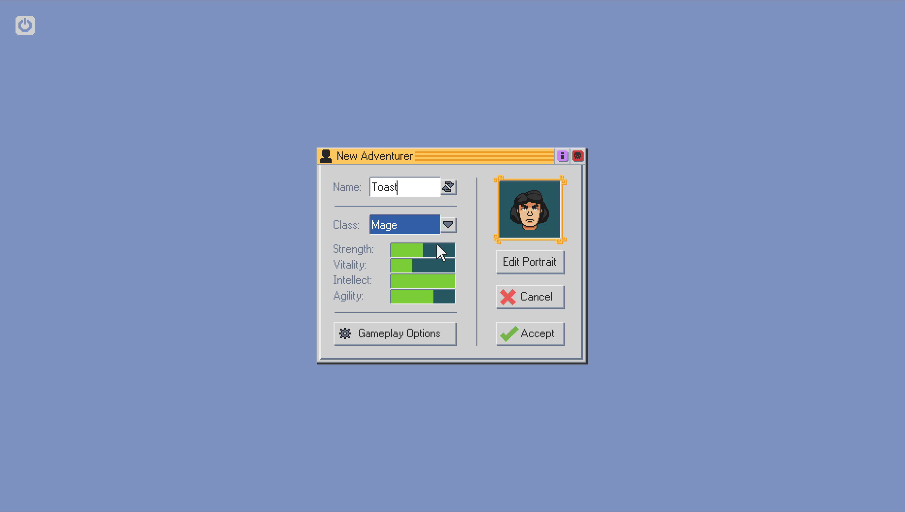

# Technical log

Reconstructed from timestamped logs, backups, exact source diffs, screenshots,
and the final live filesystem. Times use America/Los_Angeles.

## 2026-08-07: preserve and inventory

Before changes, the KDE start/stop scripts, `.bashrc`, `kwinrc`, Termux details,
package list, and GPU environment were backed up under
`~/steam-arm64/backups/20260807-113956`. The existing accelerated desktop was
treated as immutable; all Steam libraries and variables were isolated.

## Native ARM64 client in Debian

Valve's ARM64 client was staged under `~/steam-arm64/client`. Early direct and
PRoot launches established that it required a conventional glibc userspace, so
Debian 13 was used with `~/.steam/steam` linked to the external client tree.
See `debian-native-linked-20260807-115310.log` and `bootstrap-driver-2.log`.

## Private Turnip selection

A private Mesa bundle was installed at `~/steam-arm64/mesa-kgsl`. The launcher
selects it with `VK_DRIVER_FILES`, `LD_LIBRARY_PATH`, `LIBGL_DRIVERS_PATH`,
`MESA_LOADER_DRIVER_OVERRIDE=kgsl`, and `TU_DEBUG=noconform`, without replacing
the desktop's Mesa. Observed: Mesa `26.2.0-devel (git-9452d1daec)`, ICD API
`1.4.335`.

## PRoot IPC repair

Steam exercised SysV shared memory/semaphores and robust-list calls missing or
incomplete in the Android PRoot path. PRoot at commit
`a89b3732ec6ae1db674510f0843b2f3db54d0a2f` was changed to:

- emulate `set_robust_list` and `get_robust_list` registration;
- track semaphore last-operation PIDs and implement `GETPID`;
- implement `SETALL`, `GETNCNT`, and `GETZCNT` behavior;
- wake blocked `semop` waiters after `SETVAL`/`SETALL`;
- add opt-in `PROOT_SYSVIPC_LOG` diagnostics;
- add opt-in crash reports with signal, registers, command line, and memory map.

The exact 244-line diff is `patches/proot-steam-android.patch`. Focused probes
are retained in `probes/`.

## Five-minute launch delay: D-Bus pipe inheritance

Steam's updater auto-started D-Bus. The daemon inherited the updater output pipe,
preventing EOF for about five minutes. The launcher now starts a private session
bus first, passes its address into Debian, and cleans it up on exit. Evidence:
`dbus-fix.log`.

## CEF flicker, stale surfaces, and broken clicks

CEF GPU compositing under Termux:X11 produced partial/stale surfaces, flicker,
and bad hit testing. `-cef-disable-gpu` stabilized Steam's HTML UI. This affects
the client UI only; games remain on Turnip. `-no-cef-sandbox` is also required
inside this PRoot/app-sandbox arrangement. See `flicker-1.png` and
`cef-software-fixed-20260807-162701.log`. The stable-UI screenshot was removed
because it exposed private account information.

## Missing Steam network bridge methods

The UI called absent `SteamClient.System.Network` methods and threw before its
fallback could render. The idempotent UI patch adds exact function checks for
`RegisterForDeviceChanges`, `GetProxyInfo`, and
`RegisterForConnectivityTestChanges`. It backs up the minified chunk and refuses
unexpected match counts. It is tied to `chunk~2dcc5aaf7.js`; future Steam builds
will require locating the new chunk and expressions.

## IPv4 and Android `/proc/net`

Steam's local bridge was unreliable with IPv6-preferred localhost resolution,
so the Steam PRoot session receives a private IPv4-only hosts file. Android also
hides TCP ownership details from unprivileged apps. Steam's scoped `lsof` query
is answered by our shim; all other invocations reach real `lsof`. Evidence:
`ipv4-test-20260807-151041.log` and `lsof-shim-20260807-151218.log`.

## Download preallocation and inconsistent install state

File-by-file preallocation was pathologically slow through ptrace PRoot and held
downloads near 2%. `-chromeosnopreallocate` disables it. Incomplete manifests
were quarantined rather than destroyed, Steam recreated state, and downloads
completed. Final sizes observed on 2026-08-08:

- Burnout Paradise Remastered: `7992789904` bytes;
- Proton Experimental: `1515228739` bytes;
- Steam Linux Runtime 4.0: `672088523` bytes.

See `burnout-after-install-confirm.png`, `restart-after-install-complete.log`,
and `steam-relaunched-installed.png`.

## 2026-08-08: runaway logs filled the filesystem

`steamwebhelper.log` allocated about 8.4 GiB and `chrome_debug.log` about 16.7
GiB. Truncation while writers remained open merely created huge sparse files at
their retained offsets; output continued around 150 MB every few seconds. The
orphan helper trees were stopped, closed files cleared, and only those two debug
streams linked to `/dev/null`. The launcher reapplies this guard. Normal Steam
and launcher logs remain. Roughly 30 GB was free after deleted handles closed.

## Known incomplete work

Authentication, UI interaction, downloads, native ARM64 client execution, and
Turnip selection are demonstrated. Windows-game execution is not yet proven.
The official ARM64 Proton and runtime are registered and Burnout has an explicit
mapping. Its first correctly mapped launch reached ARM64 Pressure Vessel, whose
metadata scan exposed a PRoot `link2symlink` inconsistency and crashed before
Proton, Wine, FEX, the EA App, or Burnout started. Next: validate the isolated
PRoot correction, then continue through FEX, DXVK, Turnip, audio, and controller
initialization without speculative workarounds.

## 2026-08-08: first complete Burnout launch trace

Steam accepted a Burnout launch request and advanced through `UnlockingH264`,
shader-cache processing, license checkout, and `CreatingProcess`. No Proton,
Wine, FEX, EA launcher, or game process was spawned.

The immediate failure occurred in Steam's compatibility manager. Its cache-off
job was still registering every historical Proton generation at approximately
35 seconds per entry. PRoot consumed about 87% of one CPU core and accumulated
hundreds of thousands of context switches. When Proton Experimental requested
its installed Runtime 4 dependency (App ID 4183110), Steam reported the tool as
unknown because the cache rebuild had not reached it. Command-line wrapping
failed and Steam released the game session.

The Runtime 4 installation and `toolmanifest.vdf` were verified complete. This
distinguishes a slow/incomplete compatibility-cache rebuild from missing game
files or a Proton/game crash. The live state is captured in
`docs/evidence/2026-08-08-live-debugging-compat-timeout.png`.

## 2026-08-08: ARM SDK layout and the correct Proton artifacts

Once compatibility registration completed, the first real launch failed before
Proton with `/root/steam-arm/.steam/sdkarm64/steam-launch-wrapper: not found`.
The ARM client stores that wrapper in `linuxarm64`, while its game-launch command
uses Steam's traditional `$HOME/.steam` SDK names. The isolated launcher now
creates narrow symlinks for `sdkarm64`, `bin64`, `bin32`, and `steamrtarm64`.
It intentionally keeps `.steam` as a real directory because Steam stores live
account and IPC state there.

That exposed the next architecture mismatch: Burnout was automatically mapped
to conventional x86-64 Proton Experimental (App ID 1493710) and x86-64 Steam
Linux Runtime 4.0 (App ID 4183110). The x86-64 `pressure-vessel-wrap` cannot be
executed directly on this AArch64 userspace and exited 127. The required native
tools are separate Steam applications:

- Proton 11.0 (ARM64), App ID 4628740;
- Steam Linux Runtime 4.0 - Arm64, App ID 4185400.

Proton 11.0 (ARM64) downloaded completely (3,596,743,348 installed bytes). The
ARM64 runtime download was started next. Burnout must then be explicitly mapped
to Proton 11.0 (ARM64); installing it alone does not replace Steam's automatic
Proton Experimental mapping.

## 2026-08-08: register the separately distributed ARM64 tools

The installed ARM64 applications were absent from the compatibility-tool list
in the cached SteamPlay 2.0 Manifests application (App ID 891390). Their own
`toolmanifest.vdf` files were valid, but installing the applications did not add
them to Burnout's compatibility dropdown.

The launcher now renders
`config/steam-arm64-compatibilitytools.vdf.in` into Steam's canonical local-tool
directory:

```text
~/steam-arm64/client/compatibilitytools.d/steam-arm64-official/compatibilitytool.vdf
```

This declares the untouched installed payloads with explicit local keys:

- `proton_11_arm64_official`: Proton App ID 4628740, depot 4628741;
- `steamlinuxruntime_4_arm64_official`: runtime App ID 4185400, depot 4185401.

The Proton declaration and its installed `toolmanifest.vdf` both preserve the
runtime dependency on App ID 4185400. The first attempt placed the declaration
at `/root/steam-arm/.steam/compatibilitytools.d`. A full registry pass completed
at 16:11:23 without either ARM tool, and access times proved Steam never opened
that directory. This installation has no conventional `~/.steam/root` symlink;
placing the descriptor directly under the actual client root fixed discovery
without replacing the live `.steam` state directory.

On the corrected start, `compat_log.txt` recorded at 16:37:00:

```text
Processing local tool list at .../client/compatibilitytools.d/steam-arm64-official/compatibilitytool.vdf...
Registering tool proton_11_arm64_official, AppID 4628740
Registering tool steamlinuxruntime_4_arm64_official, AppID 4185400
Loaded manifest for tool proton_11_arm64_official.
Loaded manifest for tool steamlinuxruntime_4_arm64_official.
```

The launcher also makes `-noverifyfiles` a fixed client argument. It does not
disable the normal client-version manifest check. It skips bootstrap file-size
verification because this project deliberately patches one minified Steam UI
chunk. A bare start without the flag detected the 57-byte intentional size
difference and spent about eleven minutes extracting and reinstalling the same
client build. After the stock file was restored, all three exact UI signatures
were verified, the guard was reapplied, and the next start logged `Verification
skipped` with exactly one `-noverifyfiles` argument.

## 2026-08-08: registry completion and explicit Burnout mapping

The corrected compatibility registry pass completed at 00:13:45 UTC on
2026-08-09 (17:13:45 local time on 2026-08-08) and posted the two queued ARM64
tool-registration callbacks. Steam resolved these exact command prefixes:

```text
Command prefix for tool 4185400 "Steam Linux Runtime 4.0 - Arm64" set to: "'/data/data/com.termux/files/home/steam-arm64/client/steamapps/common/SteamLinuxRuntime_4-arm64'/_v2-entry-point --verb=run -- "
Command prefix for tool 4628740 "Proton 11.0 (ARM64)" set to: "'/data/data/com.termux/files/home/steam-arm64/client/steamapps/common/SteamLinuxRuntime_4-arm64'/_v2-entry-point --verb=run -- '/data/data/com.termux/files/home/steam-arm64/client/steamapps/common/Proton 11.0 (ARM64)'/proton run "
```

This confirms that the ARM Proton tool depends on
`SteamLinuxRuntime_4-arm64`; neither prefix uses conventional Proton
Experimental or the x86-64 `SteamLinuxRuntime_4` directory.

The UI remained on its loading spinner after registry completion, and opening
the Burnout Properties URI did not render a usable dialog. Steam was shut down
before the fallback edit. The live configuration files were preserved under:

```text
~/steam-arm64/backups/20260808-172147-post-shutdown-before-burnout-arm-mapping
```

With Steam offline, `~/steam-arm64/client/config/config.vdf` received this
standard explicit entry under
`InstallConfigStore/Software/Valve/Steam/CompatToolMapping`:

```text
"1238080"
{
	"name"      "proton_11_arm64_official"
	"config"    ""
	"priority"  "250"
}
```

The next startup log accepted the edit at 00:34:35 UTC, recording Burnout App
ID 1238080 mapped to `proton_11_arm64_official` at priority 250. This proves the
explicit selection was loaded. The two queued compatibility cache passes then
completed at 00:48:03 UTC. Steam explicitly skipped its automatic priority-100
`proton-experimental` mapping because the priority-250 ARM64 mapping already
existed.

Screenshot capture also needs a bounded runtime in this environment:

```sh
timeout 40s proot-distro login debian --shared-tmp -- /bin/bash -lc \
  'DISPLAY=:0 import -window root /data/data/com.termux/files/home/steam-arm64/current-screen.png'
```

An unbounded capture left an orphaned `import`/PRoot process. That process
blocked the Steam updater handoff until it was identified and terminated. The
timeout prevents a future capture from silently holding the startup sequence
open.

## 2026-08-08: first official ARM64 Proton launch and Pressure Vessel crash

Burnout was launched through `steam://rungameid/1238080` at 17:50:57 local
time. Both the install-script evaluator and the game-process log selected
`proton_11_arm64_official`. The actual game command began with:

```text
SteamLinuxRuntime_4-arm64/_v2-entry-point --verb=waitforexitandrun --
Proton 11.0 (ARM64)/proton waitforexitandrun
link2ea://launchgame/1238080?platform=steam&theme=bprm
```

There was no reference to conventional Proton Experimental or the x86-64
`SteamLinuxRuntime_4` directory. This confirms the registry and explicit
mapping work. It does not yet prove Proton itself runs: the ARM64
`pressure-vessel-wrap` process received `SIGSEGV` before Proton, FEX, Wine, the
EA App, or Burnout appeared in the process tree. Steam recovered to the Burnout
library page with its green Play button.

Both the evaluator and game crashes had the same symbolized signature in the
runtime's bundled GLib 2.66.8:

```text
instruction offset 0x41390: g_str_hash+0
link-register offset 0x3fce4: g_hash_table_lookup_extended
fault address: 0x0
```

The matching Pressure Vessel 0.20260714.0 source explains the null key. During
runtime cleanup, `pv_runtime_remove_overridden_libraries()` trusts a directory
entry reported as `DT_LNK`, ignores failure from its following `readlinkat`, and
passes the resulting null target to a string-keyed hash lookup.

The underlying inconsistency is in PRoot's `link2symlink` extension. A direct
syscall probe on an emulated hard link showed:

```text
getdents64 d_type: DT_LNK
guest lstat type: regular file
guest readlink: EINVAL
```

The host file is a symlink into PRoot's `.l2s` storage, but PRoot deliberately
presents it to the guest as a regular hard link for `stat` and `readlink`.
`link2symlink` does not currently filter `getdents` or `getdents64`, so the raw
host `DT_LNK` leaks through. Pressure Vessel therefore takes its symlink path
and receives the contradictory regular-file behavior. Replacing GLib cannot
fix this null input. The preferred fix is to make the extension report
`DT_UNKNOWN` only for `.l2s`-backed directory entries, letting the caller query
the already-correct guest `fstatat` result. Any modified PRoot must be built and
validated separately before replacing the production launcher binary.

Compatibility scanning was also strongly affected by Android scheduling. With
Termux:X11 in the foreground, the Termux UID was restricted to the moderate
cpuset on CPUs 0-3 and registry intervals took 52-54 seconds. Bringing the
Termux activity to the foreground moved the same live Steam processes to the
top-app cpuset on CPUs 0-7; the same intervals fell to 7-8 seconds, about a
6.9x improvement. This is a useful non-destructive optimization for future
nonvisual registry work; Termux:X11 must be foregrounded again for visual
inspection.

## 2026-08-08: complete ARM64 Runtime 4 container passes under PRoot

Before implementing the Pressure Vessel fixes, two local history searches were
run as required by the workspace instructions:

```text
deja "PRoot bubblewrap Can't bind mount bindfile newroot etc passwd Unable to find in mount table"
deja "PRoot Bubblewrap fchdir to oldroot No such file or directory after pivot_root"
```

Neither query matched an indexed prior agent session, so no previous-session
solution was reused. The implementation below was derived from the live traces,
the pinned PRoot source, and Bubblewrap's matching pivot sequence in the
[Steam Runtime Tools source](https://gitlab.steamos.cloud/steamrt/steam-runtime-tools/-/blob/v0.20260714.0/subprojects/bubblewrap/bubblewrap.c#L3039).

The first fix makes the `link2symlink` extension post-process `getdents` and
`getdents64`. A raw `DT_LNK` is changed to `DT_UNKNOWN` only when the host entry
is confirmed to point into PRoot's private `.l2s` storage. A focused regression
probe then produced the internally consistent results:

```text
source:   d_type=DT_UNKNOWN, lstat=regular, readlink=EINVAL
hardlink: d_type=DT_UNKNOWN, lstat=regular, readlink=EINVAL
symlink:  d_type=DT_LNK,     lstat=symlink, readlink=target=source
```

Pressure Vessel next encountered pseudo-hardlinks as physical bind sources
below its emulated `/oldroot`. Final host-path canonicalization now resolves a
confirmed `.l2s` backing path.

Two separate Bubblewrap translation failures remained. Exact host bindings
whose source is also inside the guest root were being discarded by PRoot's
reverse binding lookup, yielding:

```text
Can't bind mount /bindfile... on /newroot/etc/passwd: Unable to find the mount point in the mount table
```

The existing safety guard is retained for descendants, but an exact binding is
now allowed to win. Finally, Bubblewrap's second `pivot_root(".", ".")` keeps an
fd for the detached root, calls `fchdir()` on it, detaches `.`, and changes to
the new `/`. PRoot now gives that detached root a transient per-vpid binding
and drops bindings belonging to the stale namespace snapshot so they cannot
win fd detranslation over the alias. The focused fd probe prints
`pivot-root-fd: PASS`.

The first full-container smoke test exposed a validation mistake. Its narrow
hard-link guard compared the configured guest `var/tmp-` prefix with a syscall
argument that PRoot had already canonicalized to a host path. The command
exited zero, but a later host-side audit showed all 136 regular Pressure Vessel
files had been converted back into `.l2s` pseudo-links. The wrapper then failed
to load `libjson-glib-1.0.so.0`. Guest-side `find -type f` had hidden the
conversion because `link2symlink` intentionally presents those backing links
as regular files. This invalidated the first smoke-test conclusion and binary:

```text
00cdd490de055ca71bbb8ec75eacc22d29f708d9221eff8bf2cf4cc9178d36ae
```

The corrected guard translates the opt-in guest prefix with PRoot's own
`translate_path()` before comparing it with the canonicalized destination.
The `/proc/self/fd` special case still runs first, the prefix must be absolute
and end in `/tmp-`, and no behavior changes when the environment variable is
absent. Pressure Vessel now receives `EXDEV` and uses its normal copy fallback.

All production patches were applied to a clean checkout of Termux PRoot commit
`a89b3732ec6ae1db674510f0843b2f3db54d0a2f` and built with
`PROOT_WITH_LIBANDROID_SHMEM=1`. The corrected binary has SHA-256:

```text
5ec617e9177076d40bf1fd878387a419ff4fa6f7be32b1a0448a3e6fc38db8d5
```

The build script now stamps the commit, ordered patch-set hash, and complete
source-diff hash. A second build verified the stamp instead of applying any
patch twice. The patch-set and diff hashes were respectively:

```text
693ad81804c9c1376ff4dc9c1fa78aad1e3fe8205b48b2ee8476760c91c46179
3e233db7b62e2494909a92fe2d902e623c58178a53285f97f29ce24836de7a02
```

A fresh isolated shadow was prepared at
`~/steam-arm64/runtime/SteamLinuxRuntime_4-arm64-v2`. It preserves the
installed official ARM64 runtime and its prior `var` state, while replacing
the active Pressure Vessel tree with the hash-identical real-file ARM64 copy
shipped in the installed conventional Runtime 4 depot. Its
`pressure-vessel-wrap` SHA-256 is:

```text
f53f2e6574926d1e5bebac4ca43e19138d10941826bc397520508dcfa6648182
```

Using the corrected PRoot build and this exact shadow path, the complete
official ARM64 Runtime 4 entry point passed:

```text
_v2-entry-point --verb=run -- /bin/true
exit status: 0
host Pressure Vessel: 136 regular files, 0 .l2s links
host mutable runtime: 5,372 regular files, 0 .l2s links
```

Steam does not honor the local Runtime 4 `install_path` when Proton's
`require_tool_appid=4185400` is resolved. After the compatibility pass completed
at 02:16:17 UTC, the command prefix still used
`client/steamapps/common/SteamLinuxRuntime_4-arm64`. The installed
`appmanifest_4185400.acf`, library metadata, and ARM `steamclient.so` strings
confirm that this path is computed through `GetAppInstallDir()`.

The non-destructive solution is an outer PRoot bind from the prepared shadow
onto that exact guest depot directory. The appmanifest and both official depot
trees remain unchanged on the host. A second complete smoke test used the bind
and Steam's exact computed path; it also exited zero with 136 real Pressure
Vessel files, 5,372 real mutable-runtime files, and zero `.l2s` links on the
host.

This is the first valid end-to-end confirmation that Pressure Vessel builds and
enters its full mutable ARM64 container under both the direct and actual Steam
path spellings. It proves the runtime boundary, not Burnout, Proton, FEX, Wine,
DXVK, or the EA App.

Steam was shut down gracefully before deployment. The old launcher, manifest
template, PRoot binary, generated compatibility manifest, and `config.vdf` are
preserved at:

```text
~/steam-arm64/backups/20260808-191150-before-pressure-vessel-runtime-fixes
```

That deployment was subsequently shown to contain the invalid first guard and
shadow, so it is retained as diagnostic history rather than accepted as the
final fix.

The corrected runtime checkpoint was committed and pushed as `dfa15f6`. A
full-resolution 2800x1586 screenshot showed the authenticated Steam Store UI
rendering normally before deployment. Steam then exited cleanly six seconds
after a forwarded `-shutdown` request. The live launcher, compatibility-tool
template, generated manifest, `config.vdf`, old PRoot hash, and invalid runtime
shadow were preserved without deletion at:

```text
~/steam-arm64/backups/20260808-194157-before-runtime-v2-overlay
```

The tested v2 shadow was atomically promoted to
`~/steam-arm64/runtime/SteamLinuxRuntime_4-arm64`, and the clean stamped build
was installed at `~/steam-arm64/src/proot-production/src/proot`. The deployed
hashes are:

```text
launcher:        548d79bfae0e5d6a87288c84ba4a13285719139d004980d212b667e8f0a706e1
patched PRoot:   5ec617e9177076d40bf1fd878387a419ff4fa6f7be32b1a0448a3e6fc38db8d5
PV wrapper:      f53f2e6574926d1e5bebac4ca43e19138d10941826bc397520508dcfa6648182
```

Steam restarted at 02:42:22 UTC with main PID 22724 and PRoot parent PID
22711. The parent command line contains the exact bind:

```text
runtime/SteamLinuxRuntime_4-arm64:
client/steamapps/common/SteamLinuxRuntime_4-arm64
```

Its environment contains the guest-visible copy-fallback prefix
`client/steamapps/common/SteamLinuxRuntime_4-arm64/var/tmp-`. Turnip sysinfo
still completed successfully after restart. The new registry pass registered
both ARM tools and retained Burnout's priority-250 mapping.

## 2026-08-08: spaced compatibility-tool paths in synthetic mountinfo

The post-restart registry pass completed at 02:52:46 UTC. In the same second,
Steam posted registration callbacks for App IDs 4185400 and 4628740 and set
these fresh command prefixes:

```text
SteamLinuxRuntime_4-arm64/_v2-entry-point --verb=run --
SteamLinuxRuntime_4-arm64/_v2-entry-point --verb=run -- Proton 11.0 (ARM64)/proton run
```

The priority-100 automatic `proton-experimental` mapping was skipped because
Burnout retained the explicit priority-250 `proton_11_arm64_official` mapping.
A full-resolution 2800x1586 screenshot at
`~/steam-arm64/prelaunch-runtime-v2.png` showed the Steam Store UI rendering
normally before launch.

The launch request began at 02:55:27 UTC. Both its install-script evaluator and
the subsequent real `link2ea://launchgame/1238080?platform=steam&theme=bprm`
action selected official Proton 11 ARM64 and the ARM64 Runtime 4. Each completed
the slow mutable-runtime copy and then failed before Proton, FEX, Wine, the EA
App, or Burnout started:

```text
bwrap: Can't bind mount /oldroot/.../Proton 11.0 (ARM64)
on /newroot/.../Proton 11.0 (ARM64):
Unable to find "/newroot/.../Proton 11.0 (ARM64)" in mount table
```

The error appears at lines 18583 and 37085 of
`~/steam-arm64/logs/steam-20260808-194221.log`. The preserved post-launch
screenshot `~/steam-arm64/post-first-arm64-launch.png` shows a healthy Steam
Store/KDE desktop but no game or EA window. Both host-side integrity audits
still reported zero `.l2s` links.

Before diagnosis, these required history searches returned no indexed match:

```text
deja "bwrap Unable to find newroot Proton ARM64 mount table PRoot same-dir pivot bind mount"
deja "PROot bwrap Can't bind mount Unable to find in mount table emulate_pivot_root Proton ARM64 Pressure Vessel"
```

No prior-session solution was reused. The live trace, pinned PRoot source, and
Bubblewrap parser behavior isolated the fault to PRoot's synthetic mountinfo.
`append_runtime_binding_lines()` wrote mountpoint and source fields with raw
`%s`. Mountinfo requires spaces, tabs, newlines, and backslashes to be encoded
as `\040`, `\011`, `\012`, and `\134`. Bubblewrap splits on whitespace before
decoding those octal escapes, so the raw compatibility-tool path was parsed
only through `Proton` and could never equal the full destination.

The focused Bubblewrap reproducer produced this matrix with the deployed PRoot:

```text
bind /bin:                                  exit 0
bind Proton 11.0 (ARM64):                   exit 1
```

`proot-mountinfo-escape-paths.patch` now emits the required octal escapes for
both fields. `probe-proot-mountinfo-escape.sh` verifies a bind containing both
spaces and a literal backslash. `probe-proot-bwrap-spaced-bind.sh` exercises the
bundled ARM64 `srt-bwrap` parser with both the no-space control and the actual
official Proton directory. Against the isolated v3 build, both Bubblewrap cases
exited zero and the mountinfo probe printed `mountinfo-escape: PASS`.

The v3 build remains pinned to PRoot commit
`a89b3732ec6ae1db674510f0843b2f3db54d0a2f`. Its provenance is:

```text
patch-set SHA-256: ef0d425bc118d54ad701e01123c09ab0da71c6001ab33bdebe24a68082367fda
source-diff SHA-256: 8244798771f0c30d27ca09d28a3ff49227e0ca4bfe53daaac8780aa3c6bc44a9
binary SHA-256: c9ae8f9611b1009568ac18a8d83695440306e25e0f0b4223d09bf821ca2d6a53
```

Finally, the complete official ARM64 Runtime 4 smoke test using the exact Steam
path overlay exited zero after 177 seconds. Host audits found 136 real Pressure
Vessel files, 5,372 real mutable-runtime files, and zero `.l2s` links. The log
`~/steam-arm64/logs/proot-v3-full-runtime-smoke-20260808-2010.log` contains no
unexpected error. This validates the fix before production deployment; it does
not yet prove Proton, FEX, Wine, EA App, or Burnout execution.

The confirmed fix was committed and pushed as `822880d`. Steam then shut down
gracefully ten seconds after its own `-shutdown` forwarder completed. The prior
complete production PRoot tree and unchanged launcher are preserved at:

```text
~/steam-arm64/backups/20260808-201650-before-mountinfo-v3
```

The v3 source tree was atomically promoted to
`~/steam-arm64/src/proot-production`; its commit, patch-set hash, source-diff
hash, and binary hash all matched the isolated build. Steam restarted on PRoot
PID 32757 and main PID 320. `/proc/32757/exe` has the expected
`c9ae8f9611b1009568ac18a8d83695440306e25e0f0b4223d09bf821ca2d6a53`
hash, and its command line and environment retain the exact ARM64 runtime
overlay and guarded `var/tmp-` prefix.

The new session log is `~/steam-arm64/logs/steam-20260808-201738.log`. Turnip
sysinfo still succeeds after restart and reports `Turnip Adreno (TM) 730`.
`~/steam-arm64/post-mountinfo-v3-restart.png` is a full-resolution 2800x1586
screenshot of the healthy Steam "Loading user data..." window. Steam registered
both ARM tools and the priority-250 Burnout mapping, then started compatibility
cache job 15488033736693968634 at 03:18:13 UTC. The queued second pass completed
at 03:47:16 UTC with callbacks for App ID 4185400 as
`steamlinuxruntime_4_arm64_official`, App ID 4628740 as
`proton_11_arm64_official`, and Burnout App ID 1238080. The log explicitly
skipped Burnout's lower-priority automatic `proton_experimental` mapping.

At 20:50:31 PDT, a single `steam://rungameid/1238080` launch was forwarded to
the existing Steam process. Session `bb257b8e4cd92f1` selected the official
`SteamLinuxRuntime_4-arm64` and `Proton 11.0 (ARM64)` paths for both its install
evaluator and main `link2ea://launchgame/1238080` command. Both invocations
passed the old spaced-path mount-table failure, confirming the production
mountinfo fix against Steam's real launch path.

The next exact blocker is independent of the Proton path. Both invocations
ended at:

```text
bwrap: Can't get type of source /tmp/.X11-unix/X0: No such file or directory
```

The X0 socket exists natively in Termux and is visible from an ordinary
`proot-distro login debian --shared-tmp` shell, but the bundled ARM64
`srt-bwrap` cannot resolve it while setting up the container. The main launch
exited at 03:56:04 UTC before a Proton child, FEX, Wine, the EA App, or Burnout
started. Pressure Vessel and its mutable runtime still contain zero `.l2s`
links, and 27 GB remained free. The failed 370 MB temporary root
`var/tmp-EJJ2T3` was retained for inspection. A full-resolution post-failure
screenshot at `~/steam-arm64/post-x0-bind-failure.png` shows the authenticated
Steam Store healthy with no game or EA window.

## 2026-08-08: retain shared `/tmp` below Bubblewrap's staging mount

The X0 failure was not specific to sockets. These required history searches
returned no indexed match, so no previous-session solution was reused:

```text
deja "srt-bwrap PRoot Unix socket ro-bind X0 no such file Termux X11"
deja "PRoot srt-bwrap X0 unix socket lstat ENOENT pivot_root path translation bind source"
```

With production PRoot, bundled `srt-bwrap --ro-bind / /` could bind `/tmp`
itself, but every tested descendant of the shared Termux `/tmp` failed with
`ENOENT`: a regular file, a child directory, the existing X0 socket, and a
fresh AF_UNIX socket. The same regular file, directory, and exact live X0 inode
all succeeded when the outer PRoot exposed them below `/mnt`. This ruled out
file type, socket permissions, and the host source path.

`PROOT_VERBOSE=9` showed the exact lifecycle. The outer namespace initially
translated `/tmp` through `$PREFIX/tmp`. Bubblewrap then mounted a private
tmpfs at guest `/tmp` for its staging root. PRoot's equal-guest insertion
discarded the covered `$PREFIX/tmp:/tmp` binding. After the first
`pivot_root`, Bubblewrap resolved its pre-opened source below
`/oldroot/tmp/.X11-unix/X0`, but PRoot could only see the staging tmpfs and
returned `ENOENT`.

`proot-runtime-mount-stack.patch` gives emulated runtime mounts ordered stack
semantics. The newest equal guest binding is active, `umount` reveals the
covered entry, namespace copies preserve active-to-covered order, and
`pivot_root` excludes the active new-root layer while re-exposing its covered
underlay below `oldroot`. Root lookup now selects the active binding, and
synthetic mountinfo emits only the active entry for duplicate guest paths.

`probe-proot-bwrap-shared-tmp-bind.sh` creates a validated Termux-tmp fixture
and checks both its regular file and containing directory through the bundled
ARM64 `srt-bwrap`. The identical harness fails against production v3 with the
original `No such file or directory`, and exits zero against isolated v4b.
The v4b build also passes the mountinfo escape probe, both no-space and real
`Proton 11.0 (ARM64)` binds, and `pivot-root-fd.py`.

The isolated v4b build remains pinned to PRoot commit
`a89b3732ec6ae1db674510f0843b2f3db54d0a2f`. Its provenance is:

```text
artifact root:        ~/steam-arm64/src/mountstack-v4b-20260808-212006
source tree:          ~/steam-arm64/src/mountstack-v4b-20260808-212006/worktree
patch input SHA-256:  263d3db02e03ab90163d5080b26a806c4851af8c554ef33c81b57b2911a64ca9
probe SHA-256:        8d5e7ac5881c03585dbe69a18385c0dbe3f7a9c2fbeacc11564372338116a52a
patch-set SHA-256:    fa72be34b4317763eb6c7f0eeb048a475eb6be5a1ef33d1bc9d57cb174f71258
source-diff SHA-256:  ceac3039e9321553b2faee363b71b26d54e3620b7c1a8e54f8e557bd3efb525a
binary SHA-256:       981c304c7cf156ea7f7068fc2d3ed781aef1d2514c5d128b0ce0b57d52ad47ca
```

A complete isolated official `SteamLinuxRuntime_4-arm64` smoke using
`_v2-entry-point --verb=run -- /bin/true` then exited zero. Its private
`var/tmp-56SZT3` contains 5,371 regular files; Pressure Vessel, all isolated
`var`, and the new temporary root contain zero `.l2s` links. The log contains
only the expected guarded `EXDEV` copy warnings and no unexpected missing-path,
permission, segmentation, fatal, or `E:` errors. The production binary remains
v3 hash `c9ae8f9611b1009568ac18a8d83695440306e25e0f0b4223d09bf821ca2d6a53`
until a guarded deployment, Steam remained alive, and 26 GB remained free.

The guarded production deployment then shut Steam down through its own
forwarder and observed a natural exit. The shutdown transcript is
`~/steam-arm64/logs/shutdown-before-mountstack-v4-20260808-213614.log`. The
complete v3 tree was preserved by atomic rename at:

```text
~/steam-arm64/backups/20260808-2136-before-mountstack-v4/proot-production-v3
```

The validated v4b tree was promoted to
`~/steam-arm64/src/proot-production`, retaining the isolated candidate
artifact. The promoted patch-set, source-diff, and binary hashes exactly match
the provenance above. Steam restarted through
`~/steam-arm64/logs/restart-mountstack-v4-20260808-213713.log`; its new session
log is `~/steam-arm64/logs/steam-20260808-213715.log`. Live process inspection
found Steam PID 17522 under outer PRoot PID 17515, and `/proc/17515/exe` has
the expected v4b binary SHA-256
`981c304c7cf156ea7f7068fc2d3ed781aef1d2514c5d128b0ce0b57d52ad47ca`.
The runtime shadow bind and guarded `PROOT_L2S_EXDEV_PREFIX` also remained
exactly as configured.

The post-restart screenshot
`~/steam-arm64/post-mountstack-v4-restart.png` (SHA-256
`2b3c7e8962c2a2ac4291c7a3063893c582d948f4a1acce68a3618837c1e61020`)
shows KDE responsive and Steam at `Loading user data...`, with no crash dialog
or game window. Before the new cache rebuild began, `compat_log.txt` again
loaded App IDs 4628740 and 4185400 as `proton_11_arm64_official` and
`steamlinuxruntime_4_arm64_official`, and mapped Burnout App ID 1238080 to the
ARM Proton at priority 250. The new cache job then began its known slow scan;
Burnout was deliberately not launched while registration remained incomplete.

## 2026-08-08/09: official Proton/FEX/Wine reaches the EA App

Compatibility cache job `1851510475679486629` completed at 05:06:28 UTC. In
the same second Steam posted callbacks for App ID 4185400 as
`steamlinuxruntime_4_arm64_official`, App ID 4628740 as
`proton_11_arm64_official`, and Burnout App ID 1238080. Steam again skipped the
priority-100 automatic Experimental mapping because the priority-250 ARM
mapping already existed. `~/steam-arm64/prelaunch-mountstack-v4.png` (SHA-256
`4aebe248d100d7737ff6eba464120bde9286511086ba401d32194b0902ef3332`)
shows the authenticated Steam Store before the single launch request.

The install-script evaluator started at 05:08:11 UTC and selected the official
ARM tool. Production PRoot v4b passed the previous X0 bind boundary and ran the
bundled `srt-bwrap`, `pv-adverb`, official Proton Python entry point, native
ARM64 Wine, and ARM64 wineserver. Proton upgraded the prefix to `11.0-100` and
generated `proton-fex-config.json`. Process maps and signal telemetry identified
both `libarm64ecfex.dll`/`libwow64fex.dll` and `[anon:FEXMemJIT]`, confirming
the official bundled FEX path.

The EA installer displayed its first-run `LET'S GO` UI. The exact visible child
window was validated as `EA app installer`, 480x480, before its button was
clicked. These screenshots preserve the milestone:

```text
~/steam-arm64/wine-prefix-init-v4.png
  bed33e8043245846f10867291bbd951f1538ed13599e63d6aac0e11334b78aa3
~/steam-arm64/ea-installer-window-v4.png
  af0f34146d6bccf6b1dc3617a96d26080e6e5fe81f9598eff7053c595e4499a9
~/steam-arm64/ea-after-lets-go-v4.png
  83be20fe233cb396e307047d8e49b548b6cc579bf72bc21187fd4d7656362e5c
```

EA unpacked roughly 556 MB and invoked `EABackgroundService.exe -start`, but
the MSI transaction rolled back. The authoritative terminal artifact is:

```text
~/steam-arm64/client/steamapps/compatdata/1238080/pfx/drive_c/users/steamuser/AppData/Local/Temp/Setup_20260809053742_Failed.txt
SHA-256 2258a43b898517f750fad153876b68d8e31b2bda4c0f7c288f21f78e7bcdc814

Error 0x800700e8: Failed to pump messages from parent process.
Error 0x800700e8: Failed to run per-machine mode.
```

`0x800700e8` is Win32 `ERROR_NO_DATA`. The original clean-room/UI parent had
exited about twenty minutes earlier, leaving the elevated Burn child without
its IPC peer. The MSI log did not preserve the service return code, so this
does not prove that EA's supported `EAX_DISABLE_SYMLINKS` option is relevant.
No EA override was applied. The source `installScript.vdf` remains signed and
unchanged.

DirectX proceeded slowly through 154 CAB files after EA rolled back. Every
observed helper returned zero, and `windows/Logs/DirectX.log` ended at 05:48:50
UTC with:

```text
Installation ended with value 0 = Installation succeeded
```

The prefix registry now contains Steam's DirectX June 2010 completion marker,
so a normal retry should not repeat that prerequisite.

Steam naturally advanced into the main command at 05:52:10 UTC:

```text
SteamLinuxRuntime_4-arm64/_v2-entry-point --verb=waitforexitandrun --
Proton 11.0 (ARM64)/proton waitforexitandrun
link2ea://launchgame/1238080?platform=steam&theme=bprm
```

That attempt re-entered the cached EA bundle, but it was invalidated by the
screenshot workflow rather than an EA payload failure. An earlier
`import -window 0x4800091` remained alive after its transient target vanished.
ImageMagick's X11 import path grabs the server until image retrieval returns;
Termux:X11 frame telemetry stopped while that helper was stuck and resumed in
the exact second it was terminated. See the upstream
[`XImportImage` implementation](https://www.imagemagick.org/api/MagickCore/xwindow_8c-source.html).

EA started while the server was grabbed and logged:

```text
Error 0x800703e6: Failed to create window.
CreateDialogParam failed: File not found.
```

Its UI thread then exited, package detection completed, and both remaining EA
processes slept indefinitely in `pipe_read`. The cached and clean-room
installer executables were byte-identical, no new crash/failure artifact was
created, and no EA window appeared after X11 recovered. Therefore this run is
not evidence for changing `EAX_LAUNCH_CLIENT`, `IGNORE_INSTALLED`, symlink
mode, or Proton settings.

The recovered full desktop screenshot
`~/steam-arm64/main-link2ea-stuck-ea.png` has SHA-256
`4a3a26b00bda9aa24436106778a40df462022b6ed7bc904b15cd1da6f237837d`.
The Steam-only confirmation screenshot
`~/steam-arm64/steam-after-stop-click.png` has SHA-256
`cc0f43276a478965024f2f3a91593a0ea8bb63a4d0698bfaaeaa2252f2f6ee5d`.
After the exact visible Stop/Confirm controls were used, Steam removed App
1238080 from the running list at 06:07:28 UTC; the outer tracked PID exited
zero and every Runtime/Proton/Wine/EA child disappeared.

Future X11 evidence capture must use a hard timeout and a stable target, for
example:

```sh
timeout 12 env DISPLAY=:0 import -window <stable-window-id> output.png
```

After a timeout, verify that no `import` or capture-side `xdotool` process
survived before allowing a new GUI process to start. Do not capture a transient
window by ID while it may be closing.

The signed Steam install script, prefix registries, active EA logs, and failure
artifact were preserved before retry work under:

```text
~/steam-arm64/backups/20260808-2300-ea-before-retry
```

Before diagnosing the EA window failure and manifest-rescan behavior, focused
`deja` queries returned no indexed matches. No prior-session solution was
reused.

## 2026-08-08: avoid registry rebuilds for unchanged ARM manifests

Forwarded `steam://` commands also enter `bin/steam-arm`. The launcher formerly
rendered the ARM compatibility manifest to a temporary file and unconditionally
replaced the destination. A navigation request at 23:05:19 PDT changed the
manifest mtime without changing its content; Steam began compatibility cache
job `17304496708137475581` shortly afterward.

The launcher now streams the generated manifest into `cmp` first. Identical
content creates no temporary directory entry and does not touch the destination;
only a real content change uses a unique same-directory `mktemp` followed by an
atomic replacement. A two-pass focused test retained the same inode and mtime,
first-run and changed-content tests passed, and 128 concurrent publishers
completed with exact content and no leftover temp files. `bash -n` passed, and
ShellCheck passed after excluding the existing intentional SC2016 warning for
the single-quoted inner PRoot script. This avoids both metadata-only
compatibility scans and fixed-temp races between concurrent URI forwarders.

The new cache job was allowed to continue; Burnout will not be launched again
until it completes and reconfirms the priority-250 ARM mapping. The next test is
one clean, otherwise unmodified Steam launch with no screenshot helper active
during EA startup. A direct quiet bundle/MSI workaround remains a later option
only if the clean run reproduces the parent-IPC failure.

The reviewed launcher was deployed without executing it. Its live SHA-256 is
`c8af1a27e6e9ed716a77bdd04021ee0fc23edad9334d06e036f63851e0bd2b26`.
The prior launcher (SHA-256
`548d79bfae0e5d6a87288c84ba4a13285719139d004980d212b667e8f0a706e1`)
is preserved at:

```text
~/steam-arm64/backups/20260808-2300-ea-before-retry/steam-arm.before-manifest-idempotence
```

Cache job `17304496708137475581` then completed naturally at 06:19:17 UTC and
again retained Burnout's priority-250 `proton_11_arm64_official` mapping over
the priority-100 automatic Experimental entry. This incremental pass did not
post new ARM callbacks; the retained callbacks remain those from 05:06:28 UTC,
and live `config.vdf` plus the latest command prefixes still select the exact
ARM64 runtime and Proton paths.

A live navigation-only forwarder test at 23:20:40 PDT then exercised the
deployed launcher without starting a game. Before and after the command, the
manifest retained inode 717612, mtime `2026-08-08 23:05:19.512701718 -0700`,
size 853, and SHA-256
`051c887425acd289c225d02f6225014d63b29dc7c66f9b705bc27f3627dfcffe`.
No new cache job appeared during the observation interval. This confirms the
fix against a real existing-client URI forward, not only the focused harness.

## 2026-08-09: fail closed on contaminated ARM64 runtime shadows

The prepared ARM64 runtime must never contain PRoot `.l2s` pseudo-hardlink
symlinks. They encode paths from the temporary copy namespace and can silently
turn a reusable shadow into a host-specific, mutable tree. The preparation
script now routes donor, staged-tree, and existing-shadow checks through one
`require_no_l2s_links` guard. It rejects both a matching link and any failed
`find` traversal; an existing marker and matching wrapper hash are no longer
trusted until the whole Pressure Vessel tree passes that check.

Focused fixtures passed for a clean first preparation, idempotent reuse, donor
contamination, existing-shadow contamination, staged contamination, and an
unreadable scan root. `bash -n`, ShellCheck, and `git diff --check` also pass.
This hardening complements the earlier 136-link recovery; it does not alter the
live Steam depot or select the experimental PRoot build.

## 2026-08-09: direct Link2EA proves EA authentication and prerequisites

The installed EA service was preserved and configured with
`ServicesPipeTimeout=60000`. An isolated official-Proton session then started
the service and Link2EA directly. The authoritative transcript is:

```text
~/steam-arm64/logs/ea-service-timeout-and-link2ea-20260809-0140.log
terminal marker: LINK2EA_RC=0
```

EA's own logs show that Link2EA obtained an external-login authorization code
and access token, fetched the persona, confirmed the linked Steam/EA account,
queued App ID 1238080, and waited for the game launch request. EA Desktop and
EALocalHost also started. EABackgroundService subsequently installed all four
bundled Visual C++ prerequisites (11 x86/x64 and 12 x86/x64) successfully.
The request was dequeued only after EA Desktop became ready, while those
prerequisites were still running. This proves service startup, authentication,
account linking, and prerequisite completion. It does not prove that
`BurnoutPR.exe` started or rendered.

## 2026-08-09: Steam's Link2EA path crashes in official ARM DXVK d3d11

The clean canonical Steam launch selected
`proton_11_arm64_official`, App ID 4628740, and its required
`SteamLinuxRuntime_4-arm64`, App ID 4185400. The real command used the expected
URI:

```text
link2ea://launchgame/1238080?platform=steam&theme=bprm
```

Official Proton Python, native ARM64 wineserver, Wine's Steam stub, and FEX all
started. Link2EA then terminated before creating an EA log or window. PRoot's
terminal signal record was stable across repeated launches:

```text
signal=11 code=2 fault=0x6ff9340000 ip=0x6ff9340000
map=6ff9340000-6ff9341000 ...
    compatdata/1238080/pfx/drive_c/windows/system32/d3d11.dll
```

The faulting prefix file is 7,569,408 bytes with SHA-256
`27a79be7a0db74af3283a600b041c2ced087e4529678e6b1351488718608c676`.
It exactly matches official Proton 11 ARM64's
`files/lib/wine/dxvk/aarch64-windows/d3d11.dll`; Proton recopied it during the
launch. The companion prefix `dxgi.dll` likewise matches the official ARM DXVK
payload (`2c8df44028c1e5b707532cc4317827d9ceb306e6178eda52d2cbce89ee2b9cfe`).
This is not evidence of a stale or third-party DLL.

## 2026-08-09: overlay UI and overlay injection are separate controls

Burnout's Properties dialog was opened only after validating its exact X11
window. Before changing it, `localconfig.vdf` was preserved at:

```text
~/steam-arm64/backups/20260809-0213-before-overlay-test/localconfig.vdf
SHA-256 422f06c26050e5bedef41c4d8c1031b2169f766cbb2afd790bf8362f7411894f
```

The checkbox persisted the authoritative key
`UserLocalConfigStore/apps/1238080/OverlayAppEnable="0"`. The next process had
`SteamNoOverlayUI=1`, but its Pressure Vessel command and `LD_PRELOAD` still
contained the 64-bit, 32-bit, and ARM64 `gameoverlayrenderer.so` paths. Link2EA
reproduced the same `d3d11.dll` fault. Therefore the checkbox disables overlay
UI but is not an injection-removal control.

The installed ARM64 Pressure Vessel 0.20260714.0 supports the narrower
`PRESSURE_VESSEL_REMOVE_GAME_OVERLAY=1` switch. Valve's implementation maps it
to `--remove-game-overlay` and filters only preload paths ending in
`/gameoverlayrenderer.so`:

- <https://gitlab.steamos.cloud/steamrt/steam-runtime-tools/-/blob/v0.20260714.0/pressure-vessel/wrap-context.c#L868>
- <https://gitlab.steamos.cloud/steamrt/steam-runtime-tools/-/blob/v0.20260714.0/pressure-vessel/wrap-preload.c#L422>
- <https://gitlab.steamos.cloud/steamrt/steam-runtime-tools/-/blob/v0.20260714.0/pressure-vessel/wrap.1.md#L305>

Steam's Properties UI persisted the exact launch option under
`UserLocalConfigStore/Software/Valve/Steam/apps/1238080/LaunchOptions`:

```text
PRESSURE_VESSEL_REMOVE_GAME_OVERLAY=1 %command%
```

The pre-change backup is
`~/steam-arm64/backups/20260809-0310-before-remove-overlay-launch-option/localconfig.vdf`
with SHA-256
`fe87b3966a8e9087451515334debdc1777b38b2176ab7791260daec445062bf0`.
After the UI write, the live file hash was
`f6ece0176845e8d373100b1220166703c7a5b07e155e0c1f80985e7498ac4580`.

The real launch began at 03:20:23 PDT. Its shell command began with the exact
removal variable and used official ARM Runtime 4 plus Proton 11. The incoming
Pressure Vessel wrapper still received Steam's three preload arguments, but
the downstream `pv-adverb`, Proton Python, Wine Steam stub, and ARM wineserver
had no `--ld-preloads` argument and no `LD_PRELOAD` environment entry. This is
positive process-level proof that the supported filter worked. Nevertheless,
Link2EA PID 1770 reproduced the identical terminal `d3d11.dll` fault, no EA log
changed, no EA/Burnout window appeared, and Steam removed App ID 1238080 from
the running list at 03:24:07. Overlay injection is conclusively not the cause.

Visual evidence from the two overlay tests is preserved as follows:

```text
steam-burnout-properties-dialog.png              3a0e7d92f74b9e4e8fe0ef76086b240f898242fffdb08dde7dd9b37b2d9525b4
steam-burnout-overlay-off.png                    c40c0b394e78f375407bca25aecad35457c985d8874ee7c2e679258b4d7eda62
steam-burnout-overlay-off-launch.png             187340a81b6cff6d811a2a2bb113d918f95800cb089e5c2e99eb3f429de8a0f3
properties-before-remove-overlay-launch-option.png 78b88a02e95664ed6d85f1c70194b210a2c9f8403b78ce5c8f2c53bb4d6ff8d1
properties-remove-overlay-launch-option-set-2.png 9c3bf5c4c3b9f3156f1898053d44ac3720244c868f5db83765c363cc70f29001
canonical-remove-overlay-launching.png           187340a81b6cff6d811a2a2bb113d918f95800cb089e5c2e99eb3f429de8a0f3
canonical-remove-overlay-failed.png              07a0c5322963b5673f267813dbfae8379757adba80fc50fe769fadd125f4fd2f
```

The last image still showed a stale `STOP` button after all tracked processes
had exited; process and gameprocess-log evidence, not that transient UI label,
establishes the failure state.

Focused `deja` searches for the EA service timeout, Link2EA, overlay injection,
Pressure Vessel filtering, Proton verb behavior, and the exact `d3d11.dll`
base-address fault returned no reusable prior-session solution. Nothing from
cross-session recall was reused for these changes.

## 2026-08-09: direct Link2EA helper is diagnostic, not a Steam substitute

`scripts/run-ea-link2ea-direct.sh` reproduces the narrow direct path through
the prepared ARM Runtime 4 shadow and official Proton 11 `runinprefix`. It
checks every required file, fails closed on an unreadable or contaminated
runtime-shadow scan, and refuses to start while any wineserver is active.

Without Steam API context, Link2EA reached EA's logger but deliberately
fast-failed in its bundled `ucrtbase.dll` with `INT 0x29`. Setting
`STEAM_STUB_COUNT=0` did not change that result. The isolated stub-zero
transcript is:

```text
~/steam-arm64/logs/ea-link2ea-direct-stub0-20260809-032726.log
SHA-256 060c28d8fc9614daf4b1119eddc2c5ffd291f7b9ed3b254f0495131019ea9a97
```

Its EA crash artifact has SHA-256
`b75a352ccb8654fa7bd4d245000706cf22c0d2c2c21ed5df9ec1e3ec11591445`.
The exact crashed child was validated before an ordinary SIGTERM was sent;
the isolated subtree then exited without Wine or EA residue. This does not
invalidate the earlier direct session that authenticated and installed the
prerequisites: it shows that a reusable diagnostic invocation cannot replace
Steam's live API/stub context.

## 2026-08-09: ARM64EC import dispatch explains the DXVK image-base target

The official ARM DXVK `d3d11.dll` is COFF ARM64EC with preferred image base
`0x180000000`. Across five launches, its loaded base, faulting PC, return
address, and stack pointer were stable. Relative to loaded base
`0x6ff9340000`, LR `0x6ff94e9f98` is RVA `0x1a9f98`, exactly the instruction
after:

```text
RVA 0x1a9f94: bl 0x1803a9b04 <#memmove>
RVA 0x1a9f98: strb wzr, [x25, x21]
```

The ARM64EC `#memmove` thunk loads its target through the import/auxiliary
slot and explicitly supplies image RVA zero in `x10` before calling
`__icall_helper_arm64ec`. Microsoft's ARM64EC ABI defines `x10` as the exit
thunk for an indirect call. Valve Wine's checker substitutes that exit thunk
when the target is not classified as ARM64EC. Relocating RVA zero produces
the observed `0x6ff9340000` target exactly, whose header mapping is not
executable.

The bundled UCRT is ARM64X and contains both neutral ARM64 `memmove` and an EC
route, so the strong inference is a bad import target or Wine ARM64EC bitmap
classification at this boundary. The live IAT value was not captured;
therefore the exact loader mechanism is not yet proven. A conclusive debugger
capture would read D3D11 base plus `0x3c4430` immediately before the call and
compare it with the loaded UCRT routes.

Primary references:

- <https://learn.microsoft.com/en-us/windows/arm/arm64ec-abi>
- <https://github.com/ValveSoftware/wine/blob/proton_11.0/dlls/ntdll/signal_arm64ec.c>
- <https://github.com/ValveSoftware/wine/blob/proton_11.0/dlls/ntdll/unix/virtual.c>

## 2026-08-09: WineD3D bypasses the DXVK crash and reaches EA Desktop

Before the diagnostic, `localconfig.vdf` and all four tracked system32/syswow64
D3D DLLs were preserved under:

```text
~/steam-arm64/backups/20260809-0335-before-wined3d-diagnostic/
localconfig.vdf SHA-256 cf59b3d861020efdd388aed392a087b783e2ac194f126b991b711aa0122b3b5f
```

Steam's Properties UI persisted this exact launch option twice with stable
configuration hash
`8764267b1d5a98dcd80250e965142fd57e59146ed061930f682e49a0ea5dfa25`:

```text
PROTON_USE_WINED3D=1 PRESSURE_VESSEL_REMOVE_GAME_OVERLAY=1 %command%
```

The compatibility evaluator selected `proton_11_arm64_official`; the real
launch began at 10:46:58 UTC with both variables, official ARM Runtime 4, and
official Proton 11 ARM64. Downstream `pv-adverb`, Proton, Wine, and wineserver
again had no overlay preload. Proton replaced the prefix files as follows:

```text
d3d11.dll 34c5ea361c18cfaba22bf94b2c2c41fc4b269b0e655890913e40440d8087f1bf
dxgi.dll  6fd18f3672146bc0df65c26231082e4ad1517abe5d9894f71540cd597576fff4
```

Those hashes exactly match Proton's
`files/lib/wine/aarch64-windows/{d3d11,dxgi}.dll` built-ins. The original
prefix hashes exactly matched
`files/lib/wine/dxvk/aarch64-windows/{d3d11,dxgi}.dll`. This proves that the
test changed only Proton's supported D3D provider selection.

The DXVK image-base crash did not recur. Instead, the canonical Steam launch
created Link2EA, EABackgroundService, EADesktop, EALocalHostSvc, and CEF GPU,
storage, and network subprocesses. EA's non-verbose logs confirm:

- external Steam login, access-token acquisition, persona lookup, and account
  link succeeded;
- the catalog query for Steam App ID 1238080 returned HTTP 200 and one offer;
- the pending and authenticated Link2EA actions were pushed and later popped;
- EA Desktop reached `App ready`, LocalHost connected, and authentication
  telemetry became true.

No authentication codes, cookies, tokens, persona identifiers, or PLR payloads
are copied into this repository.

The next boundary is EA networking. At startup, EABackgroundService reported
`server_timeout`; EA Desktop set network state 4, told LoginHandler
`isOnline=false`, and entered `offlineAwaitingAuth`. Its
`DirtySDKConnectDetectionJob` later timed out without DirtySDK reaching an
online/offline/connecting state. This is not loss of tablet connectivity:
from the same Debian runtime, DNS and TLS completed and unauthenticated HTTP
requests reached all four observed hosts. `desktop-config.juno.ea.com` returned
200, while Statsig, RATT, and SAL returned application-level 403/404 responses.
EA's own earlier SAL and RATT requests also returned 200.

The running EA processes produced no mapped or hidden EA application window;
the only extra X11 objects were tiny unmapped DXGI device windows. KDE's visible
tray likewise contained no EA item. By 04:02 PDT, EADesktop, BGS, and LocalHost
were still alive and using CPU, but the non-verbose FSM log had not advanced
past LocalHost connection and `BurnoutPR.exe` had not started.

Visual evidence:

```text
wined3d-properties-before.png      d8e35c5c8be84d8cefb81d9896e833b5a66a3b8a9ba72f2c73270145886e01b0
wined3d-properties-set.png         095a14b475c3b5d0204dd300b2476d55ae1d763ab36bf3eb1837569f62868f9b
pre-wined3d-launch.png             ec6af22e196007cd0264752484c852a8178688acea9ffa13f5f62913cf9d2af3
wined3d-real-launch.png            41b4a59b757f5e46e1ffbc24e2264a4d7b4782c03633bd5d2dbe72477868be17
wined3d-link2ea-milestone.png      2acfaf9dc6584dee36a25346acb28e2e9f152b440181c0ed6a903c46de8924c8
wined3d-ea-ready.png               cf747dee0c20a7815460c5026e92428b725c6d1e997eb2a7594f8a2ac7928e92
wined3d-tray-open.png              c1a262de952bab5076da61188bbf1e5199cd28d5868ac1c568650bba9a0ecc25
wined3d-final-stalled.png          c87836fadae21efa7940a74ca2bb8a0f3edcf04643a4edfc40f177302ebd5b5e
wined3d-stop-dialog.png            afe479966f9dbb3d7dccfd02ef7466cef9ed1b5a03aae4846502c7d186adff53
wined3d-after-confirm-stop.png     27518469c8db77249365bee306a54966d5091e02971213ae481f5e5fca740f95
restore-properties-before.png     70479b92937f971c83339f58cb54f126407143bbdc4262cbfe08f3fa0df2d9ed
restore-properties-after.png      9267852f193e3726fbd377a76710355bf9d9bcef01d3588628b998cb8706b7aa
final-idle.png                     14a74e1cc693ee1f2d3adf82a43f40b60b0f1ab2840b95822911a7c42b6ada0b
```

After more than 15 minutes without another EA FSM transition or a
`BurnoutPR.exe` process, Steam's visible **STOP** button was used. The
confirmation dialog was captured and **Confirm** was clicked. At 11:08:59
UTC, `gameprocess_log.txt` removed every tracked PID and then removed App ID
1238080 from the running list; outer PID 8953 recorded exit code 143. No EA
Desktop, EA Background Service, EA LocalHost, CEF, Burnout, or wineserver
process remained. Steam itself stayed healthy under production PRoot without
a restart, and the final screenshot visibly returned to **PLAY**.

The diagnostic launch option was then restored through Steam Properties to:

```text
PRESSURE_VESSEL_REMOVE_GAME_OVERLAY=1 %command%
```

`localconfig.vdf` held that exact value with the same SHA-256
`093f4376e8a101c17a0f1069784380a5c89596da8f880a109fbba43e90ac790e`
in two reads eight seconds apart. `OverlayAppEnable` remained `0`. The prefix
still contains the Wine built-ins selected by this diagnostic; they were not
manually overwritten from the backup. A later ordinary Proton setup pass,
without `PROTON_USE_WINED3D`, is responsible for restoring the normal DXVK
links/files. Repeating that known-crashing path was not useful before the
ARM64EC defect is fixed.

Burnout did not start in this checkpoint. The confirmed forward blocker is
EA Desktop's internal connectivity state after successful Steam
authentication, account linking, catalog lookup, and external-action queue
handoff.

WineD3D is a diagnostic isolator, not the desired renderer. The final path
must still return to official ARM DXVK plus Turnip after the ARM64EC dispatch
defect is fixed. A focused `deja` query for the EA offline/external-action
state returned no reusable session, so no cross-session workaround was used.

## 2026-08-09: Android route visibility makes Wine report offline

A focused `deja` query for Android `/proc/net/route`, Wine IP Helper, and NLM
returned no reusable session. The next diagnosis therefore used a new,
credential-free Windows ARM64 probe in a scratch Proton prefix, not EA's live
prefix or verbose authenticated logs.

Static inspection first narrowed EADesktop's imports. It imports synchronous
`GetBestRoute2`, `GetUnicastIpAddressTable`, `FreeMibTable`, and
`GetAdaptersAddresses` from IP Helper, plus `CoCreateInstance`, and contains a
`NetworkListManager` system-connectivity checker. It does not statically import
or contain the names of the newer connectivity-hint notification APIs.

The probe is a freestanding COFF-ARM64 console executable built on the tablet
with Termux Clang, `llvm-dlltool`, and `lld-link`. It imports only Kernel32 and
Ole32; IP Helper, WinINet, and their optional entry points are resolved at
runtime. The canonical executable is:

```text
~/steam-arm64/diagnostics/network-api-probe/build/win-network-status-probe.exe
SHA-256 796e883f0398176e78073cbdc4d7c3f9f8a65544a1b0887821ef37c32c3dd101
scratch prefix version 11.0-100
```

Without a route workaround, official Proton 11 ARM64 returned:

```text
GetAdaptersAddresses flags 0       -> 50, zero adapters
GetAdaptersAddresses NLM flags 8e  -> 50, zero adapters
GetUnicastIpAddressTable           -> 0, five addresses
InternetGetConnectedState          -> false, flags 0
NLM create/query HRESULTs          -> S_OK
NLM connected / Internet           -> false / false
NLM connectivity                   -> 0x00000000
NotifyIpInterfaceChange(TRUE)      -> success, null handle, zero callbacks
NotifyUnicastIpAddressChange(TRUE) -> success, null handle, one callback
```

The complete numeric transcript is
`~/steam-arm64/diagnostics/network-api-probe/network-probe-no-route.log`,
SHA-256
`5b66195dc2e21e5cdbfdae9198e5c351cb86d3987847a7dceedc773ca8f31ccb`.
The narrow `+iphlpapi,+nsi,+netprofm` trace is
`network-probe-api-trace.log`, SHA-256
`98661bee5dbcd55727e56367c92663aee6cef794897f7a9889a759355e0b2c7f`.

The trace and Valve's Proton 11 Wine source establish the exact failure chain:

1. Android denies the Termux UID access to `/proc/net/route`; a Debian PRoot
   read also returns `Permission denied`. Netlink route dumps are denied too.
2. Wine's `ipv4_forward_enumerate_all()` returns `STATUS_NOT_SUPPORTED` when
   it cannot open that file.
3. `gateway_and_prefix_addresses_alloc()` propagates the error, so
   `GetAdaptersAddresses()` aborts with Windows error 50 even when gateways
   were not requested.
4. Proton's `netprofm` calls `GetAdaptersAddresses()` with flags `0x8e`. With
   no returned adapters, Network List Manager has no connected network and
   reports connectivity zero.

Relevant Proton 11 source:

- <https://github.com/ValveSoftware/wine/blob/proton_11.0/dlls/nsiproxy.sys/ip.c>
- <https://github.com/ValveSoftware/wine/blob/proton_11.0/dlls/iphlpapi/iphlpapi_main.c>
- <https://github.com/ValveSoftware/wine/blob/proton_11.0/dlls/netprofm/list.c>
- <https://github.com/ValveSoftware/wine/blob/proton_11.0/include/netlistmgr.idl>

The real tablet route was measured without root: `ifconfig` identified
`wlan0` at `192.168.0.215/24`, and a one-hop TTL probe received the expected
time-exceeded response from `192.168.0.1`. A standard two-row Linux route file
was generated from those values. Its SHA-256 is
`4b3a3e8bed570a9f39e2bca75b86e1023e3ecded31f4efe046469b63be53c648`.
Individual file binds at `/proc/net/route`, `/proc/self/net/route`, and
`/proc/thread-self/net/route` did not override Android's protected proc entry
through PRoot. Binding a private directory at `/proc/net` did.

With that one directory bind, the same binary and scratch prefix returned:

```text
GetAdaptersAddresses flags 0 / 8e -> 0 / 0, three adapters each
GetUnicastIpAddressTable          -> 0, five addresses
InternetGetConnectedState         -> true, flags 0x12
NLM connected / Internet          -> true / true
NLM connectivity                  -> 0x00000060 (IPv4 local + Internet)
```

The positive-control transcript is
`~/steam-arm64/diagnostics/network-api-probe/network-probe-with-route.log`,
SHA-256
`e4ce6c95207eea40e56a2a53a44edb6f83ede4bef799bec0384def10725ca28e`.
Linux DNS and HTTPS also continued working through the synthetic directory;
an `example.com` request returned HTTP 200.

`bin/prepare-proc-net-shadow.sh` now derives the Wi-Fi IPv4 address, interface,
netmask, and one-hop gateway, validates every component and subnet
relationship, and atomically writes only `route` plus an empty `ipv6_route`.
`bin/steam-arm` fails closed if the helper or files are absent and binds that
private directory at `/proc/net`. Fully explicit environment overrides remain
available for networks where the TTL probe is blocked. The tablet's automatic
discovery path produced the exact positive-control hash; local fixtures also
passed byte comparison plus off-subnet, unexpected-entry, and symlink
rejection.

This fixes the proven static Wine connectivity view. It does not fix Wine's
separate `NotifyIpInterfaceChange` stub, which still returns success without
the required initial callback. Microsoft documents that `InitialNotification`
must invoke the callback immediately:
<https://learn.microsoft.com/en-us/windows/win32/api/netioapi/nf-netioapi-notifyipinterfacechange>.
EADesktop does not statically import that function, so it is a remaining Wine
gap, not yet the demonstrated EA cause. A canonical Steam/EA retest after a
necessary launcher restart is the next boundary.

## 2026-08-09: route visibility preserved through Pressure Vessel

The launcher's outer PRoot bind made the route shadow visible before Proton,
but the official runtime then invoked Bubblewrap with `--proc /proc`. That
mount covered the outer `/proc/net` directory. Re-injecting the directory after
`--proc` exposed a second PRoot defect: emulated runtime mounts canonicalized
the final `/proc/net` symlink to `/proc/<bubblewrap-pid>/net`. The sandbox child
has a different PID and therefore did not see the new binding.

`patches/proot-runtime-directory-bind-target.patch` changes only this mount
case. `guest_canonicalize()` now takes an explicit final-component policy;
`emulate_mount()` uses `lstat()` on the translated source and does not
dereference the target's final component when the source is a directory.
Pivot and unmount handling retain their previous dereferencing behavior. This
matches PRoot's startup-bind semantics without preserving arbitrary covered
mounts across a pivot.

`diagnostics/pressure-vessel-route-bwrap.c` handles the other half of the
boundary. It reads Pressure Vessel's NUL-delimited `--args` file, locates the
end of the final `--proc /proc` pair, and inserts:

```text
--ro-bind-fd <validated-directory-fd> /proc/net
```

The wrapper opens the shadow with `O_NOFOLLOW | O_DIRECTORY`, requires a
private current-user-owned directory, accepts exactly regular `route` and
`ipv6_route` files with safe modes and bounded sizes, keeps the directory FD
across `exec`, and closes the superseded argument-stream FD. Ordinary feature
checks and invocations without `--args` pass through unchanged. Tests cover
both `--args FD` and `--args=FD` spellings, insertion before the payload
terminator, unsafe modes, unexpected entries, and ordinary argv passthrough.

The real lifecycle regression used the isolated candidate PRoot and the exact
installed ARM64 `srt-bwrap`. The sandbox payload could no longer access the
source FD but still read the expected route marker from `/proc/net`, proving
that the directory bind survives descriptor closure and the child PID change.
The candidate and an independent reproduction build were byte-identical:

```text
PRoot SHA-256 0378e0631dbf7a8bd0061b54fc167bb881c70a76109f567b682f7262a063166c
```

The first complete Runtime/Proton probe used a new empty compatibility prefix
and returned Windows error 2 with zero adapters. That was not a route-binding
failure: the prefix was still running `wineboot --init` and lacked `version`,
`config_info`, and `tracked_files`. Proton Wine opens `\\.\Nsi` before its
adapter and unicast enumeration; the uninitialized device state made every NSI
table unavailable.

A second isolated run copied an already initialized, credential-free Proton 11
ARM64 probe prefix, verified those three seed files, and used the candidate
PRoot plus hardened FD wrapper through official Steam Linux Runtime 4 ARM64 and
official Proton 11 ARM64. It completed before its 600-second guard with:

```text
/proc/net/route SHA-256             4b3a3e8bed570a9f39e2bca75b86e1023e3ecded31f4efe046469b63be53c648
GetAdaptersAddresses flags 0 / 8e   0 / 0, three adapters each
GetUnicastIpAddressTable            0, five rows
InternetGetConnectedState           true, flags 0x00000012
NLM Internet / Connected            true / true
NLM connectivity                    0x00000060
probe exit                           0
```

The stable transcript is:

```text
~/steam-arm64/diagnostics/network-api-probe/nested-runtime-candidate-seeded-20260809-073001/nested-runtime-network-probe.log
SHA-256 8418407443327be9894a1c5549886e4a86e5064a956894531997b43ceda28862
```

All guarded probe processes exited, and exact checks for the fake App ID,
scratch root, probe executable, and candidate PRoot found no residue. A focused
`deja` search returned no matching prior implementation, so no recalled fix was
reused.

The build now records `proot_sha256` only after a successful compile. Existing
build reuse, project-file installation, and launcher startup all fail closed if
the executable does not match that stamp. Legacy production stamps without the
hash are intentionally rejected, requiring a fresh verified build instead of
an in-place source mutation.

Nothing in this checkpoint has yet replaced the live production PRoot or
restarted Steam. The next boundary is a backed-up, controlled deployment,
graceful Steam restart, and canonical WineD3D EA retest. The live Burnout
launch options intentionally still contain `PROTON_USE_WINED3D=1` and
`PRESSURE_VESSEL_REMOVE_GAME_OVERLAY=1`; they must not be treated as the final
renderer configuration. Burnout has not started, and the separate official
DXVK ARM64EC dispatch fault remains open.

## 2026-08-09: route-preservation fix deployed to production

The validated implementation was committed as `1ebd14f`. Its test harness
then received a native Termux fallback: `a12d9f4` retains the owning argument
file object and uses `TemporaryFile` when `os.memfd_create` is unavailable.
Commit `a1d8f61` makes the C wrapper honor Termux's `TMPDIR` when it creates its
replacement argument stream. A focused `deja` query for the Termux
`TMPDIR`/Bubblewrap wrapper case returned no indexed match, so no prior-session
implementation was reused.

Steam was stopped through its own shutdown path before production files were
changed. The old outer PRoot PID 28801 and Steam PID 28808 both exited. The
pre-deployment state and the two guarded installer passes are preserved at:

```text
/data/data/com.termux/files/home/steam-arm64/backups/20260809-before-pressure-vessel-route-deploy.zCJzqG
/data/data/com.termux/files/home/steam-arm64/backups/repo-install-20260809-074455
/data/data/com.termux/files/home/steam-arm64/backups/repo-install-20260809-075057
```

The previous production source tree was retained, not deleted, at:

```text
/data/data/com.termux/files/home/steam-arm64/src/proot-production-old-ba3282b-20260809
```

The freshly built and stamped tree was promoted to
`~/steam-arm64/src/proot-production`. The live executable and installed route
wrapper match the validated artifacts exactly:

```text
production PRoot SHA-256  0378e0631dbf7a8bd0061b54fc167bb881c70a76109f567b682f7262a063166c
route wrapper SHA-256     6ba0a5f0ed955439efb220ea64d267b96cc3f6a1e7ee390f17be175990c39f7a
```

Steam restarted successfully under outer PRoot PID 13620 and Steam PID 13625.
Live environment inspection recorded the complete route-injection chain:

```text
PRESSURE_VESSEL_BWRAP=/data/data/com.termux/files/home/steam-arm64/compat-bin/steam-arm64-bwrap-route
STEAM_ARM64_REAL_BWRAP=/data/data/com.termux/files/home/steam-arm64/runtime/SteamLinuxRuntime_4-arm64/pressure-vessel/libexec/steam-runtime-tools-0/srt-bwrap
STEAM_ARM64_PROC_NET=/data/data/com.termux/files/home/steam-arm64/config/proc-net
```

At 14:46:33, the new session registered
`steamlinuxruntime_4_arm64_official` and `proton_11_arm64_official` and retained
Burnout App ID 1238080's explicit priority-250 mapping to
`proton_11_arm64_official`. The live outcomes after the compatibility scan are
recorded in the following checkpoint.

## 2026-08-09: live EA route breakthrough and Burnout pre-render stall

Steam's second cache-off pass completed at 15:15:49:

```text
Recording non-user mapping for 1238080 at priority 100 to tool proton-experimental
Skip mapping AppID 1238080 to tool "proton-experimental" with priority 100:
  mapping to tool "proton_11_arm64_official" with priority 250 already exists.
CCacheOffSteamPlayStateJob 9249030437168336014 complete
```

The next real launch used the intended artifacts throughout:

```text
SteamLinuxRuntime_4-arm64/_v2-entry-point --verb=waitforexitandrun
Proton 11.0 (ARM64)/proton waitforexitandrun
link2ea://launchgame/1238080?platform=steam&theme=bprm
```

It did not reference conventional Proton Experimental or the x86-64 Runtime 4.
The still-active launch options were intentionally diagnostic:

```text
PROTON_USE_WINED3D=1 PRESSURE_VESSEL_REMOVE_GAME_OVERLAY=1 %command%
```

The production route fix cleared the previous EA offline state. EA logged HTTP
successes, entered its online application state, authenticated through Steam,
linked the account, found the Burnout offer, accepted the external launch
action, connected its local service, and reported Link2EA launch success.
Strings naming `offlineAwaitingAuth` were state-machine definitions; the live
transition count was zero. The visible EA frontend nevertheless showed a
network-load error after its SPA load stalled. CEF subsequently logged frame
connection timeouts, a network-service crash/restart, renderer termination as
`PROCESS_CRASHED`, aborted page loads, and repeated GPU-process failures. At the
same time, the background service remained network-online, maintained websocket
traffic, and received later HTTP 200 replies. No certificate, SSL, or TLS error
was logged. The best-supported classification is a CEF renderer/GPU and IPC
starvation failure, not failure of the preserved network route.

`BurnoutPR.exe --reactivate` then appeared for the first time. Process mappings
proved Proton's bundled ARM64 WoW64/FEX path through
`aarch64-windows/libwow64fex.dll`. EA reported the game running and
`FirstPartyLoaderReady`, but X11 never acquired a managed Burnout gameplay
window. The sampled Burnout processes remained in activation/protected startup:
`Core/Activation.dll` and the EA activation/IGO logs were open, while no movie
asset or game `d3d9`, `d3d11`, or WineD3D renderer module was mapped. This does
not support a `-skipvideos` change yet.

The later FEX-hosted Burnout process produced 59,989 repeated signal-7/SIGBUS
records in `[anon:FEXMemJIT]` in the Steam session log and consumed enough CPU
to make Steam and touch input unresponsive. These records are handled guest
fault traffic, not 59,989 process crashes: both Burnout processes and affected
EA/CEF components continued running after many such records. Steam subsequently
asserted that its main loop had stalled for more than 15 seconds and exited on:

```text
src/common/pipes.cpp (900) : fatal stalled cross-thread pipe.
```

The gameprocess log did not receive a normal tracked-process removal for this
final attempt. The game container supervisor was sent standard `SIGTERM`; all
Burnout, EA, Wine, Steam, and outer-PRoot processes were subsequently absent,
but the logs do not identify the exact initiator of the whole-session exit. No
`SIGKILL` was used, and no game, prefix, credential, Mesa, or Steam data was
deleted. A full-resolution post-teardown screenshot had SHA-256
`00010e0eef41c19f56e5dd0194fa68ad2ab1b2d3bb53c6a1dcad9486dc2dba91`
and showed the intact KDE desktop with no Steam, EA, or Burnout surface.

This checkpoint proves the official ARM64 runtime/Proton/FEX launch path and
the live EA network route. It does **not** prove rendered gameplay or the final
DXVK/Turnip path. A focused `deja` query for this exact EA CEF/FEX failure found
no independent prior-session match, so no recalled implementation was reused.

## 2026-08-09: PRoot crash tracing made opt-in

The signal flood exposed an incorrect launcher assumption. `bin/steam-arm`
previously forced `PROOT_CRASH_LOG=1` with this comment:

```text
This is diagnostic only and has no effect unless a translated process fails.
```

That is false for FEX. Valve's pinned Proton 11 ARM64 FEX source names its JIT
mapping `FEXMemJIT` and installs a handler that attempts to emulate unaligned
atomic accesses on SIGBUS. Valve's pinned ARM64 Wine maps native SIGBUS to the
normal Windows `EXCEPTION_DATATYPE_MISALIGNMENT` exception path. The observed
processes continued running after hundreds or tens of thousands of these
events, matching handled guest-fault traffic rather than fatal exits.

Primary sources for the exact pinned code are:

- FEX JIT mapping name: <https://github.com/FEX-Emu/FEX/blob/a04b0241c2fe3911729842205cd8643981108aad/FEXCore/Source/Interface/Core/CPUBackend.cpp#L351-L368>
- FEX WoW64 SIGBUS recovery: <https://github.com/FEX-Emu/FEX/blob/a04b0241c2fe3911729842205cd8643981108aad/Source/Windows/WOW64/Module.cpp#L919-L935>
- FEX handled/unhandled atomic path: <https://github.com/FEX-Emu/FEX/blob/a04b0241c2fe3911729842205cd8643981108aad/FEXCore/Source/Utils/ArchHelpers/Arm64.cpp#L1900-L1925>
- Valve Wine ARM64 SIGBUS handler: <https://github.com/ValveSoftware/wine/blob/81d78e4f3ea8ce868d775021fdc9f90122dc1a6b/dlls/ntdll/unix/signal_arm64.c#L1168-L1178>

The PRoot diagnostic path is particularly expensive: for every selected signal
stop it fetches registers, reads the process command line, opens the process
maps, and scans for the instruction-pointer mapping before writing three log
records. The prior launcher also offered no effective off switch because PRoot
tests only whether `PROOT_CRASH_LOG` exists; even a value of `0` enabled it.

The production launcher no longer defines the variable by default. Explicit
`PROOT_CRASH_LOG=1 ~/bin/steam-arm` still enables the unchanged PRoot tracer for
a bounded diagnostic. The specialized direct Link2EA diagnostic script retains
its explicit setting. A focused `deja` query found no independent prior-session
implementation for this logger/default issue, so no recalled fix was reused.

The next safe discriminator is one bounded launch with Valve's supported
`PROTON_LOG=1` and a new private `PROTON_LOG_DIR`, with external file-size,
free-space, PID-progress, and timeout guards. Do not change FEX TSO or kernel
settings based only on the handled signal count.

## 2026-08-09: EA license succeeds; Burnout exposes the FEX CPUID blocker

Steam was restarted once after the crash-tracing correction and was then left
running. The fresh compatibility job `7250488763318918964` completed at
16:49:55. It posted callbacks for App IDs 4185400, 4628740, and 1238080 and
again rejected the lower-priority automatic Proton Experimental mapping. The
next launch used only `SteamLinuxRuntime_4-arm64`, Proton 11.0 (ARM64), and the
expected Link2EA target. The installed Proton appmanifest recorded build ID
`23303086` and a complete 3,596,743,348-byte depot.

The launch ran without `PROOT_CRASH_LOG`. No crash-dump flood occurred, log
files remained below 25 MiB, Steam stayed responsive, and Burnout eventually
settled sleeping instead of pegging the tablet. This confirms that making the
tracer opt-in removed the earlier instrumentation-amplified CPU stall without
changing the game result.

EA's visible CEF window displayed:

```text
Couldn't connect to servers
We ran into a problem, but a quick restart should fix it.
```

Its background state independently remained online and authenticated. The EA
logs recorded Steam external authentication, content readiness, Link2EA launch
success, and `isGameRunning:true`. `BurnoutPR.exe` requested its license at
17:10:37.280, and EA returned `RequestLicenseResponse` at 17:10:37.520. The
cached activation signature was valid. Therefore the visible EA error is a CEF
renderer/network-service failure, not a failure of the preserved network route,
Steam-to-EA authentication, or game licensing. The exact EA screenshot had
SHA-256
`b7f2ab444e23298325c813990171852232b849259f5741bcd840cedd1f2b4529`.

Burnout then created a 315x102 X11 dialog titled `CPU Error` with the exact text:

```text
This machine does not support the SSE2 Command Set which is required to run this game.
The game will now terminate
```

The exact dialog screenshot had SHA-256
`711a3b07ce6721512ac5acaf5de580b956d29ce4127356d12d655586b2dc18ed`.
The running process mapped Proton's bundled `libwow64fex.dll` and
`[anon:FEXMemJIT]`, making this a guest CPU-compatibility check reached through
the intended official ARM64 Proton/FEX path. There was no gameplay window.

Cleanup used the dialog's own exit path. Immediately before interaction, X11
reported exactly one visible window titled `CPU Error`, owned by Burnout PID
15946, class `steam_app_1238080`, with the observed 315x102 geometry. Its
centered **OK** button was clicked using window-relative coordinates. Steam then
logged removal of every App ID 1238080 tracked process at 17:34:12, recorded the
outer launcher's exit code as zero, and removed the game from its running list.
No process signal was used. Steam PID 31776 remained alive. The post-dismiss
screenshot had SHA-256
`96c940836b64bc158b8e83ac7da714ec67b7ce64a1a29ad2cc3e216bbfb5d6ea`
and showed the intact Steam/KDE desktop with only EA's CEF network-error window
remaining.

Upstream source and issue history identify the exact cause:

- Proton commit `0745bfbc4cf4365e8cf048b003990c59def29948` pins FEX commit
  `a04b0241c2fe3911729842205cd8643981108aad`.
- That FEX revision already advertises real SSE2 in CPUID leaf 1 EDX bit 26 and
  through Wine's Win32 processor-feature path.
- Burnout and Burnout Remastered incorrectly use CPUID leaf 1 EDX bit 2,
  Debugging Extensions, as their SSE2 gate.
- FEX issue [#5805](https://github.com/FEX-Emu/FEX/issues/5805) reproduces the
  same dialog. Merged fix
  [`9365e624`](https://github.com/FEX-Emu/FEX/commit/9365e6240b3b87466753cd989d257e5c93092578)
  adds the legacy DE/PSE/1-GiB-page bits expected by these games; pull request
  [#5807](https://github.com/FEX-Emu/FEX/pull/5807) carries the rationale.
- Proton's generated per-game FEX configuration only controls TSO,
  multiblocking, and logging; it has no supported CPUID feature-mask field.

Consequently there is no launch-option, TSO, kernel, or host-CPU-mask remedy.
The production-safe next step is an official Proton 11 ARM64 build whose bundled
FEX contains `9365e624` or later. The installed App ID 4628740 payload was not
modified. A private copied compatibility tool could prove the fix sooner, but
would be explicitly non-official and must never overwrite Steam's managed
depot.

The source-only `diagnostics/cpuid-probe` records the relevant raw CPUID and
Win32 checks for future validation. A standalone Proton attempt reached the
ARM64EC FEX loader but aborted in Proton's injected `steamclient` initialization
before the probe entry point, so no result from that attempt is treated as
evidence. A focused `deja` query found no independent prior-session workaround;
no recalled implementation was reused.

This checkpoint still uses `PROTON_USE_WINED3D=1` for isolation. It proves the
EA route, authentication, license response, and exact FEX CPUID blocker. It does
**not** prove gameplay, DXVK, or Turnip rendering, and it does not resolve the
separate official DXVK ARM64EC dispatch fault.

## 2026-08-09: Superflight proves DXVK/Turnip and working Pulse audio

Superflight's installed manifest identifies App ID 732430. Steam first mapped
it to conventional Proton Experimental, reproducing the known x86-64 Runtime 4
loader failure before Proton. The mapping was then replaced with this explicit
entry at priority 250:

```text
732430 -> proton_11_arm64_official
```

The corrected launch used only the intended paths:

```text
SteamLinuxRuntime_4-arm64/_v2-entry-point --verb=waitforexitandrun
Proton 11.0 (ARM64)/proton waitforexitandrun
SuperFlight/superflight.exe
```

The tracked session ran from 01:40:01 through 01:46:25 UTC on 2026-08-10.
Unity's `output_log.txt` proves a real graphics device rather than a registry or
process-only milestone:

```text
Initialize engine version: 2017.2.0f3
Direct3D: Version: Direct3D 11.0 [level 11.1]
Renderer: Turnip Adreno (TM) 730
VRAM: 5469 MB
```

The game rendered through official Proton 11 ARM64's DXVK and the private
Turnip stack. Superflight is therefore the first conventional Windows game in
this project confirmed on the DXVK/Turnip path. This result is independent of
Burnout's ARM64EC `d3d11.dll` and FEX CPUID blockers.

Audio did not work. Inspection while the game was live established the complete
failure chain:

- `PULSE_SERVER` was absent from the game environment;
- no Superflight PulseAudio client or sink input appeared;
- the prefix recorded only `Software\\Wine\\Drivers\\winealsa.drv` and no
  MMDevice render or capture endpoint;
- Wine's ALSA fallback reported `cannot find card '0'` and
  `Unknown PCM default` twice.

The ARM64 `winepulse.drv` and `winepulse.so` payloads are installed. The audio
server is also healthy: read-only `pactl info` checks against
`tcp:127.0.0.1:4713` succeeded from native Termux and Debian PRoot and reported
the Termux `OpenSL_ES_sink`. The missing game environment variable, not absent
Wine drivers, a dead Pulse server, or an Android ALSA device, is the confirmed
cause of this run's silence.

Before changing Steam's per-game configuration, the 295,280-byte live file was
copied and byte-verified at:

```text
~/steam-arm64/backups/localconfig.vdf.before-superflight-pulse-edit-20260809-1924
```

With Steam offline, the only staged full-file difference in
`~/steam-arm64/client/userdata/10546184/config/localconfig.vdf` was initially a
new App ID 732430 `LaunchOptions` block containing:

```text
PULSE_SERVER=tcp:127.0.0.1:4713 %command%
```

The staged file's SHA-256 before Steam normalization was
`6ab1317f49d1733ea1a4eb6aeb5ea0c23c20f4f0f41099c907389a7cffd807ca`.
That block was placed under the one-tab top-level `apps` section, not Steam's
four-tab `Software/Valve/Steam/apps` hierarchy. Steam retained but ignored it.
The resulting discriminator launch at 02:59 still started without the explicit
prefix, and its wrapper children inherited only the launcher's older
`PULSE_SERVER=127.0.0.1` value. This disproved the assumed VDF placement before
any audio success was claimed.

Steam restarted cleanly in
`~/steam-arm64/logs/steam-20260809-192748.log`. Both official ARM64 tools
registered at 02:27:55 UTC on 2026-08-10. The first historical-tool pass ran
from 02:28:23 through 02:48:07, mappings were processed, and the second pass
began at 02:49:03. The queued Superflight discriminator delayed but did not
break that worker. The job completed at 03:07:58, released the ARM tool and
App ID 732430 callbacks, and did not restart.

Once the full Steam UI rendered, Superflight's normal Properties page showed
an empty Launch Options field. Entering the same string through that supported
UI wrote it inside the real six-tab App ID 732430 block under
`Software/Valve/Steam/apps`. The inert top-level duplicate remains for removal
at a future clean shutdown; it is not consulted for launch options.

The next launch started session `6b66ff24a201c73b` at 03:16:14. Steam's tracked
command begins with the exact assignment:

```text
PULSE_SERVER=tcp:127.0.0.1:4713 steam-launch-wrapper ...
```

Every child after the assignment shell inherited the full URI. Live Unity PID
32705 had the same `PULSE_SERVER`, mapped `winepulse.so`, `winepulse.drv`, and
`libpulse`, and exposed the visible `SUPERFLIGHT` window. Pulse client 148
(`wine-preloader`) owned sink input 23 at stereo 48 kHz, while Termux's
`OpenSL_ES_sink` was `RUNNING` at stereo 44.1 kHz. Repeated samples preserved
that chain, and neither the Steam session log nor Unity's `output_log.txt`
contained an audio failure. This proves the game is producing an end-to-end
Wine-to-Pulse-to-Android OpenSL audio stream.

The live main-menu screenshot was captured and inspected at local path
`/tmp/superflight-pulse-live.png`, SHA-256
`e274a8762b4180591f19ed75b9a9abb229d0730dfb592654c59223b57e253d95`.

Repository checkpoint `69d18a6` independently replaces the launcher's repeated
Pulse module loads with a tested, idempotent preflight and exports the canonical
`tcp:127.0.0.1:4713` URI. It is pushed but has not been deployed to the tablet;
the current Steam session still uses the prior deployed launcher. The confirmed
audio stream comes from the per-game option and validates the canonical endpoint,
not the new launcher helper in production. That repository checkpoint remains
prepared for a controlled future deployment.

The required `deja "Superflight Termux Proton ARM64 PulseAudio ALSA
PULSE_SERVER"` query returned no matches. No cross-session solution or wording
was reused for this checkpoint.

## 2026-08-10: keyboard-resize incident and bounded session logging

An apparent Termux:X11 freeze after the Superflight audio run was not CPU or
storage exhaustion. Android's on-screen keyboard had resized X display `:0`
from the previously observed 2800x1586 desktop to 2800x876. `xdpyinfo`,
`xrandr`, and `xdotool` still completed, the eight CPUs were reported as 800%
idle, and the filesystem retained 25 GiB free. SSH cannot dismiss the Android
IME without the platform's input-injection permission, so the safe recovery is
the tablet's keyboard-hide/down control; restarting X11 is unnecessary.

The audit did find residue from the separate 03:16 Superflight session. Its
Pressure Vessel path spent roughly two hours in PRoot metadata work and emitted
12,320 `Invalid cross-device link` hard-link warnings plus 18,481
`pressure-vessel-wrap` lines before `pv-adverb: wait: Function not implemented`
and `Real-time signal 1`. The game and native Steam were already gone. Nine
sleeping App ID 732430 Wine/route processes were revalidated through their
environments and stopped with `SIGTERM`; no force signal was used and X11/KDE
were left running.

Five uncited outer wrapper logs were byte-verified as a short prefix followed by
an already preserved canonical session log. Removing only those redundant
copies recovered 115,801,781 bytes and reduced `~/steam-arm64/logs` from about
761 MiB to 651 MiB. Two documented 164 MiB wrapper/canonical files were retained,
as were every game, compatdata, credential, and normal Steam log. The known CEF
paths remained exact `/dev/null` symlinks, no deleted file was held open, and a
12-second sample showed no ongoing scoped log growth.

Repository prevention now replaces the launcher's unbounded `tee` with
`steam-arm64-session-guard.py`. The guard creates collision-safe mode-600 log
files, caps the canonical log at 64 MiB and mirrored stdout at 1 MiB, writes a
visible marker inside each cap, and continues reading all remaining child output.
With Bash `pipefail`, Steam's exit status remains the pipeline status even if
stdout closes. Preflight requires a 1 GiB free-space floor plus the session-log
budget. It treats only an exact `/dev/null` symlink as a valid CEF guard; an
incorrect path fails unchanged while Steam is running, and only missing or
closed regular files can be replaced while stopped. `PROOT_CRASH_LOG` accepts
only unset/`0`/`1`, actively removes disabled values from the outer environment,
and the direct EA diagnostic route no longer enables it unconditionally.

Syntax checks, ShellCheck, Python compilation, the PulseAudio and Pressure
Vessel regression suites, and the new guard tests all pass. The new tests prove
free-space rejection before CEF mutation, all accepted/refused CEF states,
continued drain with capped or closed stdout, child status 23 propagation, and
24 concurrent unique session-log creations. The required `deja "Termux X11
Steam CPU pegged disk full giant logs steamwebhelper cleanup prevention"` query
returned no matches, so no prior-session implementation was reused.

## 2026-08-10: Superflight low-resolution fullscreen performance profile

After the first audio-confirmed run, the apparent UI freeze was cleared by a
user-controlled KDE stop/start. X display `:0` returned to 2800x1586 at 120 Hz,
the machine was idle, and 25 GiB remained free. Superflight's saved Unity
PlayerPrefs explained its avoidable rendering cost: the keyboard-resized run
had left a 2800x876 target together with 4x antialiasing, motion blur,
post-processing, 4000-unit shadows, and enabled shadow quality. Unity's global
quality index was already zero.

With Steam and Wine stopped, the original `user.reg` was byte-verified and
preserved at:

```text
~/steam-arm64/backups/20260810-before-superflight-performance.fd0S7o/user.reg
```

An atomic replacement changed exactly eight Superflight DWORDs: windowed
1280x720, zero antialiasing, motion blur, post-processing, shadow distance, and
shadow quality. No other prefix registry value changed. The user then completed
a run and reported that it played much better and that audio worked well. This
is direct play feedback, not an instrumented FPS claim.

The live window was an exact 1280x720 at X=760/Y=446. Its post-run screenshot,
`~/steam-arm64/superflight-performance-window.png`, has SHA-256
`f6ab8b4b669b4d60ed0f035213be994f7fa9ce72ff2fe8313a76b4774ab65331`.
At the visible crash-result menu, Unity's standard Alt+Enter toggle expanded the
window to 2800x1586 while preserving the saved 1280x720 internal resolution and
all disabled effects. The full-screen screenshot has SHA-256
`bda0aaf106f94e6b331044a5150d6d497c51dd8ab1f06408409e13b6958e7acb`;
it shows correct aspect scaling without cropping.

Live process and file evidence preserves the intended stack. Unity reports
Direct3D 11.0 level 11.1 and `Turnip Adreno (TM) 730` with 5469 MiB VRAM. The
prefix `d3d11.dll` and `dxgi.dll` hashes exactly match the official Proton 11
ARM64 files under `files/lib/wine/dxvk/aarch64-windows`. The game maps
`libarm64ecfex.dll`, Wine Vulkan, private `libvulkan_freedreno.so`, Wine Pulse,
and the Turnip shader cache. Pulse's `OpenSL_ES_sink` was `RUNNING`, unmuted at
100%, with sink input 2 owned by `superflight.exe` PID 15964 at stereo 48 kHz.
The bounded Steam session log was only 5,541,850 bytes during this check.

The required `deja "Superflight small window fullscreen FSR Proton ARM64
Termux X11"` query returned no matches. No recalled implementation was reused;
the fullscreen choice was validated against the installed Proton payload and
the live window rather than assuming an unsupported FSR variable.

The full-screen window advertises `_NET_WM_BYPASS_COMPOSITOR=1`; KWin consumed
zero CPU in repeated samples, so disabling the compositor cannot explain or
improve the remaining frame rate. KGSL reported roughly 18--36% GPU busy at the
minimum 220 MHz GPU frequency, while `superflight.exe` consumed about 157% CPU
and the outer PRoot about 48%. This identifies a CPU/translation limit rather
than a Turnip fill-rate limit.

Every hot Superflight thread, including the main thread, Unity workers,
`UnityGfxDeviceW`, and DXVK submit/queue threads, had affinity `0-3`. Those are
the Snapdragon's four 1.785 GHz efficiency CPUs, each reported with scheduler
capacity 261. The game-local mask was not imposed by Android's foreground
cpuset, PRoot, Steam, Wine server, or Proton's generated FEX configuration:
parents allowed CPUs 0-7 and `proton-fex-config.json` had an empty `Config`.

A reversible live A/B applied `taskset -apc 4-7` only to Superflight PID 15964.
All 72 existing threads were verified at mask `4-7`; future threads inherit the
same mask. CPUs 4-6 have capacity 805 and a 2.496 GHz maximum, while CPU 7 has
capacity 1024 and a 2.995 GHz maximum. In the same menu scene, game CPU fell
from about 157% to 97%, big cores reached 1.65--1.88 GHz, and GPU busy rose from
about 32% to 36%. The user then completed another live feel test and reported
that it was faster. The original `0-3` mask remains the immediate rollback.

The installed Proton 11 ARM64 Wine `ntdll.so` contains support for
`WINE_CPU_TOPOLOGY`. Valve's documented syntax uses `count:host-cpu-list`, so
`WINE_CPU_TOPOLOGY=4:4,5,6,7` is the production candidate for persisting this
mapping in Superflight's launch options. It has not yet been claimed as a
confirmed fix: the current improvement comes from the live `taskset` A/B, and
the environment form still requires a clean next-launch validation.

### Reproducibility automation and validation

`scripts/configure-superflight-performance.py` turns the confirmed Unity
PlayerPrefs values into a fail-closed, idempotent operation. It accepts only one
exact Superflight registry section (including Wine's optional numeric section
timestamp) and exactly one DWORD for each of the nine settings: fullscreen,
1280x720, Unity quality zero, and disabled antialiasing, motion blur,
post-processing, shadow distance, and shadow quality. It refuses symlinks,
non-regular files, unexpected hard links, missing or duplicate values, and any
write while Steam, Wine, or the game is active. A change creates a unique
mode-700 backup directory, byte-verifies the copied `user.reg`, writes and
`fsync`s a same-directory mode-preserving temporary file, atomically replaces
the original, and `fsync`s its directory. An already-current profile creates no
backup. Read-only `--check` is safe during a game.

`scripts/set-superflight-affinity.py` makes the live A/B repeatable without a
PID guess. It requires exactly one `superflight.exe`, mandatory
`STEAM_COMPAT_APP_ID=732430`, no conflicting optional Steam IDs, the exact App
ID compatdata suffix, CPU IDs 0-7, and a measured higher-capacity CPU 4-7
cluster. It applies `taskset -apc 4-7` and then rejects any readable thread that
did not acquire that mask. Its read-only `--check` mode reports drift.

Both uncommitted tools were streamed over SSH and executed read-only against the
still-running tablet session. The settings check reported current registry
SHA-256 `78379083f691d00b5f9a45a8129fa2ed40294cc8b6426784fdad17e3c105155d`.
The affinity check independently resolved PID 15964 and reported all 72 threads
at `4-7`. At the same checkpoint, the filesystem retained 25 GiB free,
`~/steam-arm64/logs` used 656 MiB, and client logs used 13 MiB.

A final bounded X capture completed in 6.8 seconds at 09:01 local time. The
2800x1586 PNG has SHA-256
`497a6571e948b9992dcddb5b09414cbb81c3931d08f55f04195bcb780a5c2ada`.
Visual inspection shows Superflight's live 3D crash/menu scene covering the
desktop without a window border, keyboard resize, dialog, or rendering
corruption. This is final visual confirmation of the fullscreen state; it is
not by itself an FPS measurement.

The repository-wide validation matrix for this checkpoint is:

- Python compilation passed for all eight Python entry points and tests;
- Bash syntax parsing passed for all 16 shell entry points;
- ShellCheck's warning/error gate passed all 16 shell files; its unrestricted
  mode reported only seven existing informational SC2009/SC2016 notes;
- all five retained Python suites passed: settings, affinity, PulseAudio,
  Pressure Vessel route wrapper, and bounded session logging;
- `git diff --check` passed;
- `diagnostics/pressure-vessel-route-bwrap.c`, `probes/fd-holder.c`, and
  `probes/robust-list.c` all compiled with
  `-std=c11 -O2 -Wall -Wextra -Werror` into inspected temporary ELF files;
- the unchanged Windows ARM64 network probe was not rebuilt on this workstation
  because its declared Clang/LLVM cross-toolchain is absent. Its earlier tablet
  candidate and independent reproduction build remain byte-identical as logged
  in the 2026-08-09 route-probe section; no new claim is based on a skipped
  build.

The strict native compilation found one latent `-Wformat-truncation` failure in
`probes/fd-holder.c`. The probe now calls `readlinkat()` relative to its already
open `/proc/<pid>/fd` directory instead of concatenating the directory and
entry name into a fixed `PATH_MAX` buffer. This removes the truncation path and
the corrected probe passes the strict compile gate. The required
`deja "steamclienttermux fd-holder.c format-truncation PATH_MAX compile Werror"`
query returned no matches, so no prior-session implementation was reused.

The required `deja "Superflight fullscreen frame rate DXVK Turnip FEX KWin
compositor Termux X11"` query returned no matches. No prior-session affinity
implementation was reused.

## 2026-08-10: removable Windows-game library

The tablet's removable card is visible to native Termux at
`~/storage/external-1`, resolving to the app-specific directory
`/storage/7376-B000/Android/data/com.termux/files`. It has 606 GiB free. Android
mounts the underlying 924 GiB exFAT card through FUSE with `noexec` and
`symlink=0`; the live Steam PRoot initially had no bind exposing it. Steam knew
only the internal client root in `steamapps/libraryfolders.vdf`.

A disposable live probe used the production patched PRoot with an external
library bind followed by a nested internal compatdata bind. The library and
`steamapps/common` reported FUSE, while `steamapps/compatdata` reported F2FS.
External symlink creation failed as expected, executing a copied native ELF
returned 126, and a symlink inside the overlaid compatdata succeeded. Host-side
markers proved bulk data reached the card and prefix data reached internal
storage. All uniquely named probe directories were removed afterward.

The opt-in `steam-arm64-removable-library.py` helper now prepares and validates:

```text
external depot: /storage/7376-B000/Android/data/com.termux/files/steam-arm64-library
guest path:     ~/steam-arm64/removable-library
control root:   ~/steam-arm64/removable-library-steamapps
compatdata:     ~/steam-arm64/removable-library-compatdata
download state: ~/steam-arm64/removable-library-downloads
configuration:  ~/steam-arm64/config/removable-library.json
```

It accepts only Termux's exact `/storage/UUID/Android/data/com.termux/files`
boundary, mode-protects and atomically writes its configuration, backs up a
changed configuration, requires empty mountpoints so data cannot be hidden,
requires at least 1 GiB free, and fails if the card disappears. The launcher
binds the external root first, covers `steamapps` with internal control metadata,
binds only `common` back to the card, then overlays unique internal compatdata
and active downloads. Linux executables, Proton, runtimes, prefixes, and native
games remain internal; this route is limited to Windows depot payloads.

The helper's offline `register` action adds the stable guest path to
`client/steamapps/libraryfolders.vdf`. It refuses the edit while Steam or Wine
is active, rejects non-regular and multiply linked VDFs, preserves the source
newline style and mode, makes a byte-verified timestamped backup, detects a
concurrent source change, installs with an atomic rename, and is idempotent.

The initial tablet layout was prepared while the old Steam launcher remained
running. After a graceful shutdown, the offline registration added guest entry
1 with label `microSD Windows games`; its timestamped backup has the exact
pre-edit SHA. Steam retained the entry on restart, measured 991,757,860,864
bytes, and logged two library folders.

Kingsway is the first planned end-to-end validation target: App ID 588950,
Windows-only depot 588951, approximately 45.67 MiB downloaded and 57.53 MiB on
disk. The required `deja "Kingsway Steam Proton Termux ARM64 FEX microSD"`
query returned no matches, so no prior-session implementation was reused.

The first install correctly selected the removable library and fetched depot
588951's manifest, but stopped before downloading payload bytes. Native Termux
reproduced the exact blocker: `flock` succeeds on internal F2FS and returns
`ENOSYS` on the card's Android FUSE mount. Steam consequently reported `Failed
to write patch state file (Disk write failure)` for
`steamapps/downloading/state_588950_588951.patch`. The mount design therefore
keeps the active `steamapps/downloading` tree on internal F2FS as a second
nested bind, alongside compatdata, while the installed Windows payload and
appmanifest remain external.

The required `deja "Steam removable library flock errno 38 FUSE Android state
patch disk write failure"` query returned no matches, so no prior-session fix
was reused.

The failed zero-byte staging skeleton was preserved at
`steamapps/downloading.pre-internal-f2fs-20260810-1013`, copied to the new
internal staging root, and verified by relative tree and file SHA before the
new empty external mountpoint was exposed. With the nested bind active, Steam
wrote a valid patch-state file, downloaded 47,883,776 bytes, staged 60,322,784
bytes internally, and committed across the bind into the card. The final
external manifest reports `StateFlags 4`, BuildID 7833329, and 60,322,784 bytes
on disk; the internal staging tree drained to zero files. `content_log.txt`
records `Fully Installed` and scheduler result `No Error` for App ID 588950.

On the next startup Steam logged `Loaded 0 apps` for the external library and
reset Kingsway to update-required even though all payload files remained on the
card. Selecting the same SD library completed a second verification/install
without error. This isolates the remaining FUSE limitation to Steam's lockable
control metadata, including `appmanifest_588950.acf`, rather than game payloads.
The final layout therefore keeps the whole small `steamapps` control root on
internal F2FS and rebinds only `steamapps/common` to the card.

The required `deja "Steam external library appmanifest loaded 0 apps FUSE flock
internal metadata common bind"` query returned no matches, so no prior-session
implementation was reused.

## 2026-08-10: Kingsway survives restart and runs from the microSD

Steam was stopped for one backup-first migration of the removable library's
small control plane. All external `steamapps` entries except the untouched
`common/Kingsway` payload were moved into the recoverable same-card directory:

```text
/storage/7376-B000/Android/data/com.termux/files/steam-arm64-library/steamapps-control.pre-internal-f2fs-20260810-1044
```

The live launcher then exposed the removable library in this order:

```text
external library root -> ~/steam-arm64/removable-library
internal control root -> removable-library/steamapps
external common       -> removable-library/steamapps/common
internal compatdata   -> removable-library/steamapps/compatdata
internal downloads    -> removable-library/steamapps/downloading
```

After the required restart, Steam logged `Loaded 1 apps` for the removable
library. `appmanifest_588950.acf` remained fully installed with `StateFlags 4`,
BuildID 7833329, and 60,322,784 bytes, and `libraryfolders.vdf` retained App ID
588950. This proves that internal F2FS control metadata fixes the restart-time
reset without moving the game payload off the microSD.

Kingsway was mapped at priority 250 to the confirmed internal tool key
`proton_11_arm64_official`. The pre-edit Steam configuration is preserved at:

```text
~/steam-arm64/backups/kingsway-compat-20260810-1032/config.vdf
```

The next launch selected only the intended route:

```text
~/steam-arm64/removable-library/steamapps/common/Kingsway/Kingsway.exe
SteamLinuxRuntime_4-arm64/_v2-entry-point --verb=waitforexitandrun
Proton 11.0 (ARM64)/proton waitforexitandrun
```

Pressure Vessel performed its known guarded `EXDEV` copy fallback while
assembling the 5,371-file temporary runtime. This matched the earlier isolated
Runtime 4 smoke recorded in this log, so that proven diagnosis was reused and
no speculative runtime change was applied. It then entered the patched route
wrapper, upgraded the new internal prefix to Proton `11.0-100`, and started
`S:\\common\\Kingsway\\Kingsway.exe` as PID 30467.

The running game environment provided `FEX_APP_CONFIG` from bundled official
Proton, selected the Turnip `freedreno-private.json` Vulkan ICD, and pointed
`PULSE_SERVER` at the project's TCP endpoint. PulseAudio reported an active
stereo 44.1 kHz sink input. X11 reported a fullscreen 2800x1586 window titled
`Kingsway`, class `steam_app_588950`, owned by PID 30467.

The exact game window was captured without the desktop or Steam UI. Visual
inspection confirms the rendered Kingsway `New Adventurer` screen and no Steam
account or friends-list names:



The captured PNG SHA-256 is:

```text
ea65967482f8bb995ef83f715f46b194a881676311fc038650a2c4dde61663d3
```

## 2026-08-10: forwarded Steam URLs tolerate empty mount shadows

After Kingsway exited, forwarding `steam://install/12210` through the launcher
was safely refused because PRoot had left empty covered directory skeletons at
`removable-library-steamapps/common/Kingsway` and
`removable-library-steamapps/compatdata/588950`. Both trees contained zero
files, while the real 65 MiB Kingsway payload remained intact on the microSD.

The required `deja "removable internal common mount point must be empty
forwarded steam URI Steam running"` query returned no matches, so no
prior-session fix was reused.

The helper now allows recursively real-directory-only skeletons in the three
nested mountpoints that are covered at launch. It continues to reject files,
symlinks, devices, and every other non-directory entry at any depth; the
top-level internal library mountpoint remains strictly empty. Tests reproduce
the live empty Kingsway, compatdata, and download shadows and verify nested-file
and symlink refusals.

The live candidate SHA-256 was
`08df3e3031b7ef9c9abda1796ffe88c95e089bd2cd195322ed26c6e137426f2f`.
The previous deployed helper is preserved byte-for-byte at:

```text
~/steam-arm64/backups/removable-skeleton-helper-20260810-1103/steam-arm64-removable-library.py
```

With Steam still running, the promoted helper passed its live layout check and
the next launcher invocation forwarded `steam://install/12210`. Steam logged
both `ExecCommandLine` and `ExecuteSteamURL` for App ID 12210 without a restart.

## 2026-08-10: GTA IV split staging and native microSD commit

Grand Theft Auto IV: The Complete Edition (App ID 12210, target BuildID
14009960) downloaded 21,023,910,704 bytes and staged 23,929,147,221 bytes.
Steam's normal commit then attempted 5,933 updated files across the internal
F2FS-to-microSD boundary. After about seven minutes it had committed only about
34 MiB and 98 files. This was the same per-file PRoot metadata cost observed on
Kingsway, scaled to a much larger tree; the content was not corrupt.

The required recall queries for cross-filesystem commit behavior, numeric
download binds, StateFlags recovery, identical overlap handling, appmanifest
finalization, and ContentManifest metadata returned no matching prior session.
No prior-session implementation was reused. The earlier documented forwarded
`-shutdown` procedure was reused: when Steam was idle it again produced a
natural exit, while a forward issued during the wedged commit remained queued
until the worker released Steam's main loop.

Steam was stopped before staging migration. The remaining internal tree had
5,604 regular files, 242 directories, no links or special files, and
23,894,672,552 bytes by `du -sb`. It was copied natively, without Unix
owner/mode/xattr preservation, to:

```text
/storage/7376-B000/Android/data/com.termux/files/steam-arm64-library/staging/12210
```

Independent full SHA-256 inventories of the internal source and external copy
matched byte-for-byte. Each contained 5,604 records and the manifest file hash
was:

```text
62fdb31c21a4ccde9a157ee59480b20828ac8d5fabeae885169ac808b96f358f
```

The evidence is retained at
`~/steam-arm64/diagnostics/gtaiv-staging-verify-20260810-1221/`. A production
PRoot probe proved that the external staging tree and external `common` target
both report device 1048616; a 1 MiB rename between the two completed in 0.446
seconds including PRoot startup. The launcher therefore adds the whole internal
downloads bind first and a narrower external `staging/12210` bind over only the
numeric guest download tree.

Configuration version 2 records each nested staging App ID with its verified
file count, byte count, and manifest SHA. `enable-staging-bind` requires Steam
and Wine to be stopped, identical source/target SHA manifest files, matching
tree statistics, safe real-directory mountpoints, and the expected internal and
external devices. Launcher startup validates only these fixed device and path
boundaries; it deliberately does not rescan thousands of mutable staged files.

The exact offline registration was:

```sh
bin/steam-arm64-removable-library.py --base "$HOME/steam-arm64" \
  enable-staging-bind 12210 \
  --source-manifest source.sha256 --target-manifest target.sha256
```

Steam resumed after a backup-first `StateFlags 1538` to `1026` correction,
redownloaded about 26 MiB, restored the one actually missing staged file, and
again reached the complete 23,929,147,221-byte stage. Its same-device view was
correct but the PRoot commit still spent its time on metadata calls and made no
useful progress.

The offline `commit-staging` action validates the registered manifest digest,
exact source inventory and byte total, source/target device equality, real
directories, zero Steam/Wine processes, and the installed target before making
same-filesystem `os.replace()` calls. Steam had already copied 61 paths without
removing their staged sources. The helper now accepts such overlaps only when
both files independently match the registered manifest digest; any mismatch is
a hard pre-mutation failure. A regression test covers both identical reuse and
mismatched refusal.

```sh
bin/steam-arm64-removable-library.py --base "$HOME/steam-arm64" \
  commit-staging 12210 --install-dir "Grand Theft Auto IV" \
  --manifest source.sha256
```

The live result was 5,543 same-device moves, 61 digest-verified reuses, and an
empty external staging tree. The final target contained exactly 5,702 regular
files and 23,929,147,221 bytes. The deployed helper SHA at that checkpoint was
`6b269ee74257422d8b702e055670057bd66a9617ec31f9e9a81015e62255c26e`;
its predecessor is preserved at
`~/steam-arm64/backups/staging-identical-overlap-20260810-1327/`.

The interrupted Steam commit also left `InstalledDepots` empty. Steam initially
accepted the corrected build/size as fully installed, then changed state 4 to
state 6 after appinfo added five depots. It logged 21,023,910,704 bytes to
download but zero bytes to stage, proving a control-metadata inconsistency
rather than absent installed content.

The five cached Steam ContentManifest files use the standard payload marker
`0x71f617d0` and metadata marker `0x1f4812be`. Their embedded protobuf fields
matched each filename's depot ID and manifest GID. Field 5 supplied these
original sizes:

```text
12218    5435507331887440070       6,554,576
12211    8070600747380932868  16,332,847,585
12213    7959739752369022030      37,487,453
12212    5029883714475696364   7,312,739,354
1899671  1378788310039702778     239,518,253
                                      -----------
                                   23,929,147,221
```

That exact sum equals both the completed stage and installed-target byte total.
The new offline `finalize-staging` action codifies the live repair: it requires
empty external staging, verifies every cached filename against its embedded
depot/GID, requires the signed depot sizes to equal the installed tree, checks
the app/build/counter state, creates a timestamped appmanifest backup, preserves
LF or CRLF style, and atomically writes normal installed state and the depot
block. For this build the reproducible command is:

```sh
bin/steam-arm64-removable-library.py --base "$HOME/steam-arm64" \
  finalize-staging 12210 --install-dir "Grand Theft Auto IV" \
  --depot-manifest "$HOME/steam-arm64/client/depotcache/12218_5435507331887440070.manifest" \
  --depot-manifest "$HOME/steam-arm64/client/depotcache/12211_8070600747380932868.manifest" \
  --depot-manifest "$HOME/steam-arm64/client/depotcache/12213_7959739752369022030.manifest" \
  --depot-manifest "$HOME/steam-arm64/client/depotcache/12212_5029883714475696364.manifest" \
  --depot-manifest "$HOME/steam-arm64/client/depotcache/1899671_1378788310039702778.manifest"
```

The live pre-finalization manifests are preserved at
`~/steam-arm64/backups/gtaiv-finalize-20260810-1347/` and
`~/steam-arm64/backups/gtaiv-depots-20260810-1359/`. After another Steam start,
App ID 12210 remained state 4 with BuildID 14009960, size 23,929,147,221,
`StagingSize 0`, all completed counters, schedule zero, and no new update event.

Only after that restart proof was the redundant internal
`removable-library-downloads/12210` tree deleted. The deletion revalidated the
exact resolved path, 5,543 files, 242 directories, zero non-file/non-directory
entries, 23,894,509,024 logical bytes, state 4, full installed size, empty
external staging, and zero Steam/Wine processes in the same foreground shell.
The empty mountpoint was recreated mode 0700. Internal free space increased by
23,954,800,640 allocated bytes, from 3,322,888 KiB to 26,716,248 KiB.

In the final Steam session, App 4628740 registered as
`proton_11_arm64_official`, App 4185400 registered as
`steamlinuxruntime_4_arm64_official`, and App 12210 mapped to the ARM Proton key
at priority 250 while remaining state 4. The first `steam://rungameid/12210`
forward was issued only after those lines appeared. The known slow historical
tool scan then completed with `CCacheOffSteamPlayStateJob ... complete` and
posted the ARM tool callbacks. The queued launch immediately entered official
`Proton 11.0 (ARM64)` and Runtime 4 ARM64 to run
`legacycompat/iscriptevaluator.exe` for App 12210.

The evaluator created the expected ARM Proton/Wine tree (`wineserver`,
`services.exe`, `rpcss.exe`, `iscriptevaluator.exe`, and SteamService) and is
currently running Steamworks Shared's DirectX June 2010 `DXSETUP.exe /silent`.
That leaf has accumulated hundreds of megabytes of read/write I/O and steadily
increasing traced context switches, so it is slow but not stuck. GTA IV and
Rockstar Launcher have not started yet; this section therefore claims the
correct ARM prerequisite route, not game execution.

## 2026-08-10: GTA IV first launch and signed registry workaround

After DirectX setup completed, the next launch produced the required tracked
command without any x86 fallback:

```text
SteamLinuxRuntime_4-arm64/_v2-entry-point --verb=waitforexitandrun
Proton 11.0 (ARM64)/proton waitforexitandrun
Grand Theft Auto IV/GTAIV/PlayGTAIV.exe
```

The live tree progressed through `srt-bwrap`, `pv-adverb`, official ARM Proton,
`wineserver`, and `PlayGTAIV.exe`. Runtime 4 performed the same guarded `EXDEV`
hard-link-to-copy fallback already proven by Kingsway. `PlayGTAIV.exe` then
started the bundled 112,072,312-byte x86-64
`Rockstar-Games-Launcher.exe /s /t` through FEX/Wine.

The exact Rockstar installer window was captured instead of the desktop. It
showed only the Rockstar logo and progress bar, with no Steam account or friend
data. Tablet and local copies matched SHA-256:

```text
83acd34a4652f0b21182cb21614ce92f45b910cb012f48f68080972c6c41a789
```

Four minutes later a second capture was byte-identical. The installer remained
at four sleeping threads with flat context-switch counters, no TCP connection,
no created Launcher executable, and no crash log. Its 653-byte
`installer_log.txt` ended at `Load Init Page`. A standard SIGTERM to only the
validated `srt-bwrap` game-container supervisor removed all ten GTA, Proton,
and Rockstar processes in five seconds; main Steam remained running and no
SIGKILL was used.

The same launch exposed a separate deterministic error in
`installscript_log.txt`: Steam tried to load the signed file at a Linux pathname
ending in the literal filename `GTAIV\installscript.vdf`. The real 566-byte
depot file is `GTAIV/installscript.vdf`, SHA-256:

```text
58de41add79ba9753b4a73b00a1ad7e7e1e14770c959beb4c8b78155607ed498
```

The failed evaluator left the GTA IV registry keys absent. Android's exFAT/FUSE
mount refused creation of a literal backslash filename with `EPERM`; the
byte-verified temporary copy was removed and the signed original remained
unchanged. The required
`deja "PRoot file bind nonexistent target backslash path"` search returned no
matching prior session, so no prior implementation was reused.

An isolated read-only Debian PRoot probe bound the real slash-path source onto
the nonexistent literal-backslash guest target. An exact `stat`/open of that
guest path returned the real 566-byte file with the same SHA. However,
`readdir()` on the parent did not contain the alias: it returned only `GTAIV`,
`Redistributables`, and `installscript_sdk.vdf`. PRoot can redirect an exact
lookup but does not synthesize a nonexistent bind target into directory
enumeration.

Steam shut down naturally before deployment. The previous launcher/helper are
preserved at:

```text
~/steam-arm64/backups/gtaiv-installscript-bind-20260810-1423
```

The experimental deployed launcher SHA was
`5b9f2d4345e47193b475fec1c0f0504a79f75a5bce091d8c2e3ab338b13ee2a1`;
the deployed finalizer-capable removable helper SHA is
`0f5a50963d2b2ab8e0fa82837c08ec970d4e680f81e3ec980062d88ca6c5ff42`.
On restart the launcher printed the exact GTA IV path bind, Steam again
registered both official ARM tools, and App 12210 retained its priority-250 ARM
mapping. After compatibility registration completed, the 21:26:33 retry still
logged the identical installscript load failure and created neither registry
key. The production PRoot argument contained exactly one backslash and the bind
followed its parent mounts, confirming directory enumeration—not quoting or
ordering—as the failure. The ineffective launcher bind is therefore removed
from the repository.

The signed VDF contains no prerequisite executable. Its complete effect is:

```text
HKLM\SOFTWARE\Rockstar Games\Grand Theft Auto IV
  InstallFolder = S:\common\Grand Theft Auto IV\GTAIV
HKLM\SOFTWARE\Rockstar Games\Grand Theft Auto IV\1.00.0000
```

The `S:` dosdevice was verified as a symlink to the removable library's
internal `steamapps` control path, which exposes the external `common` bind in
the game container. A required
`deja "Proton reg.exe HKLM registry PRoot FEX Termux"` search found no prior
session to reuse. Instead,
`scripts/configure-gtaiv-registry.py` reuses the already tested backup, staged
write, `fsync`, atomic replace, and post-write verification pattern from the
Superflight registry helper. It additionally refuses a changed signed-VDF
hash, wrong `S:` mapping, symlink/multi-link registry, duplicate/partial/wrong
keys, or any live Wine, Proton, FEX, Runtime, GTA, or Rockstar process.

While Steam's one-time GTA shader replay was active but no prefix writer or
game container existed, the helper applied the two entries. Evidence:

```text
signed VDF SHA-256: 58de41add79ba9753b4a73b00a1ad7e7e1e14770c959beb4c8b78155607ed498
backup: ~/steam-arm64/backups/gtaiv-registry-20260810-144159-aupo4ih6/system.reg
backup SHA-256: c96836b6257de18e592b0c4d2c34aa66d19233a242c0b787f6151ddb5831f9e3
installed SHA-256: 5acf092fc006e661ba41698168ea118db8c8538845a8ae21c0714fcc0b934afc
deployed helper SHA-256: 74705507e1dbc58982197889ea47530411ee9fa0e6f9f2f54c8437c2b54583a6
```

An immediate idempotent `--check` and literal inspection confirmed both exact
sections. This proves the signed installscript state is present; it does not
yet prove that Rockstar Launcher gets past `Load Init Page` or that GTA IV
renders.

## 2026-08-11: GTA IV Rockstar CEF Code 17 matrix

GTA IV now reproducibly reaches its current Rockstar stack through the normal
Steam URI and the official ARM tools. The tracked command uses
`SteamLinuxRuntime_4-arm64`, `Proton 11.0 (ARM64)`, and `PlayGTAIV.exe`; it does
not fall back to an x86 Runtime or Proton Experimental. The installed launcher
is 1.0.108.2970, Social Club is 2.4.0.216, and its CEF is 143.0.0.0.

Rockstar Service connectivity is not the first failure. Launcher logs show
successful HTTP work and `GetDefaultApps`, then Social Club connects its CEF
browser but receives no page-load callback for either the online page or its
packed offline `default.html`. Each path receives a 60-second window before
Category 3, Code 17, `SC_INIT_ERR_WEBSITE_FAILED_LOAD`. The browser already
uses `--no-sandbox`; the renderer uses `--no-sandbox`; and the GPU process uses
`--disable-gpu-sandbox`, so repeating sandbox switches is not justified.

The following controlled tests all preserved the same official Steam/Proton
route and were rolled back after failure:

| Test | Confirmed effect | Functional result |
| --- | --- | --- |
| CEF `hardware_acceleration_mode.enabled=false` | Correct active `Local State` changed and restored | Code 17 |
| SocialClub-only WineD3D overrides | `d3d11`/`dxgi` builtins were present in live mappings | Code 17 |
| Strict bundled-FEX TSO JSON | Reduced `titles.dat` queued-write latency from about 176 seconds to 8–12 seconds | Code 17 |
| `PROTON_NO_FSYNC=1` | `WINEFSYNC` absent from the live Wine environment | Regression: browser helper did not start |
| Disable Rockstar Vulkan overlay layer | Layer absent from GPU mappings; Turnip remained | Longer helper lifetime, then a white window and no GTA |
| `%command% -scDisableGpu` | Rockstar translated it to `--disable-gpu` plus `--disable-gpu-compositing`; steady GPU count became zero | Exact Code 17 at 120 seconds |
| Wine virtual desktop, 1920x1080 | CEF visibly painted the Rockstar connection screen inside `Wine Desktop` | Internal Code 17, window disappeared, no GTA |

The virtual-desktop route came from the primary Proton launcher report
<https://github.com/ValveSoftware/Proton/issues/5882>, which reports that Wine
virtual desktop fixes similar Chromium launcher hangs. Termux:X11 reports one
`builtin` monitor at 2800x1586, not the issue's multi-monitor topology. On this
tablet virtual desktop fixed presentation only: the launcher rendered
"Connecting to Rockstar Games Services" and ran beyond the normal external
error-dialog deadline, but its open log still contained Code 17, three timeout
markers, no ready marker, and no `GTAIV.exe`.

The privacy-safe 1920x1080 diagnostic capture contains no Steam account,
friends list, or Rockstar username. Tablet and local copies matched SHA-256:

```text
5288160e45bce8c213cf365c35c697cee74205662ea39a21978867b1c62364a2
```

The failed final blank capture was deleted from both machines. The safe image
is retained outside Git until there is a successful game milestone.

The new `scripts/configure-gtaiv-virtual-desktop.py` tool exists to reproduce
or remove this diagnostic without hand-editing `user.reg`:

```sh
scripts/configure-gtaiv-virtual-desktop.py --enable --size 1920x1080
scripts/configure-gtaiv-virtual-desktop.py --check --size 1920x1080
scripts/configure-gtaiv-virtual-desktop.py --disable --size 1920x1080
```

It refuses symlink/multi-link registries, duplicate or unexpected values, and
any live Wine/Proton/FEX/Runtime/Rockstar process. Changes use a byte-verified
backup, same-directory staged write, `fsync`, atomic replace, and post-write
verification. Disable removes only the exact values it owns and preserves any
later Wine state. Enable and post-test backups are:

```text
~/steam-arm64/backups/gtaiv-virtual-desktop-20260811-020450-qt8eb6jo
~/steam-arm64/backups/gtaiv-virtual-desktop-20260811-021801-7gilqep7
```

The required `deja` searches for the CEF/FEX white-window symptom and Wine
virtual-desktop route returned no matching prior session. The helper reuses the
repository's tested GTA registry atomic-write/process-guard pattern; the
display workaround itself is attributed to the Proton issue above.

The dominant cold-launch delay is separate from Code 17. After shader replay
is skipped, `pressure-vessel-wrap` spends roughly three to five minutes in
`aarch64-linux-gnu-capsule-capture-libs` through production PRoot before Wine
starts. The tracer consumes CPU and its traced child normally sits in
`ptrace_stop`; this is slow forward progress, not a deadlock. Optimizing or
caching that capture is the next startup-performance target.

After every failed test, only App 12210 processes were enumerated from their
exact Steam environment and stopped with normal SIGTERM; SIGKILL was never
used and native Steam survived. The restored baseline has empty GTA launch
options, default fsync, hardware acceleration enabled, the Rockstar Vulkan
layer enabled, and Wine virtual desktop disabled. GTA IV is not yet running.

Three follow-up diagnostics narrowed the remaining failure further.

First, a bounded Proton trace used an isolated directory and the exact launch
environment `PROTON_LOG=1` with
`WINEDEBUG=+timestamp,+pid,+tid,err+all,warn+all`. A two-second watcher enforced
a 64 MiB ceiling; the log stopped at 19,824,105 bytes, SHA-256:

```text
408e14cc7bdcb942ef73b36b6919cb4c7c9b0955ca186cdd206dfe6acce7a473
```

This instrumentation changed the failure and is not suitable for Code 17
analysis. It emitted 61,227 `seh:virtual_unwind` and 45,921
`virtual:virtual_setup_exception` warnings, then Rockstar `Launcher.exe`
(Windows PID `0138`) hit an explicit `virtual_setup_exception` stack overflow.
The UI showed the distinct 311x82 message "Unable to launch game, please try
reinstalling the game" before any `SocialClubHelper.exe` existed. Dismissing
that validated dialog caused App 12210 to exit naturally. The diagnostic
screenshot was deleted from both machines; the trace remains outside Git.

Second, the 1920x1080 Wine virtual desktop and Rockstar's supported
`-scDisableGpu` option were tested together. The final Steam command carried
the option, and `CrBrowserMain` received both `--disable-gpu` and
`--disable-gpu-compositing` inside the live Wine desktop. GPU subprocesses still
restarted, and the combination ended at the same 940x318 Code 17 dialog with
three timeout markers and no `GTAIV.exe`. The interaction therefore provides
no workaround. Both values were removed and idempotently verified; the
post-test prefix backup is:

```text
~/steam-arm64/backups/gtaiv-virtual-desktop-20260811-025015-rxjdcokn
```

Third, an unmodified baseline launch inspected only CEF argument names and
kernel descriptor categories. Browser main grew to 129 pipes and five sockets.
Renderer received a numeric `--mojo-platform-channel-handle` and a
`--field-trial-handle`, then grew to 69 pipes and three sockets. Browser and
renderer shared six pipe/socket/anonymous kernel objects. GPU, network, and
storage subprocesses also received Mojo and field-trial handles. The numeric
Mojo value was not a Linux FD, which is expected for a Windows handle mediated
by Wine and is not itself an error.

That baseline remained alive for a 701-second watcher with browser, renderer,
GPU, and utility processes present. Rockstar's open log nevertheless recorded
Code 17, three timeouts, zero ready markers, and no `GTAIV.exe`; its visible
window had already disappeared. Basic subprocess creation, Mojo argument
delivery, and all browser-to-renderer kernel-object sharing are therefore not
missing. The remaining blocker is above channel construction: CEF renderer
execution or browser event/page-completion delivery under the ARM64
Wine/FEX/PRoot stack.

Existing FEX single-step and `MaxInstPerBlock` 32/256 diagnostics were also
audited before proposing another translator knob. They failed before CEF and
did not advance the Rockstar service log, so they are not evidence for the
current callback failure. `socialclub.dll` contains `scDebugLogging`, but it is
in a generic protobuf/XML literal area with no adjacent debug-port, level, or
file controls; it was not guessed as a launch switch.

After these diagnostics the clean baseline was restored again: no App 12210
process, empty launch options, Wine virtual desktop disabled, and native Steam
alive. Internal free space remained 23 GiB.

## 2026-08-11: credential-free Chromium/FEX callback boundary

The remaining Rockstar Code 17 failure was separated from account state with
two credential-free Windows diagnostics. Required `deja` searches for a CEF
143/FEX reproducer, delayed callback queues, and a Wine `wkscli` shim returned
no matching prior session. The implementation instead reused two already
proven repository patterns: the freestanding Termux LLVM PE build used by
`win-network-status-probe.c`, and the removable-library topology that binds an
external SD directory onto an ordinary internal Termux path before Wine sees
it.

First, `diagnostics/win-x64-message-loop-probe.c` exercises the Windows
primitives used by Chromium's message pump without loading CEF. It creates a
worker-signaled kernel event, delivers and removes a posted thread message,
and queues an APC to an alertable `MsgWaitForMultipleObjectsEx` call. The
freestanding executable imports only the explicit Kernel32/User32 symbols in
`diagnostics/win-x64-kernel32.def` and
`diagnostics/win-x64-user32.def`. It is reproducibly built on the tablet with:

```sh
scripts/build-win-x64-message-loop-probe.sh /path/to/output
```

Termux Clang 21.1.8 and LLD produced a 4,608-byte AMD64 PE with zero timestamp,
SHA-256:

```text
3c875b361634cbff85ea063163cfeed63756f3ab39caf5d425a150a28821521c
```

It ran through official Proton `11.0-1-beta5-unstripped` using the supported
`runinprefix` verb and a new scratch compatdata directory. The exact transcript
has SHA-256
`a9e3e8953e3750b1da7e412d7d3f2cd802500b30cfb10b2c37e5235580363223`
and ended:

```text
EVENT_WAIT_RC=0x00000000
EVENT_SET_RC=1
MESSAGE_WAIT_RC=0x00000000
MESSAGE_POST_RC=1
MESSAGE_FOUND=1
APC_WAIT_RC=0x000000c0
APC_QUEUE_RC=1
APC_CALLBACKS=1
EVENT_PASS=1
MESSAGE_PASS=1
APC_PASS=1
PASS=1
```

This rules out a broad failure of kernel-event wakeups, posted-message
delivery, APC dispatch, or alertable message waits in AMD64 PE code translated
by the bundled FEX. The probe exited zero and left no scratch Wine/FEX process.

Second, the official Google Chrome for Testing manifest resolved milestone 143
to `143.0.7499.192`. Its public Windows x64 headless-shell archive came from:

<https://storage.googleapis.com/chrome-for-testing-public/143.0.7499.192/win64/chrome-headless-shell-win64.zip>

The 111,718,755-byte ZIP has SHA-256
`5c6a6b71acc58f51d17c243e8e09e392753f95ea01bc7ec9a715eb3e1fd9e6fb`.
Its 187,059,200-byte `chrome-headless-shell.exe` is AMD64 and has SHA-256
`e05c08952f663b375a797b71812c609d223cab2e50bef3a7ff91669ca62810e9`.
The archive and extracted 387 MiB payload remain outside Git on the removable
card under `steam-arm64-diagnostics/chrome143-renderer-20260811-0730`.
Google documents Chrome for Testing's version/download API and headless-shell
artifacts at <https://github.com/GoogleChromeLabs/chrome-for-testing>.

`diagnostics/chromium-renderer-probe.html` is the offline input. Its final PASS
marker requires JavaScript arithmetic, Promise delivery, a WebAssembly export
returning 42, a `data:` fetch, and a timer callback before updating the DOM.
The file's tablet and repository copies match SHA-256
`3a9327a88e4614bc7b226eff5ed7c9710b98bacc051c7c59be0d4f05def82804`.

The first loader trace exposed a separate Proton gap before Chromium started:
the PE imports only `NetGetJoinInformation` from `wkscli.dll`, but Proton 11
ARM64 ships no such module. Wine mapped the Chrome PE and then stopped with
`c0000135`. The bounded `-all,+loaddll,+module,+seh` trace was 627,189 bytes,
SHA-256
`dee5549a69667e4b1277558d194d64f1893a43e061f4d0e40fb00cd0ee2ed219`.
It did not reach a browser process and left no residue.

`diagnostics/win-x64-wkscli-shim.c` provides only that one app-local diagnostic
symbol. It returns system error 50 (`ERROR_NOT_SUPPORTED`) after setting the
name buffer to null and join status to unknown. This follows the documented
API contract without inventing domain membership or allocating a buffer:
<https://learn.microsoft.com/en-us/windows/win32/api/lmjoin/nf-lmjoin-netgetjoininformation>.
The shim is built with:

```sh
scripts/build-win-x64-wkscli-shim.sh /path/to/output
```

The resulting 2,048-byte AMD64 DLL has no imports, exactly one export, and
SHA-256
`ad701bde2cff9aca038797c784e19af98303db416c45545dccde5f15d506ad15`.
Only that binary was placed beside the public Chrome diagnostic on SD; it was
not installed into Proton, GTA, or either Wine prefix and is not tracked in
Git.

After the shim, Chrome passed PE import initialization and created browser
main. Matching the live environment required two additional controls:

- `PD_PROOT_BIN` selected the production patched PRoot, SHA-256
  `0378e0631dbf7a8bd0061b54fc167bb881c70a76109f567b682f7262a063166c`,
  instead of stock Termux PRoot, SHA-256
  `6ffdff4117c571d07aa7e6f940001f050c97adb920660c984b72d4a537b4f60a`.
- The existing 173-byte route shadow, SHA-256
  `4b3a3e8bed570a9f39e2bca75b86e1023e3ecded31f4efe046469b63be53c648`,
  was bound at `/proc/net`. A guest-side hash check proved the bind before
  Chrome started.

The matched multiprocess run used a fresh profile, no sandbox, disabled GPU
and background networking, a two-second virtual-time budget, and a 180-second
normal-TERM ceiling. Browser main appeared, and a GPU subprocess appeared
about 92 seconds later. No renderer process was sampled, the PASS image was
never created, and the run timed out with no residual scratch process. The
route shadow removed repeated DNS-configuration warnings. The only remaining
Chrome log entry was:

```text
WSALookupServiceBegin failed with: 8
```

Chromium 143 handles that call failure by logging it and immediately returning
`CONNECTION_UNKNOWN`; it does not block in the notifier function:
<https://chromium.googlesource.com/chromium/src/+/refs/tags/143.0.7499.192/net/base/network_change_notifier_win.cc#188>.
A fresh `--single-process` control under the same production PRoot and route
shadow also retained only browser main for 180 seconds and produced no image.
It therefore did not demonstrate page, Blink, V8, or WebAssembly execution.

This clean reproducer narrows the remaining issue without proving an exact
Rockstar cause. Basic Windows callback/message primitives work, while a
same-generation Chromium browser does not reach useful page execution under
the matched Proton ARM64/FEX/PRoot environment. Rockstar's CEF can create and
retain a renderer but never reports page completion, so the common boundary is
now Chromium browser/renderer startup and event delivery above generic Wine
wait primitives—not Steam authentication, Rockstar HTTP reachability, DXVK,
or Turnip. Native Steam remained alive throughout; GTA App 12210 was never
launched or modified in this checkpoint, and internal free space remained
23 GiB.

## 2026-08-11: combined production/metadata-fastpath PRoot candidate

A required `deja` query for the exact message-loop/Proton/PRoot launch recipe
returned no matching prior session. This work reused the repository's stamped
PRoot builder, isolated diagnostics directories, explicit `PD_PROOT_BIN`
selection, four production regression probes, and official Proton
`runinprefix` pattern. No live source tree was hand-merged.

`scripts/build-proot.sh` now accepts the opt-in build-time switch
`PROOT_ENABLE_NODEREF_FASTPATH=1`. It appends
`proot-noderef-fastpath.patch` after the ten production patches and therefore
includes it in the ordered patch-list, patch-set, diff, and executable hashes.
The default remains the production patch set; any value other than `0` or `1`
fails before creating a target tree.

The isolated tablet build is:

```text
source       ~/steam-arm64/src/proot-production-fastpath-candidate
commit       a89b3732ec6ae1db674510f0843b2f3db54d0a2f
patch set    e30b8179fe50fca210e59e5379b63d8c0596bec58dc371b041b372d9c2e25898
binary diff  5aeaf544250f8d57ffd84254b187009cf289303ac815e8abbbcd1ce544cae953
binary       4d38e8a989df054ea119cf9b0981ff74cd41af03e62453c24081f485c275032a
```

The combined source has 12 modified files, 665 insertions, and 33 deletions.
It was rebuilt from clean objects against its stamp and reproduced the same
binary hash. The production executable remained
`0378e0631dbf7a8bd0061b54fc167bb881c70a76109f567b682f7262a063166c`;
`bin/steam-arm` continued to select that production path.

The candidate then passed the current spaced-path, shared-`/tmp`,
post-`--proc` `/proc/net`, and mountinfo-escaping probes. Their combined
transcript has SHA-256
`bf836f4f080640197d25b841d341ced1d4e15a09a0455242cf92ed0d80faa909`.
The existing AMD64 message-loop PE, SHA-256
`3c875b361634cbff85ea063163cfeed63756f3ab39caf5d425a150a28821521c`,
ran through official Proton 11 ARM64 and bundled FEX with the candidate. It
exited zero, left no Wine/FEX process, and reproduced the exact prior all-PASS
transcript SHA-256
`a9e3e8953e3750b1da7e412d7d3f2cd802500b30cfb10b2c37e5235580363223`.

The credential-free public Chrome control was attempted with the trusted SD
bind supplied through `proot-distro --env`. Candidate v6 and a production-only
v7 control both created fresh profiles, exited with code 3 after 41
seconds, produced no image, emitted only the normal wineserver synchronization
line, and left no process. Because the production control behaved identically,
this is not a candidate regression. The literal earlier v4 command was not
preserved, so these reconstructed runs also do not supersede v4's 180-second
browser/GPU timeout or measure a candidate renderer improvement.

`scripts/benchmark-proot-filesystem.sh` now accepts `PROOT_BUILD_DIR` and
`PROOT_BENCHMARK_TARGET`. It also passes `PROOT_NODEREF_FAST_PATH` via
`proot-distro --env`. A first alternating benchmark accidentally supplied that
variable only to the outer Termux shell. Inspection of the actual candidate
PRoot process showed an empty value, invalidating that transcript as a speed
measurement. A second process-environment probe with `--env` exposed the exact
trusted Proton Experimental path and passed.

The corrected three-pair benchmark counted 5,601 files in every case. Median
long-path time fell from 1.733 to 1.589 seconds (8.3%); median explicit-bind
time fell from 1.742 to 1.527 seconds (12.3%). The corrected transcript SHA-256
is `582f407dc655a3a483de1bb1a5ffe970c97f74cc550d915dfedfb10b7c3e0d09`.
These measurements are materially faster but smaller than the first prototype
delta, and do not justify claiming a Chromium or GTA fix.

The closing health check found no GTA, Rockstar, Chrome-control, Wine, or FEX
process. Internal storage had 23 GiB free, the SD card had 576 GiB free, and
the two guarded CEF logs were zero bytes. The 18-hour Steam session did have
two leaf CEF children consuming roughly 1.7 CPU cores through PRoot. After
their names, parents, tracer, arguments, and lack of descendants were
revalidated, normal TERM removed only those two leaves. Steam immediately
respawned replacements which remained CPU-heavy, proving that blind child
reaping is not a remedy. Main Steam stayed alive; no stronger signal or Steam
restart was performed in this checkpoint.

## 2026-08-13: Rockstar authenticated and GTA IV selector rendered

This checkpoint crossed the prior Code 17/authentication boundary without
restarting native Steam, X11, KDE, or Termux. The required `deja` searches did
not return an indexed match. The launch procedure reused the exact
`steam://rungameid/12210` URI and descendant-affinity method from Codex session
`019fe348-1247-7530-bc25-8a573aaf4252`, plus the scoped Social Club WineD3D and
saved-login preservation patterns from session
`019ff310-e8ac-7212-9f2f-5ba9005b97bd`.

The working route had four relevant controls. The Pressure Vessel wrapper
validated and overlaid a private internal GTA IV executable view while binding
the large data directories from the original microSD install. Its final
`PlayGTAIV.exe` payload became `cmd.exe /d /c C:\\gtaiv-service-first.cmd`,
which started `Rockstar Service` before the signed launcher. Wine's
`ServicesPipeTimeout` was 60 seconds. Finally, only
`SocialClubHelper.exe` used builtin `d3d11` and `dxgi`; the actual game retained
the accelerated D3D9/Vulkan path. No Rockstar account/profile tree was deleted
or cleared, and the known-good authenticated data remained backed up outside
Git.

The online CEF renderer completed its page state and launcher startup. The
decisive launcher records were:

```text
UiWindowController::SetContext: Auth -> MainWindow
Presence Event - Signed In
Presence Event :: Went Online
Attempting Steam launch.
Begin game launch: gta4
Launching game...
Path: S:\\common\\Grand Theft Auto IV\\GTAIV\\GTAIV.exe
```

The real `GTAIV.exe` appeared as a distinct process. `/proc/<pid>/maps` proved
that `GTAIV.exe`, `binkw32.dll`, and `steam_api.dll` came from the validated
internal executable view; Wine's `d3d9.dll`, `winevulkan`, Turnip's
`libvulkan_freedreno.so`, and App 12210's shader caches were also mapped. This
run did not capture an `MTLX.dll` mapping, so none is claimed.

The game initially had no window after Rockstar's 60-second warning. A
read-only CPU sample showed the outer PRoot tracer using about 82% of one core
and `RockstarService` about 124%, both eligible for the same performance cores.
A reversible process-local split placed PRoot on CPU 7, Rockstar Service on CPU
6, and wineserver/GTA IV on CPUs 4-5. GTA IV then advanced from 28 to 54
threads, roughly 1,350 to 1,874 mappings, and about 30 MiB to 448 MiB resident
memory before creating a focused fullscreen X11 window titled `GTAIV`.

An exact-window capture showed a fully rendered GTA IV / Episodes from Liberty
City selector rather than a black surface. GTA IV's Play control was visibly
highlighted and Enter was sent only after validating the focused window and its
owning process. Later, more complete timing evidence invalidated the initial
interpretation that the input had been accepted: the game remained on the
selector and Social Club recorded `[00600157] Shutting down...`, the exact
roughly 600-second idle boundary, followed by a clean launcher exit. The thread
and mapping growth after the attempted input was therefore continuing selector
startup, not proof of a selection. The proven milestone is authenticated online
launcher plus rendered game selector—not an accepted selection or in-game
scene.

The generic Rockstar splash captured immediately after email verification is
retained as privacy-safe context under
`docs/evidence/gtaiv-rockstar-email-verified-2026-08-12.png`. It contains no
account identifier and is not treated as proof of the later authenticated or
game states.

### Repeat confirmation and retained selector evidence

A fresh launch later on 2026-08-13 preserved the existing Rockstar login and
again reached `Auth -> MainWindow`, signed-in presence, online presence, cloud
sync completion, and the genuine `GTAIV.exe` without another 2FA prompt. This
time `/proc/<pid>/maps` also captured executable mappings for `MTLX.dll` from
the validated internal executable view. The process grew from 3 to 25 and then
54 threads, opened the game audio archives and App 12210 shader/pipeline caches,
and created a focused fullscreen 2800x1586 X11 window.

Capturing the direct game child returned a black surface because the composed
fullscreen frame lives at the root/KWin surface. A root capture produced a
fully rendered selector and was byte-identical to the previous selector
milestone. The privacy-safe image is retained as
`docs/evidence/gtaiv-selector-2026-08-13.png` and is the lead README screenshot.
Synthetic XTest input and events injected directly through the live Lorie X11
devices were visible to XInput diagnostics but did not reach the selector's
game input path. The process later reached the same exact 600-second idle
shutdown rather than exiting in response to the attempted Play input. The
remaining boundary is therefore selector input delivery, downstream of the
repeatably working Rockstar login, online presence, cloud sync, executable
routing, and initial D3D9/Vulkan setup.

A bounded Windows ARM64 diagnostic now addresses that boundary without relying
on XTest. `diagnostics/win-arm64-gtaiv-selector-input.c` enumerates only visible
top-level windows, requires the exact title `GTAIV`, focuses that window, and
places one Return press/release pair into Wine's Win32 input queue with
`SendInput`. It exits with status 2 if the exact window is absent and status 3
if Wine does not accept both input records. The reproducible freestanding build
is `scripts/build-win-arm64-gtaiv-selector-input.sh`; the generated PE imports
only `ExitProcess` and the six declared User32 calls. Live selector validation
is still required before this helper can be called a fix.

### Main-menu milestone after full desktop recovery

Later on 2026-08-13, the whole Termux:X11/KDE/Steam display stack had to be
recreated after an unrelated process loss. The authenticated Rockstar prefix
and its backup were left untouched. Native ARM64 Steam reused its saved login,
Rockstar again reached `Auth -> MainWindow`, signed-in and online presence, and
cloud sync without another 2FA challenge, and the genuine `GTAIV.exe` launched
again.

The one-shot game affinity had reset during startup, so a bounded maintainer
validated the exact GTA IV, wineserver, Rockstar Service, and outer PRoot
processes before keeping their previously measured process-local CPU split.
With GTA IV on CPUs 4-5, it advanced from 25 to 57 threads and rendered the
legal screen, GTA IV logo, selector, and finally the actual GTA IV main menu.
No account/profile files were deleted or reset.

The retained 2800x1586 composed frame visibly shows the GTA IV title art,
`Start` selected, and the connected Social Club panel. Its SHA-256 is
`0eec82f4317efd0943410ed93a67560018b8cc92a26c638100f24271f40486f2` and it is
stored as `docs/evidence/gtaiv-main-menu-2026-08-13.png`. At capture time the
real `GTAIV.exe` was still alive with 57 threads and CPU affinity 4-5. This is
proof that the run passed the earlier selector boundary and reached the game
menu; it is not yet evidence of a loaded gameplay scene.

This recovery continued to reuse the exact `steam://rungameid/12210` launch and
descendant-affinity method from Codex session
`019fe348-1247-7530-bc25-8a573aaf4252`, plus the scoped Social Club WineD3D and
saved-login preservation patterns from session
`019ff310-e8ac-7212-9f2f-5ba9005b97bd`. The required new `deja` query,
`Termux X11 KDE launch-only Steam ARM tablet full process kill GTA IV saved
login`, returned no additional indexed match.

### Game-loading sequence and whole-Termux process loss

Choosing `Start` advanced GTA IV beyond its main menu into the rotating game
loading-art sequence. Twenty-one complete 2800x1586 composed frames were
captured locally; five visually distinct, privacy-safe originals are retained
under `docs/evidence/gtaiv-loading-art-*-2026-08-13.png`. Sound was present but
stuttered during this run. Audio and performance tuning are deliberately
deferred until a playable scene is repeatable.

At 11:47:46 PDT, Termux:X11 still logged 3.2 frames per second and the real
`GTAIV.exe` remained alive with 57 threads and affinity 4-5. Shortly afterward,
the SSH listener refused a connection. Android then created a fresh
`com.termux` process at 11:48:21 and the SSH service was listening again by
11:48:26. The former X, KDE, Steam, GTA IV, Wine, and Rockstar processes were
all absent; the X0 filesystem socket remained but had no server behind it.
There was no orderly GTA/Rockstar shutdown record.

This evidence identifies a whole Termux native-process-tree loss rather than a
normal game exit. It does not yet identify the trigger. No retained `lmkd`,
kernel OOM, or `am_kill` line was visible to the Termux user, and the observed
3.9 GiB `MemAvailable` value was measured only after the former process tree
had already been reclaimed. Repeated ImageMagick root captures overlap the
failure window but are correlation, not proof of causation. The required
`deja "Termux X11 ImageMagick import root screenshot repeated capture kills X
server GTA IV"` query returned no indexed match.

`scripts/monitor-termux-game-session.sh` is a bounded, read-only sampler for the
next run. Every five seconds it records memory and swap availability, total
Termux-UID RSS/process count, load, and the presence of the critical X, KDE,
Steam, GTA IV, Rockstar, Wine, and PRoot processes. Its log is written with
mode 0600 outside Git. This should distinguish memory/swap exhaustion from a
display-only or ordinary game-process failure without polling X or touching
saved authentication.

### Android foreground scheduling and Rockstar's deadline

The next recovery used a launch-only X/KDE path to preserve the authenticated
Rockstar prefix. The live `startplasma-x11` process was orphaned under PID 1
rather than remaining the foreground job of a Termux terminal. Inspection of
the installed `~/start-kde` established that it contains no `taskset`, wake
lock, Android importance adjustment, or general process timeout override. Its
`pulseaudio --exit-idle-time=-1` setting prevents only PulseAudio's idle exit;
its final `exec startplasma-x11` keeps Plasma attached to the terminal that ran
the script.

The launch-only session exposed a separate, exactly reproducible Android
scheduling effect. While Termux:X11 was the foreground Android activity, the
Termux application PID and all inspected native children reported:

```text
cpuset: /moderate
cpu: /background
Cpus_allowed_list: 0-3
```

The tablet has CPUs 0-7 online. A one-variable live A/B brought the existing
Termux activity forward without restarting any native process:

```sh
am start -a android.intent.action.MAIN -c android.intent.category.LAUNCHER \
  -n com.termux/.app.TermuxActivity
```

The same Steam PRoot immediately changed to `/cpuset/top-app`, `cpu:/top-app`,
and `Cpus_allowed_list: 0-7`. Bringing the existing X11 activity forward with
the corresponding `com.termux.x11/.MainActivity` component immediately moved
it back to `/moderate`, `cpu:/background`, and CPUs 0-3. A separately acquired
`termux-wake-lock` returned success and created Termux's ongoing service
notification, but correctly did not change the cpuset: a wake lock prevents
CPU sleep and is not a scheduling-class control.

This launch then distinguished a timeout from a kill. Steam completed the GTA
IV install evaluator, the optional Vulkan shader dialog was skipped, Pressure
Vessel built its runtime view, Wine started, and both `RockstarService.exe` and
`Launcher.exe` appeared. Rockstar downloads returned HTTP 200. Confined to
CPUs 0-3, however, launcher background-service transactions grew from 61 to
152 seconds. At 20:13:29 UTC, almost exactly five minutes after Launcher began,
it reported `SC_INIT_ERR_WEBSITE_FAILED_LOAD` (Code 17) and the visible error
said that both online and offline content had timed out. At that point X, KDE,
Steam, PRoot, Wine, PlayGTAIV, Rockstar Service, and Launcher were all alive,
and the sampler still recorded about 1.99 GiB `MemAvailable`. This failure was
therefore Rockstar's UI deadline, not Android killing the process tree.

The result does not prove that background scheduling caused the earlier
whole-Termux loss. It does prove that foreground scheduling can determine
whether Rockstar completes before its own deadline, so future launches should
acquire the wake lock and keep the Termux activity foregrounded during the
nonvisual launcher initialization. Termux:X11 should be restored only after
`launcher.log` reports `Social Club UI has started` and `Client is ready to
attempt a launch`. The monitor now also records the effective CPU list,
cpuset/cpu cgroups, Termux application PID, and its readable OOM adjustment so
the next process-tree loss can be correlated with Android scheduling state.

This investigation reused the foreground-component command and prior
`background/moderate` versus `top-app` measurements from Codex session
`019fe348-1247-7530-bc25-8a573aaf4252`. The required `deja "start-kde"` and
`deja "Termux foreground cpuset"` searches found that session; no timeout-pin
implementation was reused because the installed script has no such mechanism.

### Fullscreen 720p launch, selector click, and CEF lifetime

A later clean run preserved both Steam and Rockstar authentication and used the
plain `-width 1280` / `-height 720` profile with Wine virtual desktop disabled.
The game still exposed a display-sized X11 window because fullscreen scaling is
handled by the presentation path; the internal render profile was not reverted
to the native 2800-pixel desktop size. After Termux:X11 returned to the Android
foreground, GTA grew from 25 to 38 threads and produced its first non-black
frame.

The new `win-arm64-gtaiv-selector-play.exe` requires the exact visible `GTAIV`
window and a fullscreen display of at least 640x480, calculates the retained
left Play target as 28 percent across and 79 percent down the current screen,
and sends one Win32 mouse click. Earlier rectangle-based revisions were not
reliable: Wine could reject both `ClientToScreen` and `GetWindowRect`, and the
separately attached ARM64 PE could finish with an access violation after its
input side effect. The implementation therefore avoids cross-process rectangle
queries, and validation uses the following frame and process transition rather
than the Wine loader's teardown status. GTA rendered its legal screen and title
logo with 43-52 threads after the input path was exercised. Privacy-safe
captures are retained as
`docs/evidence/gtaiv-fullscreen-legal-2026-08-13.png` and
`docs/evidence/gtaiv-fullscreen-logo-2026-08-13.png`.

The same run established an important negative result for memory tuning. At
peak pressure, GTA was alive with 57 threads while four Rockstar CEF processes
held about 2.2 GiB of swap. Sending normal `TERM` only to those four exact,
App-12210-validated CEF processes raised `MemAvailable` from roughly 0.9 to
2.5 GiB and free swap from 0.33 to 3.16 GiB. The launcher immediately began
reporting `Browser unavailable`, forced shutdown 14 seconds later, and then
reported GTA's exit code zero as a clean shutdown. Rockstar CEF must therefore
remain alive for this launch path; unloading it is not a safe memory fix.

This run reused the saved-login preservation and service/launcher CPU split
from Codex sessions `019ff310-e8ac-7212-9f2f-5ba9005b97bd` and
`019fe348-1247-7530-bc25-8a573aaf4252`. The required `deja "RockstarService
CPU6"` query returned no newly indexed match, so the retained session evidence
and new live measurements above were used directly.

### Supervised SSH recovery

The installed runit tree was already active, but `$PREFIX/var/service/sshd/down`
kept SSH outside supervision. `sv-enable sshd` removed that marker, and an
interactive `~/.bashrc` guard now starts `service-daemon` only when the exact
`runsvdir $PREFIX/var/service` process is absent, then calls `sv up` for the
SSH service. Killing the supervised listener with `TERM` caused an immediate
runit replacement and a new port-8022 connection succeeded. This protects an
ongoing diagnostic session from an `sshd` daemon exit; without Termux:Boot it
does not resurrect the whole Termux app after an Android force-stop or reboot.

### Foreground launch timing and the Rockstar transaction backlog

Action 8 kept Termux in Android's `top-app` group and preserved the saved
Rockstar login. `RockstarService`, the launcher, and GTA all started; GTA
reached the logo and selector while the service remained alive. Delaying the
selector input during diagnostics nevertheless let launcher service work queue
for 64-128 seconds. By the time the GTA IV Play choice was accepted, Social
Club initialization failed and the launcher later classified GTA's exit as a
clean shutdown. This separates the visible selector success from the online
service deadline.

Action 9 supplied the selector input helper in advance but began while the
Termux UID was already in `/cpuset/moderate`. Saved-login initialization never
reached `Went Online`: Rockstar transactions rose from 36.7 seconds to roughly
180 seconds even though the service, Wine server, launcher, and CEF processes
all remained alive. Expanding launcher/CEF affinity from CPUs 1-2 to every
available moderate CPU (0-2) and closing the Steam UI recovered about 1 GiB of
`MemAvailable`. Physically foregrounding Termux later drained most accumulated
transactions from about 214 to 36 seconds, but one transaction remained blocked
for more than 1,223 seconds and saved-login initialization still did not reach
`Went Online`. The launch should begin while Termux is visible; foregrounding
after a backlog forms can help but is not a dependable recovery mechanism.

At the measurement point, nine Steam webhelpers held only about 85 MiB resident
while four Rockstar CEF processes held about 765 MiB. This confirms two separate
facts: Steam UI can be hidden after dispatch for useful headroom, but Rockstar
CEF must not be terminated because it is part of the live launcher contract.

### Action 10: repeat main-menu transition, loading I/O, and whole-app eviction

Action 10 began with Termux physically in Android's `/top-app` group and kept
the saved Rockstar prefix unchanged. The launcher completed `Auth ->
MainWindow`, `Went Online`, cloud synchronization, and game dispatch without
another 2FA prompt. `GTAIV.exe` PID 23488 appeared five seconds after the
launcher requested the game, built a 57-thread process, and exposed the exact
fullscreen X11 window `GTAIV`, class `steam_app_12210`, at 2800x1586. Captures
showed the legal screen, title logo, and GTA IV/EFLC selector while
`RockstarService.exe` remained alive.

A fixed-coordinate Windows ARM64 PE was tested only after external validation
of the exact title, PID, class, and geometry. Wine returned status 5, the X11
cursor remained at the top-left corner, and the selector frame did not change,
so that helper was rejected and is not retained. The focused selector already
had GTA IV's Play choice highlighted. One XTest Return press/release sent with
`xdotool` changed the next captured frame to the real GTA IV main menu; a second
validated Return on the highlighted `Start` item entered the animated loading
art. This repeat run therefore confirms that XTest keyboard input can reach
this game state even though earlier synthetic mouse and key attempts were not
accepted. Exact window validation and following-frame evidence remain required.

The loader remained active at 57 threads and increased process read I/O from
about 877 MiB to 1.39 GiB while cycling through distinct loading frames. Memory
pressure, not a fixed launcher timeout, then became the limiting failure.
Required Rockstar CEF could not be removed. Terminating only exact
`steamwebhelper` processes temporarily raised free swap from 38 MiB to roughly
530 MiB, but native Steam respawned nine helpers, recreated its UI, stole X11
focus, and minimized GTA. Mapping and activating the exact GTA window restored
the still-running loader each time. Closing Steam's UI through
`WM_DELETE_WINDOW` did not prevent that respawn. A reversible `SIGSTOP` attempt
on Steam core did not take effect through PRoot's ptrace supervision, so Steam
core was never killed.

Immediately before the final loss, `/proc/meminfo` reported only 96 KiB of free
swap while GTA and Rockstar Service were alive and GTA's I/O was still
advancing. Twenty seconds later port 8022 refused connections twice; runit's
verified sshd supervision did not recover it. This is consistent with Android
evicting the whole Termux UID under exhausted memory, beyond the reach of an
in-app service supervisor. It is not evidence of the prior hypothesized
`start-kde` timeout. The next run should reduce the persistent Steam UI memory
contract before dispatch rather than repeatedly killing helpers after GTA has
started.

This run reused the authenticated-launch and CPU-affinity findings from Codex
sessions `019ff310-e8ac-7212-9f2f-5ba9005b97bd` and
`019fe348-1247-7530-bc25-8a573aaf4252`. The exact Nintendo Switch session
`a1837cd4-ab7b-411b-a83f-6e900a7ed053` was recalled to check the remembered
Steam-unload command; its recorded mechanism was direct `steam.pipe` launch,
not unloading Steam. The required `deja` queries for the selector and
`SIGSTOP` experiment returned no additional indexed matches.

### Action 14: lean launch, saved authentication, and first-mission start

The next launch retained Termux:X11, KWin, and PulseAudio but stopped Plasma
shell and its unrelated background services. Steam reused its saved login and
was started with `STEAM_ENABLE_SHADER_CACHE_MANAGEMENT=0` and `-noshaders`.
The prior Vulkan preprocessing dialog and its repeatedly growing 96-percent
queue did not return. Native Steam still registered the official ARM64 Proton
11 and Steam Linux Runtime 4 tools, then dispatched App 12210 through the same
validated executable view and Pressure Vessel route.

Termux:X11 initially left the Termux UID in `/cpuset/moderate`, CPUs 0-3.
Rockstar's first service transactions reached 31-64 seconds even though its
HTTP requests returned 200. Bringing `com.termux/.app.TermuxActivity` forward
through `am start` moved the live UID to `/cpuset/top-app`, CPUs 0-7, without
restarting X, Wine, or Steam. A live process-local split kept Steam UI on CPUs
0-3, launcher/Wine on 4-5, Rockstar Service on 6, and the outer PRoot tracer on
7. Rockstar then logged `Social Club UI has started`, `Client is ready to
attempt a launch`, completed cloud synchronization, and launched the real
`GTAIV.exe`. Cached authentication completed without another password or 2FA
challenge.

The game exposed the normal 2800x1586 fullscreen X11 surface. The installed
executable-view `commandline.txt` was simultaneously verified as the exact
24-byte repository file containing `-width 1280` and `-height 720`; the large
surface was therefore fullscreen scaling, not a return to native internal
rendering. Alternating short nonvisual `top-app` bursts with X11 checks moved
GTA from 27 to 40 and then 59 threads. Exact active-window validation followed
by untargeted native XTest Return events crossed the highlighted selector into
the main menu and selected `Start`. GTA's own legacy prompt then reported that
it was not currently signed in and offered `Enter` for Yes. One validated
Return accepted that choice, after which the rotating loading art began.

Memory remained the limiting resource. At the first danger point only about
150 MiB of swap was free. One exact Steam `steamwebhelper` zygote held roughly
406 MiB, mostly swap; normal `TERM` left only a zombie and raised free swap to
about 736 MiB without terminating Steam core or any Rockstar process. GTA
continued from roughly 756 MiB to 1.47 GiB of process read I/O while its
loading frames changed. Rockstar CEF remained alive throughout because the
earlier controlled test proved that removing it terminates the game.

At 09:36 PDT the composed frame changed from loading art to the first-mission
title **The Cousins Bellic**. The privacy-safe 2800x1586 frame is retained as
`docs/evidence/gtaiv-new-game-2026-08-14.png`, SHA-256
`21c8f78fdee83ee3765be5fd8ac21324ac39cbc4b778c5aecd94c0b15e4c4762`.
This is proof that a new game started, beyond the previous main-menu/loading
milestones; it is not yet proof of interactive control after the opening
transition.

A second capture attempt overlapped the next whole-Termux loss. The final
successful sampler record immediately beforehand still showed about 532 MiB
`MemAvailable`, 674 MiB free swap, active GTA CPU, and advancing reads. X11,
GTA, and SSH then all disappeared and runit could not restore SSH. This does
not support a conventional kernel OOM at the final sample, but it is consistent
with Android evicting the background Termux UID under sustained memory
pressure before Linux exhausts RAM and zram. The capture overlap remains a
correlation, not a proven cause; future high-pressure transitions should avoid
captures and keep Termux foregrounded until loading completes.

This action reused the saved-login, foreground-component, and affinity
findings from Codex sessions `019ff310-e8ac-7212-9f2f-5ba9005b97bd` and
`019fe348-1247-7530-bc25-8a573aaf4252`. The required `deja` searches for the
new combined eviction signature returned no additional indexed match.

### Bounded SSH cold-start supervision

After the Action 14 whole-UID loss, opening Termux created the Android app,
interactive `bash -l`, `runsvdir`, the `sshd` service supervisor, and the
supervised listener within roughly one second. The listener's parent was the
exact `runsv sshd` process and the service log recorded both IPv4 and IPv6 port
8022 listeners. This shows the existing profile path did run; a manually typed
standalone `sshd` command was redundant on that recovery.

The fallback still contained a race: both Termux's stock profile and `.bashrc`
backgrounded `service-daemon`, while `.bashrc` immediately called `sv up` and
silently ignored a failure before `runsvdir` was ready. The repository now
installs `~/bin/ensure-sshd-supervised`. It validates the exact service tree,
starts `service-daemon` without another backgrounding layer when needed, waits
at most ten seconds for the exact `runsvdir` argument pair, calls bounded
`sv up`, and requires the final status to begin with `run:`. The tablet's
`.bashrc` calls this helper and retains a mode-preserving backup of the prior
guard.

A live verification sent normal `TERM` only to the exact `sshd` child of the
validated `runsv sshd` supervisor. Runit replaced listener PID 4034 with PID
5567 in under one second; a new port-8022 connection and a second helper call
both succeeded. This verifies daemon-crash recovery and removes the startup
race. It still cannot resurrect an Android-evicted Termux app until an external
event opens Termux.

### Action 15: repeat launch, all-thread affinity, and foreground eviction

The first cold launch after the SSH fix used only Termux:X11, KWin, PulseAudio,
and native Steam; Plasma shell and its background services remained absent.
Steam reused its cached login without another password or 2FA prompt. Its
compatibility-manager scan completed in about six minutes, after which App
12210 entered Pressure Vessel, Wine started, and Rockstar's service and
launcher completed their HTTP requests. Rockstar restored the saved account,
reported `Went Online`, synchronized cloud saves, and launched the real
`GTAIV.exe` with the installed 1280x720 command-line profile.

This run corrected an affinity detail hidden by earlier process-leader samples.
Plain `taskset -pc` changes only the selected task; already-created worker
threads can retain their old masks. Reapplying the known split with
`taskset -apc` verified every live thread: all 9 Rockstar Service threads used
CPU 6, all 57 launcher threads used CPUs 4-5, all 24 initial GTA threads used
CPUs 4-5, Steam UI stayed on CPUs 0-3, and the outer PRoot tracer used CPU 7.
After a Termux `top-app` burst, GTA moved from its long 24-thread black-window
plateau to 37 threads. A short X11 interval advanced it to 45 threads and
rendered the GTA IV title logo; the next top-app burst reached the full
57-thread state.

The exact focused `GTAIV` / `steam_app_12210` window then rendered the normal
GTA IV/EFLC selector with GTA IV highlighted. The first untargeted XTest Return
did not change the captured frame and was not counted as accepted. Reasserting
the exact active window and sending one more untargeted Return changed the next
frame to GTA IV loading art. While Termux remained foregrounded, GTA continued
reading data; two consecutive 15-second samples advanced by about 181 MiB and
109 MiB. Later X11 checks showed distinct loading-art frames, so the game was
not hung.

Steam UI pressure was again independently reclaimable. Before GTA dispatch,
one exact Steam-only `steamwebhelper --type=zygote` held about 428 MiB and a
normal `TERM` returned about 429 MiB of swap without affecting Steam core or
Rockstar. A respawned exact Steam zygote later held about 421 MiB; terminating
only that validated process returned another 272 MiB while GTA continued.
Rockstar CEF was never touched.

The remaining failure again occurred at the Android process-importance
boundary. Immediately before the last visual check, GTA was alive with 57
threads and advancing reads, while `/proc/meminfo` still showed about 1.0 GiB
`MemAvailable` and 1.45 GiB free swap. After Termux:X11 was brought forward to
display another loading frame, the command to restore the Termux activity lost
its SSH connection. A second connection was refused while the tablet continued
answering ICMP. Because the verified runit listener did not return, Android had
evicted the entire Termux UID rather than only `sshd`; neither Linux RAM nor
zram had reached zero. This repeat narrows the active blocker to Android
background-app retention under combined GTA, Rockstar CEF, and Steam UI
pressure. The authenticated Steam/Rockstar path, 720p game configuration,
renderer, selector, and input path are all repeatable.

The run reused the saved-authentication, Android foreground-component, and CPU
split findings from Codex sessions `019ff310-e8ac-7212-9f2f-5ba9005b97bd` and
`019fe348-1247-7530-bc25-8a573aaf4252`. It also reused the Nintendo Switch
session `a1837cd4-ab7b-411b-a83f-6e900a7ed053` to verify that the remembered
mechanism was a direct `steam.pipe` launch, not unloading Steam. The required
`deja` searches for the Action 15 compatibility timeout, memory signature, and
Termux supervision produced no additional indexed match.

### Hardware identity correction and next comparison

Direct Android properties identify this tablet as model `SM-X808U`, device
`gts8p`, and SoC `SM8450`: a Samsung Galaxy Tab S8+ with Snapdragon 8 Gen 1 and
Adreno 730. Android reports 7.12 GiB of usable RAM and Android 16. Earlier
references to a Galaxy Tab S9+, Snapdragon 8 Gen 2, or Adreno 740 came from an
incorrect assumed device description and are not measurements from this
hardware. Repository-facing descriptions and the Superflight affinity helper
now use the measured identity. The generated Termux inventory independently
records `SM-X808U` in `docs/inventory/termux-info.txt`. The companion
2026-08-09 hunterdavis.com post was corrected to the same exact identity.

Sleeping Dogs: Definitive Edition is the selected apples-to-apples control for
the next phase, but no result is claimed yet. It removes GTA IV's Rockstar
launcher/account overhead, has a 4 GB minimum-memory target, and exposes an
integrated benchmark with minimum, maximum, and average FPS. The initial A/B is
GameHub versus this repository's Termux/Proton/FEX path on this exact tablet;
GameNative is an optional third path after that baseline.

Both paths must use the same Steam build and fullscreen 1280x720 Low settings,
with VSync and the FPS limiter disabled. Run one warm-up followed by three
measured benchmark passes. Preserve each pass's minimum, maximum, and average
FPS plus peak memory, time to main menu, successful launches per attempt, and
any Android whole-UID eviction. Do not substitute results from Tab S9 or
Snapdragon 8 Gen 2 devices for measurements on this tablet.

The required `deja "Galaxy Tab S9"` recall found the earlier incorrect device
assumption in Codex session `019fe348-1247-7530-bc25-8a573aaf4252`; searches for
a prior same-device Sleeping Dogs/GameHub benchmark returned no match. The
benchmark choice therefore records a plan to measure, not reused performance
evidence.

## 2026-08-14: Tomb Raider staging and the guest bind target

Tomb Raider (2013), App ID 203160, was assigned to the registered `microSD
Windows games` library. Steam's appmanifest requested 14,277,288,736 download
bytes and 16,583,266,183 staged bytes. The first controlled stop preserved 11
regular files totaling 4,195,157,363 bytes. Independent internal/card SHA-256
inventories matched with manifest digest
`13ef2d7163f06af3acff00c6b27195edd88acc84aaacea6dc6058bfe636d32be`.

That migration exposed an error in `staging-mount-info`. It emitted the card
source with the internal backing directory as its PRoot target. A production
read-only probe showed that this did cover the backing path on card device
1048616, but Steam's actual
`removable-library/steamapps/downloading/203160` view remained on internal
device 65082. The resumed internal tree consequently grew to 25 files and
11,881,856,311 bytes while the card copy did not grow. The newer tree was
copied with the original card tree preserved, and independent inventories
matched with digest
`a1e367d0caf761265ff748d426d967ed623a0458a6a6e936d002795a04d49d35`.

The helper now emits the Steam-visible guest download path for each nested
bind. A regression test requires that target to differ from the internal
backing directory. The corrected PRoot probe reported device 1048616 through
Steam's exact guest path, and a live retry changed only the card tree while the
internal byte count stayed fixed. This proves that PRoot bind sources are not
transitively overlaid by targeting the source path of an earlier bind.

Direct active staging on the corrected card path then failed for soundtrack
files in `CGenericAsyncFileIOThread::AllocateResource` with `errno 38` and a
Steam disk-write failure. A bounded temporary probe independently showed that
`fallocate` is unsupported both natively on the portable-storage mount and
through the production PRoot view. Patch-state files remained internal; this
was allocation of numeric payload files, distinct from the earlier card-FUSE
`flock` failure. The safe workflow is therefore to complete active staging on
internal F2FS, copy and hash-verify it offline, then use the card bind only for
commit or call the native manifest-gated commit directly.

`disable-staging-bind <appid>` was added as a guarded, backup-first operation
for this recovery. It refuses active Steam/Wine processes, removes only the
requested registration, is idempotent, and does not alter either payload tree.
Steam resumed from the 11,881,856,311-byte internal tree, completed the exact
16,583,266,183-byte stage, and naturally committed it to the microSD library.
The final appmanifest reported `StateFlags 4`, build ID 9573671, 420 installed
files, 11 mounted depots, and `No Error`; both active staging trees were empty.

That first completed payload was Feral's native Linux build because the app had
been installed before it had an explicit compatibility-tool mapping. With
Steam stopped, a guarded atomic `config.vdf` edit mapped App ID 203160 to
`proton_11_arm64_official` at priority 250. The next Steam start logged that
exact mapping and converted the library in place to Windows depots 203161,
203162, 203163, 203176, 203179, 208810, 208811, 208812, 208813, 208814, and
208816. The conversion finalized as fully installed with `No Error`, and the
target now contains `TombRaider.exe` rather than the Feral i386 launcher.

Launching `steam://rungameid/203160` then produced the expected ARM64 chain:
Steam Linux Runtime 4 ARM64's pressure-vessel entry point, Proton 11 ARM64's
`proton waitforexitandrun`, Wine services, and the real `TombRaider.exe`. The
Windows pre-game launcher rendered, accepted pointer input, initially saved
fullscreen 1280x720 with the Normal quality profile, and opened the real
renderer. The user then selected the Low profile and disabled motion blur. At the
first-run Square Enix terms screen, 2,321,760 KiB remained available and
5,403,720 KiB of swap remained free. The 2800x1586 X window is the tablet-sized
exclusive-fullscreen surface; the registry requests 1280x720, but the actual
DXVK swapchain extent has not yet been logged and must not be inferred from
either setting or window geometry.

Android scheduling also reproduced the earlier GTA IV measurement. One
background compatibility registration took 199 seconds in `/cpuset/moderate`
on CPUs 0-3. The full documented Termux activity intent moved the same live
Steam process to `/cpuset/top-app` on CPUs 0-7, after which several registrations
completed in 7-10 seconds. This reuses the foreground-component finding from
Codex sessions `019fe348-1247-7530-bc25-8a573aaf4252` and
`019ff310-e8ac-7212-9f2f-5ba9005b97bd`. The required `deja
"CGenericAsyncFileIOThread AllocateResource errno 38 Disk write failure Steam
FUSE fallocate"` query returned no indexed match, so the allocation result and
guest-target correction are new measurements from this run.

The same foreground boundary remained visible after launch: while Termux was
top-app, `TombRaider.exe` was allowed on CPUs 0-7 and could be pinned to CPUs
4-7; foregrounding Termux:X11 moved it back to `/cpuset/moderate` and CPUs 0-3.
This is an Android component-scheduling constraint, not a game resolution
setting, and remains a separate performance item for the benchmark runs.

## 2026-08-14: Tomb Raider first benchmark and external comparison

The user placed Termux in a Samsung pop-up above Termux:X11, keeping the Termux
UID on the top-app cpuset while the game remained visible. A direct live check
then confirmed all `TombRaider.exe` threads on CPUs 4-7 and the Termux:X11
server on CPUs 0-3. The initially attempted synthetic Return event had not
started the benchmark; a game-only screenshot proved `Start Benchmark` was
still selected, and the user started it with pointer input. No continuous
sampler or mid-run screenshot ran during the measured pass.

The first completed built-in benchmark reported **5.8 FPS minimum, 18.0 FPS
maximum, and 13.6 FPS average** at requested 1280x720 Low. These values were
read directly by the user. The exclusive-fullscreen result capture returned a
black frame, and the result had returned to the main menu before the foreground
retry, so no result screenshot is claimed. At the completed result, 1,900,812
KiB remained available and 5,158,284 KiB of swap remained free.

The stopped prefix's registry provides the authoritative saved configuration:
1280x720 at 60 Hz, Low effects, motion blur/post-process/screen effects,
tessellation, shadows, SSAO, and antialiasing disabled, fullscreen and exclusive
fullscreen enabled, and `VSyncMode=1`. The latter matches the launcher's Double
Buffer label and differs from the same-chip comparison recording's V-Sync-off
setting.

The full research and percentage calculations are in
[`docs/TOMB_RAIDER_BENCHMARK.md`](TOMB_RAIDER_BENCHMARK.md). In brief, the
closest built-in GameFusion/Turnip recording on Snapdragon 8+ Gen 1 reported
43.1/88.9/63.0 FPS, making this run's average 78.4% lower or the comparison
4.63x as high. That is not an apples-to-apples result: the SoC differs and the
recording does not prove matching resolution/preset. Qualcomm rates the 8+
generation at about 10% higher CPU/GPU clocks than 8 Gen 1, insufficient to
explain the observed gap alone.

A primary recording on the exact Snapdragon 8 Gen 1/Adreno 730/8 GB class used
1280x720 Low, V-Sync off, Proton ARM64EC, FEXCore, DXVK, and Turnip and showed
sampled gameplay counters from 35.9 to 62.7 FPS. It did not run the built-in
benchmark, so it establishes hardware headroom rather than an exact percentage.
No Tomb Raider/Adreno 730 submission was present in GameNative's live
compatibility service, and no same-chip GameHub built-in benchmark was found.

The native X surface contains 4.8186 times the pixels of 1280x720, and scaling
13.6 by that ratio gives 65.5 FPS. This numerical proximity to the external
63.0 result is a hypothesis, not proof that Tomb Raider rendered natively. The
next controlled passes disable V-Sync, set Termux:X11 to exact 1280x720, and
record the actual DXVK swapchain before changing translator or driver versions.
The official Termux:X11 integrated Termux build is also a candidate for the
documented Samsung OneUI cpuset issue, subject to a full Termux backup and
recovery plan.

## 2026-08-14: exact-X/V-Sync-off Tomb Raider follow-up

The stopped prefix contained exactly one Crystal Dynamics graphics section.
Every measured Low-profile DWORD already matched 1280x720 fullscreen except
`VSyncMode=1`. The new backup-first configurator changed only that DWORD to
zero, created a byte-verified `user.reg` backup, installed atomically, and then
passed its idempotent `--check`. Its tests cover malformed or duplicate
sections/values, atomic backup and replacement, symlink refusal, idempotence,
and active Wine/FEX/game refusal.

RandR accepted a synthetic 1280x720 modeline but rejected activating its CRTC,
leaving the desktop safely at 2800x1586. The installed official
`termux-x11-preference` tool then exposed the supported route. Setting
`displayResolutionMode:exact` and `displayResolutionExact:1280x720` changed
the live root and `builtin` output to 1280x720 at 119.86 Hz without restarting
X, KDE, Steam, or SSH. The reversible repository helper validates the current
preference state and RandR geometry, and can restore native mode.

The Steam launcher gained opt-in `STEAM_ARM64_DXVK_INFO=1`. It creates a
private per-session directory and passes only `DXVK_LOG_LEVEL=info` and
`DXVK_LOG_PATH`; it does not enable a HUD or continuous logger. Both variables
reached the real `TombRaider.exe`, and the directory was accessible from the
game mount namespace. No DXVK file was emitted. Process maps still showed the
prefix `d3d11.dll`/`dxgi.dll`, Wine Vulkan, private Turnip Vulkan driver, and
the game log identified `Turnip Adreno (TM) 730`, DX11, and feature level 11.
Because there is no internally reported swapchain extent, the report claims
only the measured 1280x720 X root and 1280x720 AppID window.

The exact-root launch also exposed a repeatable input detail. Tomb Raider's
`Start Benchmark` row is skipped by keyboard navigation, and quick XTest
clicks frequently only move selection. A validated white Start row followed by
a deliberate 300 ms mouse press activated it. Menu animation changes the
mouse hit-test offset between returns, so every synthetic activation was
visually verified before clicking. Result-dialog screenshots were taken only
after the timed scene. One activation-check pass that was captured about five
seconds into the scene reported 3.6/16.5/12.9 FPS and was explicitly excluded.

The combined exact-X/V-Sync-off profile produced:

| Pass | Minimum | Maximum | Average |
|---|---:|---:|---:|
| Warm-up | 8.9 | 16.2 | 13.6 |
| Clean 1 | 9.6 | 16.9 | 13.8 |
| Clean 2 | 5.6 | 16.3 | 13.5 |
| Clean 3 | 8.8 | 16.7 | 13.8 |
| Clean mean | 8.0 | 16.63 | 13.7 |
| Clean median | 8.8 | 16.7 | 13.8 |

Before each clean run, every one of 56 game threads was verified on CPUs 4-7
and the 12-thread X server remained on CPUs 0-3. No continuous sampler or
timed-scene screenshot ran. Mean average FPS improved only 0.7% from the 13.6
baseline; mean minimum improved 37.9%, while mean maximum fell 7.6%. Both
presentation variables changed together, so their individual effects are not
isolated. The material conclusion is that shrinking the live X surface from
2800x1586 to 1280x720 did not multiply game throughput; the earlier 4.8186x
pixel-ratio scaling hypothesis is disproven by this A/B result.

The required `deja "Tomb Raider VSyncMode 1280x720 Termux X11 exact resolution
DXVK swapchain benchmark"` search returned no indexed match. The direct Steam
URL launch reused the established `steam://rungameid/<appid>` route from the
2026-08-11 Codex session, while the foreground/affinity interpretation reuses
Codex sessions `019fe348-1247-7530-bc25-8a573aaf4252` and
`019ff310-e8ac-7212-9f2f-5ba9005b97bd`.

## 2026-08-14: Tomb Raider translator and thermal profile

The exact-X result ruled out presentation size, so the next investigation used
bounded read-only `/proc` and KGSL snapshots at the real game menu.
Linux process-name discovery required scanning `/proc/[0-9]*/status`: exact
`pgrep -x` returned false negatives for both `TombRaider.exe` and several
`steamwebhelper` processes under this Android/PRoot process view. The new
profiler parses `/proc/*/stat` after its closing parenthesis, validates process
start ticks against PID reuse, samples twice for three seconds, and records no
command lines, account data, or continuous stream.

The profile showed a CPU-side bottleneck:

- `TombRaider.exe`: 215-233% CPU across 56 threads;
- outer PRoot tracer: 60-65%;
- wineserver: 31-33%;
- Steam core plus CEF: roughly another full CPU core;
- Termux:X11: 8-11%; and
- KGSL GPU busy: only 12-16%.

Python was not in this hot path. The short-lived `proton` Python launcher had
already handed control to Pressure Vessel/Wine/FEX; the live game translation
is the bundled C++/assembly FEX unixlib, the graphics path uses native ARM64EC
DXVK plus Wine Vulkan/Turnip, and the compatibility boundary is the C PRoot
tracer. Rewriting session/configuration Python cannot produce a frame-rate-order
improvement.

The device was simultaneously in a severe thermal policy state. CPUs 4-6 were
capped at 1,324,800 kHz versus their 2,496,000 kHz hardware maximum, CPU 7 at
1,612,800 versus 2,995,200 kHz, and Adreno at 492 MHz versus its available
818 MHz state. KGSL reported `thermal_pwrlevel=6`; the hottest readable CPU
sensors were 59-62 C. Attempts to cool by sending `SIGSTOP` were rejected as
measurements: PRoot left traced CEF tasks in lowercase `t` tracing-stop state
while their CPU ticks continued to advance. This reproduces the earlier GTA IV
finding that a successful `kill(2)` return does not prove a traced Steam task
stopped. No benchmark should be interpreted until policy maxima recover.

One game thread, `Raknet-RecvFrom`, remained runnable in all 20 syscall samples,
reported `wchan=0`, and consumed 98-100% of one core. The current Tomb Raider
online-services update has independent reports of the first core staying at
100%. The comparison recording visibly uses v1.01.748.0. Our installed PE has
a September 2022 timestamp and reaches the disabled Square Enix service path,
but its semantic version was not present in readable PE strings/resources; a
payload difference remains unproven. A reversible live experiment widened all
game threads from CPUs 4-7 to 1-7, matching the comparison, and then confined
only `Raknet-RecvFrom` to CPU 1. All 56 masks and the Android
`/foreground-boost` cgroup were verified. Steam core was placed on 0-3, nine
validated CEF processes on CPU 0, and wineserver/explorer on 1-7; the game
remained live. No built-in result is yet attributed to that state.

Frame extraction from the primary same-chip recording established its exact
visible profile: Snapdragon 8 Gen 1, 1280x720, current game v1.01.748.0, Turnip
26.0 R1, DXVK 2.4.1 ARM64EC GPLAsync with async/cache enabled, FEX 2508, TSO
`Fastest`, x87 `Fast`, multiblock, aggressive service shutdown, and CPUs 1-7.
The recording's menu/startup overlay was already about 45-60 FPS:
<https://www.youtube.com/watch?v=LN5PWI8DcR4>.

The installed Proton 11.0-2-rc5 global FEX configuration instead sets
`ProfileStats=1`, `MaxInst=500`, TSO and half-barrier TSO on, and multiblock on.
Unset upstream defaults disable FEX's JIT L2 lookup and dynamically size L1 to
save memory. The comparison ecosystem exposes `MaxInst=5000`, full caches, and
a performance preset with TSO/half-barrier TSO off. `bin/steam-arm` therefore
gained opt-in `safe` and `fast` profiles. `safe` changes the block/cache/sampler
choices while retaining TSO; `fast` adds the recording-matched memory-order
settings. It also supplies `STEAM_FEX_TSOENABLED` and
`STEAM_FEX_MULTIBLOCK`, so Proton's generated per-game FEX JSON records the
same TSO/multiblock choice rather than relying only on environment precedence.
Upstream's own option definition says disabling TSO is highly likely to break
multithreaded applications, so clean `safe` runs must precede `fast`:
<https://github.com/FEX-Emu/FEX/blob/main/FEXCore/Source/Interface/Config/Config.json.in>.

The required `deja "FEX Python process performance profiling DXVK Turnip Tomb
Raider Termux"` and topology queries returned no indexed match. The exact
process-affinity and failed traced-`SIGSTOP` interpretation reuses the retained
foreground work from Codex sessions `019fe348-1247-7530-bc25-8a573aaf4252`
and `019ff310-e8ac-7212-9f2f-5ba9005b97bd`; the direct game launch continues
to reuse the August 11 `steam://rungameid/<appid>` route.

## 2026-08-15: first 31 FPS Tomb Raider scheduling pass

The first built-in benchmark after the live CPU scheduling changes reported
**23 FPS minimum, 41 FPS maximum, and 31 FPS average**, read directly by the
user. The result dialog had returned to the menu before capture, so
`tombraider-affinity-1-7-menu-2026-08-15.png` is explicitly retained as a
post-pass 1280x720 menu frame rather than mislabeled as a result screenshot.

The immediate post-pass audit froze the state that produced the result:

- `TombRaider.exe` had 56 threads and a CPUs 1-7 process mask;
- 55 threads retained CPUs 1-7, while `Raknet-RecvFrom` alone used CPU 1;
- the second `Raknet-UpdateNe` thread retained CPUs 1-7;
- nine `steamwebhelper` processes used CPU 0 and Termux:X11 retained CPUs 0-3;
- the game environment exposed only the Proton FEX app-config locations, with
  no opt-in `safe` or `fast` environment values;
- the generated per-game FEX JSON was `{ "Config": {}, "ThunksDB": {} }`;
  Proton's active global FEX JSON therefore still supplied `ProfileStats=1`,
  `MaxInst=500`, TSO/half-barrier TSO on, and multiblock on; and
- 2,063,264 KiB RAM and 4,575,800 KiB swap remained available. The game used
  264-275 MiB RSS and 371,352 KiB swap in the two adjacent reads.

CPU policy maxima remained 1,324,800 kHz on CPUs 4-6 and 1,612,800 kHz on CPU
7, far below hardware maxima of 2,496,000 and 2,995,200 kHz. The GPU exposed
its full 818 MHz maximum, reported `thermal_pwrlevel=0`, and its cumulative busy
counters corresponded to about 16.6% at the menu. The large result therefore
did not come from recovered peak CPU policy clocks.

Against the exact-X/V-Sync-off clean mean, minimum rose 187.5%, maximum 146.5%,
and average 126.3%; the 31 FPS average is 2.26x the earlier 13.7 FPS. Because
the wider game mask, RakNet isolation, and Steam-helper isolation changed
together, causality is not yet assigned to one component. Two more clean runs
in this identical state are required before testing FEX `safe`, FEX `fast`, or
removing one scheduling change at a time.

The required `deja "31 FPS Tomb Raider Raknet CPU affinity"` search had no
match. A broader `deja "Tomb Raider benchmark"` search recovered Codex session
`019ff310-e8ac-7212-9f2f-5ba9005b97bd`; this pass reuses that session's real
built-in-benchmark workflow and the already documented live-affinity method,
while all numerical results and process state above were measured in this run.

The first unchanged repetition then reported **11 FPS minimum, 28 FPS maximum,
and 24 FPS average**. Its game-thread masks, X11 CPUs 0-3 mask, nine CPU-0
Steam-helper masks, CPU policy ceilings, and Proton-default FEX state all
matched the first pass. It was cooler at roughly 52-54 C and had 2,212,152 KiB
available RAM, so neither a lost requested mask, hotter sensors, nor lower
available memory explains the regression.

The two tuned passes now average 17/34.5/27.5 FPS. Their mean average is 2.01x
the earlier 13.7 FPS clean baseline, but the 31-to-24 spread proves the combined
state is not yet repeatable. A menu-only two-second profile found a concrete
uncontrolled scheduler input: the outer PRoot tracer consumed 63.5% CPU with
CPUs 0-7 allowed, wineserver consumed 31% with CPUs 1-7 allowed, and both were
last observed on CPU 4 beside game work. The game itself consumed 213%, with
`Raknet-RecvFrom` accounting for 99% on its isolated CPU 1. This placement is a
plausible explanation for variance but remains a hypothesis because equivalent
processor-placement data was not captured after the 31 FPS pass. One more
unchanged run precedes any explicit PRoot/wineserver partition.

The final unchanged repetition reported **21.0 FPS minimum, 39.8 FPS maximum,
and 31.1 FPS average**. Its result dialog was captured successfully as
`tombraider-affinity-1-7-run3-2026-08-15.png`. The three requested passes are
therefore 23/41/31, 11/28/24, and 21/39.8/31.1 FPS, with a mean of
18.3/36.3/28.7 and median of 21/39.8/31.0 FPS. No pass was discarded. Mean
average throughput is 2.09x the 13.7 FPS clean baseline, a 109.5% increase.

Immediately after the captured high result, all 56 game-thread masks again
verified: 55 used CPUs 1-7 and `Raknet-RecvFrom` used CPU 1. CPU policy maxima
remained 1,324,800 kHz for CPUs 4-6 and 1,612,800 kHz for CPU 7. PRoot and
wineserver were both last observed on CPU 6 beside the game, so the earlier
single post-pass placement hypothesis does not explain the result by itself.
The device was hotter at 57-60 C than after the 24 FPS pass and had 2,187,340
KiB available RAM. This further rules out a simple hotter-device or lower-free-
memory explanation for the middle run. The complete set is now the bundled-
FEX scheduling baseline; the next controlled variable is FEX `safe`.

## 2026-08-15: FEX safe profile startup and first clean pass

Steam shut down through its own forwarded `-shutdown` action one second after
Tomb Raider exited. Project files were installed backup-first at
`repo-install-20260815-074634`, and Steam restarted with
`STEAM_ARM64_FEX_PROFILE=safe`. The stored login automatically reached
`Loading user data` and then the authenticated client; no credential or 2FA
entry was required.

The real Steam environment contained the complete safe profile: 5000-
instruction blocks, full L1/L2 caches, no sampling stats, reduced x87
precision, multiblock, and TSO/half-barrier TSO retained. The real
`TombRaider.exe` inherited the same values, and Proton generated
`TSOEnabled=1` plus `Multiblock=1` in the per-game FEX JSON.

Steam spent about 6.5 minutes rebuilding the compatibility registry and
deliberately delayed App 203160 callbacks after its 60-second post-login wait
expired. Repeated `steam://rungameid/203160` forwards created no app session,
including after the registry completed. `-applaunch 203160` immediately
created the expected tracked Steam Linux Runtime 4 ARM64 / Proton 11 ARM64
session. This launch behavior extends, rather than silently contradicts, the
earlier direct-URI workflow recalled from the August 11 Codex session.

The startup cpuset transiently removed one performance CPU at a time from
`sched_setaffinity`, and the guard refused the reduced masks. Once Android
moved the workload into `top-app`, CPUs 1-7 became available. The renderer
later reached 56 threads; three late DXVK/game threads reset to CPUs 0-7 and
were caught by the verification pass. Reapplying at the stable 56-thread state
left 55 threads on CPUs 1-7 and `Raknet-RecvFrom` on CPU 1.

The safe warm-up reported **18.0/30.9/25.5 FPS**, read by the user. Its window
capture was black and the root retry reached the menu, so no result screenshot
is claimed. One late `dxvk-cache` thread was found on CPUs 0-7 afterward; it
was restored before the measured series.

Safe Clean 1 then reported **17.7 FPS minimum, 30.8 FPS maximum, and 25.7 FPS
average**, captured in `tombraider-fex-safe-run1-2026-08-15.png`. All masks
verified afterward. CPU policy maxima were the baseline-matching 1,324,800 kHz
for CPUs 4-6 and 1,612,800 kHz for CPU 7. Available RAM was 2,275,692 KiB and
free swap 5,052,556 KiB. The first clean average is 10.5% below the bundled-FEX
scheduling mean, but the profile remains open until two more clean passes.

The tablet reports SM-X808U, Android 16, and One UI 8, with Samsung Gaming Hub,
Game Booster, Game Optimizing Service, and the SM8450 game-driver package
installed. The required `deja "Samsung Tab S8 Plus Game Booster performance
mode thermal CPU GPU"` search found no prior-session result. Samsung's current
official guidance supports manually adding apps and selecting Game
optimisation → Performance, with increased heat/power as the tradeoff. Because
the renderer uses Termux's UID while Termux:X11 is the visible package, both
must be added and the outcome measured as a separate post-safe profile rather
than assumed.

The attempted Safe Clean 2 reported **5.9/30.1/23.7 FPS**, but the user had
briefly used another Android window during the timed scene. The result is
captured as `tombraider-fex-safe-window-switch-excluded-2026-08-15.png` and
excluded under the pre-existing no-interaction rule. On return, Termux PID
13339, the native Termux:X11 server, and `TombRaider.exe` were all in cpuset and
CPU controller `/top-app`; all 56 game affinities verified, X11 retained CPUs
0-3, and CPU ceilings still matched the baseline. That snapshot proves clean
recovery but not uninterrupted `top-app` residency.

This shows that an Android window switch can disturb the complete Termux UID
process tree even though taskset masks appear correct again after return. It
does not establish the steady-state penalty of leaving only Termux:X11
full-screen, because the excluded pass changed windows during the timed scene.
Safe Clean 2 was therefore repeated without any Android window switch.

The uninterrupted Safe Clean 2 replacement reported **19.2 FPS minimum, 31.1
FPS maximum, and 25.8 FPS average**, captured as
`tombraider-fex-safe-run2-2026-08-15.png`. Afterward the game remained in
`/top-app`, all 56 masks verified, CPU policy ceilings stayed at
1,324,800/1,612,800 kHz, 2,433,084 KiB RAM remained available, and 5,088,304
KiB swap remained free. Clean 1 and 2 average 18.45/30.95/25.75 FPS. Their
average results differ by only 0.1 FPS and the two-run mean is 10.3% below the
bundled-FEX scheduling mean. One final unchanged Safe pass remains.

Safe Clean 3 repeated **19.2 FPS minimum, 31.1 FPS maximum, and 25.8 FPS
average**, captured as `tombraider-fex-safe-run3-2026-08-15.png`. The user
initially read the whole-number minimum and maximum as 19/31; the captured
dialog preserves their exact decimal values. The completed three-clean mean
is 18.7/31.0/25.77 FPS, 10.2% below the bundled-FEX scheduling mean. The 0.1
FPS total range among clean average results establishes a repeatable Safe
baseline.

The next A/B keeps every game, FEX, graphics, affinity, and thermal-control
setting unchanged but removes the floating Termux activity and leaves
Termux:X11 full-screen. This tests the usable steady-state configuration. The
earlier excluded 23.7 FPS pass is not a substitute because it included an
Android window switch during the timed scene. As before, no profiler,
screenshot, SSH check, or window switch runs during the benchmark.

## 2026-08-15: shared-UID Termux:X11 restores usable full-screen performance

The first no-overlay Safe pass used the separately installed Termux:X11 APK.
Once the floating Termux activity was removed, Android placed the game in
`/cpuset/moderate` and `cpu:/background`, with only CPUs 1-3 allowed. The user
reported **3 FPS minimum, 7 FPS maximum, and 5.4 FPS average**. That unusable
result is retained as the standalone-APK side of the foreground-ownership A/B;
no result screenshot is claimed.

The upstream Termux:X11 project now publishes a `sharedUid` APK specifically
for this Samsung/background-cpuset problem. The installed Termux release is a
GitHub build, satisfying the upstream compatibility requirement. The correct
universal APK is 14,576,870 bytes with SHA-256
`e3e2633287af90586cc994745855c9514fa6f9a94eff54abad6faf3cdefb0375` and
version code 15. Android reports UID 10469 for `com.termux`,
`com.termux.x11`, and `com.termux.api`; the Termux companion was upgraded to
`termux-x11-nightly 1.03.01-6`. The former standalone APK remains preserved as
`$HOME/termux-x11-standalone-rollback.apk` rather than being deleted.

Before the install, a read-only storage audit found the stale, unmounted
`$PREFIX/tmp/slr4-shadowcopy.O366iS` tree from August 8. It had no live
Steam/Wine/game process or mount reference and occupied 3,169,873 KiB. Removing
that exact tree permanently increased reported free internal space from 17 GiB
to 20 GiB. Browser/session caches, Steam logs, build caches, and rollback APKs
were deliberately retained.

The first shared-UID launch was black and extremely laggy even though an
internal X client could connect. The old X server had survived the APK swap,
and the Android activity retained a dead command Binder. A three-second logcat
sample grew by 1,733 matching messages; `MainActivity.tryConnect()` repeatedly
threw `DeadObjectException`, reset the service to null, requested another local
connection, and multiplied the server's `ACTION_START` broadcasts. The
required `deja "Termux X11 shared UID black screen reconnect loop 2800x1586"`
search returned no indexed match.

Stopping only the exact X server removed that process but not the activity's
queued callbacks. Upstream `ACTION_STOP` calls `finishAffinity()`, but the
installed activity continued retrying. Temporarily disabling only
`com.termux.x11.LorieBroadcastReceiver` stopped delivery and recycled the
entire shared UID on this Samsung build. That also stopped the supervised SSH
service despite its `runsv` parent having been PID 1; opening Termux restored
the service automatically. Re-enabling the receiver caused the same one-time
UID recycle, so Termux was opened once more. No app data, Steam state, or
credentials were cleared.

After the broadcast queue was empty, the clean connection started the Android
activity and then exactly one `termux-x11 :0 -ac` server. Logcat recorded one
`ACTION_START`, one X-socket extraction, zero Binder/connection errors, and
shared buffers at 1280x720. A 760x260 `xmessage` test was visible on the tablet
and accepted its OK-button pointer input. All involved processes reported
`/top-app`. Steam then launched directly without KDE, automatically completed
cached login, and forwarded `-applaunch 203160` into Steam Linux Runtime 4
ARM64, Proton 11 ARM64, and the real Windows renderer.

Immediately before the measured scene, the game affinity helper verified 55
live threads on CPUs 1-7 except `Raknet-RecvFrom` on CPU 1; Steam helpers used
CPU 0 and X11 used CPUs 0-3. Synthetic XTest clicks could highlight **Start
Benchmark** but did not activate it, so the user tapped it directly. No SSH
check, profiler, or screenshot ran during the timed scene. The result was
**17.4 FPS minimum, 36.3 FPS maximum, and 28.5 FPS average**, captured as
`tombraider-shareduid-fullscreen-run1-2026-08-15.png` with SHA-256
`8e84c88b00b3b5aac7686cc48d88f26b425878c8cef1395ec48988e443b9ad9f`.

Average throughput was 5.28x the standalone full-screen result, a 427.8%
increase. Minimum and maximum were 5.80x and 5.19x as high. The result is also
10.6% above the three-clean Safe mean of 25.77 FPS and 0.7% below the bundled-
FEX scheduling mean of 28.7 FPS. One pass does not establish a replacement
mean, and the post-run audit found one late `dxvk-cache` thread on CPUs 0-7;
the other game scheduling state remained intact. At capture time, the game and
X server both remained `/top-app`, with 1,978,564 KiB RAM and 4,806,580 KiB
swap available. The A/B therefore identifies Android foreground ownership,
not OOM or the 1280x720 renderer, as the cause of the 5.4 FPS collapse.

The required `deja "Termux X11 shared UID fullscreen Tomb Raider 28.5 FPS"`
search returned no indexed match. This result reuses only the repository's
documented Safe FEX, affinity, exact-720p, and clean-scene protocol; the
shared-UID measurements and Binder-loop diagnosis are new.

## 2026-08-15: shared-UID 1920x1080 resolution pass

The first resolution A/B retained Low, motion blur off, V-Sync off, FEX
`safe`, Steam, the full-screen shared-UID activity, and the existing affinity
profile. Only the X root and game resolution changed from 1280x720 to
1920x1080. Steam remained loaded deliberately; unloading it will be a separate
memory/performance A/B rather than a hidden change in this comparison.

Termux:X11 did not resize its live framebuffer after either a direct exact-mode
preference change or a native-then-exact preference change. Restarting only
the X server also reused the stale Android view. After Steam shut down cleanly,
the stale Termux UI process was recycled without clearing application data.
The supervised SSH service returned with the new Termux process. Starting the
Android activity first and exactly one `termux-x11 :0 -ac` server second then
negotiated a 1920x1080 X root and shared buffer. Logcat showed one
`ACTION_START`, one socket extraction, and no connection errors. Cached Steam
authentication survived the transition.

Immediately before the timed scene, XRandR and the Tomb Raider window both
reported exactly 1920x1080. The game registry recorded fullscreen 1920x1080
and V-Sync off. The affinity checker verified all 55 then-live game threads on
CPUs 1-7 except `Raknet-RecvFrom` on CPU 1; Steam helpers used CPU 0 and X11
used CPUs 0-3. The game and X11 were both in `/top-app`, with 1,957,420 KiB RAM
and 5,145,664 KiB swap available. The user tapped **Start Benchmark**, and no
SSH check, screenshot, or profiler ran during the scene.

The captured result reports **9.3 FPS minimum, 34.0 FPS maximum, and 27.8 FPS
average**. Its PNG SHA-256 is
`320d1f760b20f75916f58103c5e767ae04bfa24c4256d0d7449011b3f0ac494a`.
Relative to the shared-UID 1280x720 pass, the 2.25x pixel count reduced average
FPS by only 2.5% and maximum by 6.3%, while minimum fell 46.6%. This is
consistent with a non-pixel bottleneck dominating average throughput and more
severe transient stalls at 1080p, but one pass per resolution is not enough to
claim causation.

Post-run, the game and X server remained `/top-app`; 2,086,616 KiB RAM and
4,927,732 KiB swap remained available. The session did not OOM. One late
`dxvk-cache` thread had expanded to CPUs 0-7 while the other masks retained the
profile, matching the prior 720p post-run caveat. The required
`deja "Galaxy Tab S8 Plus native resolution Termux X11 2800x1752 2800x1586 Tomb Raider benchmark"`
search returned no indexed match. This pass reused the documented shared-UID,
Safe FEX, affinity, and clean-scene protocol; the 1080p measurement and
resolution-restart sequence are new.

## 2026-08-15: 2800x1752 becomes the native optimization target

The Galaxy Tab S8+ physical panel is 2800x1752. Earlier automatic Termux:X11
sessions exposed a 2800x1586 drawable area because Android system chrome used
166 vertical pixels. For the optimization baseline, the render target itself
now matches all 4,905,600 panel pixels: XRandR, the game window, registry, and
captured result frame were each exactly 2800x1752.

Termux:X11's `exact` preference is a preset selector and silently retained
1920x1080 when passed 2800x1752. `custom/2800x1752` stored the arbitrary size,
but the shared-UID build's `MainActivity` was still alive inside the Termux
Android process and continued negotiating 1920x1080. Recycling only the
separate `com.termux.x11` helper was insufficient. The exact X server was
stopped first, then the verified stale Termux UI process was terminated.
Samsung recycled the whole shared UID, briefly closing SSH, but runit's
supervised `sshd` returned immediately with a new Termux process; package data,
Steam state, and cached authentication were untouched.

Starting an X server before reopening the activity produced only its
disconnected 1280x1024 bootstrap root and no shared-buffer messages. After the
user opened Termux:X11, the correct clean order—activity first, one server
second—sent and received a 2800x1752 shared buffer with stride 2816. XRandR
then reported 2800x1752 and the server was pinned to CPUs 0-3. This reuses the
upstream distinction between the Android activity and background server:
https://github.com/termux/termux-x11#force-stopping-x-server-running-in-termux-background-not-an-activity

One shutdown lesson also became explicit. The user had already closed Steam
before the launcher was invoked with `-shutdown`, so Steam bootstrapped a new
client carrying that option instead of forwarding to an existing instance.
Do not invoke the launcher as a shutdown forwarder until a live Steam main
process is independently verified. The temporary client ultimately exited;
its cached login remained valid.

The normal Safe-profile Steam relaunch registered historical compatibility
tools serially. It hit the known 60-second post-logon timeout but continued,
posting the official ARM64 Runtime 4 and Proton 11 callbacks after 3 minutes
42 seconds. The forwarded Tomb Raider request then completed shader and
interstitial stages, entered the tracked Runtime process, and created the real
`TombRaider.exe`. No retry was needed.

Native Run 1 retained Low, motion blur off, V-Sync off, Steam loaded, FEX
`safe`, game CPUs 1-7, `Raknet-RecvFrom` on CPU 1, Steam helpers on CPU 0, and
X11 on CPUs 0-3. Immediately before the user started the timed scene, the
affinity helper verified 59 game threads, game and X11 both reported
`/top-app`, 1,928,504 KiB RAM was available, and 5,003,876 KiB swap was free.
No profiler, screenshot, SSH check, or window switch occurred during the
benchmark.

Run 1 was **15.8 FPS minimum, 29.8 FPS maximum, and 23.2 FPS average**.
The 2800x1752 PNG has SHA-256
`9292e4fb8adeb104fbba7fd144686811eb04c63f0f14da7a49e39fd253523b68`.
Versus 1080p, 2.37x the pixels reduced average FPS 16.5% and maximum 12.4%,
while minimum rose 69.9%. Versus 720p, 5.32x the pixels reduced average 18.6%,
maximum 17.9%, and minimum 9.2%. These are one-run comparisons, so the
non-monotonic minimum is evidence of run variance, not a claimed native-mode
benefit.

Post-run, XRandR and the game window remained exactly 2800x1752, game and X11
remained `/top-app`, 2,040,212 KiB RAM remained available, and 4,817,020 KiB
swap was free. One late `dxvk-cache` thread had widened to CPUs 0-7 while the
other masks retained the profile. The run did not OOM. The required
`deja "Termux X11 panel native 2800x1752 target resolution script"` search
returned no indexed match. The native run reuses the documented shared-UID,
Safe FEX, affinity, and clean-scene protocol; the panel-native measurement and
custom-mode/restart diagnosis are new.

Two unchanged native-Low repetitions followed. Run 2 reported **4.7/27.9/21.7
FPS** and Run 3 reported **13.6/28.7/21.7 FPS**. The three-run arithmetic mean
is therefore **11.37/28.8/22.2 FPS**, and the median is 13.6/28.7/21.7. Runs 2
and 3 reproduced the average exactly while their minimums differed by 8.9 FPS,
so minimum FPS remains the visibly noisy metric. The Run 2 and Run 3 PNG
SHA-256 values are respectively
`439f1c919631888c724d2cc37d7d5a35623ca634a958633c7ea9a87269c0c7fb` and
`65421a76e8b49bc358743aab450a5ecf62979301f54890520584d80286c92049`.

Before Run 2, 2,087,264 KiB RAM and 4,736,376 KiB swap were available; after
it, 2,215,072 KiB RAM and 4,545,660 KiB swap were available. Before Run 3,
2,158,440 KiB RAM and 4,556,924 KiB swap were available; after it, 2,112,664
KiB RAM and 4,541,584 KiB swap were available. The exact native root/window,
`/top-app` cgroups, and complete affinity profile verified after both runs.
Neither pass OOMed.

The user then changed only the game preset from Low to Normal for a quick
exploratory pass. At 2800x1752, with Game Booster still off, it reported
**10/16/13.9 FPS**. That average is 35.9% below adjacent Low Run 3 and 37.4%
below the native-Low mean. The registry showed Normal enabled AA mode 1, depth
of field, post-processing, LOD 2, reflections, shadows, and SSAO; motion blur,
tessellation, and V-Sync remained off. After the pass, 1,891,112 KiB RAM and
4,757,768 KiB swap were available, and both game and X11 remained `/top-app`.
The capture attempt occurred after the result had advanced to a loading frame,
so that frame was deleted and this result is explicitly user-read rather than
screenshot-backed.

## 2026-08-15: Samsung Game Booster Performance A/B begins

Termux and Termux:X11 were added manually to Gaming Hub. The next native-Low
pass reported **5.2/28.5/19.9 FPS**, but the user then asked whether a separate
game mode needed enabling. Samsung's current interface separates app addition
from **Game Booster → Game optimisation → Performance**, so this first pass
is policy-unconfirmed and excluded from the Performance sample. Its screenshot
SHA-256 is
`fb2e74988d12ad0ced8e65bad2497628c9f27c24d102b5d04298444fb39439cb`.

The user explicitly selected Performance while retaining per-game resolution
at 100% and Frame Booster off. The controlled preflight then verified the exact
native-Low registry hash, all 60 game threads on the established affinity
profile, a custom 2800x1752 X root, and both game and X11 in `/top-app`.
2,047,396 KiB RAM and 4,759,816 KiB swap were available. No tool ran during the
timed scene.

Confirmed Performance Run 1 reported **13.7 FPS minimum, 29.0 FPS maximum,
and 20.2 FPS average**. That average is 9.0% below the three-run native-Low mean
and 6.9% below each of the two adjacent 21.7 FPS Low runs. The maximum differs
from the Low mean by only 0.2 FPS, while the noisy minimum recovered relative
to the policy-unconfirmed pass. Post-run, every affinity and both `/top-app`
placements still verified; 2,059,916 KiB RAM and 4,788,128 KiB swap remained.
The run did not OOM. The exact result PNG SHA-256 is
`b9ad0f8946f36f86b293c88d0f9bb92653d59348f5d8c2837188f7fb73b05145`.

This A/B reuses the established native-Low shared-UID clean-scene protocol.
The required `deja "Samsung Game Booster Performance mode Termux X11 shared
UID Tomb Raider benchmark"` search found no prior session to reuse. Samsung's
current official settings guide distinguishes the performance policy from
Modes and Routines' notification-focused Game mode:
https://www.samsung.com/uk/support/apps-services/updates-to-game-booster-settings-and-features-on-the-samsung-galaxy-devices/

## 2026-08-15: Performance Run 2 and optimization research

An unchanged second pass under the explicitly selected Samsung Performance
policy reported **14.0 FPS minimum, 29.0 maximum, and 19.8 average** directly
to the user. Together, the confirmed Performance passes average
**13.85/29.0/20.0 FPS**, 9.9% below the ordinary panel-native Low average of
22.2 FPS. The 2800x1752 root capture was a 734-byte all-black PNG, and a
targeted result capture was not recovered before the game exited. Run 2 is
therefore user-read, no image is claimed, and Samsung Standard becomes the
control policy for the next session.

The performance review corrected an earlier architecture description. Generic
`file(1)` identifies the PE-compatible DXVK DLLs as x86-64, but
`llvm-readobj` on the active prefix's `dxgi.dll` and `d3d11.dll` reports
`COFF-ARM64EC`, AArch64, and `IMAGE_FILE_MACHINE_ARM64EC (0xA641)`. The active
DXVK identifies as `v2.7.1-498-ga6764047e587178`. The graphics layer is
therefore native ARM64EC code interoperating with the translated game, not a
second translated x86 DXVK layer. Replacing it with an older 2.4.1 GPLAsync
build is not a leading optimization. DXVK's official configuration also leaves
graphics-pipeline-library behavior on Auto and warns that forcing it can
increase stutter or degrade performance:
https://github.com/doitsujin/dxvk/blob/master/dxvk.conf

Current GameNative source was inspected at commit
`d85b2304d3e2bad8ead4faf1f8abed9b960d0d82`. Its container defaults the Vulkan
wrapper to `System`, downloads a Bionic image, and defaults startup selection to
`AGGRESSIVE`. The matching `libvulkan_wrapper.so` artifact is an Android 24
AArch64 NDK binary whose dynamic dependencies include `libandroid-sysvshm`,
`libadrenotools`, `libnativewindow`, and Android `libc`. It cannot be loaded as
a drop-in ICD by this project's glibc Proton host. A system-driver comparison
requires a Bionic host or a deliberate ABI bridge and is a structural project,
not an environment-variable change:
https://github.com/utkarshdalal/GameNative

The next immediate sequence is a fully cooled Samsung Standard control at
60 Hz, optional Pause USB PD charging, then one warm-up plus three passes each
for `safe`, bundled `proton`, and opt-in `fast`. Android documents that a
display refresh rate above the game's target adds power use without benefit,
while Samsung documents the Tab S8 series, a PPS charger of at least 25 W, and
at least 20% battery for charging bypass:

- https://developer.android.com/games/optimize/power
- https://www.samsung.com/uk/support/mobile-devices/what-is-the-pause-usb-power-delivery-feature/

The longer-term high-ceiling route is to remove the measured 60-65%-CPU PRoot
tracer. PRoot-Distro confirms that PRoot uses `ptrace` to intercept guest
syscalls, and the already-installed Termux `glibc-runner` provides a starting
point for a native host. The prior native attempt still needs focused robust-
list and SysV IPC compatibility before Steam can replace the production PRoot
session. The complete ranked protocol and deprioritized changes are recorded
in `docs/TOMB_RAIDER_OPTIMIZATION_PLAN.md`:

- https://github.com/termux/proot-distro#the-proot-utility
- https://github.com/termux/glibc-packages

Required focused recall searches for Tomb Raider FEX/DXVK affinity, Steam
web-helper unloading, Turnip/system-driver use, and Samsung thermal behavior
returned no indexed session matches. The plan reuses this repository's measured
shared-UID, affinity, clean-scene, FEX, thermal, and PRoot evidence.

## 2026-08-16: idempotent Steam-only launcher

`scripts/start-steam.sh` now installs as `~/start-steam.sh` and brings up the
gaming stack without KDE or Plasma. It verifies that Termux and Termux:X11 have
the same Android UID, opens the Android X11 activity first, retains trackpad
mouse input without trapping a physical pointer, retains X11's screen-idle
prevention without adding a separate wake-lock policy, starts exactly one X
server only when needed, verifies XInput, prepares the
canonical PulseAudio TCP endpoint, and finally launches Steam with the selected
FEX profile. The default is `safe`; `proton` and `fast` remain explicit
environment selections. Arguments are forwarded to a running Steam instance,
and a changed FEX profile never silently replaces an existing session.

The script refuses an unvalidated stale socket, multiple servers, split package
UIDs, duplicate Steam main processes, or a failed audio/input preflight. It does
not kill or recycle Termux, X11, Steam, PulseAudio, or the saved login state.
This replaces the old `~/start-kde` behavior for game-only launches; that legacy
script kills X, PulseAudio, D-Bus, and the desktop before rebuilding a full KDE
session.

The live idempotence test found the already-running panel-native stack from the
prior benchmark: X11 PID 17620 at 2800x1752/119.92 Hz, Steam PID 17806, and the
PulseAudio server on `tcp:127.0.0.1:4713`. It opened the activity and returned
the same two PIDs, verified `XInputExtension`, and found no `kwin_x11`,
`plasmashell`, or `startplasma` process. The installed file and repository copy
matched SHA-256
`f52b88dd542feb27e7577c079ff75ac546fd515666dab7249570d0cf0cf8b393`.

The required `deja "Termux X11 shared UID start Steam PulseAudio without KDE
start script mouse"` search returned no indexed match. The launcher reuses the
activity-before-server and shared-UID findings already measured in this log and
the upstream activity/server split:
https://github.com/termux/termux-x11#running-graphical-applications

### Red-team correction: X protocol readiness is not viewer readiness

The first version incorrectly treated a responsive `DISPLAY=:0`, a Steam PID,
and `XInputExtension` as sufficient readiness. The tablet disproved all three
inferences at once. X server PID 17620 still answered `xdpyinfo`, exposed a
2800x1586 Steam window, and accepted screenshots while the Termux:X11 Android
activity displayed `not connected`. Logcat showed a repeating server-side
failure on every activity connection request:

```text
LorieNative: New client connection!
Broadcast: java.lang.RuntimeException: android.os.DeadObjectException
Broadcast: ... IPackageManager.getPackagesForUid(...)
Broadcast: ... CmdEntryPoint.sendBroadcast(...)
```

This matches upstream's implementation: `CmdEntryPoint` sends an
`ACTION_START` intent containing its Binder service, while `MainActivity`
extracts that service and requests the native X connection. A dead Binder in
the long-lived command process therefore leaves ordinary X clients working but
prevents the Android renderer from obtaining its connection. Reopening the
activity cannot replace the dead Binder owned by that server process. Sources:

- https://github.com/termux/termux-x11/blob/master/lorie/src/main/java/com/termux/x11/CmdEntryPoint.java
- https://github.com/termux/termux-x11/blob/master/lorie/src/main/java/com/termux/x11/MainActivity.java

The hardened launcher now samples the server PID's current logcat records and
rejects a fresh `DeadObjectException`. It also requires the concrete `Lorie
mouse`, `Lorie touch`, and `Lorie keyboard` devices; at least one PulseAudio
sink; and a visible Steam-class window at least 640x400. If the full-size Steam
CEF window exists but is unmapped, it is mapped, raised, focused, and then
re-verified. This remains a window-manager-free single-app session. A
standalone `kwin_x11` trial failed before claiming the WM selection because its
D-Bus-activated helper could not initialize Qt's XCB platform; only those trial
processes were terminated, and the production path does not depend on KWin.

Recovery preserved authentication before any process change by copying
`loginusers.vdf` and `config.vdf` to
`~/steam-arm64/backups/pre-x11-binder-recovery-20260816-081915`. No game or
Wine process was alive. Steam PID 17806 and X11 PID 17620 both exited cleanly
after `SIGTERM`; no stronger signal was used. The clean X exit left exactly one
owned Unix socket at `/data/data/com.termux/files/usr/tmp/.X11-unix/X0` while
`:0` was unreachable and no matching server existed. The launcher now reclaims
only that fully validated socket type/owner/path case and refuses every other
stale display path.

The ensuing cold test started fresh X11 PID 28526 and Steam PID 29214 with the
safe FEX profile. Steam retained the logged-in account, the Android bridge
produced zero current Binder errors, and window 31457334 was visible. A second
normal invocation reused the same PIDs and window. A deliberate negative test
set `STEAM_MIN_WINDOW_WIDTH=9999` and `STEAM_WINDOW_TIMEOUT=1`; it exited 1 with
`no usable window became visible` while leaving the live session untouched.
The installed and repository script SHA-256 is
`3068d5b485332d0bd79823f6f86e614d010202fa84b7987218dc3e325850d3c7`.

The red-team pass also falsified the earlier scheduling comment. Despite the
activity being delivered to the top-most instance, X11 and Steam remained in
cpuset `/moderate` and CPU cgroup `/background`, not `/top-app`. The launcher
now reports the measured cgroups instead of claiming that `am start` promoted
the shared UID. This scheduling state must be handled separately before a
benchmark result is accepted.

The required `deja "Termux X11 says not connected activity server socket
reconnect without killing Steam"` search returned no indexed match. This fix
reuses the repository's prior activity-before-server ordering, WM-free benchmark
goal, and saved-login preservation method; the Binder diagnosis and readiness
gate come from the live failure plus the upstream source above.

## 2026-08-16: native glibc compatibility becomes a separate project

The high-ceiling no-PRoot work now lives in the public
[`termux-glibc-compat`](https://github.com/huntergdavis/termux-glibc-compat)
repository. Its initial commit is
`6b23eb0b4b2a75c84710531e76c585750f9dc813`. The repository separates this
longer-lived runtime project from Steam setup, retains strict black-box probes,
documents a no-ptrace architecture, and does not claim that Steam or Proton is
native-host ready.

The upstream audit corrected the earlier statement that both robust-list and
SysV IPC emulation had to be recreated. Termux's glibc package already removes
NPTL robust-list registration and supplies Android-backed SysV shared memory.
It explicitly maps `set_robust_list`, `get_robust_list`, `semget`, `semctl`,
`semop`, and `semtimedop` to `ENOSYS`. The source was pinned at official Termux
mirror commit `954c6b200aa001088fcc420550b9304dd81229b8`:

- https://github.com/termux/glibc-packages/blob/954c6b200aa001088fcc420550b9304dd81229b8/gpkg/glibc/set-nptl-syscalls.patch
- https://github.com/termux/glibc-packages/blob/954c6b200aa001088fcc420550b9304dd81229b8/gpkg/glibc/fakesyscall.json
- https://github.com/termux/glibc-packages/blob/954c6b200aa001088fcc420550b9304dd81229b8/gpkg/glibc/shmem-android.c

`gcc-glibc` 14.2.1-1 and its three dependencies were installed on the tablet
after verifying 19 GiB free; they consume 341 MB. The probes were compiled as
real glibc-linked AArch64 binaries and executed through `glibc-runner` 2.0-3
against Termux glibc 2.42. Results:

- ordinary pthread creation and mutex use: pass;
- raw `get_robust_list`: unsupported, `ENOSYS`;
- cross-process SysV shared memory: pass; and
- SysV semaphore creation: unsupported, `ENOSYS`.

The suite therefore reported two passes, two unsupported capabilities, and
zero semantic failures. Conventional Linux passed all four probes, and the new
repository's GitHub Actions run passed at the published commit. The exact
tablet stdout is retained in that repository at
`docs/results/2026-08-16-tab-s8plus-glibc-2.42.txt`.

Phase 1 is now a same-UID SysV semaphore broker and glibc `sysvipc` integration,
not general syscall translation. Its required behavior comes directly from
the retained PRoot repair: atomic multi-operation updates, `SETALL`, `GETPID`,
`GETNCNT`, `GETZCNT`, blocking waiters, and wakeups after value changes. The
native Steam client is the first end-to-end gate; Pressure Vessel namespaces
remain a later, separate boundary.

Two follow-up commits moved beyond the baseline. Commit
`bea06744d585873ae4995da1931a4c65f55379b9` adds generation-safe semaphore-set
IDs, keyed lookup/creation, `GETVAL`, `GETALL`, `GETPID`, `SETVAL`, and atomic
`SETALL` validation. Commit `941073ad12604caf0f3e286e9fd7da449250dfa1`
adds all-or-nothing multi-entry operation evaluation, distinguishes blocking
from `IPC_NOWAIT`, and rejects overflow or unimplemented `SEM_UNDO` without
partial state. The expanded core passed strict host compilation, normal tests,
ASan/UBSan, the Tab S8+ glibc compiler/runtime, and GitHub Actions at both
commits.

The required `deja "Steam ARM64 Termux replace PRoot native glibc runner robust
list SysV IPC"` query returned no matches. The new project reuses this
repository's measured 60-65%-CPU PRoot profile, exact PRoot patch, and retained
probe requirements; it does not reuse an undocumented prior implementation.

## 2026-08-16: native semaphore layer reaches the tablet

The separate `termux-glibc-compat` project now implements the complete measured
System V semaphore boundary rather than only its initial state core. Its
versioned same-UID broker supports Linux ownership/mode/time metadata,
`IPC_INFO`, `SEM_INFO`, indexed `SEM_STAT`, atomic blocking operations,
monotonic timed waits, waiter counts, removal wakeups, and process-exit
`SEM_UNDO`. The client keeps one authenticated socket per calling thread,
reuses it in steady state, reconnects safely after `fork`, and closes it with a
pthread-key destructor.

The overlay is pinned to official `termux/glibc-packages` commit
`954c6b200aa001088fcc420550b9304dd81229b8`. Static and shared glibc 2.44
sysvipc objects compiled, a real `libc.so` linked, and the public semaphore
probe passed through that loader against the broker on the workstation. The
installed tablet libc was deliberately not replaced.

Commit `7723ef4` then completed the first native device gate on the SM-X808U.
The Bionic broker built with Termux Clang 21 ThinLTO, and all seven
state/protocol/transport/client suites passed on-device, including fork,
blocking wakeup, timeouts, and `SEM_UNDO`. One 20,000-operation optimized pass
measured 108,384.3 ns and 9,226 operations/second for the full persistent-client
`GETVAL` path. Start, status, and signal-driven shutdown also passed.

Two Android-specific build failures were converted into permanent gates:

- `-mcpu=native` made Clang select Cortex-X2 plus SVE/SVE2 even though Android
  did not expose SVE, so the linked binary raised `SIGILL`. Native builds now
  derive only kernel-reported common features and execute a post-link broker
  smoke test.
- Android seccomp kills raw robust-list and SysV-semaphore probes with
  `SIGSYS`; the runner now reports those as `UNSUPPORTED`. The independent
  broker gate remains strict. Probe execution also runs outside Termux make's
  parallel jobserver after a reproduced make 4.4.1/Scudo self-crash.

The required `deja` queries for the broker transport, `SEM_UNDO`, release
launcher, Android `TMPDIR`, heterogeneous CPU `SIGILL`, Bionic probe linkage,
and make/Scudo failure all returned no indexed implementation. This work reuses
the repository's measured PRoot bottleneck, saved-login preservation rule, and
public probe requirements; it does not claim an undocumented prior fix. The
next gate is an isolated patched-glibc package and public API run on the tablet,
followed by native Steam without changing the existing client/config tree.

## 2026-08-16: current-session Steam readiness and safe X preferences

The first fresh Steam-only server, X11 PID 28526, later stopped answering
`xdpyinfo` while remaining alive. The Steam/PRoot tree exited independently.
Its launch log ended with repeated 60-second post-login compatibility-manager
timeouts, a stalled main-loop assertion, and finally:

```text
src/common/pipes.cpp (900) : fatal stalled cross-thread pipe.
src/common/pipes.cpp (900) : Fatal assert; application exiting
```

This was not labeled an OOM: after exit the tablet still reported about
3.2 GiB available RAM and 6.2 GiB free swap, and accessible kernel logs had no
OOM-kill marker. Because X was already frozen, its Android surface continued
showing the old launch frame after Steam was gone. Our bounded ImageMagick
screenshot client was also stuck inside that server.

The launcher had two remaining false-readiness paths. First, it accepted the
first full-size Steam window even though Steam replaces transitional updater
and login windows during startup. Second, the newest successful entry in
`steamui_login.txt` could belong to a prior process. The launcher now requires
one window ID to remain visible for five checks. For a new Steam process it
records the login-log byte offset before launch and accepts only a subsequent
`SetLoginState: Success - OK`; an existing process must have success in its
latest `Client version:` segment. Both waits continuously validate the exact
Steam PID and stop immediately if it exits. The default window/login budget is
20 minutes because this device's PRoot compatibility scan legitimately takes
minutes.

The X freeze also followed a live `termux-x11-preference` broadcast and several
activity handoffs. Logcat showed the preference receiver starting just before
the renderer stopped. The shared-UID APK makes its private preference XML
readable from Termux, so the launcher now verifies persisted
`touchMode=1`/`screenIdleTimeout=never` directly. It invokes the receiver only
on a cold start when those values are actually missing, retries the receiver's
startup race, and verifies persistence before starting X. It never broadcasts
a preference reload into a live X session. A reused display receives one
activity handoff rather than the former repeated handoffs.

Before recovery, the current auth files and launcher were copied to
`~/steam-arm64/backups/pre-native-project-recovery-20260816-085433`. No Steam,
Wine, FEX, or game process remained. The exact stuck screenshot PIDs 31653/31646
and X11 PID 28526 all exited after `SIGTERM`; no stronger signal was used. The
launcher then reclaimed only the validated owned stale X socket and cold-
started X11 PID 6204 and Steam PID 6781. A fresh remembered-login success was
written at 09:02:13 local time, window 31457341 stabilized at 2800x1586, and
X11 continued answering `xdpyinfo`. A second invocation reused those exact PIDs
and window. No preference receiver or `DeadObjectException` occurred after the
08:58 cold start. PulseAudio and the Lorie mouse, touch, and keyboard checks all
passed; neither KDE nor Plasma was started. The installed/repository launcher
SHA-256 is
`65cc1e43d74c228803864fb55b898f18e53557453f5e017a0555485299c9bd9e`.

Steam's compatibility registry continued in the background after the UI/login
readiness gate returned, advancing from Proton Experimental through Proton 11
and Proton 10. “Ready” therefore means an authenticated, responsive Steam UI;
it does not claim the entire slow PRoot compatibility-cache job has finished.
Both X11 and Steam remained in cpuset `/moderate` and CPU cgroup `/background`,
which the launcher reports explicitly.

Required `deja` searches for the compatibility-exit/X-freeze combination, stale
login-log success, and cold preference-receiver failure returned no indexed
matches. This correction reuses the earlier exact-process validation,
authentication backup, owned-socket recovery, and Binder diagnostics; the
current-session log offset and direct persisted-preference checks come from
the new live failures above.

## 2026-08-16: reject background launches and arm game affinity automatically

A native 2800x1752 Low Tomb Raider pass reported 7.2/13.8/10.3 FPS. The
post-run profile found the real `TombRaider.exe` at 225.3% CPU and PRoot at
68.7%, but every X/Steam/Proton game process remained in `/cpuset/moderate`
and `cpu:/background`, with the game restricted to CPUs 0-3. GPU busy was 35%
at an unrestricted 818 MHz maximum, thermal power level was zero, and 1.85 GiB
RAM plus 4.91 GiB swap remained available. The score is retained only as an
excluded Android scheduler failure.

The visible `com.termux` process and its interactive terminal child were
already `/top-app`. X11 and Steam instead descended from the supervised SSH
tree, which Android left in the background controllers despite the shared
package UID. This explains why the shared-UID APK did not rescue this launch:
process ancestry at creation remained consequential on the tested Samsung
build. The earlier launcher emitted a warning for this exact state, but it did
not prevent the invalid run.

`~/start-steam.sh` now treats `/top-app` as a correctness precondition. A cold
background/SSH invocation fails before starting X11, PulseAudio, or Steam;
reused X/Steam processes must also be `/top-app`. It applies the measured X11
and Steam CPU 0-3 masks and Steam-helper CPU 0 mask. A locked CPU-0 Python guard
then waits for one App ID 203160 `TombRaider.exe`, rejects background cgroups,
places the game plus verified wineserver/explorer auxiliaries on CPUs 1-7,
isolates the single `Raknet-RecvFrom` thread on CPU 1, corrects late threads,
and requires a visible window plus thirty stable seconds before exiting. The
guard is absent from the benchmark hot path. PRoot placement remains unchanged
because prior results identify its contention but not a winning mask.

The helper's expanded unit tests cover exact App ID selection, Android cgroup
validation, auxiliary and CEF selection, mask convergence, the visible-window
gate, and single-instance locking. A tablet cold-start test over SSH returned
1 with the expected background diagnosis and verified zero X11, Steam, and
PulseAudio processes afterward. The required focused `deja` search returned
no indexed implementation; this change reuses the repository's measured 31
FPS mask split and foreground-ownership evidence.

## 2026-08-16: hardened foreground launch validates at 25.7 FPS

The production foreground path was then exercised from the tablet's visible
Termux terminal. X11, PRoot, Steam, Proton/Wine, and the real App ID 203160
`TombRaider.exe` all inherited `/top-app`. X11 and Steam were pinned to CPUs
0-3, nine exact Steam web helpers to CPU 0, the game and verified Wine
auxiliaries to CPUs 1-7, and `Raknet-RecvFrom` to CPU 1. The affinity guard
observed a visible 2800x1752 Tomb Raider window, held all masks stable for
thirty seconds, logged readiness, and exited before the timed scene.

The user-read result was **19.0 FPS minimum, 36.0 maximum, and 25.7 average**;
a subsequent full-window capture preserved the same dialog at exactly
2800x1752. Average FPS is 15.8% above the original 22.2 FPS three-run native
Low mean and 149.5% above the excluded 10.3 FPS SSH-background pass. About
1,903,012 KiB RAM and 5,256,720 KiB swap remained available afterward, so the
pass was not an OOM. The default FEX profile remained `safe`.

The post-run verifier found the same recurring caveat: one late `dxvk-cache`
thread had widened itself to CPUs 0-7 while the main process and other game
threads retained CPUs 1-7. No verifier or screenshot process ran during the
benchmark itself. The captured result is
[`tombraider-native-hardened-run1-2026-08-16.png`](evidence/tombraider-native-hardened-run1-2026-08-16.png).

## 2026-08-16: direct background AppID launcher

`start-steam.sh` now accepts either a positive positional AppID or
`--appid ID`. That convenience form constructs `-silent -applaunch ID` and
preserves every following game argument. Unlike the ordinary no-argument
path, it does not wait for, map, raise, or focus a Steam CEF window. It still
requires current-launch remembered authentication, records the pre-request
`gameprocess_log.txt` offset, and accepts success only after a new
`AppID <ID> adding PID` entry appears. Raw Steam client arguments remain an
unchanged compatibility path; `STEAM_BACKGROUND=1` opts those into silent,
unfocused readiness.

`~/start-tombraider.sh` calls that interface with App ID 203160 and
`-nolauncher`. Additional arguments remain ordered after it, so
`~/start-tombraider.sh -benchmark` also supplies the installed executable's
advertised `-benchmark` switch. Both strings were recovered directly from the
installed `TombRaider.exe`, not assumed from a generic game guide.

The required recall search recovered Switchroot session
`a1837cd4-ab7b-411b-a83f-6e900a7ed053`. Its observed command wrote
`steam://rungameid/...` to `steam.pipe` and successfully launched a game, but
it did not unload Steam. The later GTA investigation also established that
Steam anchors this PRoot process tree. Accordingly, Steam's global
`-shutdown` request is not mixed into the production launch: the first A/B is
silent/unfocused Steam, followed by measured CEF memory, with any suspension
or shutdown kept explicit and reversible.

This is an interim PRoot improvement. The repository now treats the separate
`termux-glibc-compat` implementation as the primary structural path because
the live PRoot tracer consumed 60-65% of a core and the first measured
runtime-request-to-window launch took about 6m47s. PRoot remains the working,
matched fallback and A/B baseline.

## 2026-08-16: bounded minimal-session shutdown

`~/stop-steam.sh` now provides the inverse of the minimal launcher. It reuses
the earlier observed shutdown rule: forward `-shutdown` only after an exact
live Steam main-process match, because sending that option after Steam exits
starts a new client first. The script waits for normal exit, confines TERM/KILL
fallbacks to exact installed Steam, helper, launcher, and guard command lines,
then stops only the `termux-x11` server for the selected display and its owned
stale socket. It deliberately does not Android-force-stop Termux:X11: the
shared-UID tablet test established that doing so can recycle Termux and SSH.

Active `SteamLaunch AppId=` processes fail closed unless `--force` is explicit.
PulseAudio is stopped by default, while `--keep-pulse` and non-mutating
`--dry-run` support debugging and fast relaunches.

## 2026-08-16: native client dependency and child-exec boundary

The first no-PRoot launcher is now generic over Steam arguments and does not
copy or patch the authenticated client tree. It selects only a hash-marked,
content-addressed glibc candidate under the Termux HOME, keeps the active
`$PREFIX/glibc` installation unchanged, creates a separate native HOME with
links back to the existing client state, and places the project execution shim
before the official Termux glibc exec hook.

A read-only loader audit on the tablet established the actual dependency
boundary. The ARM64 `steam` bootstrap resolved from glibc alone, while
`steamwebhelper` initially stopped at `libgobject-2.0.so.0`. Adding the existing
Debian rootfs's real host library directories resolved the full CEF tree,
including GLib, X11, NSS, audio, font, and graphics dependencies, without
starting PRoot. The launcher now performs both loader audits before every
launch; `STEAM_ARM64_NATIVE_CHECK=1` exits after that non-mutating gate.

The Steam bootstrap's dynamic imports include `execv`, `execvp`, `execvpe`,
and `execl`, not direct `execve` alone. Because glibc can route those calls
through hidden internal symbols, a preload that exports only `execve` is not a
sufficient child boundary. `termux-glibc-compat` commit `a41c77d` covers those
imports plus direct exec and both POSIX-spawn forms. Seven fixtures with an
intentionally nonexistent ELF interpreter passed through the selected loader
on both the host and this Tab S8+. Program bytes and saved Steam login state
were not changed.

The required recall searches for a native Steam dependency audit, missing CEF
GLib dependency, and the Termux make/shebang behavior returned no indexed
implementation. This work instead reuses the official Termux glibc loader and
termux-exec mechanism, the installed Debian ARM64 libraries, and this
repository's already measured FEX profiles. Pressure Vessel's namespace and
mount boundary remains a distinct milestone; the existing PRoot path is still
the game-compatible fallback until that boundary is proven.

## 2026-08-16: generic native-client game boundary passes

The no-PRoot client now has a generic, sanitized transition back into the
proven game stack. A small glibc ARM64 entry binary is installed both as the
Steam Bubblewrap override and as the advertised Runtime 4 `_v2-entry-point`.
It removes only loader/shim variables at the glibc-to-Bionic ABI crossing, then
executes the protected Termux Bash bridge. The bridge preserves arbitrary
Steam launch environment, validates the exact patched PRoot and route binary,
reapplies removable-storage binds, and enters Debian before running Pressure
Vessel. This placement is required: running Pressure Vessel directly from
Termux reached `opendir(/proc/self/root): Permission denied` before Bubblewrap.

The first real runtime smoke used Runtime 4's normal
`PRESSURE_VESSEL_COPY_RUNTIME=1` policy. It completed the official
`_v2-entry-point --verb=run -- /bin/true` chain in 164 seconds, proving PRoot,
the production Bubblewrap route, the ARM64 runtime, `pv-adverb`, and a final
container payload. Repeating it created another temporary sysroot because
Android/PRoot cannot provide Valve's expected hardlinks and the guarded
`EXDEV` fallback is intentionally per-launch.

Valve's `usr-mtree.txt.gz` describes 818 directories, 6,190 files, and 768
logical links. The depot's `files/` is a content store rather than a ready
sysroot: 5,504 of its visible files are PRoot pseudo-hardlinks into `.l2s`, and
content-addressed objects supply another 608 entries. The new strict builder:

- parses only relative, ASCII/octal-escaped mtree paths;
- rejects traversal, unknown types, foreign pseudo-hardlinks, and malformed
  metadata;
- verifies every non-empty file's declared size and SHA-256;
- creates zero-length reference files and the declared logical symlinks;
- adds the exact merged-`/usr` links used by Pressure Vessel; and
- publishes the finished root by atomic, content-addressed selector.

This layout was taken from Valve's own `pv_runtime_create_copy()` rather than
inferred from warnings. The official routine applies the usr mtree below
`usr/`, removes/recreates the runtime lock, and adds `bin`, `etc`, `lib*`,
`sbin`, and `var` links into `usr`. The inspected upstream revision was
`cce2df601632f59d1a7734702dcb93f516ac0bff`:

- https://gitlab.steamos.cloud/steamrt/steam-runtime-tools/-/blob/cce2df601632f59d1a7734702dcb93f516ac0bff/pressure-vessel/runtime.c#L1211
- https://gitlab.steamos.cloud/steamrt/steam-runtime-tools/-/blob/cce2df601632f59d1a7734702dcb93f516ac0bff/pressure-vessel/runtime.c#L1372
- https://gitlab.steamos.cloud/steamrt/steam-runtime-tools/-/blob/cce2df601632f59d1a7734702dcb93f516ac0bff/pressure-vessel/runtime.c#L1599

The Tab S8+ built and validated the 414 MiB finished root in 25.8 seconds. It
contains 6,192 regular files and 768 intended symlinks. With copy policy
removed and that root selected, the same real Pressure Vessel `/bin/true`
smoke returned zero in 42 seconds. Its three warnings were non-fatal: immutable
`/usr` default-config linking, an absent optional host `drirc.d` destination,
and the intentionally absent X11 socket in this headless smoke. There were no
missing interpreter, executable, capsule, sysroot, or mount errors and no
processes remained afterward. Disabling locale generation also took 42
seconds, locating the remaining setup cost in the required linker-cache and
graphics-provider work rather than locale generation.

The required `deja` searches for the native Pressure Vessel boundary, Runtime
4 copy reuse, mtree materialization, incomplete no-copy sysroots, and locale
generation returned no indexed implementation. Reused work is limited to the
repository's existing PRoot/Pressure Vessel route and profiles, the official
Termux loader/exec hooks, and Valve's source-defined sysroot construction.
Logged-in Steam state and the official runtime depot were not modified.

## 2026-08-16: official glibc artifact and native boundary isolation

The pinned official Termux glibc recipe at commit `954c6b2` produced an ARM64
glibc 2.44 package with SHA-256
`bd490b547660f7857e26a02fff168d7818e1b6d49adab37f0cc7d7566c9aed7c`.
The exact package was copied to the Tab S8+, hash-checked, extracted into a
content-addressed candidate directory, and exercised without replacing the
active `$PREFIX/glibc`. The extracted-package probe used the candidate loader
and reported `SysV semaphore control and wakeup: ok`. The launcher's read-only
Steam-bootstrap and CEF loader audits then passed with
`STEAM_ARM64_NATIVE_CHECK=1`; no Steam UI or game was launched and the saved
authentication tree was not changed.

An opt-in Android compatibility shim retried only read-directory failures for
the exact path `/proc/self/root` as `O_PATH`. Its actual Android `open`/`fstat`
test passed, and it moved native Pressure Vessel beyond its original
`opendir(/proc/self/root): Permission denied` failure. Bubblewrap then failed
at `/proc/sys/kernel/overflowuid`. Direct kernel controls explain the result:
creating a user namespace returns `EINVAL`, while creating a mount namespace
returns `EPERM`. This is a kernel capability boundary, not another missing
glibc function. The shim remains gated and is not injected into production;
the native Steam design keeps PRoot only at the generic game/Pressure Vessel
boundary.

The required recall searches for the official-package test, native Pressure
Vessel failure, Android namespace boundary, and optimized PRoot profile found
no indexed implementation. This work reuses the official pinned Termux glibc
recipe and runner/exec mechanisms, Valve's source-defined Runtime 4 layout,
and this repository's existing PRoot/Pressure Vessel transition.

## 2026-08-16: reproducible native PRoot build profile

`PROOT_BUILD_PROFILE=native` now gives the production patch set a reproducible
device-native build: `-O3`, ThinLTO on the hot main objects, process-wide-safe
ARM feature selection, section garbage collection, existing hardening, and
final stripping. The embedded ARM32 loader remains portable, and `cli/cli.o`
is intentionally excluded from LTO because the build inspects and embeds its
ordinary machine code. The stamp includes the complete build-options hash.
The default profile remains portable and unchanged.

The final Tab S8+ candidate is 271 KiB with SHA-256
`5e3a5b4992a9717005d6ac84268b24b9cd98fba61b977f790d7435bf16014657`.
Its build-options hash is
`879612bd4df72b01702c8da7694beab84374e0ecbeff898e0a1e1226276359f3`.
Rebuilding the same stamped source tree with eight jobs reproduced the exact
candidate SHA-256. A subsequent native dependency preflight passed when the
selector named that candidate's `src` directory.
All four production regression probes passed: a spaced compatibility-tool
path, shared `/tmp` bind, post-`--proc` `/proc/net`, and escaped mountinfo path.

Three alternating 5,601-file passes produced these medians:

| Execution path | Production | Native profile | Difference |
|---|---:|---:|---:|
| Original long path | 5.5024 s | 5.4137 s | 1.61% faster |
| Short explicit bind | 5.3561 s | 5.3653 s | 0.17% slower |

The complete native entry -> Bionic bridge -> candidate PRoot -> Pressure
Vessel/Bubblewrap -> `/bin/true` path returned zero in 47 seconds. The earlier
production run was 42 seconds, so the profile has no defensible end-to-end
startup win yet. It is deliberately not promoted. All three launchers accept
`STEAM_ARM64_PROOT_DIR` for explicit A/B selection of a directory containing a
`proot` binary, and validate the candidate stamp, binary hash, and required
production patch before use. The complete
numbers and hashes are retained in
[`docs/evidence/proot-native-profile-20260816.txt`](evidence/proot-native-profile-20260816.txt).

## 2026-08-16: native compiler plus metadata-fastpath candidate

The native compiler profile was combined with the existing opt-in
`proot-noderef-fastpath.patch` in a second isolated source tree. The 277,720-byte
binary has SHA-256
`1f4a98c53b3d00b3881e7625cc9cce24850e8ba2e3dd5f0fa1a72bad438f3aa5`.
An eight-job rebuild reproduced that exact hash. Its ordered patch-set hash is
`7c44d775db22944b32b6534e2306a9408b98d1a88dd278e46aa12edefb9471d0`;
the compiler-options hash remains
`879612bd4df72b01702c8da7694beab84374e0ecbeff898e0a1e1226276359f3`.

With `PROOT_NODEREF_FAST_PATH` passed through `proot-distro --env` and limited
to the exact Proton Experimental benchmark directory, all three runs counted
the same 5,601 files. The production/native-fastpath medians were
5.4698/4.5569 seconds for the original long path and 5.3219/4.5257 seconds for
the short bind: improvements of 16.69% and 14.96%. The spaced-path, shared
`/tmp`, post-`--proc` `/proc/net`, and mountinfo-escaping probes all passed with
the candidate and its optimization enabled for the Steam client tree.

This candidate is not selected automatically. The fast path is a caller's
assertion that the trusted prefix is host-visible at the identical guest path
and has no nested translated bind. Runtime 4 shadows its depot path, and
removable game libraries add more nested bindings, so the entire Steam client
or library root is not a safe generic prefix. The candidate remains available
for a future game-specific end-to-end A/B after choosing and validating a
narrow prefix. Exact trials are in
[`docs/evidence/proot-native-fastpath-profile-20260816.txt`](evidence/proot-native-fastpath-profile-20260816.txt).

## 2026-08-16: signal-correct glibc candidate ready for native A/B

The first official patched package passed this project's control/wakeup probe,
but glibc 2.44's own `sysvipc/test-sysvsem.c` exposed two public-contract gaps:
a blocked `semop` swallowed `EINTR`, and an unrepresentable `semtimedop`
timeout returned `EINVAL` instead of `EOVERFLOW`. The client transport now has
an interruptible receive path. On signal interruption it closes the waiting
broker connection, returns `EINTR`, and reconnects on the next semaphore call;
the glibc overlay also performs the required timeout range check.

The pinned official Termux recipe produced a new 9,828,432-byte ARM64 package
with SHA-256
`52f5ce13b66fc3307f48285d32b72951472493e91b96fc3e08c0c42772d999f3`.
Its exported `semget`, `semctl`, `semop`, and `semtimedop` symbols retain
`GLIBC_2.17` versions. The package hash matched after transfer to the Tab S8+;
the extraction-only control/wakeup gate passed, the package was staged below
`~/.local/share/tgcompat/glibc/<sha256>`, and upstream `test-sysvsem` exited
zero through the candidate loader. The complete non-launching native
Steam/CEF and generic Pressure Vessel boundary preflight then passed with the
new selector.

The active `$PREFIX/glibc`, official Steam files, and authenticated client
state were not changed, and no Steam UI or game was launched during these
gates. The ordinary test command is now `~/start-tombraider-native.sh`; the
existing structured timer should measure `Game process added` through first
visible window for the direct comparison with the 6:47 PRoot boundary and
9:01 full-session observation.

The package overlay now preserves Termux's configured job count in both the
overridden build and install steps. This removes the one-job multilib
install-time dependency refresh observed during this official build. The
required `deja` searches for upstream `test-sysvsem` automation and parallel
Termux glibc installation found no indexed implementation. Reused work is the
repository's existing native launcher and game-boundary preflight, the pinned
official Termux recipe, and glibc's own 2.44 test program.

The first live generic native-client attempt reached the Steam updater in two
seconds, then exited before creating a window. Its exact fatal assertion was
that none of `/tmp/dumps` through `/tmp/dumps09` could be created. Unlike the
PRoot path, a native Android process has no writable Linux `/tmp`; `TMPDIR`
alone was insufficient because Breakpad uses its own location. The ARM64 Steam
binary advertises `BREAKPAD_DUMP_LOCATION`, so the native launcher now creates
a private mode-0700 directory below its validated runtime directory and exports
that location. It rejects a symbolic-link crash directory. The failed attempt
did not reach login, mutate authentication state, or start a game. The required
Deja lookup found no indexed native-Steam solution; this fix reuses Steam's own
binary-advertised environment control and the launcher's existing private
runtime directory.

A second clean launch proved that advertised control is not honored by the
updater's initial Breakpad probe: the process repeated the same search from
`/tmp/dumps` through `/tmp/dumps09` and exited. String and import inspection
showed direct use of the ordinary glibc pathname calls. The replacement is a
native-only, environment-gated preload shim: it maps only exact `/tmp` and
`/tmp/...` operands to `$PREFIX/tmp`, leaving every other path unchanged. It
also maps pathname AF_UNIX `bind` and `connect` addresses so the same rule
continues to reach Termux:X11's real socket. The launcher validates that the
shim is a regular non-symlink, prepends it to its existing exec shims, and
exports the mapping root.

The regression creates files, exercises rename/stat/directory operations, and
connects a real Unix client/server pair through virtual `/tmp` paths while
asserting that nothing appeared in the host's actual `/tmp` namespace. It
passed both on the development host and after compiling the shim as an AArch64
shared object on the Tab S8+. The tablet's complete non-launching native
Steam/CEF and generic game-boundary preflight then passed. Steam, display
`:0`, PulseAudio, and the semaphore broker were stopped after validation; no
UI, login flow, or game ran, and saved authentication state was not modified.
The required Deja searches found no indexed implementation of this native
Steam failure or shim; the design reuses the launcher's existing narrow,
environment-gated compatibility pattern and Termux's established `$PREFIX/tmp`
X11 location.

## 2026-08-16: native Steam robust-list fatal isolated

After the native executable-identity correction, Steam loaded its cached host
configuration, completed network setup, entered `steamui.so`, and started
`steamwebhelper`. It then deliberately trapped on the `IPC:CSteamEngin` thread
at `steamclient.so` file offset `0x150ecbc`. The common trap site follows three
fatal robust-list checks; the captured register state had `x19 == 0`, selecting
`futex robust_list not initialized by pthreads` rather than the adjacent
corrupt-list diagnostic.

The preceding code calls `syscall(SYS_get_robust_list, 0, &head, &len)` and
requires a non-null head, a 24-byte length, and `futex_offset == -32`. The
selected Termux glibc package intentionally maps both robust-list syscalls to
`ENOSYS`, so this is a measured ABI boundary rather than a graphics or stale
shared-object failure.

`termux-glibc-compat` commit `1a4e73a` added an opt-in syscall shim. With
`TGCOMPAT_ROBUST_LIST=1`, only the current-thread query receives a lazy,
thread-local Linux-layout head; all other calls pass to the real glibc
`syscall`. Its regression verifies distinct thread heads, repeat-query
identity, exact layout, error handling, and unrelated-syscall forwarding. The
full host suite passes. The synthetic list is not kernel-registered on Android,
so owner-death recovery remains explicitly unclaimed.

The first tablet retry changed the captured state from a null `x19` to a valid
head and passed the length/offset branches, proving that the original fatal was
cleared. It then reached the adjacent list-corruption branch at the same common
trap. Disassembly at `0x150ec60` showed Valve loading `head->list.next`, then
loading the predecessor from eight bytes before that node and requiring it to
point back to the head. The captured empty list had `head->list.next == head`
but `*(head - 8) == 1`: that word was our TLS initialization flag. This is
glibc's private `robust_prev` extension around the public Linux structure.

Commit `3a81a8d` now returns a container with an adjacent predecessor word
initialized to the head. The regression checks that hidden field as well as
the public 24-byte layout. Both the workstation suite and the glibc-linked
tablet test pass before the next Steam retry.

That retry was the first to keep the native Steam parent alive beyond IPC
initialization: it reached device enumeration, held 31 threads at roughly
195 MiB RSS, and repeatedly attempted CEF. A focused 20-second
process/signal-only trace then showed why no window appeared. Both
`steamwebhelper.sh` attempts died before their next `execve` with
`SIGBUS/BUS_ADRALN` at address `0x26181`; the small `wpctl` and Runtime Launch
Service shell children failed with the same signal.

Steam was resolving `sh` to `$PREFIX/glibc/bin/sh`. That selects the active
Termux glibc loader while inheriting the staged candidate's first-position
`LD_LIBRARY_PATH` and all candidate-built preloads. The failure reproduced
outside Steam: the full inherited library path/preload set made a trivial
`sh -c 'exit 0'` return 135 with `SIGBUS`, while each preload with its native
library set passed. The Debian runtime's `usr/bin/sh` also passed under the
candidate loader.

The native launcher now puts its compatibility helpers and Debian ARM64
`usr/bin`/`usr/sbin` ahead of the ordinary Termux path, validates that the
resolved shell remains inside the selected root, and removes
`$PREFIX/glibc/bin` from this child-command boundary. The execution shim can
therefore wrap those standard-interpreter ELF children with the same staged
loader used by Steam.

A follow-up trace corrected the remaining assumption: CEF still executed the
absolute `$PREFIX/glibc/bin/sh` and reproduced the same `SIGBUS`. This path is
compiled into Termux glibc's internal `system()` implementation, so changing
`PATH` cannot affect it and preload interposition cannot replace glibc's hidden
spawn call.

The staged loader already receives `--library-path` explicitly for the Steam
parent, and the execution shim supplies the same argument to every wrapped
Linux child from `TGCOMPAT_LIBRARY_PATH`. Exporting `LD_LIBRARY_PATH` is
therefore redundant and harmful to the unwrapped active-glibc shell. The
launcher now explicitly unsets inherited `LD_LIBRARY_PATH`, retains the
explicit loader path and execution-shim control, and keeps absolute preload
paths. A direct tablet A/B established that the complete preload chain with no
candidate `LD_LIBRARY_PATH` starts `$PREFIX/glibc/bin/sh` successfully.

The required `deja "native ARM64 Steam webhelper immediately restarts exits no
window Termux glibc"` search returned no indexed implementation. The retained
work is the repository's existing executable-boundary shim and the current
focused trace; an earlier 44 MiB full trace was removed after proving it had
captured only pre-Steam Termux:X11 startup.

Removing the exported candidate path cleared the shell `SIGBUS` completely.
`steamsysinfo` exited zero and reported Turnip Adreno 730 with a 5,734,662,144
byte VRAM budget. The real `steamwebhelper` then started, initialized Chrome
126, and launched its zygote children. CEF's own log exposed the next fatal:
creating `/dev/shm/.com.valvesoftware.Steam.*` returned `ENOENT`, followed by
the explicit Chromium diagnostic that `/dev/shm` was unavailable.

The native pathname shim now maps exact `/dev/shm` operands into a distinct
private mode-0700 directory below the already validated native runtime. It
does not expose or modify Android `/dev`, and `/tmp`/X11 mapping remains
unchanged. The first retry proved Chromium calls `openat` directly: a focused
file-syscall trace captured
`openat(AT_FDCWD, "/dev/shm/.com.valvesoftware.Steam.*", ...) = ENOENT`,
bypassing the shim's original `open` family. The boundary now covers the
corresponding `openat`, `faccessat`, `fstatat`, ownership/mode, directory, and
unlink calls as well. The regression creates and inspects a virtual
`/dev/shm` marker entirely through those `*at` entry points, proves nothing
appeared in the host namespace, and verifies the mapped content independently.
The full project suite passes before the next CEF retry. The required
`deja "Steam webhelper Chromium /dev/shm Android Termux native tmp shim"`
search returned no indexed implementation; this extends the existing narrow
path-rewrite boundary using the fatal path CEF itself logged.

The retry established that Chromium's internal `openat` does not cross the
public glibc symbol boundary either: the wrapper existed and passed its direct
regression, but CEF continued issuing the unchanged `/dev/shm` syscall. Steam's
ARM64 `steamwebhelper.sh` already owns the Chromium argument boundary. Adding
`--disable-dev-shm-usage` there made CEF select `TMPDIR`; on a clean launch the
fresh CEF log contained no `/dev/shm` failures, `BrowserReady` appeared, and
the browser, zygote, network, storage, and renderer processes all remained
alive. The launcher now reapplies that one exact, backed-up line change
idempotently so a Steam update cannot silently restore the failing flag set.

That successful browser startup exposed the next boundary instead of hiding
it behind a crash loop. Steam validates its loopback WebSocket with absolute
`/usr/bin/lsof` and `/bin/lsof`. Android's latter path is the bionic Toybox
binary; the glibc execution shim treated it as a Linux child and tried to load
it with the staged glibc loader. Every validation therefore failed with
`/bin/lsof: cannot execute`, Steam reaped the browser, lost the WebSocket, and
finally aborted with `free(): invalid pointer`.

The repository already had a narrowly scoped `lsof` responder for exactly
this otherwise-unobservable Android `/proc/net` query. The native path reuses
that proven output contract in a small compiled helper: it scans only for the
Steam webhelper NetworkService, emits the requested loopback identity fields,
and rejects unrelated queries. The native preload redirects only those two
absolute `lsof` exec paths when `STEAM_ARM64_LSOF` names the validated helper;
all other execs are unchanged. Host regressions cover the exec redirection,
synthetic-proc response, unsupported-query failure, and idempotent webhelper
patch. The required `deja "native Steam BrowserReady /bin/lsof cannot execute
websocket free invalid pointer Termux"` search returned no indexed solution;
the reused work is the repository's existing Steam-specific `lsof` response
format and its established native preload boundary.

The tablet retry confirmed the compiled route: the prior repeated
`/bin/lsof: cannot execute` and WebSocket failures disappeared. Steam then
aborted in the main thread with `free(): invalid pointer`; CEF's D-Bus
disconnect happened only after launcher teardown. A bounded GDB capture put
the allocator failure at `XFree`, called from `vgui2_s.so` immediately after
`XwcTextListToTextProperty`. Disassembly showed that Valve ignores the
conversion return code and unconditionally frees `XTextProperty.value`; the
captured value was the untouched stack sentinel `0xffffffff`.

The same run printed `XOpenIM() failed, LANG = C.UTF-8`. Native Xlib was using
its compiled absolute `/usr/share/X11/locale`, which does not exist in
Android's root namespace, even though the selected Debian runtime contains the
complete locale tree and a `C.UTF-8 -> en_US.UTF-8` alias. The launcher now
validates that real non-symlink tree and exports `XLOCALEDIR` to it. This gives
Xlib the data needed by both input-method setup and wide-character text
conversion without changing the process locale or Steam files. The required
`deja "XwcTextListToTextProperty XFree invalid pointer XLOCALEDIR C.UTF-8
Steam native"` search found no indexed solution; the fix reuses the already
validated Debian dependency root selected by the native launcher.

The first stable run also exposed a control-plane mismatch: `/proc/PID/cmdline`
starts with the explicit content-addressed loader, even though `--argv0` names
Steam. The existing start/stop selectors consequently missed the live parent
and every native webhelper. A shared exact matcher now accepts either a direct
Steam executable or the validated `$HOME/.local/share/tgcompat/glibc/...`
loader with both an exact `--argv0` target and executable operand. Synthetic
proc-tree tests reject a decoy target, wrong loader root, and missing
`--argv0`. Start, affinity, forwarding, and stop paths all use the same matcher.
The required `deja "Steam native explicit glibc loader argv0 process detection
stop script affinity Termux"` search returned no indexed implementation; this
reuses the launcher's already validated content-addressed loader layout.

Native Steam creates a 90-byte `libraryfolder.vdf` descriptor in the removable
library mountpoint after startup. The original hidden-data guard required that
directory to remain completely empty, so a clean client run prevented every
later AppID forward even though no game payload had been written there. The
validator now permits only that exact filename when it is a regular
single-link file owned by the Termux UID, has no group/other permission bits,
is at most 4 KiB, and exactly matches Steam's content-ID/label VDF grammar.
Unexpected entries, links, broad permissions, oversized data, malformed text,
and actual game data remain refusals. The required `deja "Steam removable
library mount point libraryfolder.vdf generated metadata nonempty native
client"` search returned no indexed implementation; the accepted schema comes
from the descriptor produced by the measured native client.

The required `deja "Steam get_robust_list synthetic pthread robust head syscall
shim Termux glibc"` search returned no indexed implementation. The fix reuses
only the launcher's established gated-preload boundary and the Linux robust
futex ABI fields proven by the captured Steam instructions.

## 2026-08-16: expose the split removable library to native Steam

The first App ID 203160 forward into the stable native client reached Steam:
the singleton accepted the command and `stats_log.txt` loaded Tomb Raider's
schema at 04:30:33 UTC. It never wrote an `AppID 203160 adding PID` record.
Both copies of `libraryfolders.vdf` explained why: the registered removable
entry had an empty `apps` block, and its native path contained only Steam's
90-byte `libraryfolder.vdf`. The old PRoot client had populated this same guest
path with layered binds, but a truly native client had no view of the internal
appmanifests or SD-card `common` payload.

The fix keeps the established split-storage policy. An exact
`removable-library/steamapps` link exposes the internal F2FS control tree to the
native client. Exact `common`, `compatdata`, and `downloading` links within that
tree expose, respectively, the removable payload and the two dedicated internal
backings. A live tablet probe proved that PRoot's outer and nested binds override
these symlink-backed targets: the internal control marker and external payload
were both visible in the guest, while the host target remained untouched.
Thus the game boundary retains the existing bind topology and native Steam gains
the library view it was missing.

`prepare` validates every target and link owner, refuses redirected or
non-directory data, and now refuses to mutate while Steam, a webhelper, or Wine
is active. An older directory-only mountpoint skeleton is accepted only after a
recursive no-files/no-links check, then moved intact to a timestamped backup;
the migration rolls back completed link operations on failure. Host regressions
cover fresh setup, idempotence, storage reconfiguration, link redirection,
legacy migration, malformed metadata, and the prior staging/registration paths.
The required `deja "native Steam accepts forwarded steam://rungameid command but
gameprocess does not launch removable library Android Termux"` and `deja "PRoot
bind target is symlink nested bind Steam library common symlink external
storage"` searches returned no indexed solution. The design reuses this
repository's existing internal-control/external-payload split and exact nested
bind order.

The first launch after that migration loaded all three removable appmanifests,
populated the library entry with App IDs 12210, 203160, and 588950, and advanced
Tomb Raider through cloud/stat synchronization to `CreatingProcess`. It then
failed deterministically with `AppError_51` and:

```text
Tool 4185400 "Steam Linux Runtime 4.0 - Arm64" unsupported version 0.
```

The installed official runtime contained a valid version-2 `toolmanifest.vdf`,
but the native local-tool declaration intentionally points at the synthetic
wrapper directory. That directory contained only `_v2-entry-point`, so Steam
correctly registered App ID 4185400 but found no protocol manifest at its
declared install path. The installer now places a controlled version-2 runtime
manifest beside the native entry point. A regression locks its command line,
container-runtime layer, subprocess-reaper flag, and installer destination.
The required `deja "Steam compatmanager unsupported version 0 compatibility
tool AppError_51 Steam Linux Runtime 4 Arm64 toolmanifest"` search returned no
indexed solution; the manifest schema reuses the validated official ARM64
Runtime 4 metadata already installed on the tablet.

With version 2 present, Steam resolved both ARM64 command prefixes, emitted an
`AppID 203160 adding PID` record, and marked the launch action completed. PID
28258 then exited 127 before the native Runtime wrapper ran. Its inherited
loader diagnostics identified the boundary precisely: Steam had replaced
`LD_PRELOAD` with x86 game-overlay objects and concatenated the previous native
shim tail without a separator. The wrapped ARM64 `/bin/sh` consequently tried
to load the x86 overlay, required its unavailable `libGL.so.1`, and aborted
before `_v2-entry-point` could sanitize the environment.

The generic exec helper now supports an opt-in `TGCOMPAT_EXEC_LD_PRELOAD`
override. When set, only a matching wrapped Linux ELF child receives that exact
preload value; when absent, existing behavior is unchanged. Native Steam sets
the override to its validated four-shim list, allowing the intermediate ARM64
shell and launch wrapper to start. The native Runtime entry point explicitly
removes the new control variable together with the loader/preload state before
the Bionic/PRoot crossing. Regression coverage verifies replacement versus
preservation and the bridge sanitization. The required `deja "native Steam game
SteamLaunch tracked process exit 127 external storage executable path native
Runtime wrapper Termux"` search returned no indexed solution; this extends the
existing content-addressed glibc exec boundary rather than adding a second
launcher-specific ELF parser.

The first tablet retry proved Steam retained the override in its own
environment but omitted it from the game-specific environment, so the exec
helper gained a tested process-policy fallback. The launch still failed at the
same point. This corrected the final wrong assumption: the requested pathname
is Android's absolute `/bin/sh`, whose Bionic interpreter correctly makes it
ineligible for the glibc exec wrapper. The later Termux exec hook remapped that
shell after the generic wrapper had declined it, which is why the malformed
overlay preload remained visible.

The existing native pathname shim now redirects only exact `/bin/sh` and
`/usr/bin/sh` execs to the validated
`$STEAM_ARM64_LINUX_ROOT/usr/bin/sh`. The next interposer can identify that
ARM64 glibc ELF, pair it with the staged loader, and apply the process-level
preload policy before any overlay object is loaded. The host regression uses a
sentinel shell target and proves the absolute Bionic path does not execute;
missing or malformed Linux-root configuration still leaves unrelated execs
unchanged or fails closed on overflow.

The 05:04:36 UTC tablet retry showed that this `execve`-only redirect was too
narrow: App ID 203160 again added PID 13184 and immediately removed it with
exit 127, with the same `/bin/sh` `libGL.so.1` loader failure. Symbol inspection
then established the actual bypass. Steam imports `execv`, `execvp`, `execvpe`,
and `execl`; Valve's ARM64 `steam-launch-wrapper` and `reaper` both import
`execvp`. Those calls enter `libtgcompat-exec.so`, whose internal call to its
own `execve` cannot interpose backward through the earlier pathname shim.

`termux-glibc-compat` commit `e4375e7` therefore puts the exact-shell policy at
the common execution boundary. `TGCOMPAT_EXEC_SHELL` redirects only exact
`/bin/sh` and `/usr/bin/sh` requests before ELF inspection, with process-policy
fallback for launchers that rebuild the child environment. The existing
wrappers now apply it uniformly to direct, variadic, PATH, and POSIX-spawn
entry points. The native launcher requires the new symbol and selects its
validated Debian shell; the Bionic/PRoot bridge removes the policy at the ABI
crossing. All compatibility-layer tests and the full client project suite pass
before the next live retry. The required `deja "SteamLaunch AppId exit 127
absolute /bin/sh native pathname shim LD_PRELOAD Termux glibc execve"` search
returned no indexed solution; the implementation reuses the compatibility
layer's existing full exec-family coverage and content-addressed loader path.

That correction crossed the shell boundary on the next tablet launch. At
05:11:35 UTC, Steam added PID 17759 without either overlay-preload warning or
the former `/bin/sh` `libGL.so.1` error. Valve's official Runtime 4 `run` script
then started and failed at line 6 because its Debian `readlink` had been invoked
outside PRoot and Android could not supply `/lib/ld-linux-aarch64.so.1`.
Gameprocess tracking ended one second later.

The command itself revealed why: although Steam loads the version-2 manifest
from the registered synthetic `install_path`, dependency AppID 4185400 is
canonicalized to the official depot `_v2-entry-point` in every emitted command
prefix. The protected native bridge binary was never selected, so no PRoot
process existed when the shell began resolving Debian utilities.

`termux-glibc-compat` commit `46544b2` adds a paired, exact execution-path
policy. Both `TGCOMPAT_EXEC_PATH_FROM` and `TGCOMPAT_EXEC_PATH_TO` must be
absolute and supplied together by the child or calling process; partial,
relative, and nonmatching values do nothing. It preserves the original
`argv[0]` and covers the same seven exec/spawn entry points as the loader
boundary. The native launcher maps only the official Runtime 4 entry point to
its validated native bridge binary, which then removes every native loader and
redirect variable before Bionic Bash enters PRoot. Valve's depot remains
untouched. The required `deja "SteamLinuxRuntime arm64 run readlink cannot
execute required file not found Android Termux staged glibc loader"` search
returned no indexed solution; this reuses the existing synthetic bridge and
full exec-family policy rather than patching an update-owned runtime script.

The 05:18:14 UTC retry proved that route immediately: the protected bridge
binary ran, then its own PRoot-stamp check selected `sed`, `grep`, and `tr` from
Steam's inherited Debian-first PATH. Those glibc executables could not use
their baked interpreter before PRoot, so the check falsely reported a missing
patch and stopped. The compiled bridge now replaces PATH with the validated
Termux prefix plus `/system/bin` after removing native loader policy and before
starting Bionic Bash. This keeps every pre-PRoot safety command on the Bionic
side; the script still constructs its separate guest PATH after entry. The
required `deja "native Steam bridge Bionic bash PATH Debian sed grep tr cannot
execute before proot-distro"` search returned no indexed solution; this reuses
the bridge's existing explicit ABI sanitization point.

With that correction, the 05:21:25 UTC launch stayed tracked and crossed the
complete PRoot and Pressure Vessel setup. Proton started its Python driver,
Wine server, `steam.exe`, and device processes. The first visible Wine window
was a C++ Runtime Library assertion in
`C:\\windows\\system32\\steam.exe`; the X capture was preserved outside the
repository because Wine's surface blacked out the assertion body. PRoot owned
ptrace, so a second debugger could not attach without disrupting the live
session.

The process state still isolated the failure. The ARM64 and Windows halves of
`lsteamclient` were mapped, but no native `steamclient.so` was mapped. Its
binary names `%s/.steam/sdkarm64/steamclient.so` and
`Steam_ReleaseThreadLocalMemory`; the game had `HOME=/root`, where `.steam`
did not exist. Meanwhile the protected native client HOME already contained
the exact `sdkarm64 -> client/linuxarm64` link, and that target exports
`Steam_ReleaseThreadLocalMemory`. Valve's Proton issue 9475 independently
shows this Wine dialog for the same missing-release-symbol assertion in recent
`lsteamclient`, although the filesystem cause here was determined from the
tablet's maps and environment.

The bridge now validates the owned native HOME and exact ARM64 SDK link, then
passes that HOME through `proot-distro` instead of accepting `/root`. The host
home is already part of the established PRoot binds, so this exposes the
client's normal SDK and IPC state without copying or modifying authentication
files. The required `deja "Proton lsteamclient HOME /root .steam/sdkarm64
steamclient.so native Steam PRoot"` lookup matched only this active session;
the implementation reuses the native launcher's existing protected HOME and
SDK-link contract.

## 2026-08-16: preserve the game directory across the native boundary

Restoring the protected HOME removed the `lsteamclient` assertion and allowed
the real App ID 203160 executable to initialize. Its first visible result was
not a generic Proton failure: Tomb Raider reported `Failed to open
BIGFILE.000`. The process command line pointed at the removable game, but the
guest began in `/root`; only the executable path had been translated from the
physical SD-card path into the layered PRoot view.

The native bridge now translates an eligible physical removable-library
working directory to the protected guest target, supplies it through
`proot-distro --work-dir`, and sets `PWD` at the first guest `/usr/bin/env`.
It does not accept an arbitrary host directory. After deployment, Tomb
Raider's own log identified the current directory as its guest `Z:` game
path and mounted `TITLE.000`, `PATCH.000`, `PATCH2.000`, and `PATCH3.000`.
This proves that the earlier dialog was a working-directory defect and that
the fix crossed the real data-file boundary. The required
`deja "Tomb Raider Failed to open BIGFILE.000 Proton wrong working directory
PRoot"` lookup returned no indexed solution; the implementation reuses the
repository's validated removable-library path translation and nested binds.

## 2026-08-16: make Turnip visible to Winevulkan inside Runtime 4

The next deterministic exit came from DXVK:

```text
err: DxvkInstance::createInstance: Failed to create Vulkan instance
```

An exact `vulkaninfo` probe through the same PRoot and Pressure Vessel route
showed that Runtime 4 had selected
`/overrides/share/vulkan/icd.d/freedreno-private.json`, but that generated
manifest did not exist. Plain PRoot could read the protected original ICD and
enumerated `Turnip Adreno (TM) 730`, isolating the failure to the nested
container namespace rather than KGSL, Turnip, or the Android X server.

Pointing both `VK_DRIVER_FILES` and legacy `VK_ICD_FILENAMES` at the original
host path was still incomplete. Native `vulkaninfo` succeeded, but the loader
called through Winevulkan's WOW64 path logged that it could not open the same
absolute JSON file. The route wrapper therefore opens and validates the exact
private ICD while still on the host side, clears close-on-exec, and adds a
last-wins Pressure Vessel argument set:

```text
--ro-bind-fd <validated-fd> /overrides/share/vulkan/icd.d/freedreno-private.json
--setenv VK_DRIVER_FILES /overrides/share/vulkan/icd.d/freedreno-private.json
--setenv VK_ICD_FILENAMES /overrides/share/vulkan/icd.d/freedreno-private.json
```

This is the same narrow inherited-descriptor topology already proven for the
controlled `/proc/net` view. It neither exposes the containing directory nor
patches Valve's runtime. Host regressions verify source ownership and mode,
the exact destination, placement before the payload terminator, both Vulkan
variable names, and the no-handoff route. The required focused recall queries
for the missing Pressure Vessel ICD and Winevulkan `loader_get_json` failure
returned no indexed solution; the reused part is the repository's established
validated-FD bind design.

After commit `ec20b79`, the exact nested probe read the manifest at the
`/overrides` target with SHA-256
`56f78152dd2eaef920d5fe3b68656c7afbb2aa08aff32e766a17decf193c61d8` and
created a Vulkan 1.4 instance. It reported the Adreno 730 through Turnip Mesa
26.2.0-devel. More importantly, the subsequent Proton log showed Winevulkan
loading `libvulkan_freedreno.so`, DXVK selecting the same device, and
`vkCreateDevice` succeeding. The former Vulkan-instance failure is closed.

## 2026-08-16: first game from the no-PRoot Steam client

The already-authenticated native Steam PID 21075 accepted App ID 203160 without
opening or focusing its CEF window. The request was forwarded at 06:49:35 UTC.
Elapsed-process reconstruction sampled while the complete tree was still live
placed the protected PRoot bridge at 06:49:50, the Pressure Vessel route at
06:49:51, `pv-adverb` at 06:49:57, Proton at 06:49:59, Wine and wineserver at
06:50:00, and the real `TombRaider.exe` PID 26220 at 06:50:14. The game log
recorded `CreateSwapChain() = 0` at 06:50:49.310 and
`SetFullscreenState() = 0` immediately afterward. Thus the first warm native
Steam observation reached the target process 39 seconds after forwarding and
the fullscreen swapchain in about 74.3 seconds.

This is not yet the controlled A/B number. The Runtime 4 route had just been
exercised by `vulkaninfo`, `PROTON_LOG` and `VK_LOADER_DEBUG=all` were active,
and the native endpoint is the game's own swapchain record rather than the
old watcher's first X observation. The structured timing record retains those
caveats. For scale only, 74.3 seconds is 5.48 times shorter than the earlier
407.236-second PRoot runtime-request-to-observed-window result.

The live game supplied stronger success evidence than a launcher status:

- X exposed one visible 2800x1752 window titled `Tomb Raider` with class
  `steam_app_203160`.
- The game log selected DirectX 11 on `Turnip Adreno (TM) 730`, mounted every
  base and DLC pack, initialized `Speakers (PulseAudio Output)`, and completed
  its Epic/online configuration requests.
- PID 26220 remained runnable with 52 threads and about 677 MiB RSS. Roughly
  1.85 GiB RAM plus 5.3 GiB swap remained available, so this was not an OOM.
- The exact-window ImageMagick capture reached its 12-second safety timeout.
  The helper was gone afterward while X11, the game PID, and the same visible
  window remained healthy. No screenshot is claimed for this run.

The diagnostic native session was started through Android's external-command
service without weakening its steady-state policy. `am startservice` returns
before the service consumes its intent, so restoring `allow-external-apps`
immediately can race and reject a valid request. The guarded launch instead
held the temporary uncommented property only until the exact
`start-steam.sh --appid 203160` process appeared in `/top-app`, then restored
the original commented file. The saved Steam and Rockstar authentication
trees were never touched. The required recall query for this asynchronous
RunCommandService property race returned no indexed solution.

## 2026-08-17: make the affinity guard understand native Steam paths

The first native game remained healthy, but its process mask stayed at the
Android-inherited `0-5,7` and the affinity guard remained resident without an
attachment message. Its empty live log and exact process environment exposed
two native-only selector mismatches rather than a scheduler failure.

First, `STEAM_COMPAT_DATA_PATH` was the protected physical
`removable-library-compatdata/203160` path, while the guard accepted only the
guest `removable-library/steamapps/compatdata/203160` form. The validator now
accepts exactly those two paths beneath the configured Steam base; an
identical suffix beneath a decoy base is rejected. Second, native
`steamwebhelper` command lines begin with the content-addressed glibc loader.
The helper matcher now reuses the shared native-process contract: either the
target is direct argv zero, or the loader is under the configured glibc store
and contains both the exact `--argv0` pair and target operand. Wrong loader
roots and wrong targets remain nonmatches. The required
`deja "native Steam Tomb Raider affinity guard does not attach process
environment compatdata path mask 0-5,7"` and focused loader-wrapper query
returned no indexed solution; the reused design is the repository's existing
native Steam process matcher.

All 28 project test programs passed after each correction. Commits `be4e3bb`
and `d64b071` were then deployed without restarting X, Steam, Wine, or the
game. The stale guard PID was validated by its exact command line and stopped
with TERM; the replacement immediately attached to live Tomb Raider PID
26220. After its 30-second stability gate it reported 52 game threads on CPUs
1-7, the one `Raknet-RecvFrom` thread on CPU 1, native loader-wrapped Steam
helpers on CPU 0, and exited normally. The same 2800x1752 window remained
visible with about 1.9 GiB RAM available.

## 2026-08-17: tolerate launch-time affinity rewrites

The first logging-free retry created the real game while the original guard
was walking its rapidly growing thread tree. `taskset -a` requested CPUs 1-7,
but five early threads read back as 1-6 and the guard exited immediately. A
later live audit proved CPUs 0-7 were online and available to `/top-app`; the
game had subsequently widened its main and new threads to 0-7. This was a
normal concurrent FEX/game affinity rewrite, not CPU 7 being unavailable.

`converge_game_affinity` now distinguishes that transient valid-process state
from an execution or identity failure. A residual mask mismatch returns
"not stable" to the existing watch loop, which reapplies on its next poll and
resets the 30-second gate. Failed `taskset` calls, wrong App IDs, background
cgroups, and malformed process state still fail immediately. The required
`deja "taskset requested CPUs 1-7 results 1-6 Android top-app effective cpuset
dynamic affinity guard"` query returned no indexed solution. Regression tests
simulate the residual 1-6 mask and its later convergence.

Commit `a40422f` was hot-deployed to the still-live clean game. Its replacement
guard attached to PID 4594, converged all 52 threads despite the earlier
rewrite, held 51 threads on CPUs 1-7 plus the RakNet thread on CPU 1 for 30
seconds, verified native CEF helpers on CPU 0, and exited normally. The game
window remained visible and about 2.54 GiB RAM was available afterward.

## 2026-08-17: logging-free native launch timing

A clean native client was launched through the guarded Android top-app route
without `PROTON_LOG` or Vulkan loader tracing. Steam started at 07:07:35 UTC
and restored the authenticated UI. Its first session at 07:08:09 emitted the
Runtime launch at 07:08:27, entered Pressure Vessel two seconds later, then
logged `proot info: vpid 1: terminated with signal 1` and removed the tracked
process at 07:08:30. Proton and Wine never started. This repeats the observed
one-time cold Runtime failure without implicating the now-proven Vulkan path.

The stable native Steam process accepted a retry. Its second session began at
07:09:42 and emitted Runtime PID 3918 at 07:09:48. The external one-second
watcher then observed:

| Stage | UTC | Seconds after retry Runtime |
| --- | ---: | ---: |
| Proton | 07:09:58.172 | 10.172 |
| Wine | 07:09:59.267 | 11.267 |
| wineserver | 07:10:00.353 | 12.353 |
| `TombRaider.exe` | 07:10:15.758 | 27.758 |
| visible 2800x1752 window | 07:10:47.917 | **59.917** |

The game remained live, initialized DirectX 11, PulseAudio, every content pack,
and online services, then passed the corrected affinity stability gate. The
59.917-second retry Runtime-to-window interval is 85.3% shorter, or 6.80 times
faster, than the earlier 407.236-second all-PRoot observation. From the first
native session through its failed attempt and successful retry took 158.917
seconds, 70.6% shorter than the old 541.236-second PRoot session total. Each is
still a single observation, and the native retry had warm Runtime state after
the failed attempt.

The first timer report incorrectly anchored every later process to the first
failed Runtime launch, producing a misleading 140.918-second result. The
recorder now treats each new AppID `StartSession` as an attempt boundary,
closes an incomplete attempt as `superseded_by_retry`, clears its process and
window attribution, and emits both a retry-aware attempt list and the final
attempt at schema version 2. It also refuses to claim a window before observing
the target process. Commit `23253d2` and the complete project suite passed.
The required recall query for multi-attempt launch-timer attribution returned
no indexed solution.

## 2026-08-17: verify the game process and retry a cold fast exit

The cold Runtime failure exposed a contract gap in the convenience wrapper.
`start-steam.sh` correctly returned after Steam logged the outer AppID PID, but
that acknowledgement preceded Proton and did not prove the Windows game
existed. In the failed attempt Steam added PID 1131, PRoot's guest vPID 1
received signal 1, and Steam removed AppID 203160 from its running list three
seconds later.

`start-tombraider-native.sh` now retains its foreground caller after the
acknowledgement and validates an exact `TombRaider.exe`, AppID 203160
environment, and one of the two protected compatdata paths. It reads only the
new part of `gameprocess_log.txt`; an exact `Remove 203160 from running list`
before that process appears triggers one retry through the stable native Steam
client. The final attempt fails explicitly on another removal or a bounded
no-process timeout. `TOMB_RAIDER_LAUNCH_RETRIES=0` preserves the old thin
wrapper for controlled callers. Regression coverage simulates the three-second
outer-process exit, verifies one retry, and accepts only the exact second
attempt process. Commit `48c5016` passed the complete suite. The required
focused recall query for the cold PRoot signal-1 behavior returned no indexed
solution.

## 2026-08-17: reclaim leaked Steam shared memory safely

The tablet's Termux temp tree had grown to 2.2 GiB. Exact inventory found 107
`u10469-Shm_<hex>` files, commonly 25 MiB each. A same-UID descriptor scan
proved that 17 were open in the live Steam/game stack while 90 closed inodes
accounted for about 1.89 GiB. Broad temp deletion was therefore unsafe.

The installed `cleanup-steam-temp` command is dry-run by default. It confines
itself to the real owned `$PREFIX/tmp`, accepts only the current UID's exact
hex shared-memory name, regular-file type, owner, one link, mode 0700, a 1 GiB
size ceiling, and a configurable age floor that defaults to one hour. It scans
every accessible same-UID `/proc/PID/fd` inode and refuses apply mode if any
such descriptor directory cannot be proven. Candidate metadata and inode
identity are checked again immediately before unlink. Tests preserve open,
recent, wrong-mode, and malformed-name cases.

The first production dry run enumerated 80 closed files older than one hour,
totaling exactly 1,677,853,952 bytes; four old open files and 23 other candidates
were excluded, with zero descriptor-scan errors. Apply removed exactly the
same 80 paths. Termux temp fell from 2.2 GiB to 595 MiB, while live Tomb Raider
PID 4594, its 2800x1752 X window, every open shared-memory file, saves, logs,
and authentication remained intact. The removed stale temp files are not
recoverable. Commit `d6520dd` contains the utility and installer integration.

## 2026-08-17: make launch success durable

Repeated cold tests showed that PID-added, exact process identity, and even a
visible window were insufficient success criteria. A failed container could
briefly expose an AppID- and compatdata-matched `TombRaider.exe`. Later failures
kept the 2800x1752 window visible for one, ten, and approximately 30 seconds
before `proot info: vpid 1: terminated with signal 1` and Steam's exact
`Remove 203160 from running list`. The timer and wrapper now require a live
target plus matching visible window for 30 continuous seconds. The launcher
also requires both Android CPU controllers to remain in `/top-app`. Timer
schema version 2 retains the first-window timestamp and records the stability
interval, rather than shifting the performance measurement by 30 seconds.

The same live tests exposed an auxiliary affinity race. A wineserver mask read
back as 1-6 immediately after `taskset`, causing the otherwise retry-aware
guard to exit and allowing the game to widen to CPUs 0-7. Helper and auxiliary
mask convergence now treats a residual post-apply mismatch as an unstable
sample, resets readiness, and retries on the next poll. Execution failures,
wrong identity, and non-top-app placement still fail. The production guard
then proved 50 game threads on CPUs 1-7, the RakNet thread on CPU 1,
wineserver on CPUs 1-7, and nine native Steam helpers on CPU 0. Commits
`5371489`, `da297c5`, `ad6c963`, and `efd57dc` cover these successive gates.

The required focused recall queries for the transient exact process, visible
window, auxiliary mask rewrite, and cold signal-1 cases returned no indexed
solution. The implementation reused the repository's exact AppID/compatdata
identity contract, measured `/top-app` policy, shared native helper matcher,
and existing 30-second affinity stability model.

## 2026-08-17: preserve the Android foreground lifetime

The apparent cold Runtime failure was ultimately causal rather than random.
In multiple tests the game remained healthy until the convenience wrapper
declared success; `TombRaider.exe`, its X window, and the outer Runtime were
removed in the exact second that the foreground RunCommandService shell
exited. Increasing a success timeout only postponed that teardown.

The corrected route makes two structural changes. First, a cold invocation
starts Steam with `-noshaders -silent` and no AppID, waits for remembered-login
success, then forwards AppID 203160 through the stable client. Second,
`start-tombraider-native.sh` logs success after its 30-second validation but
continues supervising the exact game identity until the user exits the game.
This keeps the Android foreground lifetime and `/top-app` scheduling in place.
The existing exact-removal retry remains a fallback. Commit `af388fa` added
the prime-first ordering; commit `0fe5649` added lifetime supervision. All 31
project test programs passed after each final correction.

The controlled cold production test established this order:

| Stage | UTC | Seconds after Runtime |
| --- | ---: | ---: |
| native Steam client, no AppID | 08:12:06 | n/a |
| forwarded Runtime launch | 08:12:42 | 0.000 |
| Pressure Vessel | 08:12:44.700 | 2.701 |
| Proton | 08:12:53.159 | 11.160 |
| Wine / wineserver | 08:12:55.257 | 13.257 |
| `TombRaider.exe` | 08:13:11.243 | 29.244 |
| first visible 2800x1752 window | 08:13:40.256 | **58.256** |
| 30-second window proof complete | 08:14:10.598 | 88.598 |

At 08:15:20 the same foreground wrapper, game PID 27731, and window remained
alive. The game used about 648 MiB RSS, stayed in both `/top-app` controllers,
and retained 48 ordinary threads on CPUs 1-7 plus RakNet on CPU 1. No new game
removal event appeared. The 58.256-second Runtime-to-first-window measurement
is 85.7% shorter, or 6.99x faster, than the 407.236-second all-PRoot result.
The exact schema-v2 artifact is stored at
`docs/launch-timings/tomb-raider-native-supervised-cold-20260817.json`.

The final focused recall query for RunCommandService exit delivering signal 1
returned no indexed solution. The fix reuses the existing guarded top-app
service launch and exact live-game selectors; the new conclusion comes from
the synchronized wrapper-exit and Steam-removal timestamps above.

## 2026-08-17: native Steam reaches authenticated GTA IV

The first two supervised native GTA IV attempts stopped after Steam entered
Runtime 4 and Proton. A preserved 4,067,136-byte Proton trace proved that the
Pressure Vessel route correctly changed the payload to
`cmd.exe /d /c C:\gtaiv-service-first.cmd`. Wine then loaded `sc.exe` and
`RockstarService.exe`, but it never loaded `PlayGTAIV.exe`; the batch's
`GTAIV_SERVICE_START_RC` marker was also absent. Both Steam attempts removed
AppID 12210 before any Rockstar launcher or game process appeared. The trace
is retained on the tablet as
`steam-12210-native-service-first-20260817-0136.log`, SHA-256
`54d191f39cf46cb2f7adac69e98ac2a6cfaeb4fe4ebd15cb770b386fb88b9613`.

A required recall query found the stronger prior control in Codex session
`019fe348-1247-7530-bc25-8a573aaf4252`: direct
`PlayGTAIV.exe -dontStartService` had previously produced the complete
Rockstar process tree on this tablet. The native A/B therefore appended only
that supported Rockstar option. Appending an argument intentionally bypassed
the route wrapper's exact no-argument service-first rewrite while retaining
the validated private executable overlay.

That run crossed every relevant boundary without clearing the prefix or
requesting another password or 2FA code:

| Stage | UTC |
| --- | ---: |
| native Steam remembered-login client | 08:42:10 |
| AppID 12210 outer Runtime | 08:42:46 |
| Wine tracked by Steam | 08:43:09 |
| Rockstar launcher log opened | 08:43:24 |
| `Auth -> MainWindow` / saved sign-in | 08:46:14 |
| `Went Online` | 08:46:16 |
| cloud-save sync complete | 08:47:15 |
| Rockstar `Launching game...` | 08:47:16 |
| exact `GTAIV.exe` observed | 08:47:20 |
| visible `GTAIV` X11 window observed | 08:51:51 |

`/proc/<pid>/maps` resolved `GTAIV.exe` and `binkw32.dll` to the private
`gtaiv-exec-view-12210`, while Wine's `d3d9.dll` came from the protected
AppID-12210 prefix. The process environment independently matched AppID 12210
and `removable-library-compatdata/12210`; both Android CPU controllers were
`/top-app`. Rockstar's own log recorded online presence, title-list work,
cloud synchronization, and the exact `GTAIV.exe` command line. This is a
native-Steam-host success with the game still entering the existing
PRoot/Runtime/Proton boundary, not a claim that Proton itself is no-PRoot.

The wrapper now uses this direct option by default. Setting
`GTAIV_DIRECT_LAUNCH=0` retains a bounded way to reproduce the service-first
diagnostic; the historical batch and prefix are not deleted. Like the native
Tomb Raider wrapper, `start-gtaiv-native.sh` primes Steam without an AppID,
forwards through the stable client, requires an exact AppID/compatdata game
identity plus a visible window for 30 seconds, and retains its foreground
RunCommandService lifetime until the game exits.

The run also converted the earlier manual affinity split into
`set-gtaiv-affinity.py`. It accepts only the exact AppID-12210 environment,
protected compatdata paths, `/top-app` placement, expected executable command
paths, and measured Tab S8+ CPU topology. It continuously converges GTA on
CPUs 4-7, PlayGTAIV/Launcher/Social Club/Wine on 4-5, Rockstar Service on 6,
and the exact game PRoot tracer on 7. This was necessary: GTA grew from 6 to
24 threads during one manual reapplication, then later had 35 of 59 threads
on rewritten masks. The installed guard converged a 64-thread visible game to
zero wrong masks and held the complete required process-role set for the
30-second readiness interval.

Memory remains the unresolved limit. Before the game window stabilized, free
zram repeatedly fell below 0.5 GiB and briefly to about 60 MiB. Normal `TERM`
to individually validated, childless Steam-only CEF zygotes recovered several
hundred MiB without touching GTA or any Rockstar process, but native Steam can
respawn those helpers. The earlier controlled result still applies: Rockstar
CEF cannot be terminated because the launcher then shuts down GTA. No
screenshot was taken during this high-pressure pass.

All 33 project test programs pass with the direct native route, installer
integration, FEX-renamed Rockstar selectors, continuous mask convergence, and
new guard regression coverage. The focused service-first query returned no
indexed solution; the direct option and CPU split are explicitly reused from
the prior Codex session above.

## 2026-08-17: separate native-glibc latency gains from FPS evidence

The native Steam host's startup improvement is now measured independently from
game throughput. The hardened cold route reached a stable visible Tomb Raider
window 58.256 seconds after the Runtime request, versus 407.236 seconds for the
all-PRoot route. This is 85.7% shorter, or 6.99x as fast. Native Steam priming
in the two subsequent benchmark attempts took 18.716 and 17.821 seconds.

The benchmark series produced two valid game-authored warm-up results at
2800x1752, exclusive fullscreen, V-Sync off, and Low/off settings:
15.6/32.9/23.6 FPS and 5.3/32.0/24.2 FPS. Their 23.9 FPS average is a
preliminary point estimate only. It is 7.7% above the older 22.2 FPS three-pass
all-PRoot-host mean, but the sample types and thermal states are not matched and
the series has no recorded passes yet. No FPS improvement is claimed.

The first warm-up raised the maximum sampled thermal sensor from 50.3 to
73.9 C. CPU policy caps fell from 1.7856/2.496/2.9952 GHz to
1.3632/1.5552/1.8432 GHz, and the GPU policy fell from 818 to 492 MHz at thermal
power level six. Memory did not show an OOM: available RAM moved from
3,179,772 to 3,338,092 KiB and free zram from 6,725,588 to 5,754,076 KiB. The
runner now cools between passes and rejects anything without full CPU/GPU
policy, GPU thermal level zero, and stable temperature near the warm-up start.

The next attempt produced a correct new timestamped result file, but exFAT/FUSE
inode churn made an old file appear changed. Commit `84b9d11` now requires
exactly one result filename that did not exist before the pass. This accepts the
new artifact without weakening fail-closed selection. Commits `c9614b9`,
`701972c`, `28794ce`, `7b1c426`, and `061d325` separately made the foreground
RunCommand route absolute, recorded preflight failures, settled duplicate
native bootstrap processes, and added thermal cooldown.

XRandR simultaneously reported the 2800x1752 Termux:X11 surface at 119.92 Hz,
although the game result requested 60 Hz. The test order is therefore fixed:
complete the current 119.92 Hz `safe` series, repeat after selecting Samsung
Standard 60 Hz and restarting X11, then compare bundled Proton and `fast` FEX
profiles. A fresh live profile will determine how much of the old measured
60-65% PRoot-core cost remains. The game route still contains one explicit
outer PRoot between native Steam and Pressure Vessel; removing it requires a
preconstructed/bindless Runtime layout because Android denies the user and
mount namespaces needed by Bubblewrap. More libc ABI shims alone cannot remove
that boundary.

The required focused `deja` query returned no indexed prior-session result.
This conclusion reuses the established game-authored-result, thermally matched
series, exact process identity, and schema-v2 Runtime timing methods rather
than inferring success from UI state.

## 2026-08-17: complete the native-glibc 119.92 Hz control

The corrected runner completed series `20260817T161307Z-safe` without manual
game launches or result selection. Native Steam primed in 17.699 seconds. The
2800x1752/119.92 Hz X surface, exclusive V-Sync-off Low profile, `safe` FEX
environment, affinity guard, and foreground Android lifetime remained fixed.

The warm-up was 14.0/33.9/23.4 FPS. Recorded passes were
14.6/32.4/24.8, 16.3/33.6/22.7, and 16.4/31.7/22.7 FPS. Their aggregate is
15.767 minimum, 32.567 maximum, and **23.400 average FPS**. Relative to the
older three-pass all-PRoot-host 22.2 FPS mean, native glibc is 1.2 FPS or 5.4%
higher under this control. This modest throughput gain is reported separately
from the established 6.99x Runtime-to-window improvement.

Cooldowns before recorded passes were 70.603, 80.619, and 110.820 seconds.
Each pass began with full 1.7856/2.496/2.9952 GHz CPU policy, 818 MHz GPU policy,
and GPU thermal level zero. Each ended with the GPU at 492 MHz/level six;
maximum sensors after the three recorded passes were 65.7, 62.2, and 79.0 C.
Run 3 still retained 3,160,796 KiB available RAM and 5,527,284 KiB free zram,
so the policy collapse is thermal rather than OOM.

The exact tablet `series.json` is committed unchanged at
`docs/benchmark-series/tombraider-native-glibc-safe-119hz-20260817.json`. This
119.92 Hz series is the fixed control for the next Samsung Standard 60 Hz A/B.

## 2026-08-17: Standard 60 Hz improves native-resolution throughput

Samsung Motion smoothness was changed from Adaptive to Standard after the
119.92 Hz series stopped. The next X11 session reported 2800x1752 at 59.97 Hz,
making this a verified display-rate change rather than an assumption from the
Android settings label. All remaining benchmark inputs matched series
`20260817T161307Z-safe`.

Series `20260817T163931Z-safe` produced a 18.6/33.6/25.6 FPS warm-up and
recorded results of 17.3/33.8/25.3, 13.4/35.5/24.9, and
17.9/34.2/25.3 FPS. Its aggregate is 16.200 minimum, 34.500 maximum, and
25.167 average FPS. Relative to the 119.92 Hz aggregate, minimum improved 2.7%,
maximum 5.9%, average 7.6%, and average-FPS median 11.5% from 22.7 to 25.3.

This does not prove that lower final temperature caused the improvement. Each
recorded pass started at 37.0 C with full CPU/GPU policy and level zero, yet
ended at 492 MHz/thermal level six. End sensor maxima were 63.9, 75.6, and
77.6 C, while cooldowns were 110.912, 100.862, and 110.975 seconds. The 60 Hz
route may reduce presentation overhead or contention without avoiding the
eventual policy cap. Available RAM and free zram after Run 3 were 3,166,504 and
5,629,180 KiB, again excluding OOM.

The exact raw series is committed at
`docs/benchmark-series/tombraider-native-glibc-safe-60hz-20260817.json`.
Samsung Standard 60 Hz becomes the fixed display state for the bundled-Proton
and `fast` FEX A/Bs.

## 2026-08-17: reject a thermally unmatched Proton profile conclusion

The first bundled-Proton series at verified 59.97 Hz completed at
14.200/31.233/22.967 FPS, apparently 8.7% below the 25.167 FPS `safe` mean.
Before committing that profile conclusion, the raw snapshots exposed different
starting thermal headroom. Proton's recorded passes began at 45.5, 45.1, and
47.9 C; `safe` began all three at 37.0 C. CPU/GPU policy was fully restored in
both, but the warmer Proton starts can move thermal throttling earlier into the
timed scene.

The cause was methodological: the runner derived its ceiling from each
series's own warm-up start plus two degrees. That creates internally matched
passes but does not match independent series. The new optional
`--start-temperature-ceiling-c` applies one absolute ceiling to the warm-up and
every recorded pass, while retaining full-policy, GPU-level-zero, stable-sample,
and timeout requirements. Cross-profile runs use 40 C. The existing `safe`
control's 37.0 C starts satisfy that gate; Proton must be repeated.

The unmatched result is not discarded. Its exact raw series is retained at
`docs/benchmark-series/tombraider-native-glibc-proton-60hz-unmatched-20260817.json`.
The focused `deja` query found no indexed implementation to reuse, so the fix
extends the repository's existing tested cooldown path.

## 2026-08-17: accept the fixed-40 C Proton profile result

The installed short wrapper launched the Proton repeat with a 40 C absolute
ceiling. XRandR remained 2800x1752 at 59.97 Hz. The warm-up and recorded passes
began at 37.0-37.6 C after three stable full-policy samples, resolving the
45.1-47.9 C mismatch in the observational series.

Recorded passes were 5.1/34.7/22.8, 14.4/30.8/22.7, and
18.0/33.4/25.2 FPS. Their 12.500/32.967/23.567 aggregate is 6.4% below the
`safe` average of 25.167 FPS; average-FPS median is 22.8 versus 25.3. The
matched native-resolution result reverses the older 720p Proton lead and keeps
`safe` as the selected profile.

Recorded Run 1 reached an 83.8 C maximum and ended with the GPU at 492 MHz,
thermal level six, explaining why its 5.1 FPS minimum should not be generalized.
Available RAM was still 2,956,196 KiB and free zram 5,680,448 KiB, ruling out
OOM. All three passes started within the same fixed thermal gate, so the noisy
minimum does not invalidate the mean and median comparison.

The accepted exact artifact is
`docs/benchmark-series/tombraider-native-glibc-proton-60hz-40c-20260817.json`.

## 2026-08-17: patched glibc crosses the Runtime boundary directly

A plan-only `/bin/true` launch captured Pressure Vessel's real Bubblewrap
request without executing its payload. The request contained 1,237 arguments:
the materialized Runtime 4 `/usr`, the provider-library `/overrides` tree,
Pressure Vessel helpers, writable linker state, three explicit environment
assignments, and the final `pv-adverb` command. This confirms that replacing
the remaining PRoot boundary is a filesystem-plan problem rather than another
Steam authentication or FEX-selection problem.

Stock Runtime 4 glibc could not execute its own `usr/bin/true` directly on the
tablet. `strace` recorded `SIGSYS` on `set_robust_list`, matching Android's
seccomp policy and the compatibility repository's existing NPTL diagnosis.
The active content-addressed `termux-glibc-compat` loader then ran the exact
same Runtime binary directly with exit status zero, without PRoot or
Bubblewrap. The same loader ran Pressure Vessel 0.20260714.0's `pv-adverb`,
and `pv-adverb` supervised the Runtime binary with exit status zero.

The next bridge therefore keeps the existing short PRoot setup phase only to
produce Valve's dynamic plan. A private same-UID Unix-socket dispatcher will
transfer that in-memory plan and its inherited file descriptors to an
outside-PRoot helper. The helper can materialize the required provider paths
under the Steam run directory and launch `pv-adverb`, Proton, and FEX through
the patched loader. The PRoot-side client waits for the outside process so
Steam retains normal game lifecycle, but the game's hot process tree is no
longer ptrace-translated.

The focused `deja` recall found only this current investigation, so no earlier
dispatcher implementation was reused. The direct ELF execution reuses
`termux-glibc-compat`'s existing patched glibc and exec-boundary shim; the
captured plan and dispatcher remain Steam-specific work in this repository.

## 2026-08-17: live Runtime plan exits PRoot with no tracer

The first opt-in dispatcher is deliberately limited to Pressure Vessel plans
whose final command is exactly `/bin/true`. Its PRoot-side client reads the
NUL-delimited Bubblewrap argument file, discovers referenced descriptors, and
sends the plan, environment, and descriptors over a mode-0600 Unix socket.
The outside Termux server requires the same Android UID via `SO_PEERCRED`,
accepts at most a 16 MiB frame and 64 descriptors, maps `/bin` through the
captured merged-`/usr` layout, and accepts only the exact prepared Runtime 4
`usr/bin/true` target. Neither the environment nor descriptor contents are
written to logs.

The live headless smoke used Runtime 4's normal `_v2-entry-point` and
Pressure Vessel setup under the existing short PRoot boundary. The server
received the real plan plus 11 inherited descriptors, forked the selected
patched-glibc child outside PRoot, and recorded:

```text
REQUEST_RECEIVED=1 FD_COUNT=11
DISPATCH_STATUS=0 TRACER_PID=0
direct Runtime smoke: PASS tracer_pid=0
DIRECT_CLIENT_RC=0
```

Both the one-shot server and the waiting PRoot client exited cleanly. This is
the first live proof that Valve's generated game-runtime request can leave the
PRoot tracer while the PRoot-side caller remains blocked for normal Steam
lifecycle. It does not yet claim a game launch: the server still rejects every
command except Runtime `/bin/true`. The next gate is executing the captured
`pv-adverb` payload with its descriptors and relocated Runtime/provider paths,
then Proton/FEX, before exposing the route to Tomb Raider.

The next opt-in `pv-smoke` gate retained the same final-command restriction but
ran the actual captured `pv-adverb` outside PRoot. The server restored all 11
descriptors to their original numbers, retained `--fd` and `--assign-fd`,
relocated the Pressure Vessel prefix and loader path, and omitted only the
container-root locale, linker-cache, and provider-tree generation options.
`pv-adverb` launched Runtime `true` and returned zero with `TracerPid: 0`; the
waiting PRoot client again returned zero.

Manual loader invocation still produced non-fatal warnings for `/` sysroot and
libdl-token discovery. They are not hidden and do not invalidate the process
or exit evidence, but the game route cannot assume they remain harmless. The
next plan must come from a real Tomb Raider request so Proton's exact script,
FEX, environment, and provider-library requirements are implemented from
evidence rather than extrapolated from `/bin/true`.

The guarded Android RunCommandService capture then produced that exact evidence
without executing the game. The temporary `allow-external-apps` change was
restored byte-for-byte as soon as capture PID 29303 appeared in both `/top-app`
controllers; the disabled properties file retained SHA-256
`89094537f49531dc9b380a0dec3a441b2fb92577e0a4f1db505790eb8b7025b0`.
The capture process returned zero, and the artifact is committed unchanged at
`docs/evidence/tombraider-pressure-vessel-plan-20260817.json` with SHA-256
`6080fb732fd375ff08c18a9cad59a92981bdfff3dd6219d02845affbb40dc253`.

The plan has 864 Bubblewrap arguments and 11 referenced descriptors. Its exact
final payload is Proton 11 ARM64's `proton` Python script with
`waitforexitandrun`, the protected removable-library `TombRaider.exe`, and
`-nolauncher`. A credential-pattern audit found only structural strings:
`--new-session`, `/etc/passwd`, `/run/pressure-vessel/Xauthority`, and the
passwd memfd name. The capture contains no full process environment or FD
contents. A graceful post-capture stop found no active game, and the final
process audit found no Steam, game, Pressure Vessel, PRoot, X11, or PulseAudio
process.

## 2026-08-17: Tomb Raider reaches interactive UI outside PRoot

The first real direct attempts failed for two independent, reproducible
reasons. A host GDB attachment caught the initial `SIGABRT` in glibc's
allocator:

```text
abort -> malloc_printerr -> unlink_chunk -> free
      -> __is_mmaped -> mprotect -> Wine set_vprot -> virtual_map_image
```

The Termux glibc custom `mprotect.c` advances two buffers with `strtok_r`
and later frees the advanced pointers. The reusable
`termux-glibc-compat` fix is `libtgcompat-mprotect.so`: on only
`EACCES + PROT_EXEC`, it copies the rejected file-backed range through a
scratch mapping, replaces the exact range with anonymous memory, restores the
bytes, and applies the requested protection without heap allocation. Commit
`4b3c50e` added the shim and a deterministic forced-`EACCES` test; commit
`43fecdd` made its temporary-file test use Android's writable temporary
directory. The tablet's ARM64 test passed. The upstream implementation that
exposed the invalid-free mechanism is
[termux-pacman glibc mprotect.c](https://github.com/termux-pacman/glibc-packages/blob/main/gpkg/glibc/mprotect.c).

Steam-side commit `ecf71f2` adds the shim to the lean final-Wine preload.
That removed the allocator abort and exposed the next real failure:
`Tomb Raider.log` showed `Failed to open BIGFILE.000` because the process
started in the Termux home directory. Commit `643d695` gives only the final
game child the validated
`removable-library/steamapps/common/Tomb Raider` working directory. The next
run mounted `TITLE.000`, every patch and DLC pack, created its DX11 swapchain,
selected Turnip Adreno 730, and exposed a real 2800x1752
`steam_app_203160` window. The game process had `TracerPid: 0`.

The direct root then lacked Pressure Vessel's `/etc/alsa` binding. Commit
`69265f4` generates a private mode-0600 ALSA configuration that loads the
Runtime 4 base and Pulse definitions and selects Pulse as the default. The
first retry reached the plugin but diagnosed its private dependency:
`libasound_module_pcm_pulse.so` could not find
`libpulsecommon-17.0.so`. Commit `2d32bcc` adds Runtime 4's
`usr/lib/aarch64-linux-gnu/pulseaudio` directory to the direct loader path.
The verified retry logged:

```text
[SND] Audio device found. FMOD reports 2 driver(s).
[SND] Audio Driver Name: Speakers (PulseAudio Output)
[SND] Speaker Mode: 2
```

The live process mapped `winepulse.so`, `libpulse.so.0`,
`libpulsecommon-17.0.so`, and a Pulse memfd. This closes the direct-audio
failure without adding PRoot back to the hot process.

The same run repeatedly logged that the legacy WebService was not ready.
Binary inspection identified `tras.os.eidos.com`; direct tablet HTTPS
returned `200 OK`, and EOS authenticated successfully in the game log.
A bounded file/network trace found no external `connect()` from the legacy
thread but did find 323 failed opens of Termux glibc's missing
`etc/localtime` in five seconds. Commit `c9088f8` gives only direct game
children the file-free POSIX `TZ=UTC0` setting to remove that logging churn
on the next launch.

The important correction is visual: the WebService messages did not block
game startup. Exact-window capture showed the live game at Square Enix's Terms
of Service prompt with working `QUIT` and `ACKNOWLEDGE` controls. The
unchanged capture is
`docs/evidence/tombraider-direct-no-proot-terms-2026-08-17.png`, SHA-256
`1c8a92249e114e5f69f5d69e0dc392cabc0395394a6a2972bb211c290af07d28`.
Terms acceptance is deliberately left to the user. Steam PID 26255, X11 PID
25663, and PulseAudio PID 25865 stayed alive throughout every game-only retry,
and the saved Steam login state was never removed.

The required focused recall searches for the allocator, ALSA/Pulse, and
timezone failures returned no earlier indexed implementation. The reused
project knowledge was the exact RunCommandService race documented above:
hold `allow-external-apps` until the state file changes, then restore the
original property byte-for-byte. Every guarded retry restored SHA-256
`89094537f49531dc9b380a0dec3a441b2fb92577e0a4f1db505790eb8b7025b0`.
The full `scripts/check-project.sh` suite passed after each Steam-side change,
and each commit was pushed to `origin/main` before tablet installation.

## 2026-08-18: explain and eliminate Tomb Raider's false one-CPU startup

The direct game reached interactive UI but repeatedly logged
`logical = 1, cores = 1, physical = 1`. This was not inferred from Linux CPU
count or fixed by adding more synthetic `/proc/stat` rows. A true PE32 MinGW
probe, committed as `diagnostics/windows-cpu-topology.c`, ran through the exact
Wine/FEX environment and reported eight processors through `NUMBER_OF_PROCESSORS`,
`GetSystemInfo`, `GetNativeSystemInfo`, both logical-processor APIs, and CPUID.
It also exposed the decisive inconsistency: `GetProcessAffinityMask` returned
process mask `0x0f` and system mask `0xff`.

Static analysis of the installed 19,198,000-byte PE32 executable (SHA-256
`f36b8dd2bd74d48c14bf910ad9bd4ac9f4024433523ffc7e46d5c85c3dd618f5`)
located the CPU log format at file offset `0x966868` / VA `0xd68268`, its call
site at VA `0x5883d0`, and the helper at VA `0x587720`. The caller initializes
all three outputs to one. The Intel path calls `GetProcessAffinityMask` at VA
`0x587860`; the comparison around VA `0x5878a5` returns early when process and
system masks differ, leaving the initialized `1/1/1` values. The probe can be
rebuilt inside the tablet Debian PRoot with:

```bash
i686-w64-mingw32-gcc -std=c11 -O2 -Wall -Wextra \
  diagnostics/windows-cpu-topology.c -o windows-cpu-topology-i686.exe
x86_64-w64-mingw32-gcc -std=c11 -O2 -Wall -Wextra \
  diagnostics/windows-cpu-topology.c -o windows-cpu-topology-x86_64.exe
```

The first correction delayed the 1-7 performance split until after the fresh
CPU line. Android then exposed a second race: it could rewrite a new process's
accepted affinity between Proton exporting `WINE_CPU_TOPOLOGY` and the game
calling the helper. One invalid command-line benchmark exported
`6:1,2,3,4,5,6`, reached Linux mask `1-5`, and fell back to `1/1/1` again.
Commit `b960d2c` closes that interval. The guard now validates matching Wine
and Proton topology variables, services the game before Steam helpers, and
repeatedly holds every game thread on that exact topology mask at 250 ms
intervals. Only a fresh multi-CPU log allows the normal 1-7/RakNet split.

The corrected live run held `1-4,6-7`, logged a usable `5/5/5`, then converged
45 threads to CPUs 1-7 with RakNet on CPU 1 and Steam helpers on CPU 0. Fixed
CPU IDs are deliberately not assumed: the accepted Android top-app set changed
across launches. The machine-readable executable, address, probe, and mask
evidence is `docs/evidence/tombraider-direct-cpu-topology-20260818.json`.

The required focused `deja` searches found no earlier solution for either the
game's affinity equality gate or Android's post-export rewrite. This work
reused the repository's exact AppID/compatdata selectors, top-app validation,
affinity convergence, and the guarded RunCommandService property-race fix.

## 2026-08-18: first native-resolution benchmark on the direct game path

Commit `26c746d` added a separate `tombraider-benchmark` dispatcher mode that
accepts only the exact final command
`TombRaider.exe -nolauncher -benchmark`. It shares the direct audio, timezone,
lean preload, dynamic topology, and delayed affinity path with normal play.
The game's own benchmark documentation confirms that `-benchmark` starts the
scene immediately, forces exclusive fullscreen with VSync off, writes one
timestamped result, and exits.

After the topology fix, a guarded `/top-app` run started below the established
40 C ceiling. The authoritative game-written result reported:

```text
Min FPS: 18.7
Max FPS: 46.5
Average FPS: 27.6
FullscreenWidth = 2800
FullscreenHeight = 1752
FullscreenRefreshRate = 60
```

The launcher and dispatcher both returned zero, the affinity log reached its
30-second ready state, and Steam, X11, PulseAudio, and saved authentication
survived the game exit. This single pass is 9.7% above the prior controlled
Safe/60 Hz mean of 25.167 FPS, but it is not promoted to the summary benchmark
table as a one-run conclusion. Commit `f84c450` extends the existing thermal
controller with a `direct` backend: it reuses exactly one authenticated Steam
process, verifies the Safe FEX profile and native display, requires direct
startup-topology evidence, waits below 40 C before every pass, and records the
same atomic JSON schema. A warm-up plus three recorded passes was started for
the repeatability decision.

## 2026-08-18: direct Safe series confirms a 21.5% throughput gain

Series `20260818T072343Z-safe` completed one warm-up and three recorded passes
through the no-PRoot game path. The warm-up reported 15.2/44.6/31.3 FPS. All
three recorded passes started at 37.0 C with full CPU/GPU policy and GPU
thermal level zero, then reported:

| Pass | Minimum | Maximum | Average |
| --- | ---: | ---: | ---: |
| recorded 1 | 21.8 | 48.1 | 31.1 |
| recorded 2 | 12.3 | 46.7 | 30.3 |
| recorded 3 | 22.6 | 48.4 | 30.3 |
| mean | **18.900** | **47.733** | **30.567** |

The 30.567 FPS average mean is 21.5% above the matched 25.167 FPS Safe/60 Hz
series with the Runtime/Proton PRoot game boundary. Average median improves
19.8%, from 25.3 to 30.3. Every direct affinity artifact contained the startup
topology hold, a fresh multi-CPU result, and the final 1-7/RakNet/helper ready
state. Launcher and dispatcher statuses were zero for all four passes.

The complete committed artifact is
`docs/benchmark-series/tombraider-direct-glibc-safe-60hz-40c-20260818.json`,
SHA-256 `0a12a244143202144b7cf75cf8e1c48a983b981e2a6f5d284629011748754ac8`.
The three post-pass memory snapshots retained at least 3,095,928 KiB available
RAM and 5,393,948 KiB free zram. Steam, X11, PulseAudio, and authentication
remained alive. This replaces the single 27.6 FPS observation as the
authoritative direct Safe result.

## 2026-08-18: stage a fail-closed RakNet priority experiment

The existing live profile measured `Raknet-RecvFrom` runnable at essentially
100% of one core. The established affinity profile pins that thread to CPU 1,
but it retains the same scheduler priority as useful game work that can also
run on CPU 1. The benchmark controller and direct affinity guard now accept an
opt-in `--raknet-nice 0..19` control. The direct launcher passes the value only
through `TOMB_RAIDER_RAKNET_NICE`; baseline launches explicitly clear inherited
values, and PRoot-backed series reject the option.

The guard applies `renice` only after it has identified exactly one verified
App ID 203160 `Raknet-RecvFrom` thread. It then reads field 19 from that exact
thread's `/proc/PID/task/TID/stat` and refuses to declare the performance state
ready unless the requested nice value is present. Series JSON records the
value, including `null` for the unchanged baseline. The first bounded candidate
will use nice 19 with whichever direct FEX profile wins the current Safe/Fast
A/B; no throughput improvement is claimed yet. The focused recall search found
the prior CPU-1 isolation work but no earlier 2-7 or RakNet-priority benchmark,
so this reuses the repository's verified process selector, top-app gate, and
finite affinity evidence rather than inventing a new process matcher.

## 2026-08-18: remove the remaining startup-topology poller race

The first direct Fast attempt produced a valid 24.0/48.9/33.1 FPS warm-up.
Its first nominal recorded pass wrote 22.0/48.4/32.7 FPS, but the controller
correctly excluded it: the fresh affinity artifact contained
`logical=1, cores=1, physical=1` and never reached the ready marker. Launcher
and dispatcher statuses were zero, so this was an evidence failure rather than
a game or direct-runtime crash.

The direct dispatcher already calls `sched_setaffinity` before `exec` and
exports the resulting multi-CPU Proton topology. The finite guard was then
reapplying that mask every 250 ms while waiting for Tomb Raider's CPU log.
Binary analysis had shown that the game discovers usable CPUs by temporarily
binding its own thread to candidate processors. The poller's `taskset -a`
could overwrite those temporary masks mid-probe, intermittently forcing the
game's 1/1/1 fallback despite a correct inherited mask.

Startup discovery is now observation-only: validate the exact game and
`/top-app`, parse its consistent multi-CPU topology environment, and wait for
a fresh usable game log without changing any thread mask. Only after that log
appears does the guard apply the final CPUs 1-7/RakNet/helper profile. Synthetic
`/proc` coverage asserts that no `taskset` or `renice` command occurs before
the fresh topology line. Earlier `holding startup topology` artifacts remain
accepted by the benchmark reader; corrected runs report `observing inherited
startup topology`. The excluded 32.7 FPS pass is not included in aggregates.

## 2026-08-18: make the startup-topology gate match Android's schedulable set

Live ancestry from the corrected Fast warm-up showed the direct dispatcher
requesting CPUs 1-7 before exec, but launch-time `sched_getaffinity` exposed
only 1-5. Proton therefore correctly copied `PROTON_CPU_TOPOLOGY=5:1,2,3,4,5`
to Wine. After the X11 task settled in `/top-app`, the same direct lineage
expanded to CPUs 1-7. This timing explains why the game consistently discovers
five CPUs even though the finite guard later gives it all seven.

The first `full` implementation required literal equality with CPUs 1-7. Series
`20260818T081852Z-fast` proved that condition does not describe the tablet's
Android policy: it started at 37.0 C with full CPU/GPU frequency policy, but
the top-app process set exposed only five non-efficiency CPUs at launch. The
dispatcher returned 125 after its bounded wait, before Proton executed. The
controller recorded the series as failed with zero runs; no value from it is
eligible for an aggregate.

Live `/proc` evidence also showed that fixed CPU IDs are the wrong invariant.
Different valid top-app starts received `1-5` or `1-4,6`, while the invalid
start that motivated this experiment received only CPU 1. The useful invariant
initially appeared to be at least five schedulable CPUs from the requested 1-7
set. The corrected gate waited up to 15 seconds for that cardinality, then
derived `PROTON_CPU_TOPOLOGY` from the exact mask Android granted. A one-CPU
start still failed closed with status 125 before Proton.

Series `20260818T083109Z-fast` supplied the necessary counterexample. Its valid
warm-up inherited `1-4,6`, logged `5/5/5`, and scored 22.4/46.7/32.5 FPS. After
a controlled cooldown, recorded run 1 inherited `1-5` but Tomb Raider still
logged `1/1/1`; its raw 11.0/36.8/20.7 FPS result was excluded and the series
failed with zero recorded runs. Five CPUs are therefore necessary but not
sufficient. Both launcher and dispatcher returned zero, so this was the same
game affinity-equality failure rather than a runtime crash.

The next bounded candidate addresses Tomb Raider's exact
process-mask-equals-system-mask test directly. Before Proton exec, the
dispatcher now requests CPUs 0-7 and `full` requires at least six schedulable
CPUs. On this Android top-app policy that normally yields a mask such as
`0-4,6` or `0-5`, which Wine advertises unchanged. CPU 0 is temporary: only
after the game writes a fresh usable topology line does the existing guard move
the game to CPUs 1-7, isolate RakNet on CPU 1, and retain Steam helpers on CPU
0. This avoids both the equality mismatch and the prior external-poller race.
No gain is claimed until a controlled series completes.

All 47 project tests pass. The dispatcher test exercises the real
fork/affinity/exec path and verifies that the child sees the same mask encoded
in `PROTON_CPU_TOPOLOGY`; the synthetic guard test verifies a six-CPU
`0-4,6` discovery followed by the final CPU-0-free game policy. This diagnosis
reused the earlier session's guarded RunCommandService property restoration and
exact `/top-app` validation; focused `deja` searches found no indexed solution
for either fixed five-versus-seven startup topology or this repeated-launch
failure.

## 2026-08-18: replace probabilistic CPU discovery with a guarded game fix

Temporary CPU 0 improved the launch probability but did not make it reliable.
Two-launch validation series `20260818T084504Z-fast` completed both passes: its
`0-4,6` warm-up logged `5/5/5` and scored 21.9/47.0/30.7 FPS; its `0-6`
recorded pass logged `7/7/7` and scored 23.0/47.5/30.6 FPS. The immediately
following full series `20260818T085215Z-fast` then inherited all CPUs 0-7 and
still logged `1/1/1`. Its warm-up was excluded and the series failed with no
aggregate. This proves that launcher affinity and exported topology can improve
odds but cannot close the post-exec Android/Wine race.

The installed PE32 executable remains exactly 19,198,000 bytes with source
SHA-256 `f36b8dd2bd74d48c14bf910ad9bd4ac9f4024433523ffc7e46d5c85c3dd618f5`.
Direct `llvm-objdump` inspection of its `.text` section confirmed the helper at
VA `0x587860`. After `GetProcessAffinityMask`, the relevant instructions are:

```text
0x5878ac  mov -0x30(%ebp),%eax       # process mask
0x5878af  cmp -0x18(%ebp),%eax       # system mask
0x5878b2  je  0x5878bb               # enumerate only when equal
0x5878b4  mov $0x8,%al               # otherwise return initialized 1/1/1
```

The guarded fix changes raw offset `0x186caf` from `3b45e87407` to
`8945e8eb07`: copy the process mask into the helper's local enumeration-mask
slot and continue unconditionally. Enumeration therefore uses only CPUs the
process can actually run on and no longer fails merely because Wine's system
mask differs. The resulting full-file SHA-256 is
`4f311ecb46d6eb8f781d0c6a5e2fac6ee6a6224d19f23a79e7173b8f260807ad`.

`configure-tombraider-cpu-topology.py` implements enable, disable, and check
actions. It accepts only those two complete-file hashes plus their exact byte
signatures, refuses symlinks and hard links, refuses a live game path, writes a
complete verified backup, revalidates inode and bytes after backup, atomically
replaces the file, fsyncs it and its directory, and verifies the final hash.
No game binary is stored in the repository. Fixture coverage exercises enable,
idempotent enable, disable, full backup verification, mode preservation,
symlink refusal, and unknown-build refusal; all 48 project tests pass.

The recalled prior session supplied the mapped helper and equality-gate
analysis; the installed executable's current disassembly and bytes were
independently reverified before implementation. No FPS or reliability claim is
made for the binary fix until a fresh controlled series completes.

## 2026-08-18: patched helper completes four controlled Fast launches

After installation, the patcher reported exact target SHA-256
`4f311ecb46d6eb8f781d0c6a5e2fac6ee6a6224d19f23a79e7173b8f260807ad`.
It retained a full source-SHA backup at
`~/steam-arm64/backups/tombraider-cpu-topology-disabled-20260818-020319-m1hjtgfj/TombRaider.exe`.
Steam, X11, PulseAudio, the disabled external-command property, and saved
authentication all survived the edit.

Series `20260818T090408Z-fast` then completed four consecutive launches. The
startup masks changed across passes (`0-4,6`, `0-5`, `0-7`, and `0-6`), yet the
patched helper returned usable CPU counts every time (`6/6/6`, `6/6/6`,
`6/5/5`, and `6/5/5`). Each guard subsequently verified the production
CPUs 1-7/RakNet CPU 1/Steam-helper CPU 0 split. This is the first complete
series with no false `1/1/1` launch after the repeated failures above.

All four passes started at 37.0 C with full policy. The warm-up reported
21.6/47.4/31.8 FPS. Recorded passes reported 21.4/48.4/30.2,
21.5/43.9/30.3, and 21.2/46.2/30.9; recorded means are
21.367/46.167/30.467 FPS. Against direct Safe, Fast improves minimum mean 13.1%
but reduces maximum 3.3% and average 0.3%. Safe remains production pending a
matched patched-topology repeat.

The committed raw artifact is
`docs/benchmark-series/tombraider-direct-glibc-fast-topology-fix-60hz-40c-20260818.json`,
SHA-256 `3abf061dab28b8f06242cab6aa17f05df891d3ed9c5e27c19b33aed05739d768`.

## 2026-08-18: make topology-fix provenance a launch invariant

All real direct Tomb Raider modes now stop before starting the compatibility
server unless the guarded configurator reports the exact enabled executable
state. Smoke modes remain independent of a local game installation. The direct
benchmark controller performs the same check and records the complete enabled
SHA-256 in `target.cpu_topology_fix_sha256` inside `series.json`. This prevents
an unpatched or replaced executable from silently reintroducing false `1/1/1`
topology passes into future comparisons.

Focused tests reject disabled and malformed status output, and the full project
suite passes. The check does not modify the game, Steam, X11, PulseAudio, or
saved authentication state.

## 2026-08-18: patched Safe and Fast are effectively tied

Matched series `20260818T093126Z-safe` completed four more consecutive patched
launches. The warm-up scored 21.3/46.3/32.1 FPS; recorded passes scored
23.2/44.7/30.6, 20.8/48.6/30.2, and 19.0/45.1/30.4. Recorded means are
21.000/46.133/30.400 FPS. Starts were 37.0, 37.0, 37.0, and 37.9 C, all below
the fixed 40 C ceiling with full CPU/GPU policy and GPU thermal level zero.

The game reported usable topology on every launch (`7/7/7`, `6/6/6`, `5/5/5`,
and `6/6/6`), and every post-discovery guard verified CPUs 1-7/RakNet CPU 1/
Steam-helper CPU 0. Across the matched patched series, Safe trails Fast by
0.367 FPS minimum mean, 0.034 FPS maximum mean, and 0.067 FPS average mean.
Those are 1.72%, 0.07%, and 0.22%, respectively, and are smaller than normal
pass spread. Safe remains production because disabling TSO yields no meaningful
gain.

The raw artifact is
`docs/benchmark-series/tombraider-direct-glibc-safe-topology-fix-60hz-40c-20260818.json`,
SHA-256 `3837e5f3fc9eda9fff75964f51cc806440c187ab66bde993946a268accd9c661`.
Steam PID 22318, X11 PID 25663, PulseAudio PID 25865, saved authentication, the
enabled patch, and the disabled external-command property all survived.

## 2026-08-18: reject unreliable RakNet nice-19 candidate

Series `20260818T095210Z-safe` changed only RakNet priority to nice 19. The
warm-up scored 18.4/47.0/30.8 FPS. Two verified recorded passes scored
23.0/45.0/30.7 and 20.3/45.9/30.4 FPS; their average-FPS mean is 30.55 versus
the matched baseline's 30.40, an incomplete 0.15 FPS difference.

The third launch wrote a raw 19.6/38.5/28.4 FPS result, but the affinity guard
never observed a RakNet thread on which nice 19 could be verified. It stopped
after valid 6/6/6 topology, the controller rejected the pass, and the series
correctly has no aggregate. The raw result is excluded. Nice 19 is not adopted:
its provisional delta is noise-sized and the intervention was not reliable on
all launches.

The incomplete manifest is
`docs/benchmark-series/tombraider-direct-glibc-safe-topology-fix-raknet-nice19-60hz-40c-incomplete-20260818.json`,
SHA-256 `33b62b03509cb7641933eb1085092f03888a00abdc7d2640a3bb380e92e5f91b`.
The excluded result's SHA-256 is
`f9a25e2ccd7263ba7c3eb2dc96e96201aa0bdedf01b6db77e686e8dcfcca4a9b`.
Steam, X11, PulseAudio, authentication, the enabled topology fix, and the
disabled external-command property remained intact.

## 2026-08-18: profile the direct hot path

An explicitly excluded one-pass Safe run sampled the middle of the direct
benchmark scene for 10.001 seconds. `TombRaider.exe` used 313.0% CPU and about
680 MiB RSS. Its `Raknet-RecvFrom` thread alone used 99.0% on CPU 1; the main
thread used 55.1%, three `cdcMulticore` workers used 17.5-17.8% each, and
`dxvk-cs` used 15.2%. The complete game mask remained CPUs 1-7.

Outside the game, Termux:X11 used 47.8%, native ARM64 wineserver 47.0%, the
hottest native Steam CEF helper 28.6%, Steam core 11.7%, and PulseAudio 9.1%.
There was no hot PRoot tracer. CEF was already confined to CPU 0, X11 to CPUs
0-3, and wineserver to CPUs 1-7. GPU busy was 68% at 791 MHz with an 818 MHz
policy ceiling and thermal power level zero. Available RAM was 1,633,776 KiB
and free zram 5,093,760 KiB, so the sample was pressured but not OOM.

The instrumented pass reported 19.8/45.7/30.9 FPS but is not comparable and is
not added to any aggregate. The raw profile is
`docs/evidence/tombraider-direct-live-profile-20260818.json`, SHA-256
`bcde3b9579a581451a4f11332dff18a16bffbab7d963571d3ee45b44def7ac85`.
This supersedes the old PRoot-era consumer ranking. Safe already contains the
measured FEX block/cache controls, so the next feasibility test targets native
Steam CEF's background CPU/thermal cost without changing accepted results.

## 2026-08-18: native CEF hold passes feasibility

The first fail-closed attempt sent no signal because exact helper PID 22367 was
not descended from Steam. Direct inspection identified it as Steam's zero-CPU
crashpad handler, intentionally reparented to PID 1. The guard now excludes
only an exact helper carrying both `--type=crashpad-handler` and its crashpad
monitor annotation; an ordinary orphan remains a tested refusal.

The corrected excluded pass held eight exact native CEF descendants in
uppercase `T` state after the game appeared, continuously verified their
start-tick identities and absence of respawns, and resumed every same identity
after normal game exit. The game reported 24.0/47.7/31.9 FPS from a 37.0 C
full-policy start. Steam, X11, PulseAudio, saved authentication, the topology
fix, and the disabled external-command property survived. The immediately
preceding untouched excluded pass also averaged 31.9 FPS, so feasibility does
not establish a gain. A full controller-recorded A/B is required.

## 2026-08-18: guarded native CEF hold shows a small candidate gain

Commit `f32df52` integrated the native-only holder into the benchmark
controller as the explicit `--hold-steam-cef` option. A pass is rejected unless
the holder exits successfully and its log contains exactly active, normal game
exit, and resumed records with the same sorted PID set. The controller starts
the holder before the game, waits for its cleanup after the launcher returns,
and never uses `SIGKILL`; graceful cleanup is what guarantees `SIGCONT`.
Static parser tests, a subprocess lifecycle test, the holder identity tests,
the wrapper broker test, and all 48 Python project tests passed.

Series `20260818T105022Z-safe` completed one warm-up and three recorded passes
at 2800x1752, 59.97 Hz, Low, Safe, full startup topology, and the fixed 40 C
start ceiling. All four passes actually started at 37.0 C with full CPU/GPU
policy and thermal power level zero.

| Pass | Minimum | Maximum | Average |
| --- | ---: | ---: | ---: |
| warm-up | 22.8 | 47.1 | 32.1 |
| recorded 1 | 23.1 | 45.3 | 31.5 |
| recorded 2 | 16.8 | 45.5 | 31.3 |
| recorded 3 | 21.2 | 48.9 | 30.9 |
| recorded mean | **20.367** | **46.567** | **31.233** |

Every holder log names the same exact eight native Steam descendants
(`22353,22369,22370,22548,22550,22601,22714,23283`), proves normal game exit,
and proves the identical set resumed. The crashpad orphan was excluded. Steam
PID 22318, X11 PID 25663, PulseAudio PID 25865, saved authentication, the
enabled topology patch, and `termux.properties` SHA-256
`89094537f49531dc9b380a0dec3a441b2fb92577e0a4f1db505790eb8b7025b0`
all survived.

Against the matched patched Safe baseline at 21.000/46.133/30.400 FPS, CEF
hold changes the means by -3.01% minimum, +0.94% maximum, and +2.74% average.
The average improvement is consistent across the three recorded pairs
(+0.9, +1.1, and +0.5 FPS), but remains small relative to observed session
variance; an immediately preceding excluded untreated pass also scored 31.9
FPS. The holder stays opt-in pending an alternating untreated/held replication.

The exact manifest is
`docs/benchmark-series/tombraider-direct-glibc-safe-topology-fix-cef-hold-60hz-40c-20260818.json`,
SHA-256 `dcc06789340dc746cd3453d14fd39a72aede66fc77eea9ac63cb835a5b43feab`.
The launch reused the exact foreground RunCommandService gate recovered with
`deja` from the prior session: `--user 0`, background execution, a service
readiness probe, controller `/top-app` validation, then byte-for-byte property
restoration. That recovered command avoided repeating the failed session-action
variant.

## 2026-08-18: paired replication rejects CEF hold as a default

Commit `b310118` added a controller-recorded pass list and separate control/
held aggregates; commit `499e7a3` added the bounded two-pass continuation
wrapper. The first alternating series `20260818T111427Z-safe` accepted two
control/held pairs, then failed closed on untreated recorded pass 5. The pass
wrote 18.8/39.7/28.5 FPS and a valid 6/6/6 topology line, but the affinity log
ended before its final performance-ready proof. That raw result, SHA-256
`e6823ccda0bb8003945d46e994c600c1a5b8a990d2ae18c247a4b1ece7de7854`,
is excluded. The exact failed manifest SHA-256 is
`949b6432fb12bc40f11b1134ca9428816e016213096ea7bb2467f8fba4272897`.

Continuation series `20260818T114122Z-safe` completed the third valid pair.
Across the six accepted passes, controls scored averages 30.2, 30.5, and 30.6
FPS; held passes scored 30.9, 30.4, and 30.5 FPS. Condition means are:

| Condition | Minimum | Maximum | Average |
| --- | ---: | ---: | ---: |
| untreated control | 17.200 | 45.533 | 30.433 |
| native CEF hold | 19.967 | 46.167 | 30.600 |
| held minus control | +16.09% | +1.39% | **+0.55%** |

All accepted starts were 37.0-39.6 C with full CPU/GPU ceilings and GPU
thermal level zero. Every held log proved the same eight native descendants
active, normal game exit, and the identical identities resumed. Per-pair
average changes were +0.7, -0.1, and -0.1 FPS. Minimum changes also reversed
direction on pair 3. The paired result therefore supersedes the initial
all-held +2.74% candidate for the decision: CEF hold is safe under this exact
guard but has no decision-sized average-FPS gain and remains off by default.

The exact complete continuation manifest SHA-256 is
`9cc1ee724d493a12952ddc06e4c5cf84530394170a6ad9b46ea0881eb4e9e5a2`.
The composite artifact is
`docs/benchmark-series/tombraider-direct-glibc-safe-topology-fix-cef-hold-paired-composite-60hz-40c-20260818.json`.
Its SHA-256 is
`c0cf0c6fe88354160ab87e11b0af8e0f2a8d54e1640b8d55433b0235ebaf4a6e`.
Steam PID 22318, X11 PID 25663, PulseAudio PID 25865, authentication, the
topology patch, and the disabled external-command property survived every
accepted, excluded, and continuation pass.

## 2026-08-18: reclaim closed Steam shared memory without touching the live stack

The guarded `cleanup-steam-temp` dry run classified 180 exact-name, aged,
closed Steam shared-memory files as eligible, totaling 4,037,625,924 bytes. It
separately found ten open files totaling 3,881,648 bytes and did not unlink
them. Apply mode repeated the inode and open-descriptor checks immediately
before unlinking. Termux temporary storage fell from 4.1 GiB to 296 MiB and
free internal storage rose from 14 to 18 GiB.

Two ended diagnostic files were then validated as regular, single-link,
non-symlink files under the exact Steam log directory, absent from `lsof`, and
unreferenced by the repository. Removing the 95,957,354-byte process trace and
15,215,106-byte diagnostic log reclaimed another 111,172,460 bytes. Their
SHA-256 values before deletion were respectively
`e2ce6f54c9ca9859cb5ee8d679092cba353f5ff879aa133881fdfe85f99296f7`
and `2d420602a2cc282141382a15e70e677a0029d3e38d09d99fa03341ae4a8ad7b5`.
In total the cleanup recovered 4,148,798,384 bytes. Steam PID 22318, X11 PID
25663, PulseAudio PID 25865, every open shared-memory file, saves, caches, and
authentication remained intact.

## 2026-08-18: reject single-core X11 isolation

The direct-path profile measured Termux:X11 at 47.8% CPU on CPUs 0-3 while the
game used CPUs 1-7, making host/game overlap on CPUs 1-3 a credible contention
target. Commit `5493e04` added an opt-in holder that records the exact X11
process start identity and every thread's original affinity, waits for the
exact game, continuously constrains current and new X11 threads, and restores
every surviving identity on normal exit, error, timeout, or signal. The
controller accepts a pass only from its exact three-line active/game-exited/
restored log. All 50 Python tests and all 48 shell syntax checks passed.

The first live smoke test refused X11 because Android exposes its process title
as one NUL-delimited token, `termux-x11 com.termux.x11 :0 -ac`, rather than
four argv tokens. Commit `21905d0` changed the matcher to require that exact
observed token. The corrected guard identified PID 25663, start tick 88002253,
and all 14 live threads with original masks 0-3.

Series `20260818T122232Z-safe` started at 2800x1752, 59.97 Hz, Low, Safe, full
startup topology, and a fixed 40 C ceiling. Its untreated warm-up scored
17.8/45.1/31.8 FPS; untreated recorded pass 1 scored 5.4/49.0/29.6 FPS. For
recorded pass 2 the holder moved the same 14 X11 thread identities to CPU 0.
The game never advanced past the affinity guard's initial `detected game` and
`observing inherited startup topology` records, wrote no benchmark result, and
remained active until the holder's 300-second bound expired. The holder then
restored the identical 14-thread set to CPUs 0-3 without SIGKILL. The exact
game PID was subsequently validated through the repository's AppID 203160,
compatdata, executable, and top-app selector and accepted SIGTERM; Steam, X11,
PulseAudio, and authentication survived.

The incomplete manifest is
`docs/benchmark-series/tombraider-direct-glibc-safe-topology-fix-x11-cpu0-60hz-40c-incomplete-20260818.json`,
SHA-256 `fad70e492674d5d89bc519be046a1f142126606124779309870a0510d1cc8403`.
The exact holder log SHA-256 is
`17075b42e52f43d3b5ffca94b0aa52f001873fe32af0ece6b94d30da49806a3b`.
CPU-0 X11 isolation is rejected: it starves startup/render progress rather than
freeing useful game capacity. A less aggressive CPUs 0-1 feasibility pass is
the next host-placement test; production remains X11 CPUs 0-3.

The guarded launcher also exposed a repeatable RunCommand detail. Termux caches
`allow-external-apps`; the reload broadcast is asynchronous. A service probe
sent immediately after `termux-reload-settings` was rejected, while the same
exact `sleep 5` intent sent after five seconds completed with structured exit
code zero. The real controller was launched only after that proof, entered
both `/top-app` controllers, and the property returned byte-for-byte to SHA-256
`89094537f49531dc9b380a0dec3a441b2fb92577e0a4f1db505790eb8b7025b0`.
The official Termux RunCommand documentation and source confirm the mandatory
property, result-directory extras, and cached policy check. Focused `deja`
queries found no earlier X11-identity, CPU-0, or post-restore hang solution;
this work reused the prior session's exact RunCommand gate and the repository's
game selector and affinity restoration contracts.

## 2026-08-18: CPU0-1 X11 isolation is safe but not yet faster

Commit `249f15b` generalized the X11 holder and benchmark controller from a
single CPU to a validated sorted CPU set. Series `20260818T125407Z-safe`
then ran at 2800x1752, 59.97 Hz, Low, Safe, full startup topology, and the
fixed 40 C ceiling. The untreated warm-up scored 22.9/45.5/33.0 FPS. The
recorded control scored 21.8/44.7/31.3 FPS; the CPU0-1 pass scored
22.3/48.7/31.4 FPS.

The holder named the same 14 X11 start identities, constrained them all to
CPUs 0-1, observed normal game exit, and restored every identity to CPUs
0-3. The isolated pass changes minimum, maximum, and average by +2.29%,
+8.95%, and only +0.32%, respectively. CPU0-1 is therefore a viable test
condition but not a production optimization from one pair. A new bounded
six-pass wrapper alternates controls with CPU0-1 on recorded passes 2, 4,
and 6 to test repeatability.

The exact manifest is
`docs/benchmark-series/tombraider-direct-glibc-safe-topology-fix-x11-cpu01-pair-60hz-40c-20260818.json`,
SHA-256 `0ca22f2ee6436eaa6a6a0492425253ca1e326153c0f7819828c589ca65281d2f`.
Steam PID 22318, X11 PID 25663, PulseAudio PID 25865, saved authentication,
the enabled topology executable SHA-256
`4f311ecb46d6eb8f781d0c6a5e2fac6ee6a6224d19f23a79e7173b8f260807ad`,
and the disabled property SHA-256
`89094537f49531dc9b380a0dec3a441b2fb92577e0a4f1db505790eb8b7025b0`
all survived unchanged.

## 2026-08-18: validate the result before classifying a Pulse shutdown abort

The first three-pair CPU0-1 replication, series `20260818T131110Z-safe`,
accepted an untreated 17.1/46.0/31.6 FPS warm-up. Untreated recorded pass 1
then wrote a complete 21.7/46.3/31.4 FPS result and a 332-byte direct-affinity
log proving 6/6/6 topology and the ready performance state. Afterward,
PulseAudio aborted on `mainloop_io_free()` with the exact `!e->dead`
assertion; the dispatcher ended with `DISPATCH_STATUS=1 TRACER_PID=0` and the
benchmark controller correctly excluded the pass under its zero-exit rule.
No X11-isolated pass ran.

The controller now separates process outcome from evidence acceptance. It
carries a direct launch return code through successful CEF or X11 holder
restoration, then still requires exactly one new regular game-authored result,
one new ready affinity proof, and valid metrics. Only status 1 can proceed to
a second validator, which requires the exact benchmark/lean dispatcher record,
regular non-symlink logs below the protected Steam log directory, the single
observed Pulse assertion, exactly `DISPATCH_STATUS=1 TRACER_PID=0`, and no
live Tomb Raider process. The run records the anomaly reason, status, server
log path, and SHA-256. Missing results, incomplete guards, other assertions,
other statuses, live games, holder failures, and all PRoot nonzero exits remain
fatal. Unit tests cover each accepted and rejected branch, including the X11
holder path; the complete project suite passes.

The failed manifest is
`docs/benchmark-series/tombraider-direct-glibc-safe-topology-fix-x11-cpu01-alternating-60hz-40c-incomplete-20260818.json`,
SHA-256 `8b46da7e398081d799b6910ca3df14af010a6b1c19a4d4e3e324a27ca0e6979f`.
The excluded raw result, ready guard, and dispatcher log SHA-256 values are
`ccfe1db6a116c85f07ada379f5fee855a6ae07767daa17743000e46d98e3b69a`,
`156d5fa9bd8b3756d2adef15b764ff318c2bbaae45d968aa78a4789873f59be4`,
and `f3370e9dd560aa4bad0bfb25a2a1f033b50d6d680d29a0997b530827d38895be`.
Steam, X11, PulseAudio, authentication, the restored X11 mask, and the
disabled external-command property survived unchanged.

## 2026-08-18: reject X11 CPU0-1 after guarded replication

The retry series `20260818T133044Z-safe` verified the new shutdown classifier
without using it: its 19.3/46.4/32.5 FPS warm-up and 21.8/45.4/32.3 FPS
untreated control both returned zero. On recorded pass 2, the exact holder
moved the same 14 X11 identities to CPUs 0-1, observed normal game exit, and
restored all identities to CPUs 0-3. The dispatcher also returned zero.

The controller nevertheless failed closed because the direct affinity log
stopped after its 7/7/7 startup-topology proof and never emitted the required
performance-ready state. The excluded raw result was 21.2/41.6/28.3 FPS,
4.0 FPS or 12.38% below its control average. The earlier valid pair had shown
only +0.1 FPS. Deferring isolation until the ready record would not preserve
the A/B: across five accepted passes, results were created only 33.8-46.0
seconds after the ready-log write, placing a delayed transition inside the
timed scene. CPU0-1 joins CPU0-only as rejected; production X11 remains on
CPUs 0-3.

The incomplete retry manifest is
`docs/benchmark-series/tombraider-direct-glibc-safe-topology-fix-x11-cpu01-replication-60hz-40c-incomplete-20260818.json`,
SHA-256 `3ef5314278f3699f5f6a0ee8b98ae6c7e5d9845f6c440a7478b535c83c2aa858`.
The excluded result, incomplete guard, and normal server log SHA-256 values
are `853ff507b67a7691a24d16169351e4d37a31661b1d507be74d93048625f42dac`,
`c7b6628a94f82c62a3cd12b3cb62085cf54f1fcb9dbbd38de3328e23c73f299c`,
and `9e9d9f657f7c77d335643a3517d9b410992a698af76ba29fa49b71463d0ed8dc`.
Steam PID 22318, X11 PID 25663, PulseAudio PID 25865, authentication, the
disabled property SHA, and the restored X11 mask all remained intact.

## 2026-08-18: stage a paired RakNet-exclusive CPU1 experiment

The direct hot-tree profile measured Tomb Raider at 313% CPU and its single
`Raknet-RecvFrom` thread at 99% on CPU1. With both native-host placement
candidates closed, the next bounded test reserves CPU1 for that saturated
thread and constrains every other game thread to CPUs2-7. Wineserver remains
on CPUs1-7, Steam helpers remain on CPU0, X11 remains on CPUs0-3, and startup
topology discovery remains the proven full schedulable set. This changes one
post-discovery variable without removing the four performance cores.

The affinity guard now accepts exactly two game masks: production CPUs1-7 and
experimental CPUs2-7. The latter is rejected unless the existing exact RakNet
CPU1 isolation is enabled. The dispatcher validates and records the requested
mask. The controller applies it only to selected recorded passes, requires one
new ready guard naming that exact mask, and records `raknet_exclusive` plus
`game_cpus` in every run. CEF hold, X11 isolation, and RakNet-nice experiments
cannot be combined with this series. The first wrapper runs an untreated
control followed by one CPUs2-7 condition at the fixed 40 C ceiling; a
six-pass alternating wrapper exists only for replication if the pair is valid
and promising. The complete project suite passes before deployment.

The required `deja` search found no prior CPUs2-7 Tomb Raider benchmark. This
experiment reuses the repository's exact AppID selection, fresh topology wait,
top-app validation, unique RakNet identification, CPU1 pin, and late-thread
convergence rather than assuming a result from an earlier session.

The bounded pair, series `20260818T140606Z-safe`, completed without invoking
the post-result abort exception. Its untreated warm-up scored
18.7/45.4/32.6 FPS. Recorded control 1 scored 20.8/47.2/31.8 FPS on game
CPUs1-7; recorded condition 2 scored 22.7/50.0/31.1 FPS with ordinary game
threads on CPUs2-7 and RakNet alone on CPU1. The condition changed minimum,
maximum, and average by +9.13%, +5.93%, and -2.20%, respectively. Both direct
guards contained exactly one ready line with their expected mask, both
launches returned zero, and the controller waited through CPU/GPU throttling
until the fixed ceiling was satisfied before each pass.

This mixed pair does not change production: the average regressed by 0.7 FPS.
The 1.9 FPS minimum improvement is large enough to justify the already staged
alternating replication, where three controls and three conditions can show
whether the low-end change repeats. The exact pair manifest is
`docs/benchmark-series/tombraider-direct-glibc-safe-topology-fix-raknet-exclusive-pair-60hz-40c-20260818.json`,
SHA-256 `cda15d2c2ec58f6c4790a92e6c90f51c64d06521eed178cd03120e9b7211b4f0`.
Steam PID 22318, X11 PID 25663, PulseAudio PID 25865, saved authentication,
and the disabled property SHA survived unchanged.

## 2026-08-18: alternating replication rejects RakNet-exclusive CPU1

Series `20260818T142035Z-safe` completed one untreated warm-up and three
alternating control/condition pairs at 2800x1752, 59.97 Hz, Low, Safe, and the
fixed 40 C start ceiling. Controls kept ordinary game threads on CPUs1-7;
conditions constrained them to CPUs2-7 while retaining the uniquely identified
RakNet receive thread on CPU1. Every pass produced one new exact ready guard,
one accepted result, and launcher status zero.

| Pass | Ordinary game CPUs | Minimum | Maximum | Average |
| --- | ---: | ---: | ---: | ---: |
| warm-up | 1-7 | 22.3 | 45.2 | 31.9 |
| control 1 | 1-7 | 19.3 | 44.7 | 30.9 |
| condition 1 | 2-7 | 3.8 | 46.3 | 29.6 |
| control 2 | 1-7 | 21.9 | 45.5 | 31.2 |
| condition 2 | 2-7 | 20.4 | 46.9 | 30.5 |
| control 3 | 1-7 | 21.7 | 46.1 | 30.7 |
| condition 3 | 2-7 | 22.8 | 45.7 | 30.7 |

Control mean minimum/maximum/average was 20.967/45.433/30.933 FPS; the
RakNet-exclusive condition was 15.667/46.300/30.267 FPS. The condition deltas
were -25.28%, +1.91%, and -2.15%, respectively. Paired average deltas were
-1.3, -0.7, and 0.0 FPS; paired minimum deltas were -15.5, -1.5, and +1.1
FPS. The initial low-end signal did not repeat, and the 3.8 FPS condition
outlier made tail behavior worse. The candidate is rejected; production
remains ordinary game CPUs1-7 with RakNet pinned to CPU1.

The exact manifest is
`docs/benchmark-series/tombraider-direct-glibc-safe-topology-fix-raknet-exclusive-alternating-60hz-40c-20260818.json`,
SHA-256 `48d87e6763d7a8f4d2008e4dece48dec2ddfc6f5a6548c51c0caebbc47cc2895`.
Steam PID 22318, X11 PID 25663, PulseAudio PID 25865, saved authentication,
the enabled topology fix, and the disabled external-command property survived.

Live monitoring exposed a controller observability gap: process disappearance
alone does not prove a pass boundary because the next launch may begin before
the next polling sample. The accepted-run count in `series.json` is
authoritative for completed passes. The controller now additionally persists
its own preflight/cooldown, launch/run, result-validation, acceptance, and
terminal phases, including the active pass metadata, so monitoring does not
infer those states from process samples.

## 2026-08-18: direct Proton becomes the leading FEX candidate

The repository audit found no topology-fixed direct `proton` series: both
existing Proton artifacts still included the removed Runtime/PRoot game
boundary. Commit `cee829b` added the missing reproducible wrapper. The exact
foreground RunCommand gate then launched series `20260818T150228Z-proton`
without restarting the authenticated Safe-profile Steam host; the direct
dispatcher applied the Proton FEX environment only to the game tree.

The controller's new atomic phase state identified every cooldown, launch/run,
validation, acceptance, and terminal boundary without process-state inference.
All four passes started unthrottled at 37.0-37.2 C under the fixed 40 C ceiling,
full topology fix, 2800x1752, 59.97 Hz, Low, motion blur off, and V-Sync off.

| Pass | Minimum | Maximum | Average |
| --- | ---: | ---: | ---: |
| warm-up | 26.0 | 46.4 | 33.5 |
| recorded 1 | 24.6 | 45.1 | 32.1 |
| recorded 2 | 14.5 | 46.8 | 31.2 |
| recorded 3 | 22.1 | 44.8 | 30.6 |
| recorded mean | **20.400** | **45.567** | **31.300** |

Against the matched direct Safe baseline at 21.000/46.133/30.400 FPS, Proton
changes minimum/maximum/average means by -2.86%/-1.23%/+2.96%. The average
gain is promising, but small; the descending 32.1/31.2/30.6 sequence also
makes session drift a credible explanation. Proton is the leading candidate,
not the production default, pending an immediate reverse-order Safe control.

Every launch returned zero and supplied one fresh ready topology/affinity log.
The RunCommand transport completed with `err=-1` and `exit_code=0`.
`termux.properties` returned to SHA-256
`89094537f49531dc9b380a0dec3a441b2fb92577e0a4f1db505790eb8b7025b0`;
Steam PID 22318, X11 PID 25663, PulseAudio PID 25865, and saved authentication
survived. The exact manifest is
`docs/benchmark-series/tombraider-direct-glibc-proton-topology-fix-60hz-40c-20260818.json`,
SHA-256 `6f64685bfbeb57c0a6732b876f5c95589c15c27ba8653af6d28d230418a47d3d`.

The required focused `deja` recall found no prior direct-Proton result or exact
RunCommand command. This work reused the repository's fixed-ceiling direct
Safe methodology and the official Termux RunCommand component/extras and
structured-result contract instead of inferring a pass from live processes.

## 2026-08-18: reverse Safe control narrows Proton to 1.29%

An immediate reverse-order Safe series, `20260818T151901Z-safe`, used the same
authenticated host, direct dispatcher, topology fix, production affinity,
2800x1752/59.97 Hz display, Low settings, and fixed 40 C ceiling. All four
passes started unthrottled at exactly 37.0 C.

| Pass | Minimum | Maximum | Average |
| --- | ---: | ---: | ---: |
| warm-up | 19.0 | 47.4 | 32.3 |
| recorded 1 | 22.3 | 46.9 | 30.9 |
| recorded 2 | 20.6 | 45.3 | 31.2 |
| recorded 3 | 14.8 | 49.9 | 30.6 |
| recorded mean | **19.233** | **47.367** | **30.900** |

Against this immediate control, Proton's 20.400/45.567/31.300 FPS changes
minimum/maximum/average means by +6.07%/-3.80%/+1.29%. More importantly, the
ordered average differences are +1.2, 0.0, and 0.0 FPS: the small mean change
comes entirely from the first recorded position and does not repeat. Safe
therefore remains production. Proton remains available for explicit tests but
is not a performance default.

Every reverse-control launch returned zero with a fresh ready guard. The
controller ended in its persisted `complete` phase, RunCommand reported
`err=-1`/`exit_code=0`, and the property returned to its exact disabled hash.
Steam PID 22318, X11 PID 25663, PulseAudio PID 25865, and authentication
survived. The exact reverse-control manifest is
`docs/benchmark-series/tombraider-direct-glibc-safe-topology-fix-reverse-control-60hz-40c-20260818.json`,
SHA-256 `40052514627a9eda68ef0fe93c8364d12073c7cb211b3a2abe47e65d45bf3103`.

## 2026-08-18: Bionic Vulkan bridge passes discovery and execution gates

The graphics-architecture investigation moved into its own public reusable
project, `huntergdavis/bionic-vulkan-bridge`. The production Tomb Raider path
was not changed. The new repository starts with bounded A/B gates rather than
claiming that Android's system driver can already replace the game-facing
Turnip path.

E001 built commit `561e50e` with Termux Clang 21.1.8 as a Bionic AArch64
executable and opened the absolute `/system/lib64/libvulkan.so`, avoiding
Termux's distinct Vulkan loader. It exited zero with empty standard error in
345,112,708 ns and enumerated one `Adreno (TM) 730`: loader API 1.4.0, device
API 1.1.128, 14 instance extensions, two queue families, two memory heaps, and
7,914,782,720 device-local/shared bytes. The Android loader and Adreno HAL
SHA-256 values were
`ca031dfc7e10449b207b5fd54d44bfe37404d4a5ae3556a1eeebc3b35cd3d304`
and `12781cd1ef0b4bc5fceacd83722d39594005b5e259d44e976b98e41324b55051`.

E002 used a Bionic service whose ELF interpreter was `/system/bin/linker64`
and a separately compiled `aarch64-linux-gnu` client whose interpreter was
Termux glibc's `ld-linux-aarch64.so.1` and whose dependency was `libc.so.6`.
The client negotiated fixed-width little-endian protocol v1 over a mode-0600
owner-authenticated Unix socket. Both processes exited zero; the service flags
confirmed Bionic execution and Android-loader visibility. The published
reproducer completed in 59,101,302 ns, including `grun` client startup. No
PRoot process participates in this boundary.

E003 refactored the direct query into one shared collector and invoked it from
the Bionic service. The glibc client requested capabilities, decoded the
bounded binary response, and compared every field with a fresh direct Bionic
control in the same script. Commit `7a59622` reported
`capability_parity=PASS`; the combined glibc startup, handshake, capability
exchange, and Vulkan query took 311,055,990 ns. The bridged and direct device
documents were identical.

E004 moved from discovery to native execution. The Bionic self-test opened the
absolute Android Vulkan loader, created a device, command pool, queue, and
4,096-byte host-visible buffer, recorded `vkCmdFillBuffer` plus a host barrier,
submitted and waited, then mapped and checked all 1,024 words against
`0xa5c3f00d`. The first run at `819371c` correctly exposed a queue-selection
bug: Adreno reported graphics and compute but omitted the optional explicit
transfer flag. After `0ad41f8` accepted Vulkan's implicit transfer guarantee for
graphics/compute queues, the test exited zero with no mismatches. Submit plus
queue-idle wait took 3,298,542 ns; total process time was 206,800,729 ns.

E005 added protocol opcode 3 so the glibc client could trigger that same test
inside the Bionic service. At `46a079a`, the published cross-libc reproducer
reported `capability_parity=PASS` and `command_selftest_parity=PASS`. The
bridged submit/wait took 3,440,573 ns and the immediate direct control took
2,371,511 ns; both verified all words. Combined glibc startup, handshake,
capability query, and self-test took 209,695,208 ns. These one-shot timings
establish operation and rough scale, not steady-state performance.

E006 proved the first Android WSI object without taking over the live
Termux:X11 surface. At `b47d9b5`, a Bionic probe dynamically loaded the Media
NDK, created a 64x64 RGBA8888 `AImageReader` with GPU-sampled-image consumer
usage, obtained its separately owned `ANativeWindow`, enabled
`VK_KHR_surface`/`VK_KHR_android_surface`, and created a Vulkan surface through
the system loader. Queue family 0 supported presentation. The surface reported
five formats, MAILBOX/FIFO plus both Android shared present modes, image counts
6 through 64, and extents 1x1 through 4096x4096. IMMEDIATE mode was absent.

The first run completed in 669,521,667 ns; three immediate lifecycle repeats
returned identical capabilities in 290,248,333, 288,357,448, and 282,208,125
ns. An initial broad `pgrep -f` cleanup assertion matched its own wrapper text,
not a leaked child; the corrected anchored executable check passed. The probe
did not launch, stop, or alter Steam, KDE, Termux:X11, or authentication state.

E007 completed the controlled offscreen presentation loop at `e4af028`. A
Bionic executable created a CPU-readable 64x64 RGBA8888 `AImageReader`, Android
surface, device, queue, and six-image FIFO swapchain. It acquired image 0,
recorded UNDEFINED-to-TRANSFER_DST and TRANSFER_DST-to-PRESENT transitions,
cleared opaque magenta, synchronized through acquire/render semaphores, and
called `vkQueuePresentKHR`. It then acquired the consumer `AImage`, honored its
4-byte pixel and 256-byte row strides, and verified all 16,384 bytes: 0 of
4,096 pixels differed from `ff 00 ff ff`.

The first submit/present took 3,988,438 ns and cold process time was 471,708,072
ns. Three full repeats also returned zero mismatches; submit/present measured
3,343,698, 3,955,313, and 3,721,719 ns, while total process time measured
310,404,166, 301,790,677, and 303,929,270 ns. Every image was available on the
first Media NDK acquisition attempt, and the final anchored process check found
no lingering executable. Steam, KDE, Termux:X11, and login state remained
untouched.

This proves the native driver is reachable and that real device/object
creation, command recording, submission, synchronization, and host-visible
memory verification can be controlled across the glibc/Bionic boundary. It
does not prove visible rendering or a speedup. The driver exposes Android
surface/swapchain, AHardwareBuffer, and external-FD extensions but not
`VK_EXT_headless_surface`. Termux:X11's current interface exports the X
connection rather than its EGL-owned Android `Surface`; E006 therefore used a
separately controlled `ANativeWindow` and passed surface creation/query. The
E007 swapchain, rendering, image acquisition, queue presentation, BufferQueue
delivery, and pixel verification also pass. The next gate is a dedicated
visible `SurfaceView` with explicit lifecycle handoff. glibc bridge exposure,
game-facing dispatch, and DXVK exposure remain. Only
after those gates pass will the fixed native-resolution Tomb Raider benchmark
be a valid graphics-path A/B. Exact machine-readable records are
`docs/evidence/bionic-vulkan-bridge-e001-e003-20260818.json` and
`docs/evidence/bionic-vulkan-bridge-e004-e005-20260818.json`, plus the E006 WSI
record at `docs/evidence/bionic-vulkan-bridge-e006-20260818.json` and E007 frame
record at `docs/evidence/bionic-vulkan-bridge-e007-20260818.json`.

E008 moved that result onto a dedicated visible Android window. The bridge
repository added a no-Java `android.app.NativeActivity` whose Bionic shared
library receives Android's `ANativeWindow`, creates the surface/device/FIFO
swapchain, clears opaque magenta, presents, and keeps its renderer alive until
the window-destroy callback. A reproducible Termux script compiles under
`-Werror`, packages with `aapt`, aligns, debug-signs, and verifies the APK.

The minimal packaging prerequisite installed `aapt`, `apksigner`, OpenJDK 21,
and dependencies: 121 MB downloaded and 275 MB installed. No Gradle, Android
Studio, Java application source, D8, or second JDK was required. The APK targets
API 36 and installed as `io.github.huntergdavis.bvb.visiblehost`; its native
library targets API 24 and needs only Android system libraries.

After installation and launch, the user directly reported a solid magenta
screen filling the display, with Android navigation icons still visible along
the bottom. E008 therefore passes visible Vulkan presentation. The navigation
bar is an immersive-mode follow-up rather than a rendering failure. An early
`pidof` check was initially interpreted as an immediate exit, but cross-UID
process visibility made that inference invalid; the direct visual result is
authoritative. Termux:X11's existing surface and Steam login state were not
modified.

The installed APK, native library, and signer certificate SHA-256 values are
`f9159df9419418ea6eebd62963e27ac2273f7be3bf4acdbc6fc8a5ff66aeb298`,
`8f8396492e304fe671b033cd1f3ca9b7ded8f179ed506376dba4bcfbbc7b4b75`,
and `5754d1170b6d007e72afed7de676312b9a1320d39c7b1405be9efa1ab2ef1e06`.
The raw record is
`docs/evidence/bionic-vulkan-bridge-e008-20260818.json`.

The required `deja` queries for a prior Bionic Vulkan bridge and a prior
cross-libc implementation returned no indexed matches. A follow-up query for
an Android/Termux:X11 surface bridge also returned no indexed matches. The
wire-format and socket-hardening discipline were instead reused from
`termux-glibc-compat` commit
`da200c72bb2fd4d3f6a4e7817d82eaf311f83780` and cited in the bridge ADR.

## 2026-08-18: E009 makes the visible Vulkan host immersive

E009 changed only the Android system-UI policy around the already-passing E008
renderer. The no-Java NativeActivity obtains its Window decor View through JNI
and sets hide-navigation, fullscreen, stable-layout, layout-hide-navigation,
layout-fullscreen, and immersive-sticky flags. It applies the flags during
`ANativeActivity_onCreate` and again whenever `onWindowFocusChanged` reports
regained focus. Vulkan window, device, swapchain, clear, and presentation code
remain unchanged.

After updating and launching package version `0.1.1` (version code 2), the user
directly observed that the opaque-magenta frame remained and reported that it
was "totally full screen no icons." This passes immersive visible presentation
on the physical tablet. It does not prove bridge lifecycle handoff, game input,
game-facing dispatch, DXVK integration, or a Tomb Raider FPS improvement.

The APK, native library, and signer certificate SHA-256 values are
`9da4ba1d459bc6470ed7a9c0729adfb03e77a79accb1739cd5393293aa0ebb57`,
`b4772396af9bda82a41247ab06b153bb2d37eb5f2ff9447951ff3a418b7f21e5`, and
`5754d1170b6d007e72afed7de676312b9a1320d39c7b1405be9efa1ab2ef1e06`.
Source commit `4b2b5a6cbd116cadfbe4595d8c610046decf3291` implements the change; bridge
documentation commit `32b28fd27b0ea5f4cf8d614f1977026f615b0f9c` records the passed gate. The
machine-readable record is
`docs/evidence/bionic-vulkan-bridge-e009-20260818.json`.

The required `deja` query—`Android NativeActivity immersive sticky hide
navigation bar JNI setSystemUiVisibility onWindowFocusChanged`—returned no
indexed prior match. E009 reused E008's proven NativeActivity window ownership
and Vulkan renderer, adding only the Android View system-UI behavior.

## 2026-08-18: E010 authenticates visible-host lifecycle into the bridge

E010 closes the previously unproven lifecycle/status boundary. Because the
standalone Activity and Termux service have different Android UIDs, the existing
mode-0600 Unix socket remains owner-only. The service instead opens an opt-in
ephemeral listener bound only to `127.0.0.1`; a fresh 256-bit capability from
`/dev/urandom` authenticates fixed-width Activity records and explicit ACKs.
The capability is never returned by the status query or retained in evidence.

The hardware harness first sent a validly framed `CREATED` record with the wrong
token. The service returned `-EACCES` and recorded one rejection. APK `0.1.2`
then delivered seven authenticated events from Activity PID 6254: created,
started, resumed, window created, renderer ready, focus lost, and focus gained.
The glibc client queried protocol opcode 4 through the original Unix socket and
received `state_flags=63`: created, started, resumed, window present, renderer
ready, and focused were all true at exactly 2800x1752; destroyed was false.
Service stderr was empty.

The service used `/system/bin/linker64`; the client used Termux glibc's
`ld-linux-aarch64.so.1`. Source pass `293fbee07b6710b45d39b74dde4dd1255452e557`
and bridge record `09749beea5c0a165524b99284bfc8d869aa438b4` are pushed. APK,
native library, Bionic service, glibc client, and result JSON SHA-256 values are
`82cea5f637ac448ca438078ba1d6757953da16c8ffe37978dc422878f0ab0bb5`,
`aed79197bfe5c7a118bfc1b2c1b2c8377bf8f95e6db9bbb96be7e6bab4132587`,
`082dc59b257f27557525cdb612c5c84a95dff21a660a162883989e4b639da594`,
`8cb4eabf2163b668cdf141fb2b0735414d96326246d59198fa38d4c27b30bac5`, and
`cd95b40b7cb0a0baebfea34cc4859b942ba05c7cecbf97179e5a41211d5070ad`.

The required lifecycle-handoff `deja` query returned no indexed implementation.
E010 reused the bridge's E002-E005 fixed-width/authenticated protocol discipline
and E008-E009 Activity renderer/lifecycle callbacks. It does not yet carry game
Vulkan calls or input and makes no Tomb Raider FPS claim.

## 2026-08-19: E023 sustains native-resolution cross-libc frame replay

The separate `bionic-vulkan-bridge` project has advanced from E010's lifecycle
proof to a persistent visible command path. E011-E016 traced the real DXVK
startup entry points, added typed handles and shared command batching, generated
an executable six-command triangle subset, and replayed it through a visible
Android Vulkan render pass. E017-E022 then crossed the Android UID boundary:
Binder delivers a sealed 4 KiB memfd to a Termux helper, same-UID `SCM_RIGHTS`
relays it to the real glibc process, and only authenticated metadata crosses
loopback before Bionic validates, submits, and presents the shared batch.

E023 retains that mapping and one TCP connection for 64 frames. The glibc
producer rotates through four 256-byte slots, writes a newly sequenced 200-byte
six-command batch, and waits for Bionic's response after `vkQueuePresentKHR`
and queue idle before reusing ownership. APK v13 keeps the Vulkan instance,
device, queue, swapchain, render pass, pipeline, command pool, and semaphores
alive across the run.

Two consecutive hardware passes completed all 64 sequences at the tablet's
native 2800×1752 surface with no rejected lifecycle events. Run 1 measured
16.069 ms mean, 16.488 ms p50, and 18.958 ms p95 execute-to-ack latency; run 2
measured 16.329, 16.815, and 19.352 ms. Their combined mean is 16.199 ms, about
61.7 serialized acknowledgements per second. FIFO/vsync dominates this
distribution, so it proves sustained native-resolution triangle replay rather
than Tomb Raider FPS or a game-ready bridge. Only one frame is currently in
flight, and per-frame image-view/framebuffer/command-buffer churn remains.

Bridge source/evidence commit `dbb811cce15a7410ee40af725e62559cd030da3c`
is pushed to `main`. Canonical E023 evidence SHA-256 is
`67a243e5719a8c1d61f7e7777f5eacb4b0a40e4d32ff9c0126750a679d321055`;
signed v13 APK and standalone glibc relay SHA-256 values are
`8f83fd6d7158064e820b2a926affa12ceed5abd63b9e20569e7e0288b81ca0be`
and `cab8177389a1db459fa6262b4cfee5a12c8c7b92541cbf60322de515a12abca9`.
The required E023 recall query returned no indexed implementation; the work
reused E022's retained renderer/mapping and E021's Binder/`SCM_RIGHTS` chain.

## 2026-08-19: E024 makes measured DXVK dispatch coverage auditable

The bridge now converts E011's complete 742-name Tomb Raider/DXVK startup
observation into a generated runtime policy. The inventory contains 4 global,
101 instance, 635 device, and 2 Wine-private names. Of the 440 names that
resolved in the control trace, the resolver returns non-null only for the eight
aliases already backed by the executable six-command triangle path. The other
432 resolved names and all 302 originally-null probes deliberately return null.
This prevents the Vulkan loader from mistaking inventory coverage for working
semantics.

The exhaustive policy test passed all 742 lookups under the real Termux AArch64
glibc interpreter with empty stderr. All 16 normal-host contracts and all 14
contracts available under Termux ARM64 also passed. A policy-aware regression
then presented all 64 E023 frames at 2800×1752 with a 16.239 ms mean, 16.654 ms
p50, and 19.539 ms p95 execute-to-ack latency, matching the earlier vsync-paced
range.

Bridge commit `7a8fc52` and canonical evidence SHA-256
`ff17d8c2991c2de57f74326c9532f62fd2b75a8f90d887db5e6a941d34456045`
are pushed to `main`. The required recall query found no indexed E024
implementation; E024 reused E011's measured inventory, E015's executable
dispatch, and E023's persistent transport regression. E025 is the first
semantic expansion: implement the four observed global Vulkan bootstrap calls,
proxy instance ownership, and truthful extension enumeration through the
Bionic control path.

## 2026-08-19: E025 executes real Vulkan global bootstrap across libc

The separate bridge now executes all four global calls observed in the
Tomb Raider/DXVK startup trace: `vkEnumerateInstanceVersion`,
`vkEnumerateInstanceExtensionProperties`,
`vkEnumerateInstanceLayerProperties`, and `vkCreateInstance`. The Termux
AArch64 glibc library keeps one authenticated Unix connection to the Android
Bionic service. The service loads `/system/lib64/libvulkan.so`, retains native
instance ownership, and returns type-1 proxy IDs rather than exposing Bionic
pointers across libc.

The canonical Galaxy Tab S8+ run used the glibc interpreter for the client and
`/system/bin/linker64` for the service. Android reported Vulkan 1.4.0. The
bridge exposed zero instance extensions and zero layers because none have
complete bridge semantics yet. Two valid creates returned sequential IDs
`0x0100000000000001` and `0x0100000000000002`; both processes exited cleanly
with empty stderr. The generated policy now classifies 12 of the measured 742
names as executable, leaving 428 resolved commands explicitly unimplemented
and 302 originally-null probes unavailable.

The first hardware attempt exposed a real conformance bug the fake loader had
masked: Android returns null when `vkDestroyInstance` is resolved with a null
instance because it is instance-scoped. The Bionic context now retains GIPA and
resolves destruction after creation. All 17 host contracts, all 15 available
Termux ARM64 contracts, and the corrected real-glibc hardware gate pass.

Bridge milestone commit `3b5b1fe` is pushed to `main`. Canonical E025 evidence
SHA-256 is
`e27a42248ecc0302a38becf972203e3453314d0729b616d7c962e9aa9ca081d0`.
The required recall queries found no indexed E025 bootstrap implementation;
the gate reused E003's authenticated control discipline, E012's typed handles,
E015's generated dispatch pattern, and E024's measured policy. E026 will add
explicit instance destruction and physical-device enumeration proxies.

## 2026-08-19: E026 returns a stable Adreno proxy and destroys instances

The bridge now implements the first two instance-scoped calls after E025's
global bootstrap. `vkEnumeratePhysicalDevices` crosses the authenticated
glibc-to-Bionic connection, resolves against the native instance, and returns a
typed proxy instead of a Bionic pointer. Repeated count/fill enumeration maps
the same native device to the same client pointer and wire ID.

On the Galaxy Tab S8+, Android reported one physical device. Its stable proxy
ID was `0x0200000000000001`: type 2 (`PHYSICAL_DEVICE`), serial 1, parented to
instance `0x0100000000000001`. `vkDestroyInstance` then removed the child proxy
and destroyed that native instance plus the second test instance explicitly.
Both libc sides exited zero with empty stderr. Physical properties, queue and
memory inventory, device extensions, logical-device creation, and WSI remain
unimplemented.

The measured policy now marks 14 of 742 startup names executable, leaving 426
resolved names explicitly unavailable and preserving 302 observed-null probes.
All 17 host contracts and all 15 available Termux ARM64 contracts pass. Bridge
milestone commit `2ec9d31` is pushed to `main`; canonical evidence SHA-256 is
`25456a8c75b4c6d844dde39a800c69bc5a005819bd8c36c6d71025ec794ce175`.
The required recall query found no indexed E026 implementation; this gate
reused E012's parented handles and E025's persistent authenticated connection.
E027 is the bounded read-only physical-device discovery set needed before
logical-device creation.

## 2026-08-19: E027 returns complete base Adreno discovery across libc

The game-facing bridge now executes four more instance-scoped calls:
`vkGetPhysicalDeviceProperties`,
`vkGetPhysicalDeviceQueueFamilyProperties`,
`vkGetPhysicalDeviceMemoryProperties`, and
`vkEnumerateDeviceExtensionProperties`. A generator derived from the pinned
Khronos registry encodes every base-property field explicitly; native Vulkan C
structure layout does not cross between glibc and Bionic. Device extensions use
15-record pages under the protocol's 4 KiB payload bound while the client
preserves Vulkan count/list and truncation behavior.

The canonical Galaxy Tab S8+ run returned `Adreno (TM) 730`, physical-device
API 1.1.128, two queue families, nine memory types, two memory heaps, and 90
device extensions. Retrieving the full extension inventory exercised six
pages. Both native instances were destroyed explicitly, both stderr streams
were empty, all 18 host contracts passed, and all 16 Termux ARM64 contracts
passed.

The measured startup policy now marks 18 of 742 names executable, leaving 422
resolved names unavailable and preserving 302 observed-null probes. Bridge
milestone commit `eb003b4` is pushed to `main`; the canonical E027 evidence is
[in the bridge repository](https://github.com/huntergdavis/bionic-vulkan-bridge/blob/main/docs/evidence/e027-physical-device-discovery.json),
SHA-256
`0f5804f74b3509d331cb85cf47c33c18dfc0b47e286e8b5bc943343ba0c6ceda`.
The required recall query reused E025's persistent authenticated connection and
E026's stable parented physical-device handles. The next bounded gate is the
feature-query surface plus constrained logical-device and queue creation; this
milestone does not claim a Tomb Raider FPS change.

## 2026-08-19: E028 creates a typed Adreno device and stable queue

The game-facing bridge now executes `vkGetPhysicalDeviceFeatures`,
`vkCreateDevice`, `vkGetDeviceProcAddr`, `vkGetDeviceQueue`, and
`vkDestroyDevice`. The current create contract is deliberately narrow: one
queue validated against native inventory, no extensions, no enabled features,
no `pNext` chains, and no custom allocator. Bionic retains native ownership and
returns type-3 device and type-4 queue proxies to glibc.

On the Galaxy Tab S8+, the base feature record reported sampler anisotropy.
The real client created logical-device proxy `0x0300000000000001`; two queue
lookups returned the same pointer and queue proxy `0x0400000000000001`. The
device and both instances were explicitly destroyed, both stderr streams were
empty, all 18 host contracts passed, and all 16 Termux ARM64 contracts passed.

The measured policy now marks 23 of 742 names executable, leaving 417 resolved
names unavailable and preserving 302 observed-null probes. Bridge milestone
commit `b8de649` is pushed to `main`; canonical evidence is
[in the bridge repository](https://github.com/huntergdavis/bionic-vulkan-bridge/blob/main/docs/evidence/e028-logical-device.json),
SHA-256
`2ccf3e0de86afecd206566e3172bfd7e190f6acb7012d641c4d2adcfef93c171`.
The recall search found no prior E028 bridge implementation; this gate reused
the native self-test's proven create sequence and the E025-E027 connection and
handle ownership. Next is ordinary command-pool/buffer submission and
synchronization through these proxies; E028 does not claim DXVK resource
creation, WSI, animation, or a Tomb Raider FPS change.

## 2026-08-19: E029 crosses the queue synchronization boundary

The bridge now executes `vkQueueSubmit` for the deliberately bounded zero-submit
case, plus `vkQueueWaitIdle` and `vkDeviceWaitIdle`, through a real device proxy.
The glibc client transports only the typed queue/device ID; Bionic resolves the
owned native handle and native device dispatch. Non-empty submissions and
fences return `VK_ERROR_FEATURE_NOT_PRESENT` on the client side until command
buffers and synchronization objects have their own proxy lifecycles.

On the Galaxy Tab S8+, the real Adreno 730 returned `VK_SUCCESS` for all three
supported operations. The deliberately non-empty probe was rejected locally,
the native logical device and both instances were explicitly destroyed, and
both client and service stderr remained empty. All 18 host contracts and all 16
Termux ARM64 contracts passed.

The E029 policy marks 26 of 742 measured names executable, leaves 414 resolved
names required-but-unimplemented, and preserves 302 observed-null names. Bridge
milestone commit `009ac50` is pushed to `main`; canonical evidence is
[in the bridge repository](https://github.com/huntergdavis/bionic-vulkan-bridge/blob/main/docs/evidence/e029-empty-submit.json),
5,284 bytes with SHA-256
`a11c8483133cf254e4d5caa386514ed177e4876d5e40107b6da44200d75d2616`.

The required recall query found no prior queue-RPC bridge implementation. E029
reused E025's persistent authenticated connection, E026-E028's parented proxy
handles, and the bridge's older native/fake Vulkan queue-submit and idle code.
The next bounded gate is command-pool and command-buffer ownership followed by
one real non-empty submit; E029 does not claim DXVK resource creation, WSI,
game-facing animation, or an FPS change.

## 2026-08-19: E030 submits a typed native command buffer

The bridge now executes the measured command lifecycle through typed proxy
ownership: `vkCreateCommandPool`, `vkAllocateCommandBuffers`,
`vkBeginCommandBuffer`, `vkEndCommandBuffer`, one-buffer `vkQueueSubmit`,
`vkQueueWaitIdle`, `vkResetCommandPool`, `vkFreeCommandBuffers`, and
`vkDestroyCommandPool`. Fixed-width opcodes carry only IDs, flags, level, and
count; pool type 10 is parented to the device and buffer type 11 to the pool.
Both glibc and Bionic validate that submitted queue and buffer share a device.

On the Galaxy Tab S8+, the real Adreno 730 created pool proxy
`0x0a00000000000001` and primary-buffer proxy `0x0b00000000000001`. Begin,
end, one-buffer submit, queue wait, and pool reset all returned `VK_SUCCESS`.
The buffer and pool were explicitly freed/destroyed before the device and
instances, both stderr streams were empty, all 18 host contracts passed, and
all 16 Termux ARM64 contracts passed.

The E030 policy marks 33 of 742 measured names executable, leaves 407 resolved
names required-but-unimplemented, and preserves 302 observed-null names. Bridge
milestone commit `6bbd16e` is pushed to `main`; canonical evidence is
[in the bridge repository](https://github.com/huntergdavis/bionic-vulkan-bridge/blob/main/docs/evidence/e030-command-buffer.json),
6,037 bytes with SHA-256
`cbefbe5d64797a597a1e77e21cc4ed489ec2c79988571d22938f6cea94bb16a4`.

The required recall query found no prior cross-libc command-buffer bridge. E030
reused the older native self-test's create/begin/end/submit order, its native
and fake Vulkan lifecycle, E025's persistent authenticated connection, and the
E026-E029 parented proxy model. A host test caught and fixed one ownership
lookup bug before tablet deployment.

This is a genuinely non-empty submit array, but the command buffer intentionally
contains no GPU commands. Next is buffer/device-memory ownership plus one
deterministic recorded GPU write; E030 does not claim rendering, game-facing
animation, or an FPS change.

## 2026-08-19: E031 executes and verifies a game-facing GPU buffer fill

The bridge now owns ordinary Vulkan buffers and device memory through typed,
device-parented proxies. Its generated glibc dispatch adds `vkCreateBuffer`,
`vkDestroyBuffer`, `vkGetBufferMemoryRequirements`, `vkAllocateMemory`,
`vkFreeMemory`, `vkBindBufferMemory`, and `vkCmdFillBuffer`. The bounded E031
contract permits a transfer-destination buffer and allocations up to 16 MiB;
unsupported shapes remain unavailable rather than crossing raw pointers or
unimplemented structure chains.

On the Galaxy Tab S8+, the glibc client created a 4 KiB buffer, selected Adreno
memory type 6, bound it, and recorded a fill of 1,024 words with value
`0xa5c3f00d`. The real Adreno 730 executed the command. After the queue wait,
the Bionic verifier mapped the allocation and found zero mismatches. Buffer,
memory, command objects, device, and instances were explicitly released; both
stderr streams were empty. All 18 host contracts and all 16 Termux ARM64
contracts passed.

The E031 policy marks 40 of 742 measured names executable, leaves 400 resolved
names required-but-unimplemented, and preserves 302 observed-null names. Bridge
milestone commit `04964a3` is pushed to `main`; canonical evidence is
[in the bridge repository](https://github.com/huntergdavis/bionic-vulkan-bridge/blob/main/docs/evidence/e031-buffer-fill.json),
6,746 bytes with SHA-256
`8ed3e99014865629a8f76875b3e11216ee17853f936bdb674eab27d5de676d51`.

The required recall query found no prior cross-libc buffer-fill bridge. E031
reused the repository's proven native fill/barrier/map/readback sequence,
E025's persistent authenticated connection, and E026-E030's parented proxy
ownership. The next bounded work expands dispatch toward the measured DXVK
startup subset; E031 does not yet prove image/shader resources, presentation
through this path, DXVK startup, animation, or a Tomb Raider FPS change.

## 2026-08-19: E032 adds fence-backed Adreno submission

The bridge now exposes typed fence creation, destruction, status, wait, and
reset plus a same-device fenced variant of its one-command-buffer submit. On
the Galaxy Tab S8+, the fence transitioned from `VK_NOT_READY` before the GPU
fill to signaled after submission, waited successfully without queue-idle for
that fill, and returned to `VK_NOT_READY` after reset. All 1,024 readback words
still matched and both stderr streams were empty.

All 18 host and 16 Termux ARM64 contracts passed. The policy now marks 45 of
742 measured names executable, 395 required-but-unimplemented, and 302
observed-null. Bridge commit `c5e21cb` and canonical
[E032 evidence](https://github.com/huntergdavis/bionic-vulkan-bridge/blob/main/docs/evidence/e032-fence-submit.json)
are pushed; the evidence is 7,372 bytes with SHA-256
`c01dc3b12143db9edcb96965503a128b07e5aa01a195706be96edee53d560119`.

The required recall query found no earlier fence bridge. This reused E025's
persistent connection and E026-E031's parented handles, command recording, and
fill/readback path. Next is the requested slow rotating triangle, carried as a
new per-frame push constant through the established shared frame ring.

## 2026-08-19: E033 sustains a bridged rotating triangle

The glibc producer now emits a typed `vkCmdPushConstants` record containing a
pipeline-layout ID, deterministic per-frame angle, and native-window aspect
ratio. The Bionic host validates that record, resolves the real layout, and
pushes it into an aspect-correct vertex shader. The user visually confirmed
continuous rotation rather than a sampled static frame.

The first long run exposed a 10-second timeout in the outer Java SCM-rights
helper: rendering was healthy, but the helper stopped the Activity while
waiting for all 4,096 frames. Commit `90f087d` raises only that bounded
completion wait to five minutes; the per-frame native watchdog remains 10
seconds. The complete rerun processed all 4,096 frames at 2800x1752 in 68.443
seconds: 59.8 FPS, 16.657 ms median, 18.869 ms p95, and 27.354 ms maximum.
All relay, service, and valid-helper stderr streams were empty.

The policy now marks 46 of 742 measured names executable, 394
required-but-unimplemented, and 302 observed-null. Bridge commit `837d46b` and
canonical
[E033 evidence](https://github.com/huntergdavis/bionic-vulkan-bridge/blob/main/docs/evidence/e033-rotating-triangle.json)
are pushed; the evidence is 2,773 bytes with SHA-256
`24e573c19181a4725dfbd67dcfecbe4435ffbacfd4b72d9bc313de2e77093407`.

The required recall query found no earlier rotating-triangle bridge or helper
timeout fix. E033 reused E023's persistent four-slot frame ring, E025's
authenticated connection, and E026-E032's typed-handle and generated-dispatch
path. E034 will add client-visible mapped uploads and prove them with vertex
data supplied by glibc rather than baked into the shader.

## 2026-08-19: E034 proves game-facing mapped-memory correctness

The bridge now exposes `vkMapMemory`, `vkFlushMappedMemoryRanges`,
`vkInvalidateMappedMemoryRanges`, and `vkUnmapMemory` through the generated
glibc dispatch. Because a pointer cannot cross the process/libc boundary, the
glibc side maps a bounded shadow allocation while fixed-width opcodes 48 and
49 move chunks to and from the real Bionic-owned Vulkan allocation. Queue
submit conservatively uploads active shadows owned by the submitting device.

On the Galaxy Tab S8+, the live Adreno 730 gate selected memory type 6, mapped
4,096 bytes, wrote and flushed a deterministic pattern, zeroed the local
shadow, invalidated it, and recovered all bytes with zero mismatches. The
existing GPU-fill and fence checks also remained green, and both client and
service stderr were empty. All 18 host contracts, the tablet's generated glibc
dispatch contract, and the live integration passed. The policy now marks 50
of 742 measured names executable, 390 required-but-unimplemented, and 302
observed-null.

Implementation commit `61c1b98`, documentation commit `ec3d409`, and the
canonical
[E034 evidence](https://github.com/huntergdavis/bionic-vulkan-bridge/blob/main/docs/evidence/e034-mapped-memory.json)
are pushed. The evidence is 7,611 bytes with SHA-256
`e707f57d135850957fd27926a7c055c3200447531582e87751e03cfe7b832eec`.

The required recall query found no earlier E034 mapped-memory implementation.
E034 reused E031's allocation metadata and readback path plus E032's device-
owned submission lifecycle. The original expectation that mapped data could
immediately feed the visible triangle exposed the next architectural boundary:
the game-facing Vulkan device and Android Activity renderer own separate
allocations. E035 must establish an external-memory-backed allocation and
synchronization path between them before vertex data can move out of shader
constants without slow inline copies.

## 2026-08-19: E035 shares one Adreno allocation across devices

The Bionic bridge selftest now enables the measured external-memory capability,
base, and FD extensions, queries opaque-FD buffer compatibility, and creates
matching 4 KiB transfer/vertex buffers on two distinct logical devices from
the same Adreno 730 physical device. The source writes a deterministic pattern
to an exportable allocation, exports one opaque FD, and the destination imports
ownership into a second `VkDeviceMemory`, maps it, and compares every byte.

The live tablet reported feature mask `7` (`DEDICATED_ONLY`, `EXPORTABLE`, and
`IMPORTABLE`), compatible and re-exportable opaque-FD masks of `1`, host-
visible/coherent memory type 4, 4,096 bytes, zero mismatches, and zero stderr.
All 19 host contracts passed, including a real memfd-backed fake-driver
regression. Implementation commit `0cecfb7`, harness commit `7e576b9`,
documentation commit `9afcf53`, and canonical
[E035 evidence](https://github.com/huntergdavis/bionic-vulkan-bridge/blob/main/docs/evidence/e035-external-memory.json)
are pushed. The evidence is 1,196 bytes with SHA-256
`fa2c7893a9b6a0539f81d559afc713192fa567164a2d40c73e4d1aba15e5b371`.

The required recall query found no earlier E035 implementation. This reused
E004/E005's loader, memory selection, and cleanup path plus E020/E021's explicit
FD-ownership discipline. The driver-level sharing primitive is now proven.

## 2026-08-20: E036 passes the real cross-UID external-memory path

Visible-host v24 exported a 9,396-byte opaque-FD allocation from the focused
2800×1752 Android renderer. Binder delivered the descriptor into Termux, the
same-UID native broker relayed it with `SCM_RIGHTS`, and a separate Bionic
consumer imported it through `/system/lib64/libvulkan.so`. The consumer
recovered all 4,096 patterned bytes with zero mismatches and empty stderr. The
deliberately wrong 256-bit capability was rejected with `-EACCES` before
descriptor delivery. Binder remains setup-only and is not in the frame path.

The exact 1,797-byte
[E036 evidence](https://github.com/huntergdavis/bionic-vulkan-bridge/blob/main/docs/evidence/e036-external-memory-broker.json)
has SHA-256
`976b6835cbe5233ccba37bbe018d41438cf12770330515842a9eeef58735eb22`.
The implementation exercised source commit `7388d52`; evidence and the updated
roadmap are pushed in bridge commit `d1207a0`. This reuses E035's explicit
external-memory ownership model and the E036 visible-host capability broker;
the required recall queries found no indexed prior session to reuse.

The remaining E037 boundary is GPU-to-GPU synchronization for the externally
shared resource without CPU waits or per-frame Binder traffic. E036 proves the
cross-UID zero-copy transport primitive, not shared game frames, DXVK startup,
or a Tomb Raider FPS increase.

## 2026-08-20: E037 passes cross-process Adreno GPU synchronization

The real Adreno 730 capability probe showed why the first E037 implementation
could not initialize: external `OPAQUE_FD` semaphores report feature mask 0,
whereas `SYNC_FD` reports mask 3 (exportable and importable). Visible-host v27
therefore retains the opaque-FD allocation from E036 but exports a temporary
one-shot `SYNC_FD` only after queuing the producer GPU signal. The separate
Bionic consumer imports it with `VK_SEMAPHORE_IMPORT_TEMPORARY_BIT`, queues its
GPU wait, waits on an evidence fence, and validates the shared allocation.

The live gate transported both descriptors through Binder and same-UID
`SCM_RIGHTS`, imported them through `/system/lib64/libvulkan.so`, and matched
all 1,024 expected 32-bit words with zero errors. The consumer fence wait took
54,948 ns and receive/import took 140,961,146 ns. A wrong capability was
rejected with `-EACCES`; native stderr was empty. Android tore down the window
after renderer readiness, so the corrected evidence contract records that the
ready event occurred instead of requiring it to be the final lifecycle state.

The exact 2,161-byte
[E037 evidence](https://github.com/huntergdavis/bionic-vulkan-bridge/blob/main/docs/evidence/e037-external-sync-broker.json)
has SHA-256
`478171f4a89ae0efa51f903a117d645f35e0b018d2d479a8ad7cde43d29a307c`.
The producer is bridge commit `33c9bb3`, the lifecycle-aware harness is
`486c9eb`, and canonical documentation is `b4dbc0a`; all are pushed. This
reuses E035's external-memory ownership and E036's setup-only capability
broker. The required recall query returned no indexed prior session.

E038 now targets a real shared Vulkan image/frame and a persistent native
descriptor channel for per-frame `SYNC_FD` delivery. Binder may establish the
channel once, but Java and Binder must stay outside steady-state rendering.

## 2026-08-20: E038 passes a real cross-process Vulkan image

Visible-host v28 created a dedicated exportable 64×64
`VK_FORMAT_R8G8B8A8_UNORM` optimal-tiling image with transfer and sampled usage,
transitioned it to `GENERAL`, and cleared it to exact magenta on the Activity
GPU. It exported the 25,780-byte allocation as opaque FD and the queued GPU
signal as temporary `SYNC_FD`. The separate Bionic consumer recreated and
imported the image, waited on-GPU, copied it to host-visible readback memory,
and compared every pixel.

All 4,096 pixels matched `0xffff00ff` with zero errors. Adreno selected image
memory type 0 and readback memory flags 15. The consumer fence wait took
2,696,041 ns; total receive/import/readback took 242,367,604 ns. A wrong
capability was rejected with `-EACCES`, and receiver stderr was empty. The
exact 2,264-byte
[E038 evidence](https://github.com/huntergdavis/bionic-vulkan-bridge/blob/main/docs/evidence/e038-external-image-broker.json)
has SHA-256
`b4aa96c79d657717ae7272e092fbcc4af730f5a28a81fdbeca24ee85a75f190e`.
Implementation commit `15fb544`, harness commit `0eb926b`, and evidence commit
`ce3892a` are pushed. This reuses E035's allocation ownership, E036's
cross-UID broker, and E037's Adreno `SYNC_FD` path; recall found no indexed
prior session.

E039 is now the speed-critical boundary: Binder establishes a channel once,
then native code delivers frame metadata and each one-shot `SYNC_FD` without
per-frame Java/Binder work. E038 proves image compatibility, not yet sustained
60/120-FPS streaming, visible DXVK output, or Tomb Raider performance.

## 2026-08-20: E039/E040 isolate the Android policy boundary

E039 tested both native Unix-stream and native Unix-datagram paths between the
visible-host app UID and Termux. The stream `connect` failed with `-EACCES`.
Datagram payloads crossed both ways, but the Termux `recvmsg` failed with
`-EACCES` when the Activity attached Vulkan FDs through `SCM_RIGHTS`. This
separates Android policy from capability validation and Vulkan correctness.
Canonical
[E039 evidence](https://github.com/huntergdavis/bionic-vulkan-bridge/blob/main/docs/evidence/e039-native-socket-policy.json)
records both variants.

E040 then compiled a zero-Java producer and consumer against stable API-29
`libbinder_ndk`. The Activity retained the service's strong reference and
reported the exact registration result through authenticated lifecycle event
13. `AServiceManager_addService` returned `EX_SECURITY` (`-1`), while Termux
lookup returned `STATUS_NAME_NOT_FOUND` (`-2`). Canonical
[E040 evidence](https://github.com/huntergdavis/bionic-vulkan-bridge/blob/main/docs/evidence/e040-native-binder-policy.json)
records the independent producer and consumer observations.

Together these gates disprove the original persistent cross-UID native-FD
channel plan on an unmodified tablet. The revised speed path transfers
long-lived external image/control handles once through the already-proven
framework Binder callback. Java and Binder then exit the hot path; shared
atomics/futex wakeups and native GPU completion coordinate frames without
per-frame sockets or descriptor transfer. E041 first validates one image after
a producer queue fence, and E042 extends the same ownership model to a sustained
multi-frame ring before DXVK/Tomb Raider integration.

## 2026-08-20: E041 passes a one-FD producer-fenced image handoff

Visible-host v38 completed its external-image GPU write with a producer queue
fence, retained that offscreen Vulkan resource across temporary Android window
loss, and transferred only the 25,780-byte image allocation through the
one-time Binder callback. The separate Termux/Bionic consumer imported the
optimal-tiling 64×64 RGBA8 image without an external semaphore FD, submitted a
local GPU readback, and matched all 4,096 magenta pixels with zero errors.

The consumer GPU fence wait was 4,836,562 ns and complete
receive/import/readback time was 241,366,667 ns. The wrong capability returned
`-EACCES`; receiver stderr was empty. Canonical
[E041 evidence](https://github.com/huntergdavis/bionic-vulkan-bridge/blob/main/docs/evidence/e041-fenced-external-image.json)
is 2,329 bytes with SHA-256
`42482a09591b0710901c6bf47c951f19857aab785e649e440193c892305e415d`.
Implementation and Android lifecycle fixes are bridge commits `6004812`,
`3f6159f`, `9dc125e`, and `12c22f5`; evidence commit `3e50048` is pushed.

E041 proves the required ownership primitive, not a performance improvement:
its one-shot validation intentionally waits for both GPUs. E042 now transfers a
shared control page once and replaces every per-frame framework operation with
native atomic sequence/acknowledgement words, futex wakeups, and local GPU
fences. That sustained loop is the next prerequisite for DXVK presentation and
the fixed native-resolution Tomb Raider benchmark.

## 2026-08-20: E042 passes a persistent native external-image loop

Visible-host v39 transferred one long-lived opaque image-memory FD and one
4 KiB control memfd during setup, then left Java, Binder, sockets, and FD
transfer completely outside the measured frame path. The producer and
consumer reused their Vulkan devices and the consumer imported the 64×64 RGBA8
image only once. Fixed-width shared atomics, process-shared futex wakeups, and
local GPU fences then serialized 120 alternating magenta/green frames.

All 120 frames and 491,520 aggregate pixel comparisons matched. The native
loop took 233,743,020 ns, or 1.948 ms per small validation frame (513.4
handoffs/s); consumer GPU fence waits totaled 59,211,559 ns. Complete setup,
one-time import, loop, and teardown took 368,773,176 ns. This proves persistent
ownership and removes allocation-time Android framework work from every frame,
but the 64×64 readback test is not a native-resolution game FPS prediction.

The wrong capability returned `-EACCES` and receiver stderr was empty.
Canonical
[E042 evidence](https://github.com/huntergdavis/bionic-vulkan-bridge/blob/main/docs/evidence/e042-persistent-frame-ring.json)
is 2,276 bytes with SHA-256
`b828195c8fd8ca1b8dbe37e1b46d700beb7ec27ce92e4aa0675616e9c18e6744`.
The frame ABI, persistent implementation, and harness are bridge commits
`8b7d593`, `434439d`, and `6369442`. The implementation reuses E035's external
allocation ownership, E036's one-time Binder relay, E038's image import, and
the E023 ownership/sequence discipline recovered from prior session recall;
the required E042 `deja` query found no prior implementation to reuse.

The next bounded gate is real DXVK presentation through this persistent path.
Only after a DXVK frame appears will the project launch and benchmark Tomb
Raider at the fixed 2800×1752 Low target against the current control.

## 2026-08-20: E043 passes through Steam's standard glibc Vulkan loader

Steam's real AArch64 glibc Vulkan loader 1.3.296 selected the bridge's standard
ICD manifest and `libvulkan-bvb-glibc.so`, negotiated the loader/ICD interface,
created an instance across the glibc-to-Bionic socket boundary, and enumerated
the system Vulkan driver's `Adreno (TM) 730` (`vendorID=20803`,
`deviceID=117637121`, `apiVersion=4206888`). Both client and Bionic service
stderr were empty.

This closes a critical integration gap: earlier bridge clients linked directly
to the bridge library, while Wine/DXVK expects normal Vulkan loader discovery.
The ICD now has loader-compatible dispatchable handles and required Vulkan 1.0
format-query entry points. Those format queries conservatively report no
support until their real Bionic RPCs are implemented, so E043 proves standard
loader selection and physical-device enumeration—not DXVK execution or a
rendered game frame.

Canonical
[E043 evidence](https://github.com/huntergdavis/bionic-vulkan-bridge/blob/main/docs/evidence/e043-steam-glibc-icd-loader.json)
is 1,454 bytes with SHA-256
`d0cdd186312e9430baa0003f91242f8784816574a13b7c62963362309f5719da`.
The format-query gate is bridge commit `b3f1117`; the complete hardware record
is `2a59738`. The implementation reuses E023's fixed-width transport discipline
and the existing typed instance/physical-device ownership recovered through
the required session recall. The next gate returns real device formats and
capabilities, then advances the measured DXVK startup sequence.

## 2026-08-20: E044 returns real Adreno format limits through Steam's loader

The bridge replaced E043's conservative format stubs with two fixed-width
glibc-to-Bionic RPCs. Through Steam's real Vulkan loader, the Adreno 730
reported `1047939` optimal-tiling feature bits for RGBA8, including sampled
image support. Its 2D optimal sampled-image query returned `VK_SUCCESS`, a
`16384×16384×1` maximum extent, and a `562949953421312`-byte maximum resource
size. The fixed 2800×1752 Tomb Raider target is within that measured limit.

No raw Vulkan struct or pointer crosses the libc boundary: the client sends
the owned physical-device ID plus scalar query fields, and the Bionic service
returns scalar properties. All 23 host tests passed, and hardware client and
service stderr were empty. Canonical
[E044 evidence](https://github.com/huntergdavis/bionic-vulkan-bridge/blob/main/docs/evidence/e044-real-format-capabilities.json)
is 1,549 bytes with SHA-256
`8bcb5918b4e546b194bc3d824e66f32f808a74eb64a18aaeedd2dca247740e47`.
Implementation is bridge commit `700f0a0`, the distinct harness artifacts are
`3a0dfb4`, and the evidence record is `404b8be`. The required recall search
found no prior E044 implementation. Extended capability chains, DXVK execution,
and a rendered game frame remain unproven.

## 2026-08-20: E045 creates an Adreno device through Steam's loader

The standard glibc loader path now advances beyond physical-device queries:
it created a real Bionic Adreno logical device on graphics queue family 0,
recovered the queue, completed `vkQueueWaitIdle` and `vkDeviceWaitIdle`, and
tore the objects down. Client and service stderr were empty, and all 23 host
tests passed.

The first attempt failed before the device RPC because Steam's loader prepends
private `pNext` metadata to `VkDeviceCreateInfo`. The bridge now applies the
same rule already proven for E043 instance creation: loader metadata remains
local to the glibc ICD and only fixed-width application fields cross to Bionic.
Canonical
[E045 evidence](https://github.com/huntergdavis/bionic-vulkan-bridge/blob/main/docs/evidence/e045-standard-loader-device.json)
is 1,365 bytes with SHA-256
`0450fa2d0be7cf796f320c7fde950ecf8902774177ee0910f90a9179631f7889`.
The hardware harness is bridge commit `f4f41a2`, diagnosis is `f8e8bf0`, the
fix is `17395b7`, and the evidence record is `6f188c1`. Application feature and
extension chains, DXVK execution, and a game frame remain the next boundaries.

## 2026-08-20: E046 enables a real device extension across libc boundaries

Through Steam's loader, the glibc client enumerated the Adreno 730 extension
list, confirmed `VK_KHR_swapchain`, transported that name to Bionic, and enabled
it in the native `VkDeviceCreateInfo`. Device creation, graphics queue family 0,
queue/device idle, and teardown all still passed with empty client/service
stderr.

The new bounded wire record supports up to 24 names in canonical 128-byte slots
and rejects missing terminators, inconsistent lengths, excess counts, and
nonzero padding. The Bionic service reconstructs its own pointer array, so no
glibc pointer crosses the socket. Canonical
[E046 evidence](https://github.com/huntergdavis/bionic-vulkan-bridge/blob/main/docs/evidence/e046-device-extension-create.json)
is 1,482 bytes with SHA-256
`6713be83250541f1e93ffb07c233709e92fceda209f9bcb86379ae97a6f5500c`.
Implementation is bridge commit `2df2488`, harness naming is `814d346`, and the
evidence record is `f6424eb`. Instance/WSI extensions, device feature chains,
swapchain commands, DXVK execution, and a game frame remain unproven.

## 2026-08-20: E047 adds Vulkan 1.1 discovery through Steam's ICD path

The bridge now resolves core and KHR aliases for the seven base Vulkan 1.1
physical-device query families: Features2, Properties2, Format2, ImageFormat2,
QueueFamilyProperties2, MemoryProperties2, and SparseImageFormatProperties2.
They reuse the fixed-width core RPC results without transporting caller
pointers.

On the Galaxy Tab S8+, the standard glibc loader path reported sampler
anisotropy through Features2, 9 memory types and 2 heaps through Memory2, and
the same RGBA8 limits measured in E044 through Format2. The device still
enabled `VK_KHR_swapchain` and passed queue/device idle. Canonical
[E047 evidence](https://github.com/huntergdavis/bionic-vulkan-bridge/blob/main/docs/evidence/e047-vulkan11-discovery.json)
is 1,563 bytes with SHA-256
`132bd04e8fe9fa4720fed397bb401d7c4009b5903457f24e517fdcc4344bf20b`.
Implementation is bridge commit `6970fa3`; evidence is `f4e5d0a`. Extended
`pNext` structures, instance WSI, DXVK execution, and game output remain open.

## 2026-08-20: E048 enables a command-backed instance extension

The Bionic service now filters native instance extensions through a bridge
allowlist. Steam's glibc loader sees exactly
`VK_KHR_get_physical_device_properties2`, whose base command family passed in
E047, and the bridge transports and enables that name in the native Bionic
instance. Non-allowlisted names are rejected rather than falsely advertised.

The hardware gate repeated Vulkan 1.1 discovery, enabled
`VK_KHR_swapchain` on the logical device, and completed queue/device idle with
empty client/service stderr. Canonical
[E048 evidence](https://github.com/huntergdavis/bionic-vulkan-bridge/blob/main/docs/evidence/e048-instance-extension-create.json)
is 1,502 bytes with SHA-256
`07e97299a4d98ee46bb48fec0630514140994f10300266b17464790f59f8fd4d`.
Implementation is bridge commit `a0bce7b`; evidence is `ababc71`. The next
large boundary is virtual surface/WSI backed by the persistent Android image
path, followed by extended feature chains and real DXVK execution.

## 2026-08-20: E049 measures Wine's real Tomb Raider instance requirements

The authenticated ARM64 Steam client launched the real Tomb Raider executable
through the direct glibc dispatcher and selected the BVB ICD through Steam's
standard Vulkan loader. The concurrent Bionic service accepted independent
connections from Zink and `TombRaider.exe`, proving that the prior single-client
stall is gone without restarting Steam or losing login state.

Opt-in ICD and Wine Vulkan diagnostics measured the next exact boundary. Wine
recognizes BVB's surface, Xlib-surface, and Wayland-surface probe names, while
its Tomb Raider path requires `VK_KHR_external_memory_capabilities`,
`VK_KHR_external_semaphore_capabilities`, and
`VK_KHR_get_physical_device_properties2`. E048 command-backs only properties2,
so the standard loader returns `VK_ERROR_EXTENSION_NOT_PRESENT` before the
ICD's instance-create call. Normal launches remain `WINEDEBUG=-all`; the 1.09
MB trace was bounded and stopped after measurement.

Canonical
[E049 evidence](https://github.com/huntergdavis/bionic-vulkan-bridge/blob/main/docs/evidence/e049-tombraider-wine-instance-requirements.json)
is 3,440 bytes with SHA-256
`20ec2b6b1618297b2d2ba9d1c80b3be036795b50bc4f5b863051f7c60e1da66f`.
This reused E011 and E043-E048 repository evidence; the required `deja`
searches found no additional prior implementation. E050 will bridge the two
measured external-capability command families, then return to virtual WSI and
the first DXVK frame.

## 2026-08-20: E051 reaches the visible Android host from real Tomb Raider

The real AppID 203160 path now performs a deterministic foreground handoff.
Termux:X11 is restored to Android's `/top-app` CPU classes before Steam is
asked to launch; the direct dispatcher then waits for Steam acknowledgement
and its own game-request marker before the authenticated BVB Activity takes
the foreground. This corrected two observed races without weakening the
performance guard. Commits `7fed0b0`, `96c7645`, and `940c9a9` are pushed to
`origin/main`.

On the Galaxy Tab S8+, the installed Activity authenticated to the bridge,
reported renderer-ready event 11 at 2800×1752, and remained as the visible
native app while the game child started. Wine selected the BVB ICD, advertised
the four virtual WSI extensions, normalized its application extension list,
and received `VK_SUCCESS` from the bridge's real Bionic `vkCreateInstance`.
The direct child then exited with status 3 before a Tomb Raider frame replaced
the rotating triangle. The same trace measured a separate Zink device request
with two queue-create records, a non-null feature chain, and 33 extensions;
the current bounded device bridge accepts one queue record and 24 extensions.
Wine's later Tomb Raider instance resolved the virtual surface entry points
but did not call surface creation before exit, so the next gate must diagnose
that exact transition rather than assume Zink's device rejection is the only
cause.

Steam PID 5973 and X11 PID 27923 survived the run, and the probe cleaned its
service and launch processes. This reuses E045's loader-private `pNext`
discipline, E046's bounded extension transport, and E049's real Wine trace
route. The required `deja` searches returned no additional prior
implementation. E051 proves a visible authenticated Activity and successful
Wine instance creation, not a swapchain, presented game frame, or performance
result.

## 2026-08-21: E075 shared recording gets a game-only A/B selector

`TOMB_RAIDER_BVB_COMMAND_STREAM` now accepts `strict` (the default) or
`shared`. The probe and direct launcher validate it, remove caller-supplied
effective/control copies, and give only the inert control value to the direct
dispatcher server. Captured Pressure Vessel environments cannot smuggle those
names back in. Only a shared BVB Wine/DXVK invocation receives
`BVB_COMMAND_STREAM=shared`; Steam, CEF, the Bionic service, and Activity
helpers do not. Shared without BVB and every unknown value fail closed.

This prepares the post-E076 cooled strict/shared benchmark; it does not claim
a visible game frame or FPS gain. The required focused `deja` query found no
indexed implementation. The design instead reuses the audited native-bwrap
environment-preservation boundary, the direct dispatcher's existing sanitized
environment reconstruction, E075's explicit opt-in, and the established
game-authored thermal benchmark contract.

## 2026-08-21: E077 mapped memory gets an independent game-only selector

`TOMB_RAIDER_BVB_MAPPED_MEMORY` now accepts `strict` (the default) or
`shared`, independently of `TOMB_RAIDER_BVB_COMMAND_STREAM`. The probe and
direct launcher validate both controls and fail closed on an unknown value or
either shared mode without BVB. Only the direct-dispatch server receives the
validated internal `STEAM_ARM64_DIRECT_BVB_MAPPED_MEMORY` control. The probe
service, Activity launcher, package query, frame helper, Steam/CEF launch, and
captured Pressure Vessel request receive no effective, internal-control, or
caller-control mapped-memory variable. The final reconstructed BVB Wine/DXVK
environment receives exactly `BVB_MAPPED_MEMORY=shared` only for the shared
selection; strict omits it.

Tests cover all four strict/shared combinations of command recording and
mapped memory and prove that changing either selector changes only its own
final variable. They also cover effective/control smuggling, the strict
defaults, invalid selectors, and shared-without-BVB rejection at both launcher
and dispatcher boundaries. This is host-side A/B wiring for the corresponding
bridge capability; it does not claim that the bridge implementation is
integrated, deployed, visually proven, or faster.

The required exact history query, `deja "Tomb Raider BVB mapped memory shared
final Wine environment selector"`, returned no indexed session. The
implementation therefore reuses E075's audited game-only command-stream
selector, the native-bwrap environment-preservation boundary, and the direct
dispatcher's existing sanitized final-environment reconstruction rather than
introducing another environment path.

## 2026-08-21: E077 is real on Turnip; v40 RGBW is the next truth gate

The matching BVB implementation now passes on the Galaxy Tab S8+ through the
real glibc-client/Bionic-service/private-Turnip boundary. An authoritative
same-runtime A/B kept the allocation mapped through submit in both modes.
Strict used 11 control round trips across map, flush, invalidate, unmap, and
submit (`2/2/2/2/3`); the upload-only shared transport used five
(`1/1/1/1/1`), a 54.5% reduction in this bounded control path. Both modes had
zero mapped-byte and GPU-fill mismatches. This is a transport result, not a
Tomb Raider frame or FPS result. The compact record, complete raw JSON, and
rollback manifest are retained in the
[bridge E077 evidence](https://github.com/huntergdavis/bionic-vulkan-bridge/blob/main/docs/evidence/e077-upload-memory-transport-tablet.json).

The next gate is deliberately visual and isolated from Steam: Android Activity
v40 must import the three exported images and display four producer-authored
red/green/blue/white frames with ring slots `0,1,2,0`. The one-command runner
pins the exact service, producer, adjacent ICD, APK, and Turnip identities;
rejects a shadowing RUNPATH or malformed helper result; and requires one import
plus exactly four correlated presents. Its current preflight correctly refuses
the still-installed v39 before launching anything. The staged v40 update needs
the user to approve Android's normal Update dialog; it has not been installed
autonomously.

Before that update, the installed E073 bridge and three current selector files
were copied to a verified no-clobber rollback snapshot. The exact `065b64e`
selector trio is separately staged and syntax-checked, but not installed.
Steam PID 5973 and Termux:X11 PID 27923 retain their original start ticks. Once
the user installs v40, the order is RGBW visual proof first, E077 deployment
second, selector installation third, and only then a bounded real Tomb Raider
first-invocation trace. The required E077 and RGBW `deja` queries returned no
indexed implementation; this sequence reuses E073's virtual swapchain, E074's
fail-closed APK identity gate, E076's four-frame producer, and E077's
strict/shared transport contracts.

## 2026-08-21: E078 removes the shared-recording global lock

The bridge's opt-in shared command stream now records distinct Vulkan command
buffers concurrently instead of serializing every `Begin`/command/`End` behind
the process-wide socket mutex. Each command buffer owns its recording lock, the
bounded slot allocator has a separate lock, and typed object lookup uses a
read-mostly registry. Submission remains on the existing control/socket
boundary and follows a fixed control-to-command-buffer-to-slot lock order;
strict mode and all wire formats remain unchanged.

The host contract recorded two command buffers from two threads, with 256 fill
commands per thread, zero recording socket exchanges, and one validated native
submission containing both immutable streams. ThreadSanitizer passed that
case, and the integrated bridge suite passed 53/53 at pushed bridge commit
`422249a04a985872d7ecb7a2a64fd97df69f21a0`. This removes a CPU serialization
bottleneck but is not a tablet frame or FPS result. The required exact `deja`
query found no prior implementation; E078 reuses E075/E075a's command-stream
ownership and transactional replay rules plus E077's strict-by-default A/B
discipline.

## 2026-08-21: E079 gets a game-only first-rejection diagnostic selector

`TOMB_RAIDER_BVB_FIRST_REJECTION_DIAGNOSTIC` accepts `0` (the default) or
`1`. The direct launcher validates the user control and gives only the private
`STEAM_ARM64_DIRECT_BVB_FIRST_REJECTION_DIAGNOSTIC` control to the dispatcher.
The probe service, Activity launcher, package query, frame helper, Steam/CEF
launch, and captured Pressure Vessel environment receive none of the user,
private-control, or effective variables. Only an enabled final BVB Wine/DXVK
environment receives exact `BVB_FIRST_REJECTION_DIAGNOSTIC=1`; disabled omits
it. Unknown values and enablement without BVB fail closed.

Tests cross both diagnostic values with all four command-stream/mapped-memory
combinations, reject captured-environment smuggling, and prove the non-game
process boundaries remain clean. This is diagnostic routing for the upcoming
bridge E079 first-rejection trace, not a game-frame or performance result. The
required `deja "Tomb Raider BVB first rejection diagnostic final Wine DXVK
environment selector captured environment smuggling"` query returned no
indexed session. The implementation reuses E075/E077's audited game-only
selector and sanitized final-environment reconstruction patterns.

## 2026-08-21: E079a makes the first-rejection trace fail closed

An adversarial review blocked the original E079 diagnostic before deployment:
unsupported void Vulkan stubs could silently return, and stdio split the sole
record across multiple writes. E079a supersedes that unsafe boundary. A
missing `vkCmd*` now poisons the real command buffer and emits its one record at
`EndCommandBuffer` with the typed command-buffer ID and sequence; an unsupported
non-command void entry records and terminates only the opt-in diagnostic process
with status 86. The immutable winning record is formatted off-lock and sent by
one bounded `write(2)`. Negative Xlib, Xcb, and Wayland surface-create results
are also covered without treating a false presentation-support boolean as an
error.

The standalone Termux glibc builder now generates and compiles the diagnostic
dispatch as well as the normal CMake build. Real command-buffer poison,
protected WSI rejection, concurrent first-winner, exact one-write, default-off
pointer identity, and null-policy contracts all pass. The integrated bridge
suite passed 57/57 before the next performance gate. This remains host proof;
the exact next Tomb Raider Vulkan rejection is deliberately unknown until one
selector-scoped tablet run emits it. Required `deja` searches found no prior
implementation; the correction reuses E011's dispatch inventory, E075a's
poison/End semantics, and E077/E078's default-off and locking rules.

## 2026-08-21: E080 caches shared-recording ownership checks

E078 removed socket and process-global mutex traffic from shared command
recording, but each `vkCmd*` still touched the process-wide object-registry
rwlock. E080 adds a fixed 16-entry positive ownership cache to each command
buffer. A first reference still validates exact type and same-device ownership
under the registry lock; repeated references in that recording stay local.
`BeginCommandBuffer` and successful pool reset clear the cache, collisions
revalidate, negative entries are never cached, and the Bionic service still
authoritatively validates every typed object before replay.

In the bounded host case, two threads appended 256 repeated fills each while
performing two registry reads total—one per command buffer—instead of 512.
Reset, collision, rerecord, cross-device, and stale-positive tests pass; the
stale-positive case destroyed the buffer after recording and proved Submit2
failed before native replay by preserving the native-memory sentinel. The
integrated suite passed 58/58 at pushed bridge commit
`b522c57ee7489ea95a0cf26ff87742c4c3cd2053`, with a fresh TSAN concurrency
pass. This proves a client lookup reduction, not a tablet FPS gain. The exact
`deja` query found no prior implementation; E080 reuses E075/E075a service
validation, E076 typed poison, E078 locking, and E079a diagnostics.

## 2026-08-21: E081 restores the full Termux build gate

The combined E079a/E080 bridge compiled on the tablet, but one host-only E074
contract repeatedly printed PASS and then aborted under Termux Python 3.14.6.
A bridge-free reduction reproduced the Scudo failure with temporary nested
`#!/usr/bin/env python3` fake command-line tools; equivalent fixed-output shell
tools did not. E081 changes only those test fixtures. The real v40 preflight
subprocess and its APK, certificate, ICD linkage, marker, frame-document, and
authentication checks remain intact.

The corrected contract passed 13/13 focused tablet runs, including a final
10-run consecutive stress pass. The complete tablet suite passed 56/56 and the
complete host suite passed 58/58. Installed E073, Activity v39, Steam, and
Termux:X11 remained unchanged. Bridge main is pushed at
`bb8b8333d1d0b95362b26e278b64b9a7c7d6858c`. This is test-infrastructure proof,
not a deployed bridge, visible frame, Tomb Raider result, or FPS claim. The
required `deja` query found no indexed match; E081 reuses E074's fail-closed
runtime-gate semantics rather than weakening or skipping them.

## 2026-08-21: paired ADB owns the fullscreen Activity handoff

The BVB probe can now route only Android package, Activity, task, focus, input,
frame-listener visibility, and screenshot operations through an explicitly
paired `BVB_ACTIVITY_ADB_SERIAL`. Steam, Wine, DXVK, the Bionic bridge service,
and the frame helper remain in their existing Termux paths. The launcher removes
only stale tasks for the exact BVB package, starts the Activity in fullscreen
windowing mode, resizes the exact new task to the measured Android display,
requires a matching renderer-ready extent and current focus, activates Samsung's
fullscreen control, waits for the renderer to replace the splash, and records a
PNG milestone without overwriting an existing file. The non-ADB path is
unchanged.

The host contract covers paired-device validation, exact package/task scope,
display extent, focus, fullscreen input, screenshot signature, and absence of
the game-only BVB optimization selectors from ADB and Activity helpers. The
required `deja "BVB Activity ADB fullscreen Samsung window mode screenshot Tomb
Raider launcher"` query found no indexed implementation. This reuses the
existing bounded child cleanup and exact-package Activity ownership rules; it
does not claim a Tomb Raider frame or FPS result.

The first E115 rerun exposed an ordering bug in that handoff: Samsung ignored
the requested fullscreen launch mode and initially supplied a `1514x1138`
freeform surface. The launcher waited for renderer-ready before resizing, but
the native-resolution bootstrap batch could not be built at that small extent,
so renderer-ready could never arrive. Paired-ADB runs now resize the exact new
task first and only then require the authenticated `2800x1752` renderer event.
The required `deja "BVB Samsung Activity launches window freeform instead
fullscreen 2800x1752 adb am start task resize"` query returned no indexed
implementation; this correction reuses the existing exact-task resize and
event-11 extent checks without changing the non-ADB path.

## 2026-08-22: BVB game runs default to quiet ICD diagnostics

The first opaque E115 run presented 33 game frames but emitted 1,628 lines of
per-call ICD diagnostics in roughly two minutes. The log repeatedly serialized
complete graphics-pipeline structures and every dynamic-rendering begin; that
instrumentation is useful for shape discovery but belongs outside a performance
run. The launcher had hard-coded it on even when
`TOMB_RAIDER_DIRECT_DIAGNOSTICS=0` was requested.

`TOMB_RAIDER_BVB_ICD_DIAGNOSTICS` is now a strict `0`/`1` control with a quiet
default. Caller-smuggled effective values are removed before the Bionic service
and Activity are started, and the selected effective value reaches only the
direct game launcher. The one-record first-rejection diagnostic remains an
independent selector. The required `deja "BVB Tomb Raider 3 seconds per frame
identical image sequences performance first command poison diagnostic
vkCreateDevice Zink masks"` query returned no indexed implementation. A paired
quiet/noisy tablet A/B is required before claiming a speedup.

The first nominally quiet run then exposed a legacy presence-vs-value mismatch:
the launcher correctly selected `0`, but the ICD's diagnostic sites use
`getenv`, so an exported string value of `0` still enabled every log. The final
environment builder now omits `BVB_ICD_DIAGNOSTICS` entirely in quiet mode and
exports only exact `1` in diagnostic mode. This preserves the installed ICD's
established selector ABI while making the requested quiet A/B real.

The next live check found a second inheritance route: the long-lived Steam
process itself still carried `BVB_ICD_DIAGNOSTICS=1`, and Pressure Vessel sent
that stale value back in the captured request after the quiet selector had
omitted its replacement. The request sanitizer now removes the effective ICD
diagnostic variable, its user-facing control, and `VK_LOADER_DEBUG`; only the
validated server-side selection may add diagnostics to the final game process.
The contract deliberately smuggles all three values and proves that a quiet
request contains none of them.

The corrected live A/B confirmed zero selected per-call markers and reduced
the first 20 presentation elapsed time from 82.555 to 71.116 seconds (13.9%).
After excluding the first two startup intervals, mean frame interval fell from
4.094 to 3.444 seconds (15.9%), while the median moved from 3.313 to 3.186
seconds. That is a real improvement, but it also proves logging was not the
dominant bottleneck. Six consecutive presentation samples produced six unique
PNG hashes, and the retained sequence-45 image visibly shows the opaque
Nixxes/Eidos intro at native resolution. Compact evidence is
`docs/evidence/tombraider-bvb-quiet-diagnostics-ab-20260822.json`; this is a
frame-transport timing sample, not a game benchmark or FPS claim.

E116 adds `TOMB_RAIDER_BVB_FRAME_PROFILE=1` as an independent, strict,
default-off control. The launcher passes the validated selection to the Bionic
service, the final Wine/DXVK environment, and the exact Activity Intent while
removing caller-smuggled effective values. The bridge then emits one aggregate
summary per 32 frames at each of those three boundaries; it does not add a
per-frame logging stream or a wire opcode. This is a diagnosis gate for the
remaining multi-second interval, not a speedup by itself.

The first exact E116 tablet profile decisively moved that boundary inward.
Across 32 native-resolution presents, client present and acquire RPCs averaged
6.535 ms and 0.667 ms; the Bionic present and acquire paths averaged 5.517 ms
and 0.356 ms; and the Activity copy/present path averaged 2.990 ms. Presentations
were nevertheless still roughly three seconds apart. WSI, the Activity copy,
and their synchronization therefore cannot explain the multi-second frame
interval. The next gate will rank the synchronous Vulkan bridge opcodes between
presents so work targets the measured submission/upload bottleneck rather than
blindly expanding hundreds of APIs. This remains frame-timing evidence, not a
Tomb Raider benchmark or FPS claim.

E117 then ranked every synchronous bridge exchange in a post-startup
32-present window. It found 491,762 calls totaling 92.795 seconds—15,367.6
round trips and 2.900 seconds of blocked RPC time per present. Tiny opcode-48
memory writes dominated: 481,200 calls and 89.533 seconds, or 96.484% of all
measured RPC wait. The verified screenshot showed the real Nixxes/Eidos frame,
not the bootstrap triangle. This answers the “hundreds of gates” question:
Vulkan API breadth is not our immediate blocker; one upload fallback is. The
next optimization gate is to collapse or eliminate roughly 15,038 synchronous
memory-write calls per frame while preserving the existing shared-memory and
GPU-visibility rules.

E118 widened the existing opt-in memory mirror from GPU-read-only buffers to
all buffer-only allocations while preserving Bionic ownership, typed binding,
byte-exact host-divergence reconciliation, and explicit-invalidate readback.
Images still use the strict path. The required `deja "E118 eliminate opcode 48
MEMORY_WRITE synchronous 4KiB fanout mapped memory submit shared mirror Tomb
Raider"` query returned no indexed implementation; the change reuses E077's
sealed memfd and baseline design, targeted by E117's measurement.

The exact `e3a974c` bridge archive passed 76/76 Termux tests and its glibc
dispatch self-test before transactional installation. A matched
native-resolution run reduced RPC calls from 491,762 to 4,827 per 32 presents
(99.018%) and RPC blocking from 2.900 to 0.329 seconds per present (8.81x).
Matched 46-present Activity logs reduced the full mean interval from 3.154 to
0.618 seconds (5.10x), the post-first-two mean from 2.991 to 0.406 seconds
(7.37x), and the median from 2.927 to 0.313 seconds. The screenshot was the
same real Nixxes/Eidos frame, not a triangle.

This is transport timing, not Tomb Raider's built-in benchmark or a final FPS
claim. Both A/B runs stopped at present 46. The new measured bottleneck is the
common submit path: shared-stream opcode 105 plus ordinary Submit2 opcode 85
consume 81.840% of the remaining RPC time, and both perform the same full
coherent-mirror baseline scan before native submission. Steam, X, and private
Turnip remained unchanged; rollback is `install-pre-v7zk8ojY`.

E119 optimized that newly exposed common submit path without changing the
wire or memory semantics. The Bionic mirror scanner now skips equal 64-KiB
regions with optimized `memcmp`, narrows differences to 4-KiB blocks, then
retains the exact byte-run copier so unchanged host bytes still cannot
overwrite GPU-produced native bytes. The required `deja "E119 opcode 105
QueueSubmit2 stream replay mapped mirror baseline scan Tomb Raider"` query
returned no indexed implementation; this directly reuses E077/E118's baseline
and explicit-invalidate rules.

The exact `e342783` archive passed 77/77 Termux tests and the glibc dispatch
self-test. In the same 32-present profile, RPC blocking fell from 0.329 to
0.118 seconds per present (2.789x), making the total improvement from E117
24.575x. Shared-stream Submit2 time fell 74.848% and ordinary Submit2 time fell
84.606%. Across the matched 46-present Activity trace, the post-first-two mean
interval fell from 0.406 to 0.202 seconds and the median from 0.313 to 0.089
seconds—11.236 presented frames/s at the median.

The real game image was again byte-identical and both runs stopped at exact
present 46. That makes the next goal an exact correctness/lifecycle diagnosis,
not another broad Vulkan-family implementation pass. These are frame-transport
timings, not Tomb Raider's built-in benchmark or a final FPS result. Rollback
is `install-pre-iH5GvzkE`; Steam, X, and private Turnip remained unchanged.

## 2026-08-21: Tomb Raider frame helper loads the installed native host

The first E097 Tomb Raider rerun proved the Vulkan image-view fix but its
standalone `app_process` frame helper failed before AHardwareBuffer receipt:
`System.loadLibrary` cannot infer an APK's installed native-library directory
from a bare `CLASSPATH`. The authoritative E074 runner had already solved this
by passing `BVB_VISIBLE_HOST_NATIVE_LIBRARY`; the game launcher had omitted the
same proven handoff.

The launcher now requires a canonical installed `base.apk`, derives and
validates its regular executable `lib/arm64/libbvb-visible-host.so`, and passes
that exact absolute path only to `FrameTransportClient`. The fake package tree
and helper contract prove both identities, and the complete project checks
pass. The required `deja "E097 Activity frame transport status 1 after virtual
swapchain image view"` query returned no indexed implementation. This reuses
E074's explicit installed-native-library boundary; it does not change the APK
or the per-frame no-Java/no-Binder architecture.

## 2026-08-21: frame generations retain all 64 bits

The E098 trace run completed the Activity's native three-image import, but the
game launcher rejected its valid generation because Java rendered the unsigned
64-bit ring identifier as a negative signed `long`. The standalone E074 gate
already validates a nonzero signed 64-bit value and normalizes it modulo 2^64.
The Tomb Raider launcher now uses that same rule. Its host contract exercises a
negative generation through the complete successful handoff; no APK or frame
transport ABI changed. The required `deja "BVB FrameTransportClient negative
generation signed long JSON uint64"` query found no indexed implementation.

## 2026-08-22: harden the standalone frame-helper native search path

A cold direct-BVB benchmark run reached DXVK device creation, the native-size
three-image virtual swapchain, dynamic rendering, graphics-pipeline creation,
and low-32-bit mapped memory before the standalone `FrameTransportClient`
reported `libbvb-visible-host.so` missing. The launcher's bounded failure path
then stopped the game, so this run is not evidence of a Tomb Raider offline or
DRM failure.

The helper process retained both its exact installed-library environment value
and APK class path. A same-UID synthetic AHardwareBuffer setup proved that the
installed library is valid and loadable, and Android 16's native-loader trace
showed the bare APK class-loader namespace searches only system library
directories. The launcher therefore retains E092's explicit absolute
`System.load` handoff and also sets `java.library.path` to the validated
installed APK native-library directory before `app_process64` initializes the
class loader. The helper contract proves the exact JVM argument and preserves
the setup-only Java/Binder architecture.

The required `deja "FrameTransportClient UnsatisfiedLinkError
libbvb-visible-host.so BVB_VISIBLE_HOST_NATIVE_LIBRARY app_process"` query
returned no indexed implementation. This correction reuses E092's successful
three-AHardwareBuffer relay and the repeated E099/E100 helper-pass evidence; it
does not claim a game frame, benchmark result, or FPS change before the bounded
tablet rerun.

## 2026-08-22: E122 renders the first real benchmark scene through BVB

E122 completed DXVK's measured query-pool family and the exact tablet build,
install, and `-nolauncher -benchmark` launch reached a real, game-authored Lara
Croft scene at 2800x1752. The Activity imported the three-image transport once
and presented 721 frames without a consumer failure or any per-frame Java or
Binder work. The milestone screenshot and machine-readable artifact/log hashes
are retained in
`docs/evidence/tombraider-bvb-e122-first-real-benchmark-frame-20260822.*`.

The same screenshot remained byte-identical for more than 35 minutes and no
benchmark result was written. DXVK's submit/queue threads were idle while one
translated game thread spun through `getcpu` and the known RakNet receive
thread yielded. Android had placed the Termux-owned game in `/moderate` and
`/background`, limiting every thread to CPUs 0-3; a live request for 4-7 was
rejected with `EINVAL`. That cgroup restriction is a separate confirmed
performance defect, not yet proof of the sequence-721 stall's root cause.

The required exact `deja` query found no prior implementation for this freeze.
A broader recall recovered the guarded CPU-topology work and the earlier proof
that `WebService is not ready` can coexist with successful launches. This run
did not contain that spam, so E123 will preserve the visible proof and trace
the first non-recoverable post-frame Vulkan or synchronization failure rather
than revive the discarded offline-service theory. No animation, completed
benchmark, FPS, or performance gain is claimed by E122.

## 2026-08-22: E124 completes the first Tomb Raider benchmark through BVB

E123 preserved the first active-game failure after Lara appeared: an otherwise
supported `vkCmdCopyImage2` record exhausted the fixed 256-KiB shared command
slot. E124 expanded each of the 64 sparse slots to 2 MiB while preserving the
pointer-free transfer wire, zero recording RPCs, immutable service snapshot,
and bounded 128-MiB one-time mapping. The new 10,000-copy regression fills and
validates a 1,760,032-byte command stream. The required exact `deja` query found
no reusable implementation; the fix reuses E075/E075a's command stream,
E080's typed ownership cache, E105/E111's transfer family, E112's capacity
contract, and E123's live failure record.

The exact `2588c51` source passed 84/84 host and 82/82 Termux contracts plus
the glibc dispatch self-test. After transactional installation, the real
`TombRaider.exe -nolauncher -benchmark` run advanced through multiple visibly
different Lara Croft frames, completed at 2800x1752 Low, wrote the game's own
result file, and exited cleanly. The Activity presented through sequence 1655
with no consumer failure and no per-frame Java or Binder calls. Steam PID 15575
and X11 PID 13643 retained their original start ticks.

The game-authored result is **0.8 FPS minimum, 3.6 maximum, and 2.0 average**.
That is the first truthful complete BVB benchmark baseline, not a performance
victory. The retained screenshot, result, identities, and log hashes are in
`docs/evidence/tombraider-bvb-e124-complete-benchmark-20260822.*`. The next
gate profiles this now-complete workload and attacks its measured dominant
bridge cost before adding more unrelated Vulkan API breadth.

## 2026-08-22: E125 identifies the full-benchmark descriptor RPC storm

The first complete default-off E124 result was repeated with the existing
bounded E116 frame and E117 RPC profilers enabled. The game again authored a
2.0 FPS average result (0.9 minimum and 3.8 maximum), so the profiler did not
create the slowdown. Fifty-two complete 32-present windows cover 1,664 real
frames. During the benchmark scene, synchronous bridge exchanges block the
game for 286.1 ms per present on average; the worst window reaches 469.9 ms.

The dominant shape is now exact. The benchmark scene averages 529.7
`vkAllocateDescriptorSets` RPCs and 529.1
`vkUpdateDescriptorSetWithTemplate` RPCs per present. Together they cost
162.4 ms per frame on average. The peak window exceeds 1,000 calls of each
kind and spends 306.6 ms of its roughly 500-ms frame in those two operations.
Shared command-stream submission, semaphore waits, and ordinary Submit2 add
about 115.1 ms per present in the heavy windows. By contrast, the complete
client acquire/present boundary is only 1.50 ms per present and the service
portion is 0.97 ms. This rejects the Activity copy path, PRoot, storage
page-in, and service CPU saturation as the primary 15–16x loss.

There is also a separate scheduler defect: Android places both the
Termux-owned game and bridge service in `/background` plus `/moderate`, with
CPUs 0-3 as their entire allowed mask. The visible BVB Activity is a different
UID in `/top-app`, so it does not promote those processes. A ten-second sample
showed the game at about 246% CPU, the service at 31%, and `Raknet-RecvFrom`
alone at about 109% of one efficiency core. No major faults occurred and over
4.8 GiB of swap remained free.

The optimization order is therefore descriptor updates first, descriptor-set
allocation second, submission/completion batching third, and Activity-owned
foreground scheduling fourth. The descriptor updates are void Vulkan calls
and can be appended to a bounded pointer-free shared journal, then validated
and replayed in order at the existing native submit boundary. Allocation
returns handles and needs a bounded pool-epoch-aware arena or request/completion
ring rather than a semantic shortcut. Only after those measured CPU/IPC costs
fall should GPU timestamps decide whether graphics work itself is next. Full
measurements, artifact hashes, caveats, and the ranked plan are retained in
`docs/evidence/tombraider-bvb-e125-full-benchmark-profile-20260822.json`.

## 2026-08-22: E126 batches descriptor-template updates

The required `deja "steamclienttermux BVB descriptor journal selector final
Wine DXVK environment"` query returned no indexed implementation. The launcher
therefore reuses the established E075/E077 containment model. The user-facing
`TOMB_RAIDER_BVB_DESCRIPTOR_JOURNAL` selector accepts `strict` (default) or
`shared`; the probe validates it and removes caller-supplied actual/internal
copies before starting the service, Activity, helper, launcher, Steam, or CEF.
The direct dispatcher receives only a validated internal control and injects
`BVB_DESCRIPTOR_JOURNAL=shared` into the final reconstructed Wine/DXVK
environment. Captured Pressure Vessel variables are stripped, so launch options
cannot smuggle a different value.

Bridge E126 uses a separate sealed-capacity 16-MiB memfd and setup/flush opcodes
121/122. The client appends the existing canonical pointer-free
`vkUpdateDescriptorSetWithTemplate` payload locally, and any following bridge
exchange first drains the journal. The Bionic service copies the published
range once, validates the complete record structure, and replays native updates
in order. An uncertain drain permanently poisons the connection rather than
risk repeating a void update. The strict opcode-112 path remains intact.

The cross-process host proof applied 4,096 null updates plus one typed virtual
image update with zero update-time exchanges; the following wait observed one
journal drain plus its normal RPC. All 87 bridge tests passed. No tablet runtime
or FPS change is claimed here. The immediate measurement gate is the exact
native-resolution Low benchmark with the journal enabled and E117 profiling;
opcode 68 descriptor-set allocation remains synchronous and is expected to be
the next dominant family.

## 2026-08-22: E126 runtime reduces descriptor waits but not FPS

The exact E126 source and final-process-only selector passed 87/87 host and
85/85 Termux contracts, then completed the same 2800x1752 Low game-authored
benchmark with command stream, mapped memory, and descriptor journal all in
shared mode. Two Lara screenshots have different hashes, all 52 bounded
32-present profile windows completed, the game wrote its result, and the probe
exited cleanly without changing the protected Steam or X11 process identities.

The result was **0.6 FPS minimum, 3.7 maximum, and 2.0 average**. E126 therefore
does not improve rounded FPS, but its intended transport change is real:
opcode 112 disappeared, benchmark-scene descriptor blocking fell from 162.4
to 139.9 ms per present (13.8%), and total measured RPC blocking fell from
286.1 to 267.8 ms (6.4%). The remaining shape explains the small gain. Each
synchronous opcode-68 allocation drains preceding updates, producing about
532 allocations and 351 opcode-122 drains per present—only about 1.5 updates
per drain. Allocation plus drain still consumes 139.9 ms of each roughly
500-ms frame.

E127 will therefore not enlarge the journal or guess at graphics settings. It
will preserve ordered native descriptor-pool allocation results while moving
both allocation requests/completions and updates onto a bounded shared-memory
transport. This conclusion reuses E116's WSI timing, E117's opcode histogram,
E125's matched complete profile, and E126's immutable typed journal. The
required `deja "BVB descriptor allocation lease cache pool epoch batch
vkAllocateDescriptorSets DXVK performance"` query returned no indexed
implementation. Exact results and hashes are retained in
`docs/evidence/tombraider-bvb-e126-descriptor-journal-profile-20260822.json`.

## 2026-08-22: E127 fuses descriptor updates with allocation

E127 replaced the E126 update-drain-plus-allocation pair with one ordered
descriptor transaction. In shared mode, the Bionic service snapshots and
validates the pending canonical update records, replays them in order, performs
the real native `vkAllocateDescriptorSets`, and returns typed bridge-owned set
IDs in the same response. Strict opcode 68 and standalone opcode 122 remain
available, and uncertain transport state still poisons the connection.

The exact 2800x1752 Low benchmark completed cleanly and improved from E126's
**2.0 FPS average to 2.3 FPS**: **0.7 minimum, 4.1 maximum, 2.3 average**. In
the comparable final 30 profile windows, descriptor blocking fell from 139.95
to 102.08 ms per present (27.1%), total RPC blocking fell from 267.80 to
224.79 ms (16.1%), and total RPC calls fell 38.3%. The complete client WSI
boundary remained only 1.54 ms per present. Steam and X11 retained their exact
process identities, and the tablet ended at 23.6 C.

The remaining bottleneck is equally concrete: the scene still performs about
526 synchronous opcode-123 transactions per present, costing 100.34 ms. E128
must therefore move descriptor requests and completions to a bounded shared
ring, or introduce an equivalently strict pool-epoch-aware lease cache; another
socket-side fusion cannot close the gap. The required `deja` query for such a
descriptor allocation cache returned no indexed implementation. Exact metrics,
artifact identities, and the game-authored result are retained in
`docs/evidence/tombraider-bvb-e127-descriptor-transaction-profile-20260822.json`.

## 2026-08-22: E128 proves transport alone is not enough

E128 replaced each opcode-123 socket request/reply with a fixed shared
request/completion ring and a dedicated Bionic worker. Host validation passed
90/90, the ring's ThreadSanitizer contract passed, and the exact source passed
88/88 Termux contracts before transactional installation. The implementation
is correct: steady-state descriptor allocation emits no socket exchange, while
the worker still validates the immutable journal snapshot, replays updates,
performs the real native allocation, and returns typed set IDs.

The matched complete benchmark reported **0.8 minimum, 3.8 maximum, and 2.0
average FPS**, down from E127's 2.3 average. In the comparable final 30 windows,
socket blocking fell from 224.79 to 128.93 ms per present, but 531 synchronous
ring transactions added 139.00 ms. Combined measured bridge wait therefore
rose to 267.93 ms, essentially the E126 level. Per-allocation latency increased
from 190.7 to 261.7 microseconds. The ring moved the boundary; it did not remove
the boundary or the native work.

The live game process ancestry was also captured. PRoot remained present only
while Steam/Pressure Vessel formed the launch request; the final Tomb Raider
process was re-launched under the direct glibc loader/dispatcher and had no
PRoot ancestor. PRoot is therefore not the per-frame cause in this run. The
next gate must split the worker wait into scheduling, journal replay, native
allocation, and completion components, then remove the hundreds of native
allocations through descriptor-pool reset-epoch reuse. Exact identities,
profiles, screenshots, and the negative performance result are retained in
`docs/evidence/tombraider-bvb-e128-descriptor-ring-profile-20260822.json`.

## 2026-08-22: E129 separates descriptor work from wakeup latency

E129 retained the E128 wire and runtime behavior and added bounded phase
profiling inside the Bionic descriptor worker. The exact service-only update
passed 91/91 host contracts. Its first Termux suite passed 88/89; the unrelated
WSI ring stress timed out once at frame 1418, then passed five consecutive
isolated repetitions in 0.57 seconds. The unchanged E128 glibc ICD and new
service were installed transactionally without restarting Steam or X11.

The same 2800x1752 Low benchmark rendered multiple distinct Lara frames,
completed cleanly, and reported **0.4 minimum, 3.8 maximum, and 2.0 average
FPS**. Across 527,157 descriptor transactions, the worker averaged 78.2
microseconds: real native descriptor allocation consumed 38.9 microseconds
(49.7%), completion publication/futex wake 25.0 microseconds (31.9%), journal
replay 8.8 microseconds (11.2%), and context-mutex wait only 0.6 microseconds
(0.8%). The matching client ring averaged about 269.4 microseconds per call.
Because the two counters cover slightly different run boundaries, subtraction
is approximate, but roughly 191 microseconds per transaction remains outside
the timed worker body in publication, wakeup/scheduling, and client response
consumption.

This rejects both the context mutex and native allocation alone as sufficient
explanations. The next gate must remove the synchronous per-set wakeup and the
native allocation together: preallocate or recycle same-layout native sets in
bounded descriptor-pool reset epochs, publish typed leases without a per-set
worker round trip, and retain authoritative reset invalidation plus a strict
fallback. Exact phase totals, hashes, screenshots, and caveats are retained in
`docs/evidence/tombraider-bvb-e129-descriptor-worker-profile-20260822.json`.

## 2026-08-22: E130 converts the wakeup diagnosis into a 20% FPS gain

E130 changed the descriptor ring handoff without changing its synchronous
native result. Request and completion waiters now actively poll their sequence
for at most 250 microseconds, explicitly publish spinning/sleeping state, and
fall back to the original futex path when work is not ready. The exact client
and service passed 92/92 host and 90/90 Termux contracts. Installation first
exposed a real `readelf | grep -q` false negative under `pipefail`; the service
was a genuine `/system/bin/linker64` Bionic executable. Bridge commit `4e8f673`
makes those checks consume the complete stream and adds a large trailing-output
regression. The corrected transaction retained rollback
`install-pre-kQuPHP5u` and did not restart Steam or X11.

The same 2800x1752 exclusive-fullscreen Low benchmark rendered the triangle,
loading screen, and multiple distinct Lara frames, then completed cleanly with
**1.0 minimum, 4.4 maximum, and 2.4 average FPS**. That is a **20% average-FPS
gain** over E129's matched 2.0-FPS run. Launch-to-result time fell from about
673 to 591 seconds (12.2%). Steam PID 15575 and X11 PID 13643 retained their
original start ticks, and the tablet measured 25.4 C after teardown.

The intended transport change is directly measurable. Across 526,374 worker
transactions, mean worker time fell from 78.2 to 48.1 microseconds (38.5%),
and completion publication/wake fell from 25.0 to 3.5 microseconds (86.1%).
Client ring latency fell from 269.4 to 195.8 microseconds (27.3%). In the
comparable final 30 windows, ring blocking fell from 143.0 to 103.6 ms per
present and combined socket-plus-ring blocking fell from 272.8 to 228.7 ms
(16.2%). WSI remained essentially unchanged at 1.54 ms client-side and 0.94 ms
service-side per present.

E130 therefore validates the scheduling diagnosis but also establishes the
next limit. The scene still performs about 529 synchronous descriptor
transactions per present. Native allocation is now the largest worker phase at
33.2 microseconds and 69.0%, yet the complete client call still averages 195.8
microseconds. E131 should create bounded service-owned descriptor-set leases
keyed by pool, layout, and reset epoch, refill them in batches, and let the
glibc client claim a ready typed proxy without a request/completion wake.
Authoritative reset/destroy invalidation, finite pool capacity, native error
reporting, journal ordering, and strict fallback remain mandatory. Exact
metrics, identities, and claim boundaries are retained in
`docs/evidence/tombraider-bvb-e130-active-handoff-20260822.json`.

## 2026-08-22: E131 rejects reset-epoch sequence prediction

E131's 64-KiB ring ABI and bounded reset-epoch lease implementation passed
93/93 host and 91/91 Termux contracts, and its glibc ICD passed the tablet
self-test. The verified client/service pair was installed transactionally with
rollback `install-pre-qJXarbUn`; Steam PID 15575 and X11 PID 13643 retained
their original start ticks. The first launch failed closed before Wine because
Android 16 denied Termux access to `/proc/net/unix`. Reusing the already-paired
ADB device `192.168.0.215:45495` crossed that known Activity-socket boundary.

The second attempt rendered the loading screen and multiple clean, real
2800x1752 Tomb Raider frames. Screenshot inspection also caught that Samsung
still labelled the resized task `freeform`; its window bounds and output were
nevertheless the complete 2800x1752 display. Android repeatedly raised the
known Activity ANR dialog, so a bounded watchdog selected only **Wait** when
the exact `Application Not Responding: io.github.huntergdavis.bvb.visiblehost`
window was present. It never selected **Close app**.

The optimization itself did not engage. Across 33 complete 32-present profile
windows, only 36 of 159,843 allocation attempts used a lease: **0.0225%**.
The remaining 159,807 calls still blocked in the E130 ring for 35.315 seconds,
or 221.0 microseconds per call. Descriptor-pool reset appeared at least 221
times in the top-eight RPC summaries, but the learned whole-epoch pool/layout
sequence almost never repeated exactly. The client stopped emitting new frame
summaries, the camera stopped making observable progress, and no game-authored
benchmark file appeared even after the run exceeded E130's complete runtime.
The owning controller was terminated cleanly; no Wine, bridge, or watchdog
child remained, Steam/X survived, and the tablet cooled from a measured 54.4 C
peak back to 37.0 C.

E131 is therefore a negative runtime gate: real-frame rendering passed, but
there is no FPS result or speedup claim. E132 must predict only what the
current request proves. On a ring miss, Bionic can allocate a bounded repeated
pool/layout-signature batch in one native call, return the requested prefix,
and publish only the extra real typed sets. Multiple signature banks must be
searched per pool and all must be invalidated on reset/destroy. Khronos'
allocation contract makes a failed multi-set call atomic, allowing an exact
request fallback without keeping partial descriptor sets. Exact metrics,
hashes, teardown state, and the retained Lara frame are in
`docs/evidence/tombraider-bvb-e131-reset-epoch-lease-failure-20260822.json`.

## 2026-08-22: E132 rejects eager maximum batches for cold signatures

E132's live-signature implementation passed 94/94 host and 92/92 Termux
contracts, and the tablet-built glibc ICD self-test passed. Ring ABI version 4
allowed 64 independent pool/layout-signature banks and a first live miss could
allocate up to 16 real sets, return the requested prefix, and publish the
extras. The exact pair was installed transactionally with rollback
`install-pre-QRR6N78Z`; Steam PID 15575 and X11 PID 13643 retained their start
ticks.

The hardware run did not reach a game frame. Screenshot inspection showed the
unchanged Activity triangle while a tiny hidden X11 window was titled **Tomb
Raider Error**. A diagnostic rerun resolved the ambiguity. Zink first received
`VK_ERROR_INITIALIZATION_FAILED` from `vkCreateDevice`, but Tomb Raider/DXVK
continued past that incidental GLX path. The fatal record was
`vkAllocateDescriptorSets` returning `VK_ERROR_OUT_OF_POOL_MEMORY` even after
the normal retry. No game swapchain or result file was created.

This identifies over-prefetch, not the bridge's online/offline path, as the
regression. Allocating 16 sets for every cold signature consumed real finite
pool descriptors on signatures that had not demonstrated reuse. E133 must
start with only one speculative extra. A fully drained bank followed by a new
live miss is proof that the signature is hot; only then should the batch double
toward the existing cap. Reset must invalidate all banks and restore cold
state rather than prefill a maximum batch. Exact hashes, diagnostics, visual
boundaries, and teardown state are retained in
`docs/evidence/tombraider-bvb-e132-live-batch-pool-exhaustion-20260822.json`.

## 2026-08-22: E133 proves one cold extra is still unsafe

E133 passed 95/95 host and 93/93 applicable Termux contracts plus the tablet
glibc ICD self-test. It reduced a new signature from E132's sixteen native
sets to two—one requested set plus one extra—and grew only after a published
bank drained. The exact pair was installed transactionally with rollback
`install-pre-askFUMfF`; the existing Steam and X11 processes were preserved.

The run still failed before a game swapchain. Screenshot inspection showed
only the unchanged bridge triangle, while X11 exposed a hidden **Tomb Raider
Error** window. The first-rejection diagnostic again ended at
`vkAllocateDescriptorSets` with `VK_ERROR_OUT_OF_POOL_MEMORY`, now after 1,500
executable Vulkan calls. This is not a rendering or FPS result.

Tomb Raider therefore sizes some descriptor pools tightly enough that even
one unused real extra across many unproven signatures is unsafe. E134 removes
cold speculation completely: the first two occurrences allocate exactly, and
only the third identical request may start a two-set batch. Further growth
still requires every published extra to have been claimed. Exact identities,
logs, visual boundaries, and teardown state are retained in
`docs/evidence/tombraider-bvb-e133-cold-extra-pool-exhaustion-20260822.json`.

## 2026-08-22: E134 restores a complete benchmark without cold speculation

E134 passed 96/96 host and 94/94 applicable Termux contracts plus the glibc
ICD self-test. The exact pair was installed transactionally with rollback
`install-pre-O3JlkOCn`; Steam PID 15575 and Termux:X11 PID 13643 retained their
original start ticks. The first two occurrences of each descriptor signature
allocated exactly, the third could begin a two-set batch, and larger batches
still required a completely drained bank.

That policy crossed the E132/E133 pool-exhaustion boundary. The 2800x1752 Low
benchmark rendered its loading screen and multiple visibly distinct Lara
frames, wrote a new game-authored result, and exited with status zero. The
result is **0.5 FPS minimum, 5.0 maximum, and 2.2 average**. This is 10% above
E129's 2.0 average, but 8.3% below E130's 2.4 and still roughly fourteen times
below the established direct-path target near 31 FPS. E134 is therefore a
correctness recovery, not the desired performance result.

Fifty-one complete profile windows cover 1,632 presents. In the comparable
final 30 windows, socket calls block for 126.1 ms per present and the
descriptor ring blocks for another 116.6 ms. Stream submission, semaphore
waits, and ordinary Submit2 account for about 107.8 ms per present; virtual
WSI acquire plus present remains only 1.70 ms. Descriptor leases hit 81.75% of
the eligible set observations, but the remaining ring boundary still averages
311 microseconds per recorded transaction. The measured socket-plus-ring
budget is 242.7 ms of the game's 454.5-ms average frame.

The old scheduler defect also remains. The affinity artifact records the
Termux-owned game in `/moderate` and `/background` on CPUs 0-3 while the
separate-UID BVB Activity owns `/top-app`. That factor was not isolated in this
run. The next bounded test should foreground the Termux UID without changing
bridge code, while the next bridge transport design should target submission
completion and the remaining descriptor misses—not WSI or more API breadth.
Exact results, profiles, screenshots, hashes, and claim boundaries are in
`docs/evidence/tombraider-bvb-e134-zero-speculation-profile-20260822.json`.

## 2026-08-22: E135 foreground scheduling raises BVB from 2.2 to 7.0 FPS

E135 changed no bridge binary, Vulkan policy, Proton build, Steam process,
resolution, or graphics setting. It changed only Android launch lineage and
foreground lifetime. A harmless RunCommandService child first proved parent
Termux Activity PID 11485, CPUs 0-7, and both CPU controllers at `/top-app`.
The guarded launch then started the BVB controller through that lineage and
restored `termux.properties` byte-for-byte as soon as the exact controller was
verified. A small shared-UID Termux:X11 freeform window remained above the BVB
surface, keeping the controller, service, and game foregrounded.

The activation pass rendered a visually inspected Lara frame and scored
3.1/12.1/**7.1 FPS**, but is excluded because a screenshot ran during its
scene. A cooled clean repeat started at 39.3 C, performed no mid-scene capture
or window operation, completed 6/6/6-equivalent multi-core startup, attached
the affinity guard to 39 game threads on CPUs 1-7, and produced a new
game-authored **3.6 minimum, 13.9 maximum, and 7.0 average FPS** result. The
two averages agree within 1.4%.

The clean gain over E134 is **218.2%** and average frame time falls from 454.5
to 142.9 ms. Foreground placement accelerates the bridge as well as the game:
final-window socket waiting falls from 126.1 to 69.0 ms per present,
descriptor-ring waiting from 116.6 to 12.2 ms, and descriptor-worker mean time
from 74.3 to 19.9 microseconds. WSI remains only 1.54 ms. The now-dominant
measured bridge boundary is semaphore wait plus stream/ordinary Submit2 at
about 59.4 ms per present.

This proves the earlier `/background`/`/moderate` placement was a major cause,
not a footnote. The temporary X11 foreground window is not the desired user
experience, so the launcher must be hardened and the visible foreground
surface minimized without losing `/top-app`. Exact results, placement proof,
profiles, screenshot, property restoration, hashes, and caveats are retained
in `docs/evidence/tombraider-bvb-e135-top-app-profile-20260822.json`.

## 2026-08-22: harden the E135 foreground launch contract

The E135 procedure is now a reusable installed command,
`~/start-tombraider-bvb-foreground`. Its controller enables
`allow-external-apps` through an atomic same-directory replacement, waits for
Termux's cached setting to settle, and proves a harmless RunCommandService
child enters both `/top-app` controllers. It then starts the real BVB probe,
requires the exact Python/tool/request command line, Termux Activity parent,
start tick, and `/top-app` placement, and restores `termux.properties`
byte-for-byte immediately. Cleanup repeats the restoration check on every
exit path.

When the separate-UID BVB Activity displaces the controller, the outer process
promotes only the exact Termux:X11 Activity in Samsung freeform mode, resizes
only its resolved task ID, and requires the controller to return to
`/top-app`. Android polling stops before the timed scene. Normal or failed
completion restores X11 through fullscreen windowing mode; interruption may
signal only the revalidated Activity-owned child PID and never uses a broad
process match. Structured state also prevents a dead child from consuming the
full benchmark timeout.

The focused contract proves byte-identical property restoration, exact
RunCommand intent arguments, top-app/parent/start-tick validation, unique X11
task selection, cleanup ordering, and the absence of `pkill`/`killall`. The
complete project suite passes. The required exact `deja` query returned no
indexed implementation; this launcher reuses the repository's earlier guarded
RunCommandService race fix, the E135 top-app evidence, and the existing paired
ADB/same-task discipline from the BVB probe.

### E136 follow-up: accept an already-visible X11 keeper

The first reusable-controller E136 run exposed a valid state the original
promotion loop did not model: Termux:X11 was already visible before BVB
started, so the Activity-owned controller correctly remained in `/top-app`.
The old loop waited only for it to leave `/top-app`, timed out after 180
seconds, and interrupted an otherwise rendering benchmark. The controller now
also treats the probe's exact `Starting Tomb Raider BVB probe:` handoff record
as proof that the BVB Activity and frame transport are ready, then explicitly
reorders/resizes the existing X11 task and stops Android polling before the
timed scene. The child signal path was also made non-reentrant: a signal handler
requests group termination while the ordinary wait loop performs bounded reap
and always writes the structured result.

The required `deja "E135 E136 foreground controller X11 already visible
top-app Activity never displaced controller timeout benchmark completes"`
query returned no indexed implementation. This fix reuses the E135 exact
top-app validation, paired-ADB X11 task identity, and property-restoration
contract; it changes no game, bridge, Steam, or Vulkan behavior.

## 2026-08-22: E137 isolates coherent mirror copying inside native submission

The corrected foreground controller completed the E137 diagnostic benchmark
and wrote a game-authored **3.7 minimum, 11.7 maximum, and 7.1 average FPS**
result at 2800x1752 Low. The Wait-only Android ANR guard acted during the
scene, so this result corroborates E135 rather than replacing its clean
7.0-FPS result. Steam and X11 retained their exact PIDs and start ticks, the
performance-hardening property remained `1`, and `termux.properties` remained
byte-identical after teardown.

Across 1,568 profiled presents, the client spent 24.05 ms per present in
`vkWaitSemaphores`, 15.53 ms in shared Submit2, and 4.58 ms in ordinary
Submit2. Matching Bionic records show 23.80 ms of native wait, 14.04 ms of
coherent mirror synchronization, 3.04 ms of actual Turnip queue submission,
2.47 ms of shared-command replay, and only 0.80 ms of remaining client/service
transport difference. Virtual WSI is 0.79 ms per present.

The wait shape is not an accidental poll: all 3,926 measured calls used an
infinite timeout, waited for both of two timeline semaphores, and succeeded;
none timed out. The queue path is more actionable. Coherent mirror copying is
82% of the measured resolve/mirror/native queue stage. Even so, it consumes
only 14.04 ms of a 140.85-ms average frame, so eliminating it alone has an
idealized ceiling near 7.9 FPS, roughly an 11% gain—not an order-of-magnitude
fix.

The next bounded gate is therefore an architecture probe, not another socket
micro-optimization: ask private Turnip for an exported host-visible allocation
FD, map it from the glibc client, and prove bidirectional visibility. If that
works, the bridge can replace eligible coherent mirrors with direct shared
device memory. If it does not, the probe rules out that design before invasive
changes. Exact counts, hashes, the diagnostic result, launch-state screenshot,
and claim boundary are retained in
`docs/evidence/tombraider-bvb-e137-native-sync-profile-20260822.json`.

## 2026-08-22: E139 direct mapped-memory selector

Private Turnip's E138 probe proved that an exported host-visible coherent
allocation can be mapped across the Bionic/glibc boundary with zero
bidirectional byte mismatches. Bridge E139 (`b385d0e`) turns that into an
opt-in `BVB_MAPPED_MEMORY=direct` path: Bionic retains the real Vulkan mapping,
sends its opaque FD once, and the glibc ICD maps the same allocation directly.
Its host contract changes Map/Flush/Invalidate/Unmap/Submit socket exchanges
from mirror `1,1,1,1,1` to direct `1,0,0,1,1`, while a forced native rejection
proves clean mirror fallback.

The Tomb Raider launch controls now accept
`TOMB_RAIDER_BVB_MAPPED_MEMORY=direct`. As with E077's `shared` selector, the
user-facing value is validated and converted into the internal dispatcher
control, stripped from captured Pressure Vessel input, and emitted as the real
`BVB_MAPPED_MEMORY` variable only in the final BVB Wine/DXVK environment. It
does not enter Steam, CEF, the Bionic service, Activity, or frame helper. The
default remains `strict`; `shared` remains the mirror A/B control; any
non-strict mode without BVB fails closed. The required exact `deja` query found
no indexed prior implementation, so this change reuses the existing E077
selector-containment design.

## 2026-08-22: exact RakNet empty-receive backoff

The clean direct-glibc profile already identified the next actionable host
consumer: Tomb Raider used 313% CPU and its single `Raknet-RecvFrom` thread
used 99%. The retained raw trace repeatedly records `getrusage`,
`sched_yield`, and `getrusage`; the captured stack is Wine
`NtDelayExecution`/`NtYieldExecution`. This is not a network-compatibility
failure and the socket receive must not be removed.

Upstream RakNet's `RNS2_Berkley::RecvFromLoopInt` calls `RakSleep(0)` only
after an empty receive. Its Windows implementation calls `Sleep(0)`. Microsoft
documents zero as yielding the remainder of the time slice while the thread
stays runnable; Wine implements the zero-delay path with `NtYieldExecution`,
whose Unix implementation surrounds `sched_yield()` with the two `getrusage`
calls seen on the tablet. A no-op would therefore tighten the busy loop rather
than fix it.

The bounded experiment follows that established remedy without patching the
game: `libtgcompat-raknet-recv.so` interposes public `sched_yield()` and
substitutes an EINTR-safe 1 ms `nanosleep` only when the Linux thread name is
exactly `Raknet-RecvFrom`. Disabled mode and every other thread retain the real
call. The launch selector accepts only `0` or `1000`, requires the lean final-
process preload path, strips smuggled values, and loads the shim only into the
final Tomb Raider Wine process—not Steam, CEF, or the Pressure Vessel entry
process. Host tests prove exact-thread selection, disabled behavior, launcher
containment, and a measurable delay. No CPU or FPS improvement is claimed
until the AArch64 artifact runs on the tablet.

Sources: [RakNet receive loop](https://github.com/facebookarchive/RakNet/blob/master/Source/RakNetSocket2.cpp#L346-L368),
[RakNet Windows sleep](https://github.com/facebookarchive/RakNet/blob/master/Source/RakSleep.cpp),
[Wine zero-delay implementation](https://github.com/wine-mirror/wine/blob/master/dlls/ntdll/unix/sync.c#L2392-L2452),
and [Microsoft `Sleep` semantics](https://learn.microsoft.com/en-us/windows/win32/api/synchapi/nf-synchapi-sleep).
The required `deja` query returned no indexed implementation. This gate reuses
the repository's retained direct-glibc profile, exact thread identity, private
final-preload boundary, and 40 C game-authored benchmark contract.

### Tablet result

The AArch64 glibc artifact passed its enabled and disabled contracts on the
tablet, then loaded only into the direct Tomb Raider process. A 10.15-second
diagnostic measured the exact `Raknet-RecvFrom` thread at **3.0% CPU**. The
matched no-backoff warmup measured **98.2% CPU** over 10.18 seconds with no
shim mapping or policy variable. This is a 95.2-point, 96.9% relative reduction
and the game still initialized networking, rendered, wrote its benchmark, and
exited normally.

The guarded native-resolution series scored 32.9, 31.3, and 30.7 average FPS:
**31.633 mean / 31.3 median**, with all passes beginning at 37 C. Mean
minimum/maximum/average was 20.300/46.767/31.633 FPS. Against the retained
immediate reverse control's 19.233/47.367/30.900 FPS this is
+5.55%/-1.27%/**+2.37%**. The same-session reverse control accepted two
recorded passes at 30.4 and 28.9 FPS, a partial 29.650 mean, before pass three
failed closed because its changed affinity log never emitted the final ready
state. Relative to that incomplete two-pass control, the backoff is
directionally +6.69%, but it is not reported as a complete three-pass claim.

The backoff is nevertheless promoted for lean Tomb Raider launches. The
decision follows the proportionate evidence: a 96.9% reduction in a proven
empty-receive busy loop, exact network/render/exit correctness, and no observed
FPS regression. `TOMB_RAIDER_RAKNET_RECV_SLEEP_US=0` remains the explicit
reverse-control switch. Exact paths, hashes, process identities, both retained
raw series, and claim limits are in
`docs/evidence/tombraider-direct-raknet-backoff-20260822.json`.

### Post-backoff live profile

The upgraded all-thread sampler captured the next excluded benchmark after the
RakNet promotion. `Raknet-RecvFrom` remained at 3.0% CPU. The largest newly
visible non-game consumer was instead Steam's `IPC:CServiceEng` thread at
100.8% CPU; its owning Steam process used 114.7%. Termux:X11 used 57.8%, native
wineserver 47.1%, and Tomb Raider 222.4%. Inside the game, the main thread used
55.0%, another anonymous game thread 31.6%, and `dxvk-cs` 19.2%.

This profile was deliberately diagnostic and ran late enough to observe 84.5 C,
CPU/GPU thermal caps, and 29.1 FPS, so it is not an FPS baseline. It does prove
the ordering of the next CPU investigation. A follow-up `/proc` sample found
`IPC:CServiceEng` blocked in an epoll set containing three Steam-service
eventfds when idle; after game exit the same thread fell to 0.2% CPU over five
seconds. The next gate must therefore identify and suppress the game-lifetime
Steam service event storm without killing Steam, authentication, input, or the
outer lifecycle request. The exact raw profile is retained as
`docs/evidence/tombraider-direct-raknet-backoff-live-profile-20260822.json`
(SHA-256 `e4367b458fea650619e41b2ba0f45b4ebfc97895a7cbdc782dd2c98a772f02d8`).
The required `deja` query found no indexed implementation; this investigation
reuses the existing low-overhead live sampler and its new same-UID thread rank.

## 2026-08-23: reversible Steam service CPU isolation candidate

The post-RakNet profile moved the next external bottleneck into focus: Steam's
single `IPC:CServiceEng` thread reached 100.8% CPU during Tomb Raider, then
fell to 0.2% after game exit. A later trace showed game-lifetime Steam-service
IPC activity but did not establish a safe optional feature that could simply
be disabled. The next gate therefore changes placement rather than behavior.

`isolate-tombraider-steam-service.py` validates the exact native Steam process,
Android top-app membership, the exact Tomb Raider process, and exactly one
thread named `IPC:CServiceEng`. It records that thread's start time and
original CPU mask, moves it to CPU0 only while the same game identity remains
alive, continuously verifies both identities and the target mask, and restores
the original mask after normal exit, timeout, error, or handled termination.
It deliberately does not change nice priority: the live service thread is
already nice -10, and an unprivileged same-UID process cannot be assumed able
to undo an experimental priority reduction.

The benchmark runner can apply the holder to all passes or selected recorded
passes and retains its exact active/restored identity in `series.json`. The
argument-free
`test-tomb-raider-direct-steam-service-cpu0-excluded-40c-ceiling.sh` wrapper
exists for the hardened Android foreground controller's first correctness run.
The
`test-tomb-raider-direct-steam-service-cpu0-abba-40c-ceiling.sh` wrapper uses
control/isolation/isolation/control ordering at the existing 40 C gate. This is
host-tested experimental machinery only; no game completion, CPU reduction,
FPS improvement, or promotion is claimed yet. The required exact `deja` query
returned no indexed implementation. This gate reuses the existing CEF holder's
exact Steam/game identity, bounded sidecar lifecycle, signal cleanup, and
restore-validation contract.

### Excluded tablet feasibility result

The hardened Android foreground controller started the argument-free wrapper
at 37 C and restored `termux.properties` before the game. The holder moved the
exact Steam TID 15688 from CPUs0-3 to CPU0, Tomb Raider completed normally,
and the holder restored CPUs0-3. Steam PID/start tick 15575/128118834 and X11
13643/121863492 survived unchanged. The game-authored result was **15.4
minimum, 44.4 maximum, and 33.7 average FPS**.

That number is encouraging but excluded: a 10-second live profiler ran during
the scene, the sampled CPU sensors reached 84.1 C, and CPU frequency policy was
already thermally capped. The diagnostic still provided useful ordering.
Tomb Raider used 210.0% CPU, Steam 85.9%, X11 51.2%, and wineserver 44.9%.
The targeted thread remained on CPU0, but a distinct `IPC:CSteamEngin` thread
became Steam's leading sampled thread at 48.3% on CPUs0-3. RakNet remained at
3.2%. This proves feasibility and a new follow-up target, not causality or an
FPS gain. Exact hashes, paths, placement, and preservation evidence are in
`docs/evidence/tombraider-direct-steam-service-cpu0-excluded-20260823.json`.
The next acceptance gate is the profiler-free cooled ABBA series.

### Cooled ABBA result: CPU0 placement rejected

The complete profiler-free series used control/isolation/isolation/control
ordering after one control warm-up. All five runs began below 40 C and wrote
normal game-authored results. Controls scored 35.5 and 33.3 average FPS, for a
34.4 mean. CPU0-isolated passes scored 33.7 and 32.7, for a 33.2 mean. Relative
to the matched controls, isolation changed mean minimum/maximum/average by
**-12.37%/+2.11%/-3.49%**. The small maximum increase does not compensate for
the lower mean and much worse minimum.

Both experimental passes proved exact 0-3 -> 0 -> 0-3 transitions. Steam,
X11, authentication, and `termux.properties` remained intact. CPU0 isolation
is rejected as a production setting and remains opt-in only. The result also
argues against blindly enumerating narrower Steam masks: the service is
latency-sensitive enough that constraining it can worsen frame pacing. The
next investigation should reduce an identified Steam/X11/Wine workload or
change a more scalable boundary, not merely move the same work. Full numbers
and hashes are retained in
`docs/evidence/tombraider-direct-steam-service-cpu0-abba-20260823.json`.

## 2026-08-23: post-RakNet CEF hold remains a near-miss

The Steam-service feasibility profile also ranked one native
`steamwebhelper --type=zygote` process at 58.5% CPU, satisfying the ledger's
explicit trigger to revisit the already proven native CEF hold after a causal
game workload reduction. The unchanged holder stopped the same nine exact
native descendants only while Tomb Raider was alive, continuously rejected
identity changes or respawns, and resumed every identical PID after exit.

A quick control/held pair looked promising: 32.4 versus 32.5 average FPS,
17.3 versus 24.8 minimum FPS, and a 6.5 C lower ending temperature. The
required six-pass alternating replication did not preserve that signal.
Controls averaged **20.100/46.667/32.667 FPS**; held passes averaged
**20.167/45.533/32.867 FPS**. That is only +0.07 minimum, -1.13 maximum, and
+0.20 average FPS, or **+0.61% average**. Pairwise average deltas were +1.3,
-0.5, and -0.2 FPS. Mean ending temperature was 69.3 C for controls and 73.4 C
for held passes, so the quick pair's thermal result also did not repeat.

All seven game-authored runs exited normally. Every held pass named and
resumed the same nine PIDs; Steam PID/start tick 15575/128118834 and X11
13643/121863492 survived unchanged, and `termux.properties` returned
byte-identically. Native CEF hold remains off by default. This independent
post-RakNet result agrees with the earlier +0.55% alternating series and
closes the candidate unless a future causal change again makes CEF dominant.
Exact run, result, holder, identity, and temperature evidence is retained in
`docs/evidence/tombraider-direct-cef-hold-revisit-20260823.json`.

The required post-RakNet `deja` query returned no indexed implementation. This
run reused the repository's exact native-descendant hold/resume guard, guarded
Android foreground controller, and cooled alternating game-authored benchmark
methodology.

## 2026-08-23: stage a final-game-only FEX code-cache A/B

The post-RakNet default controls now average 32.667 FPS, while both Steam
service placement and a second native CEF hold replication are rejected. The
next experiment therefore returns to the translated game rather than moving
native host work between CPUs.

Current upstream FEX configuration definitions show that this stack's
`MaxInst=5000` is already the current default. They also describe disabled L2
lookup and dynamic L1 sizing as memory-saving choices that can introduce
stutter; the existing Safe profile deliberately retains the fixed L1 and L2
lookup caches. Blindly changing those settings would trade away the exact
latency behavior we are trying to improve. FEX instead documents its
experimental code cache as a way to reduce JIT work and in-game stutter on
subsequent runs. The installed ARM64EC module contains the exact
`FEX_ENABLECODECACHINGWIP` and `FEX_APP_CACHE_LOCATION` controls, so this is a
testable feature rather than a guessed variable.

`TOMB_RAIDER_FEX_CODE_CACHE={off,on}` is now a strict default-off selector.
The shell validates it, removes caller-supplied actual/internal copies, and
passes only a server control to the direct dispatcher. The dispatcher strips
all cache variables from the captured Pressure Vessel request and injects the
actual FEX controls only into the final Tomb Raider Wine/FEX environment. An
enabled run uses the private persistent directory
`~/steam-arm64/cache/fex-code-cache/tombraider-203160/`; the actual environment
value retains that trailing slash because upstream concatenates `codemap/...`
without inserting a separator. Steam, CEF, the outer
runtime request, and unrelated games never receive the switch. Invalid modes,
non-Tomb-Raider modes, unsafe directories, and request smuggling fail closed.

The benchmark controller records the exact selector in `series.json`, and
`test-tomb-raider-direct-fex-code-cache-40c-ceiling.sh` runs the existing Safe,
full-topology, native-resolution, 40 C protocol. Its warm-up is intentionally
part of the experiment: it can populate the cache before three recorded runs.
No cache file, launch, FPS, or promotion is claimed by this host-only gate.

Sources: [FEX configuration definitions](https://github.com/FEX-Emu/FEX/blob/main/FEXCore/Source/Interface/Config/Config.json.in),
[FEX project overview](https://github.com/FEX-Emu/FEX), and
[FEX release history](https://github.com/FEX-Emu/FEX/releases). The required
post-RakNet `deja` query returned no indexed MaxInst/DynamicL1/code-cache
experiment. This implementation reuses the direct launcher's final-process
environment containment, the BVB selector anti-smuggling pattern, and the
existing cooled game-authored benchmark protocol.

## 2026-08-23: promote FEX maximal-buffer/code-map mode

The corrected, panel-native Low candidate completed one excluded warm-up and
three cooled recorded passes at 35.3, 34.6, and 32.1 average FPS: **34.000 FPS
mean**. Its immediate reverse control completed 33.3, 33.8, and 31.9 FPS:
**33.000 FPS mean**. The paired candidate changes are +2.0, +0.8, and +0.2
FPS, so every recorded position moved in the same direction and the aggregate
gain is **+1.0 FPS / +3.03%**. Candidate minimum-FPS mean fell from 21.500 to
20.667 (-3.87%), while maximum mean changed from 46.800 to 46.433 (-0.78%).
That pacing caveat is retained rather than hidden.

The mechanism is narrower than the original name implied. At upstream FEX
commit `af9b438`, `ENABLECODECACHINGWIP` calls
`StartMaximalCodeBuffer()`; the ordinary buffer starts at 16 MiB and grows,
while the maximal buffer allocates 128 MiB immediately. No independent runtime
switch for this buffer exists. The installed Proton ARM64EC module records
four roughly 0.48 MiB Tomb Raider code maps, but the Proton payload contains no
`FEXOfflineCompiler32/64.exe` and produced zero files under `cache/`.
Therefore this result proves a maximal JIT-buffer/code-map mode—not a loaded
persistent compiled cache.

The final-game-only selector is promoted to default-on for Tomb Raider. It is
still excluded from Steam, CEF, the captured Pressure Vessel request, and
unrelated games; `TOMB_RAIDER_FEX_CODE_CACHE=off` remains the exact reverse
control. Steam PID 15575/start tick 128118834 and Termux:X11 PID 13643/start
tick 121863492 survived both series unchanged. Full raw series and artifact
identity are retained in
`docs/evidence/tombraider-direct-fex-max-buffer-20260823.json`.

After the repository checks passed and commit `6aea0fa` reached
`origin/main`, only the exact launcher was promoted on the tablet. Its
installed SHA-256 is
`68f7a401a1ee706e8ec5787fcedbe66f7939dbdc4f566f497104535bd994ddf8`;
the previous exact file is retained under
`~/steam-arm64/backups/pre-6aea0fa-fex-max-buffer`. The broad installer was
not used. Steam/X11 identities and the Termux properties hash remained
unchanged after the atomic replacement.

The next diagnostic uses the argument-free
`test-tomb-raider-direct-fex-max-buffer-profile-excluded-40c-ceiling.sh`
wrapper. It runs exactly one cooled current-default pass with no warm-up so
the Android foreground broker never needs to transport raw benchmark options.
Any profiler attached to this pass makes its FPS explicitly excluded; its only
purpose is to rank the post-promotion hot paths.

That pass completed normally at 17.8/47.5/35.2 FPS, but remains excluded.
During its 10.0-second sample Tomb Raider used 230.9% CPU, Termux:X11 57.7%,
wineserver 45.4%, and the DXVK command thread 20.4%. GPU busy read 74% at the
full 818 MHz with thermal power level zero at the sample boundary. Steam core
used 14.3% and no Steam/CEF worker dominated, so the earlier Steam placement
candidate is not reopened.

The next default-off selector is
`TOMB_RAIDER_DXVK_RELAXED_GRAPHICS_BARRIERS={off,on}`. Enabled mode injects
only `DXVK_CONFIG=d3d11.relaxedGraphicsBarriers = True` into the final
Tomb Raider Wine/DXVK process. Caller-supplied `DXVK_CONFIG`,
`DXVK_CONFIG_FILE`, and selector copies are removed from the captured request;
Steam, CEF, unrelated games, and the control receive none. Pinned DXVK
`a6764047` documents that this skips graphics UAV barriers while retaining
compute UAV barriers. It may improve performance but can cause rendering
errors, so an excluded correctness run precedes any cooled A/B.

The required focused `deja` query returned no indexed implementation. This
candidate reuses final-game environment containment, strict selector
anti-smuggling, the 40 C benchmark gate, and the argument-free Android
foreground wrappers.

The relaxed-graphics-barrier candidate then completed its real-game gate. An
excluded correctness pass scored 11.3/45.8/34.7 FPS and a separate excluded
warm-up scored 23.9/48.4/34.9 FPS. The captured native-resolution Lara frame
showed coherent geometry, textures, shadows, vegetation, and lighting; its
SHA-256 is
`fc62f965f1c6821560432923689ebe1706a2d3cf0cc7600897bbf257fdf4096c`.
That remains a spot check rather than proof against subtle corruption.

The three cooled recorded passes scored 7.9/47.6/32.2,
24.0/49.9/33.5, and 23.6/45.8/33.3 FPS. Their **33.0 FPS mean** is
**1.0 FPS / 2.94% below** the accepted 34.0 FPS build. Minimum-FPS mean also
fell from 20.667 to 18.5 (-10.49%), while maximum-FPS mean rose from 46.433
to 47.767 (+2.87%). The promising excluded readings therefore did not
replicate. The candidate is rejected and remains default-off; its opt-in is
retained for future translator/driver retests.

The full raw series is retained at
`docs/benchmark-series/tombraider-direct-glibc-safe-dxvk-relaxed-graphics-60hz-40c-20260823.json`
with SHA-256
`0ae6410e2b81da8d321e494c504414e09059fadb7ef8b1fc1c3a28424afc3055`.
Structured interpretation is in
`docs/evidence/tombraider-direct-dxvk-relaxed-graphics-20260823.json`.
Steam PID 15575/start tick 128118834 and Termux:X11 PID 13643/start tick
121863492 survived unchanged; login state was not touched.

The next translator-side candidate is FEX self-modifying-code tracking. The
Safe profile currently sets `FEX_SMC_CHECKS=mtrack`, FEX's default page-based
executable-code invalidation mode. Upstream documents `none` as disabling
those checks entirely, and an upstream game issue shows that invalidation can
become a major CPU cost in pathological workloads. This is therefore a real
performance lever, but it is also a correctness risk: modified executable
code would no longer invalidate translated blocks.

The new `TOMB_RAIDER_FEX_SMC_CHECKS={mtrack,none}` selector defaults to the
unchanged `mtrack`. It removes raw and user-supplied selector copies from the
captured request and injects exact `FEX_SMC_CHECKS` only into the final Tomb
Raider Wine/FEX environment. Invalid values and `none` outside Tomb Raider
fail closed. Argument-free excluded and cooled-series wrappers keep Android
foreground promotion simple. A correctness/visual/exit pass is mandatory
before measuring `none`; a crash or malformed frame rejects it immediately.

The required focused `deja` query returned no indexed Tomb Raider SMC
experiment. The implementation reuses the final-game containment,
anti-smuggling, FEX maximal-buffer default, full-topology guard, and 40 C
game-authored benchmark protocol. Upstream references:
[FEX configuration](https://github.com/FEX-Emu/FEX/blob/main/FEXCore/Source/Interface/Config/Config.json.in)
and [invalidation performance issue](https://github.com/FEX-Emu/FEX/issues/4999).

After commit `315120d` reached `origin/main`, only the exact SMC experiment
files were promoted on the tablet. Installed SHA-256 values are dispatcher
`ed5bc5dfe2b0328f2c18541c7ad86107d415abc913e09ac3fb3400047022d3a0`,
benchmark runner
`d809b3b096e406f4ef4d672dfd21b335e74a06cffc507530b72c7b1631ea35d4`,
launcher
`fb4c3720a8d848e0c9061fc52887ba2eacf9a0c1b9a565fb9f0888e9bd1f8e9e`,
excluded wrapper
`215a664f33a6ad9f7f830c0c1b7b35138eac76518ae4b30de8834a316ba2da72`,
and cooled-series wrapper
`9b87e39460d20e2b42927a0b0705de8a7011baed3145188e51ba6937620b3541`.
The three replaced files are retained under
`~/steam-arm64/backups/pre-315120d-fex-smc-none`; the five exact sources are
under `~/steam-arm64/candidates/315120d-fex-smc-none`. Steam and Termux:X11
kept PID/start-tick identities 15575/128118834 and 13643/121863492.

The excluded `SMC=none` correctness pass completed at 11.1/46.1/34.6 FPS.
Live environment inspection proved the parked outer Steam/PRoot request kept
`FEX_SMC_CHECKS=mtrack`, while the final direct Runtime/Proton/Wine/game chain
received `FEX_SMC_CHECKS=none` and the FEX maximal-buffer switch. A real ADB
screenshot at 2800x1752 showed coherent Lara geometry, skin, hair, clothing,
trees, rocks, shadows, and lighting; SHA-256 is
`ff5b6e690d13d190d78109f5a0151aa58ffbc64942309695e4d85c99931702ce`.
The game and foreground controller exited normally.

The complete candidate warm-up scored 15.4/45.7/33.9 FPS. Recorded passes
were 23.7/46.3/34.0, 23.6/46.8/32.9, and 21.1/45.2/32.7. Their **33.2 FPS
mean** is **0.8 FPS / 2.35% below** the accepted 34.0 FPS build, so `mtrack`
remains the default. The candidate's minimum-FPS mean did improve from 20.667
to 22.8 (+10.32%), which is why `none` remains available as an explicit
future pacing experiment rather than being removed.

Both raw runs are retained under `docs/benchmark-series/`; their SHA-256
values are
`8372395cef435110645e2e5744431db43d4bfac325cdf7d4dc970cafa2a79b9d`
for the excluded pass and
`8ccaa7c61facd238b081bc80fa0aa011b7e335fced958bb9d27a7d809fcf9bd1`
for the full series. Structured interpretation is in
`docs/evidence/tombraider-direct-fex-smc-none-20260823.json`. Steam and
Termux:X11 identities survived unchanged, and login state was not touched.

## 2026-08-23: build an exact FEX-2605 ARM64EC offline compiler

The next optimization turns the code maps retained by the accepted 34.0-FPS
maximal-buffer mode into reusable compiled ARM64 code. This cannot safely use
an arbitrary current compiler: FEX embeds the exact 20-byte Git hash in each
cache and rejects a mismatch, and the cache layout changed between FEX-2605
and FEX-2607. Proton 11.0-1b pins FEX commit
`a04b0241c2fe3911729842205cd8643981108aad`, so a 2607-generated file is not a
valid input to the installed runtime.

The new reproducible builder starts from that exact 2605 commit and applies
the three upstream commits that added `process-all`, the Windows/ARM64EC
backend, and Windows integration. Its small reviewed compatibility patch uses
the 2605 Windows feature-query API and adds the required ntdll relocation
declaration; FEXCore code generation remains on the 2605 base. CMake receives
both `OVERRIDE_HASH` with the exact Proton-pinned hash and
`OVERRIDE_VERSION=FEX-2605`. The toolchain is the pinned bylaws LLVM-MinGW
20250920 lineage used by FEX's PPA workflow, verified before extraction by
SHA-256 `8dd8c34fc051a50c2fae86015f35057f8aae93fe1e19b34537ef1269a8b4c772`.

The first host build completed. `llvm-readobj` identifies the 3,346,432-byte
artifact as `COFF-ARM64EC`, machine `IMAGE_FILE_MACHINE_ARM64EC`, with a
console subsystem and the expected `LdrProcessRelocationBlock` import. Its
SHA-256 is
`fff9bd81049d250eb26554887b3b3df7db9d934e3969023101c887b655bc7644`.
The tablet currently retains fifteen non-empty Tomb Raider maps between
482,796 and 486,936 bytes under the private `codemap/new` directory.

This is a host build boundary only: the compiler has not yet run under Proton,
no compiled cache has been accepted by the installed runtime, and there is no
FPS claim. The next exact gate stages the compiler and copies of those maps,
runs `process-all` in an isolated cache root, verifies the emitted cache header
and runtime load, then uses the existing cooled native-resolution series.

The required `deja` query for a prior Tomb Raider ARM64EC offline-cache
implementation returned no indexed result. The work reuses the existing
final-game containment, cooled benchmark protocol, and no-clobber/rollback
discipline. Primary references are the
[FEX-2607 release](https://github.com/FEX-Emu/FEX/releases/tag/FEX-2607),
[FEX source](https://github.com/FEX-Emu/FEX), and
[FEX PPA build repository](https://github.com/FEX-Emu/FEX-ppa).

## 2026-08-23: isolate and validate the offline-compiled FEX cache

The version-matched compiler now has a fail-closed execution path. The new
preparation tool copies only the retained Tomb Raider code maps into a private,
no-clobber candidate root; it never consumes or modifies the accepted 34.0-FPS
cache. The direct dispatcher validates the compiler's exact SHA-256, executes
its `process-all` command through the same Proton/FEX payload used by the game,
and confines the operation to that candidate root.

The post-compile verifier requires an empty pending directory, non-empty ready
maps and compiled files, cache format version 1, the exact embedded FEX-2605
Git hash, and a nonzero block count. It then writes one exclusive result
manifest. The final-game selector accepts `compiled` only after repeating
those checks; malformed, mixed-version, writable, foreign-owner, incomplete,
or already-used candidates fail before game launch. The cooled benchmark
wrapper keeps the established Safe profile, full startup topology, native
2800x1752 resolution, and 40 C start ceiling.

Host contracts pass for prepare, duplicate rejection, source-map preservation,
cache-header rejection/acceptance, final selector containment, dispatcher
mode selection, benchmark parsing, and shell syntax. This remains a host gate:
the compiler has not yet run on the tablet, the installed runtime has not
loaded the resulting files, and 34.0 FPS remains the accepted result.

The required `deja` query for a prior FEX offline-cache pipeline returned no
indexed implementation. This gate reuses the final-game environment
containment, cooled native-resolution benchmark protocol, and private
no-clobber/rollback discipline established by earlier Tomb Raider work.
Structured host evidence is retained in
`docs/evidence/tombraider-fex-offline-cache-pipeline-host-20260823.json`.

The first tablet execution reached the direct handoff but returned status 1
before consuming a map. Its `amdxcffx64.dll` copy line is the same benign
optional-contrib warning seen in earlier successful Proton launches; recall
explicitly prevented treating that line as the cause. The real compiler exit
was opaque because the new mode had not forwarded the existing direct
diagnostic selector. The dispatcher now applies that selector to the compiler
mode as it already does for the game and ARM64 command smoke gate, permitting
a bounded diagnostic retry while leaving the default quiet path unchanged.

The diagnostic retry exposed a more precise pre-execution contamination: the
compiler process inherited `FEX_ENABLECODECACHINGWIP=1` together with its
target cache root, so its own Wine/FEX bootstrap wrote a zero-byte `steam.exe`
map into `codemap/new`. The compile path now supplies only
`FEX_APP_CACHE_LOCATION`; `process-all` can still find its input/output root,
while the compiler process cannot record itself into that input. The failed
zero-byte file is retained separately as attempt evidence rather than deleted.
The required focused recall query found no prior implementation of this fix.

## 2026-08-23: first valid fullscreen 720p Normal baseline

The new apples-to-apples benchmark target is Tomb Raider's 1280x720 Normal
profile, exclusive fullscreen, 60 Hz, V-Sync off, and motion blur off. The
Termux:X11 Activity remains borderless at the Galaxy Tab S8+ panel's
2800x1752/59.97 Hz geometry; the 720p game image is scaled inside that surface.
This distinction matters because two earlier 720p readings, 34.1 and 29.7
FPS, left X11 as a decorated 520x320 floating window and are excluded.

The foreground controller now starts in a small freeform task only long enough
to establish the launch handoff, applies Samsung DeX's titlebar expand action,
and requires requested, task, frame, and content bounds of
`0,0,2800,1752` with zero decoration/insets. It remains Android `/top-app`
and stops Android polling before the timed scene. Cleanup never shrinks an
already expanded task. The retained fullscreen-ready screenshot is
`~/steam-arm64/candidates/tomb-v12-fullscreen-ready.png`, SHA-256
`a5714549246e0a0f7b72ad9df83225aa7dc547fb74438447f832b16e17c46710`.

The first valid pass used Safe FEX, `mtrack`, direct native-glibc dispatch,
and the verified offline-compiled generation-5 candidate
`tombraider-203160-offline-7efb8f8e`. The fixed 40 C gate observed 37.0 C,
full CPU/GPU policies, and GPU thermal power level zero before launch. The
affinity guard proved 59 game threads on CPUs1-7, `Raknet-RecvFrom` on CPU1,
and Steam helpers on CPU0. It then completed in 122.618 seconds and wrote
**33.7 minimum, 61.6 maximum, and 52.0 average FPS**. The direct dispatcher
returned zero. The benchmark then exited normally, so an observer looking
after 14:48:56 PDT correctly sees no Tomb Raider process or window.

Exact retained identities:

- committed series:
  `docs/benchmark-series/tombraider-direct-glibc-safe-offline-compiled-720p-normal-fullscreen-60hz-40c-first-20260823.json`,
  SHA-256 `38ebe9404a9f7bbde53442cb49e2f7d126708d7abe494519f9f83d9be641a67b`;
- tablet foreground log:
  `~/steam-arm64/logs/tombraider-bvb-foreground-20260823T214538Z-6152.log`,
  SHA-256 `8ae8b86b26e7f71722c39086cef0af459fc27a27eb476c2afc1180bdbc97be68`;
- raw game result:
  `~/steam-arm64/removable-library/steamapps/common/Tomb Raider/benchmarkresults 2026-08-23 21-48-54.txt`,
  SHA-256 `f714af27da24e56c63dffb10a988c3442d0c64eb71eef01a7249bdbb268dc35c`;
- affinity log:
  `~/steam-arm64/logs/tombraider-direct-affinity-20260823T214654Z.log`,
  SHA-256 `8848d81a8df6779c1e326f9b6ddf6930c5ccc2d4bb3dac080a83e2df0623b213`.

This is one valid sample, not a promoted multi-run mean. It establishes the
fullscreen topology and supplies the control point for contained DXVK swaps.

The failed attempts remain part of the experiment record. v5-v8 produced
zero-byte logs because the new wrapper used Android's nonexistent
`#!/bin/bash`; v9 then exposed an invalid `/usr/bin/env` interpreter; v10
incorrectly rejected Termux's legitimate `python3` symlink; and v11 passed the
fullscreen gate but the installed direct dispatcher hardcoded stale cache
`tombraider-203160-offline-fff9bd81`, so no game or affinity guard appeared.
The v12 no-clobber candidate selected verified generation 5 and succeeded.
One validation import created a single Python bytecode cache; it was enumerated
and explicitly removed, and the candidate was revalidated with bytecode writes
disabled. No production install or Steam-login state changed.

The attempted offline-cache refresh is generation 6 but did not finish: Proton
failed its `amdxcffx64.dll` copy before compiler output was accepted. Generation
5 remains the only verified compiled result; both generation-6 runtime-delta
directories are retained for later diagnosis rather than discarded.

Required recall queries for prior fullscreen automation, foreground handoff,
zero benchmark output, and cache-generation selection returned no indexed
implementation. The solution reuses the 2026-08-14 backup-first profile data,
E135/E136 foreground-controller behavior, direct final-game containment, and
the generation-5 verifier. The next experiment preserves every variable above
and swaps only a private Tomb Raider-local DXVK payload.

## 2026-08-23: official x32 DXVK 2.4.1 raises 720p Normal to 59.1 FPS

The next contained optimization replaces Proton's bundled DXVK only for Tomb
Raider. A new hash-pinned selector validates official x32 DXVK 1.10.3 and 2.4.1
candidates, while a transactional game-directory overlay installs and removes
`d3d9.dll`, `d3d10core.dll`, `d3d11.dll`, and `dxgi.dll` as one coherent unit.
The final Wine environment uses native overrides for exactly those modules.
Steam, CEF, unrelated games, and the persistent prefix receive no selector.
Normal and signal cleanup move every app-local DLL into its manifest-backed
evidence directory; no partial live overlay remained after either pass.

The first implementation copied only `d3d9.dll`. A live process-map and DXVK
log check caught that Tomb Raider's benchmark actually used bundled D3D11/DXGI
2.7.1, so that result is excluded. A second wrong-topology attempt invoked the
BVB foreground probe and showed the bridge triangle rather than the direct
glibc game; it is also excluded. These failures established two reusable rules:
swap the complete graphics family and point the Android foreground controller
directly at the native benchmark wrapper, never through the BVB launcher.

With those boundaries corrected, official DXVK 2.4.1 x32 produced two
independent game-authored results:

- 35.8 minimum, 74.4 maximum, **59.1 average FPS** at 23:45:47 UTC;
- 15.7 minimum, 72.5 maximum, **59.1 average FPS** at 23:55:46 UTC.

Both files record 1280x720, exclusive fullscreen, 60 Hz, Normal-equivalent
quality, V-Sync off, and motion blur off. Both per-run DXVK directories report
version 2.4.1; D3D11 transitions from the bootstrap 926x513 surface to a
1280x720 swapchain. The visual evidence at
`~/steam-arm64/logs/tombraider-dxvk-241-x32-live-20260823T2345Z.png`, SHA-256
`d30f1135c3954a40f84a279f90c1b5d25b585bf84ebe0493122ba563a184fe25`,
shows Lara Croft and the correct 16:9 image scaled within the full panel. The
second affinity log reached ready with PID 24176, 50 threads, CPUs1-7, RakNet
CPU1, and Steam helpers CPU0. Protected Steam PID 15575, Termux:X11 PID 13643,
and PulseAudio PID 13923 retained start ticks 128118834, 121863492, and
121863956 respectively.

Against the valid bundled-DXVK 52.0 FPS control, the reproduced 59.1 average is
+7.1 FPS / **+13.7%**. The two minimums do not reproduce, so this is a promoted
throughput result with an explicit pacing caveat, not a claim of improved
minimum FPS. Neither pass became a runner-accepted thermal series: the first
encountered a stale long-lived affinity-log routing check after successful
game exit, while the second outer SSH controller was interrupted at Steam's
delayed handoff boundary before the detached benchmark completed normally.
The exact results, hashes, limitations, and rollback proof are retained in
`docs/benchmark-series/tombraider-direct-glibc-dxvk-241-x32-720p-normal-fullscreen-60hz-20260823.json`.

The required `deja` queries for Tomb Raider x32 DXVK selection and final Wine
override containment returned no indexed implementation. This work reuses the
repository's private hash-pinned candidate staging, backup-first/recoverable
overlay discipline, established top-app fullscreen controller, and offline-FEX
archive pattern. Upstream DXVK's documented rule—x32 DLLs for a 32-bit game,
placed beside the executable with native Wine overrides—supplies the external
design boundary. The next exact A/B is official DXVK 1.10.3 x32 under the same
720p Normal fullscreen target.

## 2026-08-23: official x32 DXVK 1.10.3 reaches 55.6 FPS but trails 2.4.1

The first 1.10.3 A/B stopped before the game because the verified offline-FEX
directory contained the two runtime maps created by the preceding 2.4.1 pass.
The fail-closed message identified the exact unsafe path. Both maps were moved,
not deleted, to
`runtime-delta-confirmed-dxvk-241-20260824T0006Z` with a verified
`SHA256SUMS`; the pending directory was then empty. The required focused recall
query returned no indexed match, so this reused the repository's established
recoverable offline-FEX archive pattern.

The clean retry completed with status zero. Its game-authored result was
**27.9 minimum, 70.3 maximum, and 55.6 average FPS**. The runner recorded a
37.0 C initial maximum, 30.318 seconds of cooldown, 123.992 seconds elapsed,
full-panel 2800x1752/59.97 Hz X11, 1280x720 Normal exclusive fullscreen, and
affinity ready for PID 30490 with 48 threads on CPUs1-7, RakNet CPU1, and Steam
helpers CPU0. The isolated logs identify DXVK 1.10.3 and a 1280x720 swapchain.
Overlay restoration, Steam/X11/PulseAudio identity, and FEX-map archival all
passed.

This puts 1.10.3 3.6 FPS / 6.9% above the bundled 52.0 FPS control, but 3.5 FPS
/ 5.9% below 2.4.1's repeated 59.1. Version choice therefore matters, but
"older is faster" is false on this target: official 2.4.1 remains promoted and
1.10.3 remains an exact fallback. The compact artifact authority is
`docs/benchmark-series/tombraider-direct-glibc-dxvk-1103-x32-720p-normal-fullscreen-60hz-40c-20260824.json`.

## 2026-08-23: 1080p Normal reaches 44.8 FPS in validated fullscreen

The optimization target moved from 1280x720 Normal to 1920x1080 Normal while
retaining official x32 DXVK 2.4.1, Safe FEX, the verified offline-compiled
generation-5 cache, `mtrack`, V-Sync off, motion blur off, the 40 C start gate,
and full startup topology. A new fail-closed `1080p-normal` profile changes
only the game width and height relative to the established Normal preset.

The first game-authored pass reported 31.7 minimum, 64.5 maximum, and 45.0
average FPS, but it is excluded from the comparison chart. Its new wrapper
printed `Starting Tomb Raider probe:` instead of the foreground controller's
exact `Starting Tomb Raider BVB probe:` handoff marker. The game itself used
exclusive 1920x1080, but the Android Termux:X11 task remained in its small
bootstrap window and the controller explicitly reported that the benchmark
exited before full-display expansion. Both new wrappers and their tests now
require the exact marker; the correction is pushed as commit `760a7e9`.

The first corrected retry proved borderless Android task bounds
`0,0,2800,1752`, controller `/top-app`, and zero Android polling during the
timed scene, but stopped before game creation because the preceding excluded
pass left two new FEX maps in `codemap/new`. This was a deliberate fail-closed
boundary, not a game crash. The two maps were moved intact to
`runtime-delta-valid-1080p-windowed-20260824T0047Z`; the pending directory was
recreated empty.

The clean fullscreen retry was runner-accepted at **29.2 minimum, 65.5
maximum, and 44.8 average FPS**. It began at 37.0 C with full CPU/GPU policy
ceilings and GPU thermal power level zero, cooled for 30.309 seconds, and
completed in 121.326 seconds. The game result and DXVK logs independently
record exclusive 1920x1080 at 60 Hz; DXVK reports version 2.4.1, a 1920x1080
swapchain, graphics pipeline libraries, 352 state-cache entries read, and its
automatic choice of seven compiler threads. Affinity reached ready for PID
8879 with 53 threads on CPUs1-7, RakNet CPU1, and Steam helpers CPU0. Steam,
Termux:X11, and PulseAudio retained their protected PID/start-tick identities,
the four-DLL overlay restored, and the resulting two FEX maps were archived to
`runtime-delta-valid-1080p-fullscreen-20260824T0055Z` rather than deleted.

Against the 59.1 FPS 720p Normal result, 2.25x the pixels reduced average FPS
by only 14.3 FPS / 24.2%. The current stack is therefore not governed by pixel
fill alone. The 44.8 result is a strong single-pass 1080p baseline, not yet a
replicated mean. Exact hashes and the excluded-run boundary are retained in
`docs/benchmark-series/tombraider-direct-glibc-dxvk-241-x32-1080p-normal-fullscreen-60hz-40c-20260824.json`.

The required `deja` searches for a prior 1080p Normal implementation and the
zero-result fullscreen retry returned no indexed match. This work reused the
hash-pinned candidate, transactional DXVK overlay, top-app fullscreen
controller, and recoverable FEX-delta archive disciplines already established
in this repository.

## 2026-08-23: four DXVK compiler workers do not improve 1080p

DXVK 2.4.1 selected seven compiler threads automatically in the accepted
44.8 FPS 1080p Normal baseline. Upstream documents
`dxvk.numCompilerThreads` as the exact compiler-worker control, so a reusable
final-game-only selector now supports `0` (automatic) through `16`. It is
stripped from Steam/CEF and captured Pressure Vessel environments, validated
twice, composed with the existing DXVK configuration, and recorded in series
metadata. The first bounded candidate forced four workers while holding every
other 1080p variable constant.

The candidate completed at **27.7 minimum, 63.1 maximum, and 44.3 average
FPS**, versus 29.2 / 65.5 / 44.8 for automatic/seven. All three metrics moved
down; average changed by -0.5 FPS / -1.1%. The difference may be normal
single-run variance, but it is not evidence of a gain, so four workers is
rejected and DXVK automatic remains the default. The logs prove the exact
effective configuration `dxvk.numCompilerThreads = 4`, DXVK 2.4.1, a
1920x1080 swapchain, 352 state-cache entries read, graphics pipeline
libraries, full-display Android/X11 bounds, an unthrottled 37.0 C start, and
affinity ready for PID 13831 with 50 threads on CPUs1-7, RakNet CPU1, and
Steam helpers CPU0.

The post-run maps were preserved at
`runtime-delta-rejected-dxvk-compiler4-1080p-20260824T0104Z`; the pending
directory is empty. Exact evidence is
`docs/benchmark-series/tombraider-direct-glibc-dxvk-241-compiler4-1080p-normal-fullscreen-60hz-40c-20260824.json`.

## 2026-08-23: exact High-through-Ultimate matrix runner

The comparison matrix now has fail-closed targets for Tomb Raider's three
quality levels above Normal at both 1280x720 and 1920x1080. Rather than infer
the launcher's individual registry values, the runner uses the game's native
`-benchmarkini` interface and its documented aggregate `QualityLevel`: 2 for
High, 3 for Ultra, and 4 for Ultimate. The exact private INI also forces
fullscreen, exclusive fullscreen, 60 Hz, V-Sync off, motion blur off, and the
selected resolution. PCGamingWiki and the retained Nixxes command-option list
both document `QualityLevel` 0 through 4 as Low through Ultimate:

- https://www.pcgamingwiki.com/wiki/Tomb_Raider_%282013%29
- https://www.forum-3dcenter.org/vbulletin/archive/index.php/t-539497.html

The launcher creates one mode-0600 INI under the private runtime directory,
refuses residue or a symlink, passes its exact Wine `Z:` path, and removes it
during bounded cleanup. The direct dispatcher independently validates the
selector, file ownership/mode, byte-exact contents, resolution, and quality
level before accepting the Proton command. The selector is stripped from
Steam/CEF and the captured payload. The benchmark runner records the INI
lines/hash and all game-authored effective quality settings, and rejects a
result unless fullscreen, exclusive fullscreen, resolution, 60 Hz, V-Sync,
and motion blur match the controlled target.

Six single-pass wrappers retain the established official x32 DXVK 2.4.1,
Safe FEX, offline-compiled cache, full startup topology, 40 C thermal ceiling,
and exact foreground-controller handoff. Full `check-project.sh` validation
passed after the generalization. No FPS is claimed by this implementation
gate; each matrix cell still requires a real fullscreen tablet run and
game-authored result. The required `deja` query for prior High registry/preset
work returned no indexed session, so this reuses the repository's existing
controlled runner, private transient-file, final-process containment, and
fullscreen validation disciplines rather than a prior preset implementation.

## 2026-08-23: 720p High establishes 47.5 FPS

The first higher-quality matrix cell completed with a game-authored **31.4
minimum, 59.4 maximum, and 47.5 average FPS**. The runner's exact
`QualityLevel=2` INI resolved to High settings including texture quality 3,
anisotropic filter code 10, shadow resolution 2, reflection quality 2, LOD 3,
and high-precision RT enabled; TressFX and tessellation remained off. The game
independently recorded exclusive 1280x720 at 60 Hz with V-Sync and motion blur
off.

The fixed 40 C gate began at 37.0 C after 30.302 seconds of cooldown. The
foreground controller proved borderless Android task 2852 at
`0,0,2800,1752`, retained `/top-app`, stopped Android polling before the timed
scene, and returned status zero. DXVK logs prove official 2.4.1, a 1280x720
swapchain, graphics pipeline libraries, and six automatically selected
compiler threads. Steam PID 15575, Termux:X11 PID 13643, and PulseAudio PID
13923 retained their protected start ticks.

Compared with 720p Normal's repeated 59.1 FPS, High loses 11.6 FPS / 19.6%.
This establishes a meaningful quality-path cost rather than a pure pixel-fill
cost. The two runtime FEX maps were preserved, not deleted, in
`runtime-delta-valid-720p-high-20260824T0143Z`; its manifest hash is retained
in the compact evidence. The authoritative artifact is
`docs/benchmark-series/tombraider-direct-glibc-dxvk-241-x32-720p-high-fullscreen-60hz-40c-20260824.json`.

## 2026-08-23: 720p Ultra exposes a 19.4 FPS quality cliff

The next exact matrix cell completed at **16.3 minimum, 22.0 maximum, and
19.4 average FPS**. The runner and game independently agree on exclusive
1280x720 at 60 Hz, V-Sync off, and motion blur off. The private
`QualityLevel=3` benchmark INI resolved to texture quality 4, filter code 18,
SSAO 2, depth of field 2, LOD 4, and tessellation enabled; TressFX remained
off. That is a large bundle of changes, so this pass identifies a cliff but
does not yet attribute it to any one setting.

The run began unthrottled at 37.0 C after 30.302 seconds of cooldown. DXVK
reported official 2.4.1, a 1280x720 swapchain, graphics pipeline libraries,
and six automatic compiler threads. Affinity reached ready for PID 26845 with
55 threads on CPUs1-7, RakNet CPU1, and Steam helpers CPU0. Steam, Termux:X11,
and PulseAudio retained their protected PID/start-tick identities.

Ultra loses 28.1 FPS / 59.2% versus 720p High and 39.7 FPS / 67.2% versus
720p Normal. The two runtime FEX maps were preserved in
`runtime-delta-valid-720p-ultra-20260824T0150Z`. Exact hashes and the
single-run claim boundary are in
`docs/benchmark-series/tombraider-direct-glibc-dxvk-241-x32-720p-ultra-fullscreen-60hz-40c-20260824.json`.

## 2026-08-23: 720p Ultimate isolates TressFX at 14.2 FPS

The completed 720p preset sweep ends with **10.8 minimum, 18.2 maximum, and
14.2 average FPS** at Ultimate. The controlled `QualityLevel=4` run was exact
exclusive 1280x720 at 60 Hz with V-Sync and motion blur off. Its game-authored
quality state is byte-for-byte equivalent to Ultra's resolved settings except
that `HairQuality` changes from 0 to 1. This isolates TressFX as the cause of
the 5.2 FPS / 26.8% Ultra-to-Ultimate loss in this benchmark.

The run began at 37.0 C after 30.276 seconds of cooldown, used official DXVK
2.4.1 with a 1280x720 swapchain and six compiler threads, and reached affinity
ready for PID 30182 with 55 threads. A live screenshot records the fullscreen
Tomb Raider loading artwork across the complete 2800x1752 tablet surface.
Steam, Termux:X11, and PulseAudio retained their protected identities.

Both generated FEX maps were moved to the recoverable
`runtime-delta-valid-720p-ultimate-20260824T0201Z` archive. The compact source
of truth is
`docs/benchmark-series/tombraider-direct-glibc-dxvk-241-x32-720p-ultimate-fullscreen-60hz-40c-20260824.json`.

## 2026-08-23: 1080p High reaches 28.7 FPS

The first higher-quality 1080p cell completed at **17.2 minimum, 37.3
maximum, and 28.7 average FPS**. The game, runner, DXVK swapchain, and a live
scene screenshot all prove exclusive 1920x1080 at 60 Hz within the full-display
2800x1752 Termux:X11 task. Expected aspect-ratio bars are part of the
fullscreen presentation and are not the prior floating-window failure.

The run began at 37.0 C after 30.291 seconds of cooldown. DXVK 2.4.1 selected
eight compiler threads, and affinity reached ready for PID 2863 with 54
threads on CPUs1-7. Steam, Termux:X11, and PulseAudio retained their protected
identities. Both new FEX maps were archived rather than discarded.

High loses 16.1 FPS / 35.9% versus the 44.8 FPS 1080p Normal control and lands
1.3 FPS below the desired 30 FPS floor. Exact evidence is retained in
`docs/benchmark-series/tombraider-direct-glibc-dxvk-241-x32-1080p-high-fullscreen-60hz-40c-20260824.json`.

## 2026-08-23: 1080p Ultra falls to 10.0 FPS

The 1080p Ultra cell completed at **7.2 minimum, 12.8 maximum, and 10.0
average FPS**. The runner, game result, DXVK, full-display controller, and live
scene screenshot agree on exclusive 1920x1080 at 60 Hz. It began at 37.0 C,
used DXVK 2.4.1 with seven automatic compiler threads, and reached affinity
ready for PID 6310 with 53 threads. Protected Steam, X11, and audio identities
were unchanged, and both new FEX maps were archived.

Ultra costs 18.7 FPS / 65.2% against 1080p High, versus 28.1 FPS / 59.2%
against 720p High. The slightly larger proportional collapse at 1080p is
evidence that the aggregate tessellation/SSAO/DOF/LOD/texture transition is
substantially sensitive to pixel work, not solely fixed translation overhead.
It does not yet identify which member dominates. Exact hashes are in
`docs/benchmark-series/tombraider-direct-glibc-dxvk-241-x32-1080p-ultra-fullscreen-60hz-40c-20260824.json`.

## 2026-08-23: 1080p Ultimate completes the matrix at 7.4 FPS

The final aggregate-profile cell completed at **4.3 minimum, 10.0 maximum,
and 7.4 average FPS**. The only game-authored quality difference from 1080p
Ultra is `HairQuality=1`, and the live screenshot visibly captures the TressFX
hair path. Fullscreen, 1920x1080, 60 Hz, thermal, affinity, DXVK, protected
process, and recoverable-map checks all passed.

TressFX costs 2.6 FPS / 26.0% at 1080p versus 5.2 FPS / 26.8% at 720p. This
consistent proportional cost makes it a clear optional feature to keep off,
but the much larger High-to-Ultra drop remains the primary optimization
target. Exact evidence is in
`docs/benchmark-series/tombraider-direct-glibc-dxvk-241-x32-1080p-ultimate-fullscreen-60hz-40c-20260824.json`.

## 2026-08-23: isolate the Ultra tessellation cost

The first targeted post-matrix experiment is implemented at both 1280x720
and 1920x1080. It starts from native `QualityLevel=3` Ultra and appends the
documented `EnableTessellation=0` benchmark override. The private INI remains
mode 0600, byte-exact, final-game-only, and cleanup-bounded. The direct
dispatcher independently validates the additional line before accepting the
Proton payload, and the benchmark runner now rejects the game-authored result
unless it reports tessellation disabled as well as the controlled fullscreen
settings.

Dedicated one-pass wrappers retain DXVK 2.4.1, Safe FEX, the compiled cache,
full startup topology, and the 40 C start gate. Focused runner, dispatcher,
and launch-wrapper tests pass, including mutation of the override from zero to
one. The required `deja` query found no prior custom-profile implementation;
this reuses the established transient-INI and fail-closed result-validation
architecture. No performance claim is made until a real fullscreen tablet run
proves the resolved settings and game-authored FPS.

## 2026-08-23: disabling tessellation lifts 720p Ultra to 22.9 FPS

The first custom profile passed every runtime gate and completed at **17.0
minimum, 26.0 maximum, and 22.9 average FPS**. The game-authored quality block
confirms all measured Ultra settings remain in place while
`EnableTessellation` alone changes from one to zero. The exact 1280x720
swapchain, full-display screenshot, 37.0 C start, affinity, DXVK 2.4.1,
protected process identities, and recoverable FEX-map archive all passed.

Against the 19.4 FPS Ultra control, disabling tessellation gains 3.5 FPS /
18.0%. It is a real and useful improvement, but it recovers only 12.5% of the
28.1 FPS absolute High-to-Ultra loss. The next cumulative isolation keeps
tessellation off and lowers Ultra SSAO from mode 2 to mode 1. Exact evidence
is retained in
`docs/benchmark-series/tombraider-direct-glibc-dxvk-241-x32-720p-ultra-no-tessellation-fullscreen-60hz-40c-20260824.json`.

## 2026-08-23: isolate Ultra SSAO after the tessellation win

The next cumulative profile is implemented for both 1280x720 and 1920x1080.
It keeps every Ultra setting, retains `EnableTessellation=0`, and changes only
`SSAOMode` from 2 to 1. Dedicated one-pass wrappers preserve DXVK 2.4.1, Safe
FEX, the compiled cache, fullscreen control, and the 40 C start gate.

The benchmark controller, transient-INI launcher, and final Pressure Vessel
dispatcher independently require the ordered overrides. Focused tests prove
the exact generated INI and reject a mutated `SSAOMode=2` result. The required
`deja` searches found no prior implementation; this reuses the proven
fullscreen runner, private transient INI, fail-closed game-result validation,
and recoverable FEX-map archive. No FPS claim is made until the tablet run
passes every gate.

## 2026-08-23: SSAO mode 1 lifts tuned 720p Ultra to 44.3 FPS

The cumulative profile completed at **15.5 minimum, 57.7 maximum, and 44.3
average FPS**. The game-authored quality block proves Ultra texture quality,
filtering, LOD, DOF, shadows, reflections, and post-processing remained
unchanged; only the already-accepted tessellation disable and the new
`SSAOMode=1` override differ from stock Ultra.

This step gains 21.4 FPS / 93.4% over the 22.9 FPS tessellation-off control.
The cumulative result gains 24.9 FPS / 128.4% over stock Ultra and lands only
3.2 FPS below High. SSAO mode 2, not tessellation alone, was therefore the
dominant Ultra cliff on this Adreno 730 path.

The run began at 37.0 C after 30.319 seconds of cooldown. DXVK 2.4.1 created
the exact 1280x720 swapchain with six compiler threads; affinity reached ready
for PID 17469 with 51 threads on CPUs1-7. A retained 2800x1752 live-scene
screenshot proves fullscreen visible rendering. Steam, X11, and PulseAudio
retained their protected identities, and both generated FEX maps were moved
to the recoverable
`runtime-delta-valid-720p-ultra-no-tessellation-ssao1-20260824T0254Z`
archive. Exact evidence is in
`docs/benchmark-series/tombraider-direct-glibc-dxvk-241-x32-720p-ultra-no-tessellation-ssao1-fullscreen-60hz-40c-20260824.json`.

## 2026-08-23: isolate Ultra depth of field after SSAO

The next cumulative 720p and 1080p profiles keep the accepted tessellation
disable and SSAO mode 1, then reduce only `DOFQuality` from 2 to 1. Dedicated
wrappers retain official DXVK 2.4.1, Safe FEX, the compiled cache, full startup
topology, fullscreen control, and the 40 C start gate.

The benchmark controller, transient-INI launcher, and final dispatcher require
the same three ordered overrides. Focused tests prove the exact file and reject
a mutated `DOFQuality=2` payload. The required `deja` query found no prior DOF
implementation; this reuses the accepted SSAO isolation pipeline and its
fail-closed game-result validation. No FPS claim is made until a real tablet
pass completes.

## 2026-08-23: DOF quality 1 is throughput-neutral but improves the minimum

The accepted rerun completed at **28.1 minimum, 57.9 maximum, and 44.5
average FPS**. Relative to the 44.3 FPS SSAO control, average throughput gains
only 0.2 FPS / 0.45%, so lowering depth-of-field quality is not a meaningful
average-FPS optimization. The minimum rises by 12.6 FPS / 81.3%, which is
promising but remains a single observation rather than a percentile or
replicated pacing claim.

The first attempt generated a valid 36.0 FPS game result but was correctly
rejected because its affinity guard reached startup topology without emitting
the final CPUs1-7 ready state. Its result, screenshot, affinity log, series,
and both FEX maps were preserved in rejected evidence. The unchanged rerun
began at 37.0 C, reached affinity ready for PID 25591 with 52 threads, used the
exact 1280x720 DXVK 2.4.1 swapchain with six compiler threads, and preserved
all protected process identities. Its two maps were archived recoverably in
`runtime-delta-valid-720p-ultra-no-tessellation-ssao1-dof1-20260824T0312Z`.
Exact evidence is in
`docs/benchmark-series/tombraider-direct-glibc-dxvk-241-x32-720p-ultra-no-tessellation-ssao1-dof1-fullscreen-60hz-40c-20260824.json`.

## 2026-08-23: isolate Ultra LOD after the pacing candidate

The next cumulative 720p and 1080p profiles retain tessellation off, SSAO mode
1, and DOF quality 1, then lower only `LODScale` from 4 to 3. The exact ordered
INI and final-dispatch allow list are independently validated, and a mutated
LOD value fails closed. The required `deja` query found no prior LOD override
implementation; this reuses the accepted custom-profile and recoverable-map
pipeline. No performance claim is made before a controlled tablet pass.
## 2026-08-23: LOD override moves from benchmark INI to the registry

The first 1080p cumulative tuned-Ultra pass used the exact accepted
tessellation-off, SSAO-mode-1, and DOF-quality-1 settings and averaged 27.5
FPS.  A follow-up attempted to lower only `LODScale` from 4 to 3 through the
game's `-benchmarkini` interface.  Tomb Raider rendered the fullscreen scene
and wrote 22.0/36.0/29.0 FPS, but its own result reported `LODScale = 4`.
The runner therefore rejected the pass instead of attributing the 29.0 FPS
result to LOD3.

The exact `deja "Tomb Raider LOD3 fullscreen rendered benchmark controller
status 1 result validation"` query returned no indexed implementation.  The
replacement reuses the project's existing atomic Wine-registry backup/profile
writer and the benchmark runner's game-authored effective-setting validation.
Profile `1080p-ultra-tuned-lod3` writes the complete effective 1080p tuned
Ultra state—including texture/filter, shadow, reflection, high-precision RT,
tessellation, SSAO, DOF, and LOD DWORDs—before launching ordinary `-benchmark`.
It does not weaken validation or accept the rejected 29.0 FPS measurement.

## 2026-08-23: preserve the working BGRA benchmark presentation path

The first registry-owned LOD3 run exposed a separate presentation constraint.
The foreground controller correctly converged Termux:X11 to the full
2800x1752 Samsung task before releasing the Activity/game gate, but ordinary
`-benchmark` requested a 1920x1080 `VK_FORMAT_R8G8B8A8_UNORM` swapchain.  The
BVB service rejected that format with `VK_ERROR_FORMAT_NOT_SUPPORTED`; the
screen therefore showed only the bridge's rotating diagnostic triangle and
the attempt produced no usable FPS result.  The failed DXVK trace is retained
in `~/steam-arm64/logs/dxvk-direct-znh8cte5`.

The accepted benchmark-INI route requests
`VK_FORMAT_B8G8R8A8_UNORM`, as retained in
`~/steam-arm64/logs/dxvk-direct-_uiy1415`.  The next profile therefore keeps
the registry as the sole owner of quality—including the effective LOD3
DWORD—but restores `-benchmarkini` with only fullscreen, resolution, refresh,
VSync, and motion-blur presentation fields.  It deliberately omits
`QualityLevel` and every quality override from the INI.  The runner and both
launcher layers validate that exact minimal payload, while the game-authored
result must still prove every tuned-Ultra setting before FPS is accepted.

The required fullscreen and cleanup `deja` queries returned no indexed
implementation.  This reuses the already accepted BGRA benchmark path, the
transactional registry profile, the child-gated Samsung fullscreen controller,
and its exact-PID cleanup.  The abandoned controller was terminated through
its own child cleanup path; Steam, X11, and PulseAudio retained their exact
start identities.  No performance claim is made until the hybrid path
completes a controlled tablet benchmark.

## 2026-08-23: reject LOD3 and isolate Ultra shadow resolution

The hybrid experiment disproved its own premise. The minimal presentation-only
INI did preserve the registry's LOD3 state, but Tomb Raider then requested
`VK_FORMAT_R8G8B8A8_UNORM`; the service repeatedly returned
`VK_ERROR_FORMAT_NOT_SUPPORTED`. A 2800x1752 screenshot with SHA-256
`28b7305067678da2bc88ffcb75bf49b49141cf49c27c59d79df332dcee89e9f8`
proves only the bridge triangle was visible. The run produced no benchmark
result and is not part of the FPS table. Its DXVK log is retained at
`~/steam-arm64/logs/dxvk-direct-ry5yed1w`.

The exact 27.5 FPS control instead used `QualityLevel = 3`, which selected the
working `VK_FORMAT_B8G8R8A8_UNORM` path but also restored Ultra's LOD4. The
game ignores an appended `LODScale = 3`, so LOD3 cannot currently be isolated
through the supported benchmark interface. Adding RGBA frame transport is a
separate bridge feature, not a valid performance result. The failed RGBA
attempt's two generated FEX maps were preserved recoverably in
`runtime-delta-rejected-registry-rgba-20260824T0422Z`.

The next cumulative 1080p profile therefore returns to the proven BGRA
benchmark route and changes one game-supported field: `ShadowResolution` from
2 to 1. Ultra texture quality/filtering, high-precision rendering,
reflections, LOD4, post-processing, tessellation-off, SSAO1, and DOF1 remain
fixed. The runner, launcher, and final dispatcher independently require the
exact ordered override and reject a mutated shadow value. The required
`deja "Tomb Raider 2013 Ultra ShadowResolution benchmarkini performance
Adreno 730 1080p"` query found no indexed implementation; this reuses the
accepted custom-INI and game-authored result-validation pipeline. No FPS
claim is made before a controlled tablet pass.

## 2026-08-23: 1080p tuned Ultra crosses 30 FPS

The first two shadow attempts were invalid because the foreground controller
still defaulted to `start-tombraider-bvb-probe`; they rendered only the BVB
triangle and were archived as rejected experiments. Comparing the exact
27.5-FPS control proved the accepted route instead sets
`TOMB_RAIDER_FOREGROUND_PROBE` directly to the benchmark wrapper. That keeps
the Termux RunCommand `/top-app` lineage and verified borderless X11 task but
does not start the BVB Activity or service.

The corrected direct-X11 run completed at **15.3 minimum, 39.8 maximum, and
30.1 average FPS**. Its game-authored quality block proves
`ShadowResolution=1` while retaining Ultra texture quality 4, filter 18,
LOD4, reflection quality 2, high-precision rendering, tessellation off,
SSAO1, and DOF1. This gains 2.6 FPS / 9.5% over the otherwise identical 27.5
FPS control and raises the minimum by 5.4 FPS / 54.5%.

The run started from 37.0 C after 30.287 seconds of cooldown, used official
DXVK 2.4.1 x32 with a 1920x1080 BGRA four-image swapchain and six compiler
threads, and reached affinity ready for PID 21677 with 52 threads on CPUs1-7.
Steam, X11, and PulseAudio retained their exact start identities. The two
generated FEX maps are preserved in
`runtime-delta-valid-1080p-ultra-no-tessellation-ssao1-dof1-shadow1-20260824T0456Z`.
Exact evidence is in
`docs/benchmark-series/tombraider-direct-glibc-dxvk-241-x32-1080p-ultra-no-tessellation-ssao1-dof1-shadow1-fullscreen-60hz-40c-20260824.json`.

## 2026-08-23: minimum shadow resolution raises tuned Ultra to 30.7 FPS

The next single-variable pass retained the complete accepted 1080p tuned-Ultra
profile and changed only `ShadowResolution` from 1 to 0. Shadows remained
enabled (`ShadowMode=1`), alongside Ultra texture quality 4, filter 18, LOD4,
reflection quality 2, post-processing, high-precision rendering, SSAO1, and
DOF1. The required `deja "Tomb Raider 2013 ShadowResolution 0 tuned Ultra
1080p benchmark"` query returned no indexed implementation, so the gate reused
the accepted shadow-1 benchmark-INI ordering, game-authored quality validation,
direct-X11 `/top-app` foreground controller, and recoverable FEX archive.

The first attempt failed closed before game launch because the new preset was
missing from the shell wrapper's initial allowlist. No result was produced.
After adding a regression assertion, the controlled pass completed at **17.3
minimum, 39.8 maximum, and 30.7 average FPS**. This improves the 30.1-FPS
shadow-1 result by 0.6 FPS / 2.0% and raises its minimum by 2.0 FPS / 13.1%.
The run began at 37.0 C, used the same official DXVK 2.4.1 x32 BGRA swapchain,
and preserved the exact Steam, X11, and PulseAudio process identities. Its two
generated FEX maps are archived in
`runtime-delta-valid-1080p-ultra-no-tessellation-ssao1-dof1-shadow0-20260824T0514Z`.
Exact evidence is in
`docs/benchmark-series/tombraider-direct-glibc-dxvk-241-x32-1080p-ultra-no-tessellation-ssao1-dof1-shadow0-fullscreen-60hz-40c-20260824.json`.

## 2026-08-24: compiled FEX caches remain reusable after learning

The first promoted compiled-cache AppID launch reached a stable Tomb Raider
window in 64.200 seconds, then retained FEX's normal zero-byte `steam.exe`
marker and 486,888-byte Tomb Raider runtime map. The next DXVK 2.4.1 A/B
stopped before Wine because runtime validation treated any pending map as an
incomplete compilation. This was a repeat-launch defect, not a DXVK failure;
the overlay restored and Steam/X11 identities were unchanged.

Runtime validation now accepts only a bounded set of exact, private
Steam/Tomb Raider delta names, permits an empty marker only for Steam, and
retains every accepted byte for the explicit offline-refresh workflow.
Unknown, empty-game, oversized, linked, writable, wrong-owner, and excess
files still fail closed. The focused contract and complete project suite pass.
The required exact `deja` query returned no indexed implementation; this
reuses the verified generation-5 identity, existing refresh pipeline, and
private-file checks. Tablet repeat-launch proof remains the next gate.

The tablet repeat gate then accepted the two retained deltas and reached a
stable full-screen Tomb Raider loading window. With official x32 DXVK 2.4.1 as
the sole A/B variable, AppID-to-window fell from 64.200 to 55.339 seconds
(-13.8%). Game-process-to-window fell from 33.425 to 26.905 seconds, so the
renderer change reduced the previously dominant block rather than only moving
the Steam handoff. The transactional overlay restored, four runtime maps were
retained, and exact Steam/X11 identities survived. DXVK 2.4.1 is now the
Tomb Raider direct-launch default; bundled DXVK and 1.10.3 remain explicit
controls. The result is one engineering pass, not a latency distribution.

The next host gate extends the existing AppID timer with optional, external
DXVK milestone observation. It ignores preexisting log directories and records
the first new state-cache, swapchain, and compiler markers with their source
files and runtime-relative observation times. No code is injected into the
game and no per-frame work is added. Focused delayed-file/incremental-follow
coverage and the complete project suite pass. A tablet run is still required
to partition the remaining 26.905-second game-process-to-window interval.

The promoted default then completed without any explicit DXVK selector in
57.320 seconds, within 1.981 seconds of the 55.339-second candidate. Its
full-screen loading frame was visually confirmed. The timer first observed
the state-cache marker only 0.100 seconds before the first window and the
swapchain/compiler markers after that first sighting, demonstrating DXVK log
buffering rather than a causal ordering. The next diagnostic must therefore
use unbuffered process-map milestones before changing another runtime option.

That process-map gate is now host-complete. The existing timer reads only the
verified target PID's `/proc/<pid>/maps` at its existing polling cadence and
records first Wine Vulkan, DXGI, D3D11, and Turnip mappings. It injects nothing,
adds no render-thread/per-frame work, and tolerates an exited PID. The focused
four-module contract and full project suite pass. The required exact `deja`
query returned no indexed implementation; the gate reuses verified target-PID
matching and the timer's external first-observation event model.

The tablet module run completed at 57.828 seconds with a visually confirmed
full-screen loading frame. The verified game PID appeared at 20.045 seconds,
Wine Vulkan and Turnip mapped at 32.814, DXGI/D3D11 at 33.955, and the first
window appeared at 46.828. The remaining interval is therefore 12.769 seconds
before graphics plus 14.014 seconds after graphics begins. The game install is
15 GiB on external-card Android FUSE while the prefix, DXVK, cache, and Turnip
are internal F2FS, making a hot-file mirror plausible but not yet proven. CPU
and I/O deltas must decide that next optimization.

The host timer now samples bounded cumulative `/proc/<pid>/stat` and `io`
counters at target-process, module-map, DXVK-marker, and stable-window
boundaries. It reports user/system CPU seconds, threads, read characters,
read syscalls, and physical storage reads. Window counters are explicitly
labeled as stability-confirmation samples rather than first-sighting values.
The exact recall query returned no prior implementation; the focused decoder
and full suite pass. No hot-file mirror is promoted before tablet attribution.

The tablet attribution pass completed at 58.564 seconds with a verified
2800x1752 full-screen Tomb Raider frame. From target creation to Wine Vulkan
mapping, 12.755 wall seconds contained 4.12 CPU seconds and 51,837,440 bytes of
physical reads, confirming a mixed external-storage/I/O opportunity. From
D3D11 mapping to the DXVK cache marker, 13.885 wall seconds contained 13.45 CPU
seconds but only 1,474,560 bytes of physical reads, identifying serialized
translation/graphics initialization as the other major block. The next two
bounded experiments are therefore the existing FEX learned-map refresh and an
overlapped hot-file prefetch; neither is promoted until independently timed.

Before the refresh, the direct launcher was tightened so its now-default DXVK
2.4.1 overlay activates only for `tombraider*` game modes. The first edit
guarded tool validation but missed the separate activation condition; the
generation-6 run exposed that duplication, activated one overlay, and restored
it cleanly. Both conditions are now guarded and the contract requires exactly
two guarded sites. Offline compilation and smoke modes no longer touch the game
directory. The focused DXVK/FEX contracts and complete project suite pass.

The tablet refresh then consumed ten bounded runtime maps, advanced the
verified cache from generation 5 to 6, increased compiled files from 73 to 74,
and left `codemap/new` empty. The direct compiler dispatch took 75.05 seconds.
The previous generation is retained as a 142,305,280-byte external-storage tar
with SHA-256 `b456e571572138f324be3294eb6cd58bb08f2d05b9edb1d29e97e24d1de4dcf9`.
The new `result.json` SHA-256 is
`02a4eda6237e2c28230be74a60042797f175921bc599d8ece3af5b9289bc7228`.
Steam and X11 identities survived unchanged. A repeated AppID-to-window run is
required before attributing any launch-time improvement to generation 6.

That A/B completed at **53.553 seconds**, the fastest verified AppID-to-game
window result so far. It improves the generation-5/DXVK-2.4.1 best by 1.786
seconds / 3.2% and the original 81.742-second path by 28.189 seconds / 34.5%.
The verified target appeared at 16.858 seconds after the runtime request, Wine
Vulkan at 28.560, D3D11 at 29.379, and the first window at 42.553. The
2800x1752 screenshot shows the real full-screen game startup. The run added one
normal Steam marker and one 400,992-byte Tomb Raider learning map for the next
explicit refresh; it did not invalidate generation 6. This single pass proves
a useful cache improvement, not a latency distribution.

The next host gate targets the measured external-storage phase without adding
game-specific code to the engine. `prefetch-game-files.py` accepts a bounded
manifest, rejects absolute/traversing/duplicate/symlinked/size-mismatched files,
issues best-effort `POSIX_FADV_WILLNEED`, and performs a real bounded read. The
Tomb Raider manifest covers 48,371,402 bytes across the executable, early DLLs,
and 11.4-MiB startup patch archive—close to the measured 49.4-MiB pre-Vulkan
physical-read delta. Opt-in prefetch overlaps the existing Steam AppID handoff,
logs exact bytes/time, and never enters the render path. The same engine can be
packaged with reviewed per-game manifests. The required `deja` query returned
no indexed implementation; this reuses the measured AppID phase timer,
fail-closed path discipline, and launcher child cleanup. Host contracts pass;
tablet timing is required before promotion.
